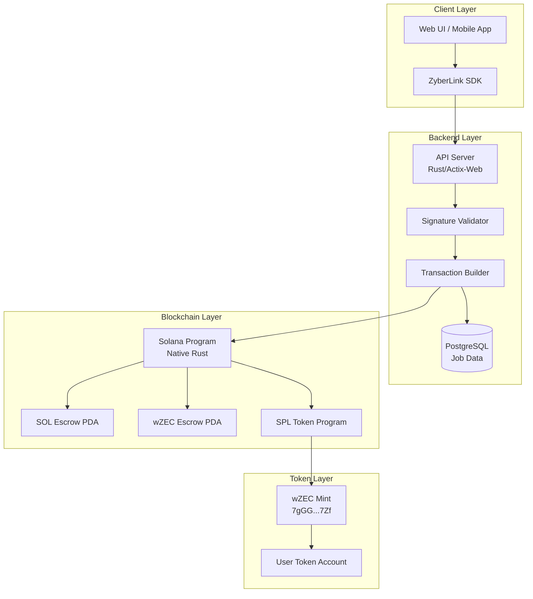
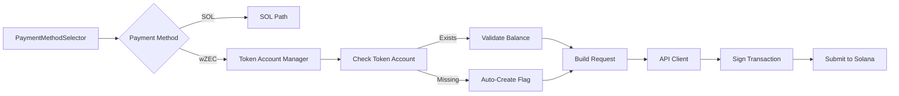
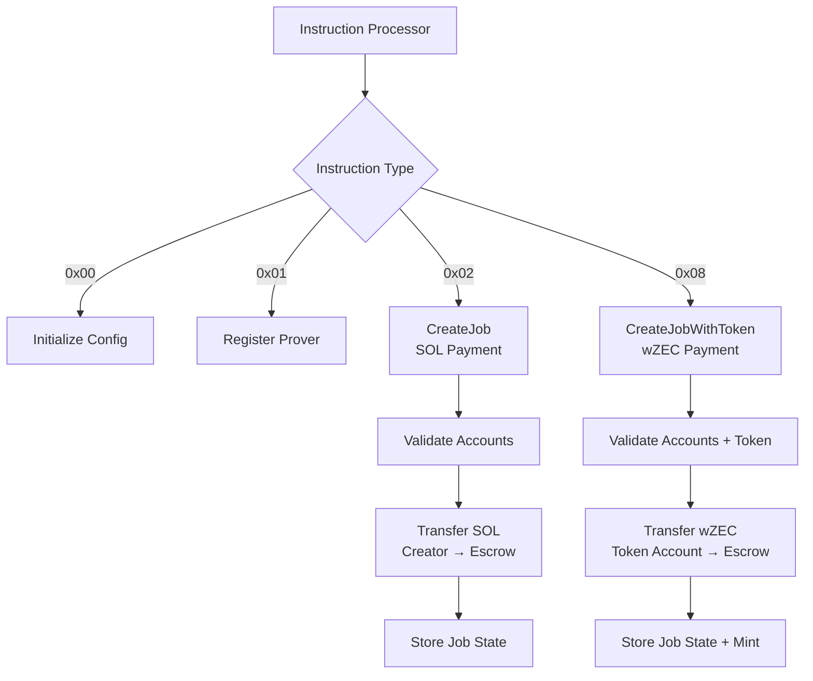
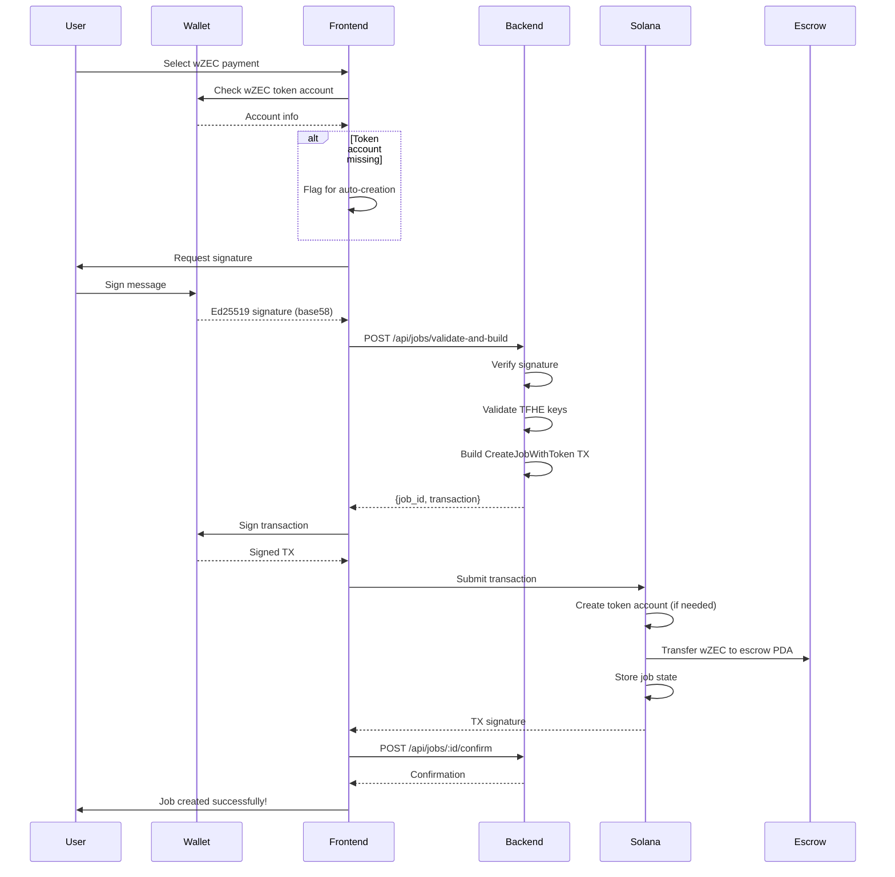
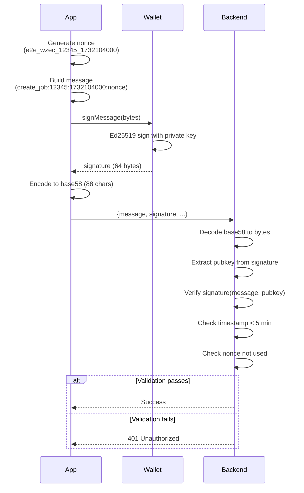
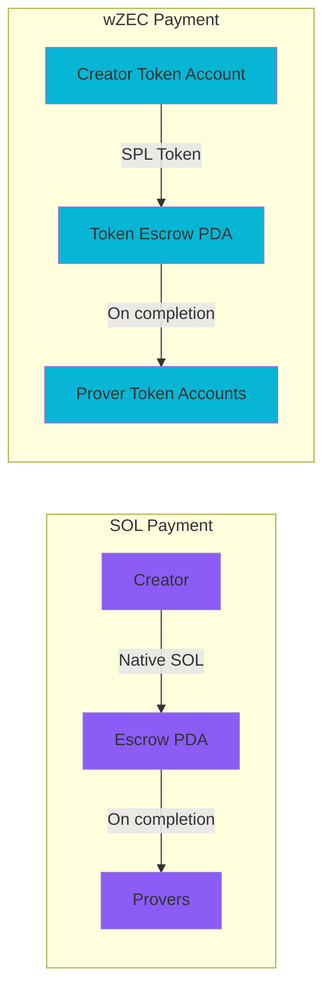
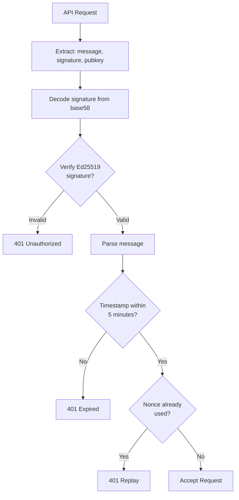
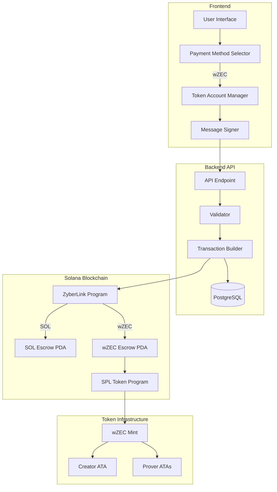

# wZEC Payment Architecture

Technical architecture documentation for the wZEC (Wrapped Zcash) payment integration in ZyberLink marketplace.

## Table of Contents

- [System Overview](#system-overview)
- [Component Architecture](#component-architecture)
- [Data Flow](#data-flow)
- [Payment Methods Comparison](#payment-methods-comparison)
- [Transaction Structure](#transaction-structure)
- [Security Model](#security-model)
- [Performance Considerations](#performance-considerations)
- [Future Enhancements](#future-enhancements)

## System Overview

### High-Level Architecture



### Key Design Principles

1. **Backwards Compatibility**: SOL payments continue to work unchanged
2. **Automatic Handling**: Token accounts created automatically if missing
3. **Type Safety**: Rust type system prevents payment method confusion
4. **Signature Security**: Ed25519 signatures with replay protection
5. **TFHE Support**: Handles 156 MB ServerKeys efficiently

## Component Architecture

### Frontend Components



**PaymentMethodSelector.svelte:**
- Radio button UI for SOL vs wZEC
- Visual indicators and tooltips
- Accessibility-compliant (WCAG AA)
- Responsive design

**TokenAccountManager:**
- Checks for wZEC Associated Token Account
- Validates balance before transaction
- Flags missing accounts for auto-creation
- Error handling for edge cases

### Backend Architecture

```mermaid
graph TB
    API[POST /api/jobs/validate-and-build]
    API --> Parse[Parse & Validate Request]
    Parse --> SigVerify[Verify Ed25519 Signature]
    SigVerify --> NonceCheck[Check Nonce Uniqueness]
    NonceCheck --> PaymentRoute{Payment Method?}

    PaymentRoute -->|SOL| SOL_Build[Build SOL Transaction<br/>5 accounts]
    PaymentRoute -->|wZEC| WZEC_Build[Build wZEC Transaction<br/>9 accounts]

    SOL_Build --> SOL_Ix[CreateJob Instruction]
    WZEC_Build --> WZEC_Ix[CreateJobWithToken Instruction]

    SOL_Ix --> Serialize[Serialize Transaction]
    WZEC_Ix --> Serialize

    Serialize --> Store[Store in PostgreSQL]
    Store --> Response[Return {job_id, transaction}]
```

**Key Backend Files:**

```
blink-server/
├── src/
│   ├── api_handlers.rs          # HTTP endpoint handlers
│   ├── validators.rs            # Signature & input validation
│   ├── tx_builder.rs            # Transaction construction
│   ├── db/
│   │   ├── models.rs            # Database models
│   │   └── queries.rs           # SQL queries
│   └── main.rs                  # Server entry point
└── migrations/
    └── 20250120000007_add_wzec_payment_support.sql
```

### On-Chain Program Structure



**Program Files:**

```
programs/zyberlink/
├── src/
│   ├── processor/
│   │   ├── mod.rs                        # Main processor
│   │   ├── create_job.rs                 # SOL payment (existing)
│   │   └── create_job_with_token.rs      # wZEC payment (NEW)
│   ├── instruction.rs                    # Instruction enum
│   └── lib.rs                            # Program entrypoint
```

## Data Flow

### wZEC Payment Flow



### Message Signing Flow



## Payment Methods Comparison

### SOL vs wZEC



### Technical Differences

| Aspect | SOL Payment | wZEC Payment |
|--------|-------------|--------------|
| **Instruction** | CreateJob (0x02) | CreateJobWithToken (0x08) |
| **Accounts** | 5 | 9 |
| **Token Account** | Not required | Required (auto-created) |
| **Escrow Type** | SOL PDA | SPL Token PDA |
| **Transfer Program** | System Program | SPL Token Program |
| **Price Unit** | Lamports | Zatoshis |
| **Mint Address** | N/A | 7gGG...7Zf |

### Account Structures

**SOL Payment (5 accounts):**
```rust
pub struct CreateJobAccounts<'a> {
    pub creator: &'a AccountInfo<'a>,        // Signer
    pub job: &'a AccountInfo<'a>,            // PDA (writable)
    pub config: &'a AccountInfo<'a>,         // PDA (readonly)
    pub escrow: &'a AccountInfo<'a>,         // PDA (writable)
    pub system_program: &'a AccountInfo<'a>, // Program
}
```

**wZEC Payment (9 accounts):**
```rust
pub struct CreateJobWithTokenAccounts<'a> {
    pub creator: &'a AccountInfo<'a>,              // Signer
    pub job: &'a AccountInfo<'a>,                  // PDA (writable)
    pub config: &'a AccountInfo<'a>,               // PDA (writable)
    pub token_escrow: &'a AccountInfo<'a>,         // PDA (writable)
    pub creator_token_account: &'a AccountInfo<'a>, // ATA (writable)
    pub token_mint: &'a AccountInfo<'a>,           // Mint (readonly)
    pub system_program: &'a AccountInfo<'a>,       // Program
    pub token_program: &'a AccountInfo<'a>,        // Program
    pub rent: &'a AccountInfo<'a>,                 // Sysvar
}
```

## Transaction Structure

### wZEC Transaction Anatomy

```
Transaction {
  signatures: [null],  // Unsigned, filled by wallet
  message: {
    header: {
      num_required_signatures: 1,
      num_readonly_signed_accounts: 0,
      num_readonly_unsigned_accounts: 4
    },
    account_keys: [
      creator_pubkey,           // Signer
      job_pda,                  // Writable
      config_pda,               // Writable
      token_escrow_pda,         // Writable
      creator_token_account,    // Writable
      wzec_mint,                // Readonly
      system_program,           // Readonly
      token_program,            // Readonly
      rent_sysvar              // Readonly
    ],
    recent_blockhash: "...",
    instructions: [
      {
        program_id_index: 7,  // Token Program
        accounts: [...],      // Account indices
        data: [0x08, ...]     // CreateJobWithToken data
      }
    ]
  }
}
```

### PDA Derivation

```rust
// Job PDA
let (job_pda, job_bump) = Pubkey::find_program_address(
    &[
        b"job",
        creator.as_ref(),
        &job_id.to_le_bytes()
    ],
    &program_id
);

// SOL Escrow PDA
let (sol_escrow_pda, escrow_bump) = Pubkey::find_program_address(
    &[
        b"escrow",
        job_pda.as_ref()
    ],
    &program_id
);

// Token Escrow PDA
let (token_escrow_pda, token_bump) = Pubkey::find_program_address(
    &[
        b"token_escrow",
        job_pda.as_ref(),
        token_mint.as_ref()
    ],
    &program_id
);

// Associated Token Account (ATA)
let ata = spl_associated_token_account::get_associated_token_address(
    &creator,
    &wzec_mint
);
```

## Security Model

### Authentication



### Signature Format (CRITICAL)

**Correct Format (base58):**
```javascript
const signature = bs58.encode(signatureBytes);
// Output: "5J7XqG3K8H9L..." (88 chars)
```

**Incorrect Format (base64):**
```javascript
const signature = Buffer.from(signatureBytes).toString('base64');
// Output: "BQYHCAkKCw..." (wrong!)
```

### Anti-Replay Protection

```rust
// Check timestamp
let current_time = SystemTime::now().duration_since(UNIX_EPOCH)?.as_secs();
let request_time = parse_timestamp_from_message(&message)?;

if current_time - request_time > 300 {  // 5 minutes
    return Err("Timestamp expired");
}

// Check nonce uniqueness
if db.nonce_exists(&nonce).await? {
    return Err("Nonce already used");
}

// Store nonce
db.store_nonce(&nonce).await?;
```

### Token Account Security

**Automatic Creation Safety:**
```rust
// Check if creator has enough SOL for rent
let creator_balance = rpc_client.get_balance(&creator)?;
let rent_exempt_balance = rent.minimum_balance(TOKEN_ACCOUNT_SIZE);

if creator_balance < rent_exempt_balance {
    return Err("Insufficient SOL for token account rent");
}

// Create ATA instruction (idempotent)
let create_ata_ix = create_associated_token_account_idempotent(
    &creator,  // payer
    &creator,  // owner
    &token_mint
);
```

## Performance Considerations

### Payload Sizes

```
Request Components:
├── JSON overhead:       ~500 bytes
├── encrypted_data:      ~1 MB (1,048,576 bytes max)
├── server_key:          ~156 MB (typical TFHE ServerKey)
├── Other fields:        ~300 bytes
└── Total:               ~157 MB

Response:
├── JSON overhead:       ~100 bytes
├── transaction:         ~1-2 KB (serialized TX)
└── Total:               ~2 KB
```

### Network Optimization

```rust
// Backend: Stream large payloads
#[post("/api/jobs/validate-and-build")]
async fn create_job(
    payload: web::Payload,
    max_size: web::Data<MaxSize>
) -> Result<HttpResponse> {
    // Stream payload instead of loading into memory
    let body = payload
        .limit(max_size.0)  // 200 MB limit
        .fold(BytesMut::new(), |mut acc, chunk| {
            acc.extend_from_slice(&chunk?);
            Ok::<_, PayloadError>(acc)
        })
        .await?;

    // Process...
}
```

### Database Indexing

```sql
-- Optimize lookups
CREATE INDEX idx_temp_job_data_payment_method
ON temp_job_data(payment_method);

CREATE INDEX idx_temp_job_data_nonce
ON temp_job_data(nonce);

CREATE INDEX idx_temp_job_data_creator_timestamp
ON temp_job_data(creator_pubkey, created_at DESC);
```

### Transaction Cost Analysis

```
SOL Payment:
├── Transaction fee:     ~0.0005 SOL
├── Escrow rent:         ~0.002 SOL (refundable)
└── Total upfront:       ~0.0025 SOL

wZEC Payment:
├── Transaction fee:     ~0.001 SOL (more accounts)
├── Token escrow rent:   ~0.002 SOL (refundable)
├── ATA rent (if new):   ~0.002 SOL (one-time)
└── Total upfront:       ~0.005 SOL (worst case)
```

## Future Enhancements

### Phase 1: Current State

- [x] Dual payment support (SOL/wZEC)
- [x] Automatic token account creation
- [x] Base58 signature format
- [x] 156 MB TFHE ServerKey support
- [x] E2E test coverage

### Phase 2: Optimization (Q1 2025)

- [ ] Batch transaction support
- [ ] Token account pre-creation UI
- [ ] Signature caching
- [ ] WebSocket real-time updates
- [ ] GraphQL API

### Phase 3: Advanced Features (Q2 2025)

- [ ] Multi-token payment support
- [ ] Partial payments / installments
- [ ] wZEC staking for provers
- [ ] Cross-chain bridges (ZEC ↔ wZEC)
- [ ] Shielded payment integration

### Phase 4: Privacy Enhancements (Q3 2025)

- [ ] Zcash shielded pool integration
- [ ] Private transaction amounts
- [ ] Zero-knowledge payment proofs
- [ ] Confidential job pricing
- [ ] Anonymous prover selection

## Diagram: Complete System Flow



## Related Documentation

- **[User Guide](../guides/wzec-user-guide.md)** - End-user documentation
- **[Developer Guide](../guides/wzec-developer-guide.md)** - Integration guide
- **[API Reference](../guides/wzec-api-reference.md)** - Complete API docs
- **[Testing Guide](../guides/wzec-testing-guide.md)** - Testing procedures

---

**Last Updated**: 2025-11-21
**Architecture Version**: 1.0.0
**wZEC Mint**: `7gGGpHxbEuY8i76PwxjgGB1ZX2Nhmfq65N6YNHtrv7Zf`
