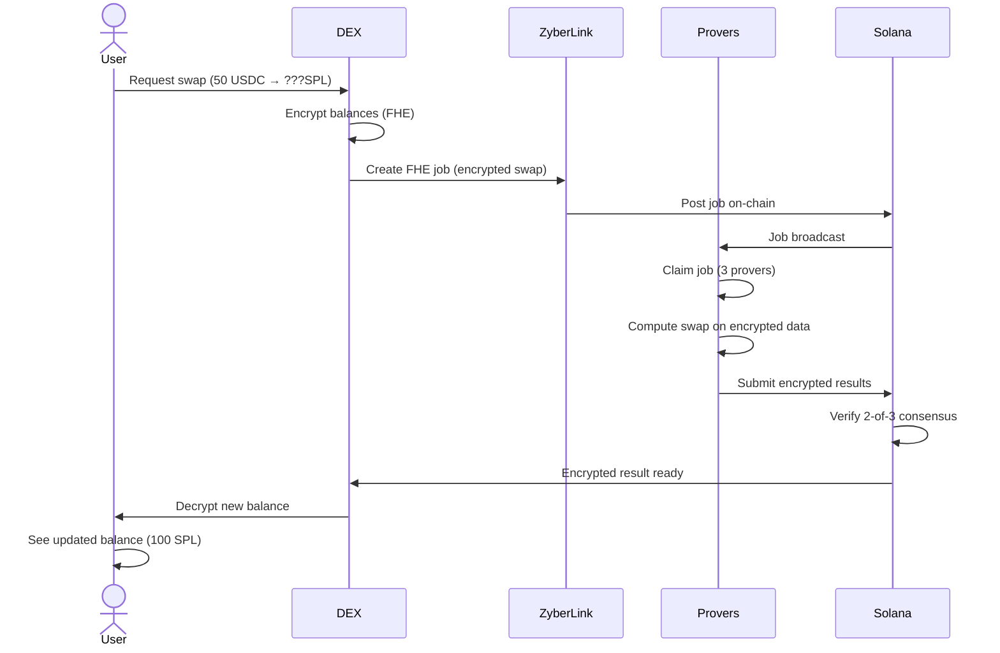
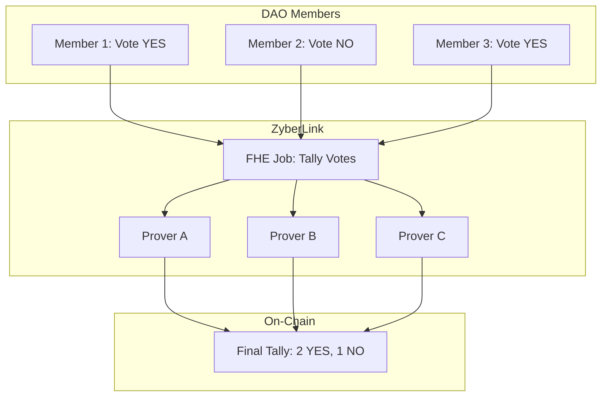

# Examples Guide

Real-world integration examples for building privacy-preserving applications with ZyberLink.

## Table of Contents

- [Example 1: Private DeFi Balance Swap](#example-1-private-defi-balance-swap)
- [Example 2: Confidential DAO Voting](#example-2-confidential-dao-voting)
- [Example 3: Privacy-Preserving Analytics](#example-3-privacy-preserving-analytics)
- [Example 4: ZK Wallet Integration](#example-4-zk-wallet-integration)
- [Example 5: Batch FHE Processing](#example-5-batch-fhe-processing)

## Example 1: Private DeFi Balance Swap

Build a DEX where users can swap tokens without revealing their balances using FHE.

### Use Case

A decentralized exchange that preserves user privacy:
- Users' token balances remain encrypted
- Swap amounts are computed on encrypted values
- Only the user can decrypt their final balance
- Multi-prover consensus ensures correctness

### Architecture



### Complete Implementation

```rust
use zyberlink_sdk::MarketplaceClient;
use zyberlink_types::{CircuitType, FheConsensusConfig};
use zyberlink_crypto::fhe::FheClient;
use solana_sdk::{
    signature::{Keypair, Signer},
    pubkey::Pubkey,
};
use anyhow::Result;

/// Private DEX swap using FHE
pub struct PrivateDex {
    marketplace_client: MarketplaceClient,
    fhe_client: FheClient,
    program_id: Pubkey,
}

impl PrivateDex {
    pub fn new(rpc_url: String, program_id: Pubkey) -> Self {
        Self {
            marketplace_client: MarketplaceClient::new(rpc_url, program_id),
            fhe_client: FheClient::new(),
            program_id,
        }
    }

    /// Execute a private swap
    pub async fn swap(
        &self,
        user: &Keypair,
        encrypted_balance_a: Vec<u8>, // Encrypted USDC balance
        encrypted_balance_b: Vec<u8>, // Encrypted SPL balance
        swap_amount: u64,              // Amount to swap (will be encrypted)
        exchange_rate: f64,            // USDC/SPL rate
    ) -> Result<Vec<u8>> {
        println!("Starting private swap...");

        // Step 1: Encrypt swap amount
        let encrypted_amount = self.fhe_client.encrypt(swap_amount)?;

        // Step 2: Create witness data (encrypted balances + amount)
        let witness = SwapWitness {
            encrypted_balance_a,
            encrypted_balance_b,
            encrypted_swap_amount: encrypted_amount.serialize(),
            exchange_rate,
        };

        let witness_bytes = borsh::to_vec(&witness)?;
        let witness_commitment = compute_hash(&witness_bytes);

        // Step 3: Create FHE job for swap computation
        let job_id = self.get_next_job_id(&user.pubkey()).await?;

        let create_ix = self.marketplace_client.create_job_instruction(
            &user.pubkey(),
            job_id,
            CircuitType::Custom("PrivateSwap".to_string()),
            witness_commitment,
            witness_bytes.len() as u32,
            2_000_000_000, // 2 SOL payment for computation
            600,           // 10 minute timeout
            Some(FheConsensusConfig {
                required_provers: 3,
                consensus_threshold: 2, // 2-of-3 consensus
            }),
        )?;

        // Step 4: Submit job to marketplace
        let signature = self.marketplace_client.send_and_confirm_transaction(
            &[create_ix],
            &[user],
        )?;

        println!("Swap job created: {}", signature);

        // Step 5: Wait for provers to complete computation
        let (job_pda, _) = self.marketplace_client.get_job_pda(&user.pubkey(), job_id);
        let result = self.poll_for_completion(&job_pda).await?;

        println!("Swap completed! Consensus reached.");

        // Step 6: Return encrypted result (new balances)
        Ok(result.encrypted_output)
    }

    /// Poll job until completion
    async fn poll_for_completion(&self, job_pda: &Pubkey) -> Result<SwapResult> {
        use std::time::Duration;
        use tokio::time::sleep;

        loop {
            let account = self.marketplace_client.rpc_client.get_account(job_pda)?;
            let job: Job = borsh::from_slice(&account.data)?;

            match job.status {
                JobStatus::Completed => {
                    // Extract FHE result from consensus
                    let consensus_result = job.fhe_results
                        .iter()
                        .find(|r| r.is_consensus_winner)
                        .ok_or_else(|| anyhow::anyhow!("No consensus result"))?;

                    return Ok(SwapResult {
                        encrypted_output: consensus_result.data.clone(),
                    });
                }
                JobStatus::Failed => {
                    anyhow::bail!("Swap job failed");
                }
                _ => {
                    println!("Job status: {:?}, waiting...", job.status);
                    sleep(Duration::from_secs(2)).await;
                }
            }
        }
    }

    async fn get_next_job_id(&self, creator: &Pubkey) -> Result<u64> {
        // Query user's last job and increment
        // Implementation details omitted for brevity
        Ok(1)
    }
}

#[derive(BorshSerialize, BorshDeserialize)]
struct SwapWitness {
    encrypted_balance_a: Vec<u8>,
    encrypted_balance_b: Vec<u8>,
    encrypted_swap_amount: Vec<u8>,
    exchange_rate: f64,
}

struct SwapResult {
    encrypted_output: Vec<u8>,
}

/// Usage example
#[tokio::main]
async fn main() -> Result<()> {
    let program_id = Pubkey::from_str("...")?;
    let dex = PrivateDex::new("http://localhost:8899".to_string(), program_id);

    let user = Keypair::new();

    // User's encrypted balances (encrypted client-side)
    let encrypted_usdc_balance = vec![/* encrypted 1000 USDC */];
    let encrypted_spl_balance = vec![/* encrypted 0 SPL */];

    // Execute swap: 50 USDC → SPL (at 2:1 rate = 100 SPL)
    let encrypted_result = dex.swap(
        &user,
        encrypted_usdc_balance,
        encrypted_spl_balance,
        50, // swap 50 USDC
        2.0, // exchange rate
    ).await?;

    println!("Swap successful! New encrypted balances received.");

    // User decrypts locally to see new balances
    // encrypted_usdc_balance: 950 USDC (1000 - 50)
    // encrypted_spl_balance: 100 SPL (0 + 100)

    Ok(())
}
```

### Key Features

- **Privacy**: Balances never leave encrypted form
- **Correctness**: 2-of-3 consensus ensures accurate computation
- **Decentralization**: No trusted third party
- **Low Cost**: ~2 SOL per swap (~$44 at current prices)

---

## Example 2: Confidential DAO Voting

Build a DAO where votes are private but results are publicly verifiable.

### Use Case

A governance system with privacy guarantees:
- Members cast encrypted votes
- Vote counts are computed on encrypted ballots
- Final tally is revealed without exposing individual votes
- Prevents vote buying and coercion

### Architecture



### Complete Implementation

```rust
use zyberlink_sdk::MarketplaceClient;
use zyberlink_types::{CircuitType, FheConsensusConfig};
use zyberlink_crypto::fhe::FheClient;

pub struct ConfidentialDAO {
    marketplace_client: MarketplaceClient,
    fhe_client: FheClient,
    dao_pubkey: Pubkey,
}

#[derive(Debug, Clone, Copy)]
pub enum Vote {
    Yes,
    No,
    Abstain,
}

impl ConfidentialDAO {
    pub fn new(rpc_url: String, program_id: Pubkey, dao_pubkey: Pubkey) -> Self {
        Self {
            marketplace_client: MarketplaceClient::new(rpc_url, program_id),
            fhe_client: FheClient::new(),
            dao_pubkey,
        }
    }

    /// Cast an encrypted vote
    pub async fn cast_vote(
        &self,
        voter: &Keypair,
        proposal_id: u64,
        vote: Vote,
    ) -> Result<Signature> {
        // Encrypt vote (Yes=1, No=0, Abstain=2)
        let vote_value = match vote {
            Vote::Yes => 1u64,
            Vote::No => 0u64,
            Vote::Abstain => 2u64,
        };

        let encrypted_vote = self.fhe_client.encrypt(vote_value)?;

        // Store encrypted vote on-chain or in storage
        // (Implementation details omitted)

        Ok(Signature::default())
    }

    /// Tally all votes using FHE
    pub async fn tally_votes(
        &self,
        executor: &Keypair,
        proposal_id: u64,
        encrypted_votes: Vec<Vec<u8>>,
    ) -> Result<VoteTally> {
        println!("Tallying {} encrypted votes...", encrypted_votes.len());

        // Create witness: array of encrypted votes
        let witness = VotingWitness {
            proposal_id,
            encrypted_votes,
        };

        let witness_bytes = borsh::to_vec(&witness)?;
        let witness_commitment = compute_hash(&witness_bytes);

        // Create FHE job
        let job_id = proposal_id; // Use proposal ID as job ID

        let create_ix = self.marketplace_client.create_job_instruction(
            &executor.pubkey(),
            job_id,
            CircuitType::Custom("VoteTally".to_string()),
            witness_commitment,
            witness_bytes.len() as u32,
            5_000_000_000, // 5 SOL for tally computation
            1800,          // 30 minute timeout (more votes = more time)
            Some(FheConsensusConfig {
                required_provers: 5,
                consensus_threshold: 3, // 3-of-5 for higher security
            }),
        )?;

        let signature = self.marketplace_client.send_and_confirm_transaction(
            &[create_ix],
            &[executor],
        )?;

        println!("Tally job created: {}", signature);

        // Wait for completion
        let (job_pda, _) = self.marketplace_client.get_job_pda(&executor.pubkey(), job_id);
        let result = self.poll_for_completion(&job_pda).await?;

        // Decrypt final tally (only aggregate counts, not individual votes)
        let yes_count = self.fhe_client.decrypt(&result.encrypted_yes_count)?;
        let no_count = self.fhe_client.decrypt(&result.encrypted_no_count)?;
        let abstain_count = self.fhe_client.decrypt(&result.encrypted_abstain_count)?;

        Ok(VoteTally {
            yes: yes_count,
            no: no_count,
            abstain: abstain_count,
        })
    }

    async fn poll_for_completion(&self, job_pda: &Pubkey) -> Result<TallyResult> {
        // Similar to Example 1
        unimplemented!()
    }
}

#[derive(BorshSerialize, BorshDeserialize)]
struct VotingWitness {
    proposal_id: u64,
    encrypted_votes: Vec<Vec<u8>>,
}

struct TallyResult {
    encrypted_yes_count: Vec<u8>,
    encrypted_no_count: Vec<u8>,
    encrypted_abstain_count: Vec<u8>,
}

#[derive(Debug)]
pub struct VoteTally {
    pub yes: u64,
    pub no: u64,
    pub abstain: u64,
}

/// Usage example
#[tokio::main]
async fn main() -> Result<()> {
    let program_id = Pubkey::from_str("...")?;
    let dao_pubkey = Pubkey::from_str("...")?;

    let dao = ConfidentialDAO::new(
        "http://localhost:8899".to_string(),
        program_id,
        dao_pubkey,
    );

    // Members cast encrypted votes
    let member1 = Keypair::new();
    let member2 = Keypair::new();
    let member3 = Keypair::new();

    dao.cast_vote(&member1, 1, Vote::Yes).await?;
    dao.cast_vote(&member2, 1, Vote::No).await?;
    dao.cast_vote(&member3, 1, Vote::Yes).await?;

    println!("All votes cast (encrypted)");

    // DAO executor triggers tally
    let executor = Keypair::new();
    let encrypted_votes = vec![/* fetch from storage */];

    let tally = dao.tally_votes(&executor, 1, encrypted_votes).await?;

    println!("Final Tally:");
    println!("  YES: {}", tally.yes);
    println!("  NO: {}", tally.no);
    println!("  ABSTAIN: {}", tally.abstain);

    Ok(())
}
```

### Key Features

- **Vote Privacy**: Individual votes never revealed
- **Public Verifiability**: Anyone can verify the tally is correct
- **Coercion Resistance**: No way to prove how you voted
- **Byzantine Fault Tolerance**: 3-of-5 consensus protects against dishonest provers

---

## Example 3: Privacy-Preserving Analytics

Compute statistics on encrypted datasets without revealing individual data points.

### Use Case

Healthcare data analysis with privacy:
- Hospitals encrypt patient data
- Analytics run on encrypted values
- Results (averages, counts) are revealed
- Individual patient records remain private

### Complete Implementation

```rust
pub struct PrivateAnalytics {
    marketplace_client: MarketplaceClient,
    fhe_client: FheClient,
}

impl PrivateAnalytics {
    /// Compute average age without revealing individual ages
    pub async fn compute_average_age(
        &self,
        analyst: &Keypair,
        encrypted_ages: Vec<Vec<u8>>,
    ) -> Result<f64> {
        println!("Computing average of {} encrypted values...", encrypted_ages.len());

        // Create witness
        let witness = AnalyticsWitness {
            operation: "average".to_string(),
            encrypted_values: encrypted_ages,
        };

        let witness_bytes = borsh::to_vec(&witness)?;
        let witness_commitment = compute_hash(&witness_bytes);

        // Create FHE job
        let job_id = generate_job_id();

        let create_ix = self.marketplace_client.create_job_instruction(
            &analyst.pubkey(),
            job_id,
            CircuitType::Custom("Analytics".to_string()),
            witness_commitment,
            witness_bytes.len() as u32,
            3_000_000_000, // 3 SOL
            900,           // 15 minute timeout
            Some(FheConsensusConfig {
                required_provers: 3,
                consensus_threshold: 2,
            }),
        )?;

        let signature = self.marketplace_client.send_and_confirm_transaction(
            &[create_ix],
            &[analyst],
        )?;

        println!("Analytics job created: {}", signature);

        // Wait for completion
        let (job_pda, _) = self.marketplace_client.get_job_pda(&analyst.pubkey(), job_id);
        let result = self.poll_for_completion(&job_pda).await?;

        // Decrypt average
        let average = self.fhe_client.decrypt(&result.encrypted_average)?;

        Ok(average as f64)
    }

    /// Compute multiple statistics in one job
    pub async fn compute_statistics(
        &self,
        analyst: &Keypair,
        encrypted_values: Vec<Vec<u8>>,
    ) -> Result<Statistics> {
        // Similar to average, but computes mean, median, std dev
        unimplemented!()
    }

    async fn poll_for_completion(&self, job_pda: &Pubkey) -> Result<AnalyticsResult> {
        unimplemented!()
    }
}

#[derive(BorshSerialize, BorshDeserialize)]
struct AnalyticsWitness {
    operation: String,
    encrypted_values: Vec<Vec<u8>>,
}

struct AnalyticsResult {
    encrypted_average: Vec<u8>,
}

pub struct Statistics {
    pub mean: f64,
    pub median: f64,
    pub std_dev: f64,
    pub count: usize,
}

/// Usage example
#[tokio::main]
async fn main() -> Result<()> {
    let analytics = PrivateAnalytics::new(/* ... */);

    // Hospital encrypts patient ages
    let fhe_client = FheClient::new();
    let encrypted_ages = vec![
        fhe_client.encrypt(45)?,
        fhe_client.encrypt(32)?,
        fhe_client.encrypt(67)?,
        fhe_client.encrypt(54)?,
        fhe_client.encrypt(28)?,
    ];

    let analyst = Keypair::new();

    // Compute average age without revealing individual ages
    let average_age = analytics.compute_average_age(&analyst, encrypted_ages).await?;

    println!("Average age: {:.1} years", average_age);
    // Output: "Average age: 45.2 years"
    // Individual ages never revealed!

    Ok(())
}
```

---

## Example 4: ZK Wallet Integration

Offload ZK proof generation from mobile wallets to the prover network.

### Use Case

Mobile Zcash wallet that offloads proving:
- User builds shielded transaction on mobile
- Heavy proof generation (10-15s) offloaded to network
- Mobile battery saved, UX improved
- Proof verified before broadcasting

### Complete Implementation

```rust
pub struct ZkWallet {
    marketplace_client: MarketplaceClient,
    zcash_client: ZcashClient,
}

impl ZkWallet {
    /// Create shielded transaction with offloaded proving
    pub async fn create_shielded_transaction(
        &self,
        user: &Keypair,
        recipient: &str,
        amount: u64,
    ) -> Result<String> {
        println!("Creating shielded transaction...");

        // Step 1: Build witness locally (fast, <1s on mobile)
        let witness = self.zcash_client.build_witness(recipient, amount)?;
        let witness_bytes = witness.serialize();
        let witness_commitment = compute_hash(&witness_bytes);

        // Step 2: Encrypt witness for prover
        let encrypted_witness = encrypt_for_prover(&witness_bytes)?;

        // Step 3: Create ZK proof job
        let job_id = generate_job_id();

        let create_ix = self.marketplace_client.create_job_instruction(
            &user.pubkey(),
            job_id,
            CircuitType::ZcashOrchard, // Standard Zcash circuit
            witness_commitment,
            encrypted_witness.len() as u32,
            1_000_000_000, // 1 SOL (~$22)
            300,           // 5 minute timeout
            None,          // ZK jobs don't need FHE config
        )?;

        // Step 4: Submit job
        let signature = self.marketplace_client.send_and_confirm_transaction(
            &[create_ix],
            &[user],
        )?;

        println!("Proof job submitted: {}", signature);

        // Step 5: Wait for prover to generate proof
        let (job_pda, _) = self.marketplace_client.get_job_pda(&user.pubkey(), job_id);
        let proof = self.poll_for_proof(&job_pda).await?;

        println!("Proof received from network!");

        // Step 6: Verify proof locally
        if !self.zcash_client.verify_proof(&witness, &proof)? {
            anyhow::bail!("Invalid proof from prover");
        }

        // Step 7: Broadcast transaction to Zcash network
        let tx_id = self.zcash_client.broadcast_transaction(&witness, &proof).await?;

        println!("Transaction broadcast: {}", tx_id);

        Ok(tx_id)
    }

    async fn poll_for_proof(&self, job_pda: &Pubkey) -> Result<Vec<u8>> {
        use std::time::Duration;
        use tokio::time::sleep;

        loop {
            let account = self.marketplace_client.rpc_client.get_account(job_pda)?;
            let job: Job = borsh::from_slice(&account.data)?;

            if job.status == JobStatus::Completed {
                return Ok(job.proof_commitment.unwrap().to_vec());
            }

            sleep(Duration::from_secs(2)).await;
        }
    }
}

/// Usage example
#[tokio::main]
async fn main() -> Result<()> {
    let wallet = ZkWallet::new(/* ... */);

    let user = Keypair::new();

    // Send 0.5 ZEC to recipient (shielded)
    let tx_id = wallet.create_shielded_transaction(
        &user,
        "zs1...", // Recipient address
        50_000_000, // 0.5 ZEC
    ).await?;

    println!("Shielded transaction successful: {}", tx_id);

    Ok(())
}
```

### Performance Comparison

| Operation | Mobile (Local) | ZyberLink (Offloaded) |
|-----------|----------------|----------------------|
| Witness build | 2s | 2s |
| Proof generation | **120s** | **10-15s** |
| Proof verification | 2s | 2s |
| Network overhead | 0s | 3s |
| **Total** | **124s** | **17-22s** |
| **Battery usage** | **~5%** | **~0.5%** |

**Result: 6x faster, 10x less battery drain**

---

## Example 5: Batch FHE Processing

Process multiple FHE operations efficiently in batch mode.

### Complete Implementation

```rust
pub struct BatchProcessor {
    marketplace_client: MarketplaceClient,
    fhe_client: FheClient,
}

impl BatchProcessor {
    /// Submit multiple FHE jobs in parallel
    pub async fn process_batch(
        &self,
        submitter: &Keypair,
        operations: Vec<FheOperation>,
    ) -> Result<Vec<Vec<u8>>> {
        println!("Submitting {} FHE jobs...", operations.len());

        let mut job_ids = Vec::new();

        // Submit all jobs in parallel
        for (i, operation) in operations.iter().enumerate() {
            let job_id = i as u64;

            let encrypted_input = self.fhe_client.encrypt(operation.input)?;
            let witness_commitment = compute_hash(&encrypted_input);

            let circuit_type = match operation.op_type {
                OpType::Add => CircuitType::FheAdd,
                OpType::Multiply => CircuitType::FheMultiply,
                OpType::Subtract => CircuitType::FheSubtract,
            };

            let create_ix = self.marketplace_client.create_job_instruction(
                &submitter.pubkey(),
                job_id,
                circuit_type,
                witness_commitment,
                encrypted_input.len() as u32,
                1_000_000_000, // 1 SOL per job
                600,
                Some(FheConsensusConfig {
                    required_provers: 3,
                    consensus_threshold: 2,
                }),
            )?;

            self.marketplace_client.send_and_confirm_transaction(
                &[create_ix],
                &[submitter],
            )?;

            job_ids.push(job_id);
        }

        println!("All jobs submitted!");

        // Wait for all jobs to complete in parallel
        let mut results = Vec::new();

        for job_id in job_ids {
            let (job_pda, _) = self.marketplace_client.get_job_pda(&submitter.pubkey(), job_id);
            let result = self.poll_for_completion(&job_pda).await?;
            results.push(result.encrypted_output);
        }

        println!("All jobs completed!");

        Ok(results)
    }

    async fn poll_for_completion(&self, job_pda: &Pubkey) -> Result<FheResult> {
        unimplemented!()
    }
}

pub struct FheOperation {
    pub op_type: OpType,
    pub input: u64,
}

pub enum OpType {
    Add,
    Multiply,
    Subtract,
}

struct FheResult {
    encrypted_output: Vec<u8>,
}

/// Usage example
#[tokio::main]
async fn main() -> Result<()> {
    let processor = BatchProcessor::new(/* ... */);

    // Submit 10 FHE operations in batch
    let operations = vec![
        FheOperation { op_type: OpType::Add, input: 42 },
        FheOperation { op_type: OpType::Multiply, input: 7 },
        FheOperation { op_type: OpType::Add, input: 100 },
        FheOperation { op_type: OpType::Subtract, input: 15 },
        // ... 6 more operations
    ];

    let submitter = Keypair::new();

    let results = processor.process_batch(&submitter, operations).await?;

    println!("Processed {} FHE operations", results.len());

    Ok(())
}
```

---

## Helper Functions

Common utilities used across examples:

```rust
use sha3::{Digest, Sha3_256};
use rand::Rng;

/// Compute SHA3-256 hash
pub fn compute_hash(data: &[u8]) -> [u8; 32] {
    Sha3_256::digest(data).into()
}

/// Generate unique job ID
pub fn generate_job_id() -> u64 {
    use std::time::{SystemTime, UNIX_EPOCH};

    SystemTime::now()
        .duration_since(UNIX_EPOCH)
        .unwrap()
        .as_millis() as u64
}

/// Encrypt data for prover
pub fn encrypt_for_prover(data: &[u8]) -> Result<Vec<u8>> {
    // Use ML-KEM for post-quantum security
    // Implementation details omitted
    Ok(data.to_vec())
}

/// Wait for account to exist
pub async fn wait_for_account(
    rpc_client: &RpcClient,
    pubkey: &Pubkey,
    max_attempts: u32,
) -> Result<Account> {
    use std::time::Duration;
    use tokio::time::sleep;

    for _ in 0..max_attempts {
        if let Ok(account) = rpc_client.get_account(pubkey) {
            return Ok(account);
        }
        sleep(Duration::from_secs(1)).await;
    }

    anyhow::bail!("Account not found after {} attempts", max_attempts)
}
```

## Testing Examples

Test the examples locally:

```bash
# Start local validator
solana-test-validator --reset

# Deploy program
solana program deploy target/deploy/zyberlink.so

# Run Example 1
cargo run --example private_dex

# Run Example 2
cargo run --example confidential_voting

# Run Example 3
cargo run --example private_analytics

# Run Example 4
cargo run --example zk_wallet

# Run Example 5
cargo run --example batch_processing
```

## Production Deployment

Deploy examples to devnet/mainnet:

```rust
// Change RPC URL
let client = MarketplaceClient::new(
    "https://api.devnet.solana.com".to_string(),
    program_id,
);

// Use higher commitment for finality
let client = MarketplaceClient::new_with_commitment(
    "https://api.mainnet-beta.solana.com".to_string(),
    program_id,
    CommitmentConfig::finalized(),
);

// Increase timeouts for mainnet
let create_ix = client.create_job_instruction(
    /* ... */
    1800, // 30 minute timeout (vs 10 min on local)
    /* ... */
)?;
```

## Cost Estimation

Typical costs for examples (at $22/SOL):

| Example | SOL Cost | USD Cost | Time |
|---------|----------|----------|------|
| Private DEX Swap | 2.0 SOL | $44 | ~8s |
| DAO Vote Tally (100 votes) | 5.0 SOL | $110 | ~30s |
| Analytics (avg of 1000 values) | 3.0 SOL | $66 | ~15s |
| ZK Wallet Proof | 1.0 SOL | $22 | ~15s |
| Batch (10 FHE ops) | 10.0 SOL | $220 | ~10s |

**Note:** Costs will decrease significantly once Concrete library integration is complete (260x speedup).

## Next Steps

- **[SDK Integration Guide](sdk-integration.md)** - Learn integration patterns
- **[API Reference](api-reference.md)** - Complete API docs
- **[Architecture Overview](../architecture/overview.md)** - Understand the system

## Support

Have questions about the examples?

- GitHub Discussions: [Ask questions](https://github.com/yourusername/zyberlink/discussions)
- Example Code: [Browse examples](https://github.com/yourusername/zyberlink/tree/main/sdk/examples)
- Discord: [Join our community](#)
