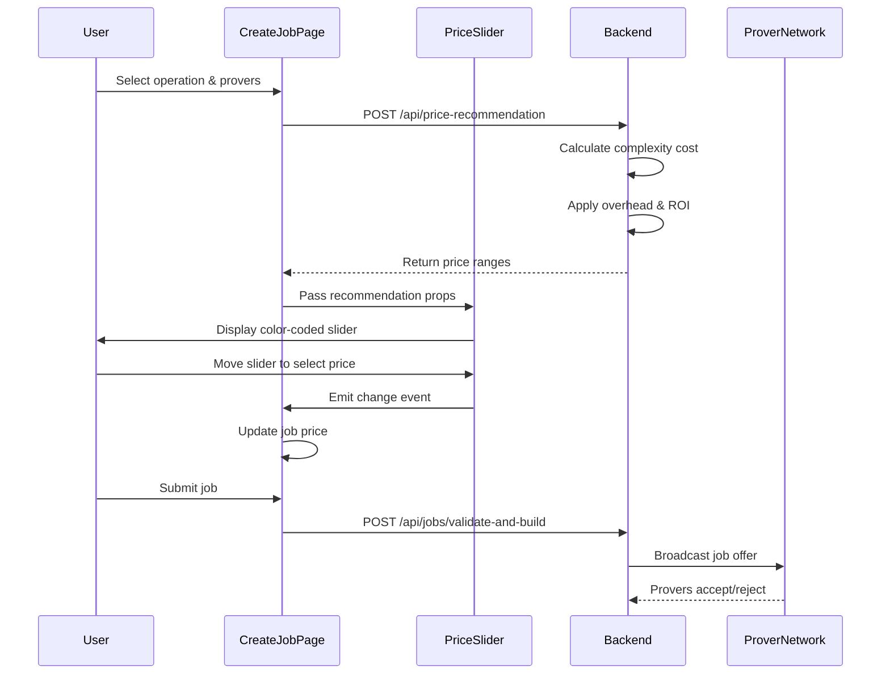
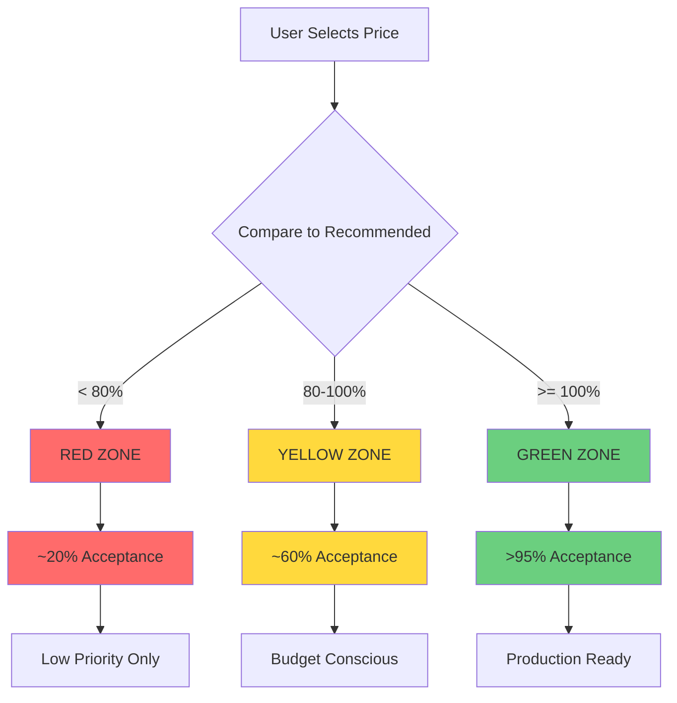
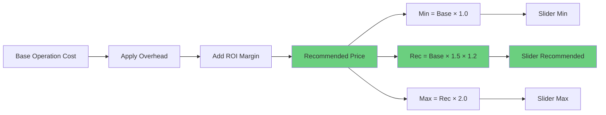

# PriceSlider Integration Guide

## Overview

The **PriceSlider** component is an interactive pricing tool that helps job creators select optimal prices for their FHE computation jobs. It provides visual feedback on how different price points affect the likelihood of prover acceptance, ensuring jobs are picked up quickly while maintaining cost efficiency.

### Why is PriceSlider Important?

When creating an FHE job, the price you offer directly impacts:

- **Prover Acceptance Rate**: Higher prices attract more provers
- **Job Pickup Speed**: Competitive prices result in faster processing
- **Cost Efficiency**: The slider helps balance price vs. acceptance rate

The PriceSlider uses a dynamic pricing recommendation system that considers:
- Operation complexity (e.g., multiply, add, subtract)
- Number of required provers (consensus requirements)
- Current network conditions and prover availability
- Expected ROI for provers

---

## Visual Interface

The PriceSlider presents a color-coded interface that makes it easy to understand pricing zones:

```
┌─────────────────────────────────────────────────────────┐
│  PRICE_SELECTION:                                       │
│                                                         │
│  ├────────────────────────────────────────────────────┤ │
│  MIN              REC                              MAX  │
│  0.003           0.0054                           0.01  │
│       [░░░░░░░░░████████████░░░░░░░░░]                 │
│                    ▲                                    │
│               YOUR PRICE: 0.0054 SOL                    │
│                                                         │
│  PROVER_ACCEPTANCE: [HIGH (>95%)]                      │
│                                                         │
└─────────────────────────────────────────────────────────┘
```

### Interface Elements

1. **Price Range Labels**: Displays minimum, recommended, and maximum price values in SOL
2. **Color-Coded Track**: Visual zones indicating acceptance likelihood
3. **Recommended Marker**: Vertical line marking the optimal price point
4. **Interactive Slider**: Draggable thumb for selecting your desired price
5. **Current Price Display**: Shows selected price in both SOL and lamports
6. **Acceptance Indicator**: Color-coded badge showing estimated prover acceptance

---

## Acceptance Zones Explained

The slider divides pricing into three zones, each with distinct characteristics:

### Red Zone (< 80% of Recommended)

```
Acceptance Rate: ~20%
Risk Level: HIGH
Recommendation: AVOID
```

**Characteristics:**
- Very low prover acceptance
- Jobs may sit in queue for extended periods
- High risk of job expiration before completion
- Not recommended except for experimental purposes

**When to use:**
- Never recommended for production jobs
- May be acceptable for non-urgent, low-priority tasks

### Yellow Zone (80% - 100% of Recommended)

```
Acceptance Rate: ~60%
Risk Level: MEDIUM
Recommendation: USE WITH CAUTION
```

**Characteristics:**
- Moderate prover acceptance
- Some provers will accept the job
- Slower pickup time compared to recommended price
- Potential delays during high network activity

**When to use:**
- Budget-conscious job creators
- Non-urgent computations
- When willing to accept moderate delays

### Green Zone (>= 100% of Recommended)

```
Acceptance Rate: >95%
Risk Level: LOW
Recommendation: OPTIMAL
```

**Characteristics:**
- High prover acceptance rate
- Fast job pickup and processing
- Minimal risk of delays or expiration
- Competitive pricing that attracts provers

**When to use:**
- Production jobs requiring reliability
- Time-sensitive computations
- When maximum availability is needed

---

## Component Props

The PriceSlider component accepts the following properties:

```typescript
export let minPrice = 1000000;        // Minimum price in lamports
export let recommendedPrice = 1800000; // Recommended price in lamports
export let maxPrice = 3600000;         // Maximum suggested price in lamports
export let currentPrice = 1800000;     // Currently selected price in lamports
export let step = 100000;              // Slider step size in lamports
export let isLoading = false;          // Loading state indicator
```

### Prop Details

| Prop | Type | Default | Description |
|------|------|---------|-------------|
| `minPrice` | number | 1000000 | Minimum acceptable price (1M lamports = 0.001 SOL) |
| `recommendedPrice` | number | 1800000 | AI-calculated optimal price for high acceptance |
| `maxPrice` | number | 3600000 | Maximum suggested price (upper bound) |
| `currentPrice` | number | 1800000 | Currently selected price by the user |
| `step` | number | 100000 | Increment step size for slider movement |
| `isLoading` | boolean | false | Shows loading state while fetching recommendations |

All price values are expressed in **lamports** (1 SOL = 1,000,000,000 lamports).

---

## Events

The PriceSlider component emits a single event when the user changes the price:

### `on:change`

Fired when the user moves the slider to a new price point.

**Event Detail:**
```javascript
{
  price: number  // Selected price in lamports
}
```

**Example Handler:**
```svelte
<script>
  let selectedPrice = 1800000;

  function handlePriceChange(event) {
    selectedPrice = event.detail.price;
    console.log(`New price selected: ${selectedPrice} lamports`);
  }
</script>

<PriceSlider
  on:change={handlePriceChange}
  currentPrice={selectedPrice}
/>
```

---

## Backend Integration

The PriceSlider relies on dynamic pricing data from the backend `/api/price-recommendation` endpoint.

### API Request

```javascript
const response = await fetch('http://localhost:8080/api/price-recommendation', {
  method: 'POST',
  headers: { 'Content-Type': 'application/json' },
  body: JSON.stringify({
    operation: 'multiply',      // Operation type: 'add', 'multiply', 'subtract', etc.
    operation_value: 5,          // Operation-specific value
    expected_count: 10,          // Expected data count (for operations like sum/average)
    bins: 5,                     // Number of bins (for histogram operations)
    required_provers: 3          // Number of provers needed for consensus
  })
});

const priceRecommendation = await response.json();
```

### API Response

```json
{
  "min_price_lamports": 3000000,
  "recommended_price_lamports": 5400000,
  "max_suggested_lamports": 10800000,
  "slider_step": 100000,
  "prover_overhead_percent": 50.0,
  "target_prover_roi_percent": 20.0
}
```

### Response Fields

| Field | Type | Description |
|-------|------|-------------|
| `min_price_lamports` | number | Absolute minimum price for operation |
| `recommended_price_lamports` | number | Optimal price for high acceptance (>95%) |
| `max_suggested_lamports` | number | Maximum reasonable price (2x recommended) |
| `slider_step` | number | Suggested increment for smooth sliding |
| `prover_overhead_percent` | number | Prover overhead factor (default: 50%) |
| `target_prover_roi_percent` | number | Target ROI for provers (default: 20%) |

---

## Acceptance Calculation Logic

The backend calculates pricing recommendations using the following formula:

### Base Price Calculation

```
base_price = operation_complexity_cost
```

The `operation_complexity_cost` is determined by the operation type and computational requirements.

### Recommended Price Formula

```
recommended_price = base_price × overhead_multiplier × (1 + target_roi / 100)

where:
  overhead_multiplier = 1 + (prover_overhead_percent / 100)  // default: 1.5
  target_roi = target_prover_roi_percent                     // default: 20%
```

### Example Calculation

For a multiply operation with base cost of 2M lamports:

```
base_price = 2,000,000 lamports

overhead_multiplier = 1 + (50 / 100) = 1.5

roi_factor = 1 + (20 / 100) = 1.2

recommended_price = 2,000,000 × 1.5 × 1.2 = 3,600,000 lamports (0.0036 SOL)
```

This ensures provers receive:
- 50% overhead for operational costs
- 20% profit margin (ROI)
- Competitive pricing for fast acceptance

---

## Usage Example in Svelte

Here's a complete example showing how to integrate the PriceSlider into a job creation form:

### Step 1: Fetch Price Recommendation

```svelte
<script>
  import PriceSlider from '$lib/components/PriceSlider.svelte';

  let jobData = {
    operation: 'multiply',
    operationValue: 5,
    requiredProvers: 3,
    priceLamports: 0
  };

  let priceRecommendation = null;
  let isFetchingPrice = false;

  async function fetchPriceRecommendation() {
    isFetchingPrice = true;
    try {
      const response = await fetch('http://localhost:8080/api/price-recommendation', {
        method: 'POST',
        headers: { 'Content-Type': 'application/json' },
        body: JSON.stringify({
          operation: jobData.operation.toLowerCase(),
          operation_value: jobData.operationValue,
          expected_count: 10,
          bins: 5,
          required_provers: jobData.requiredProvers
        })
      });

      if (!response.ok) {
        throw new Error('Failed to get price recommendation');
      }

      priceRecommendation = await response.json();

      // Initialize with recommended price
      jobData.priceLamports = priceRecommendation.recommended_price_lamports;

    } catch (error) {
      console.error('Failed to fetch price recommendation:', error);
      // Fallback to defaults
      priceRecommendation = {
        min_price_lamports: 3000000,
        recommended_price_lamports: 5400000,
        max_suggested_lamports: 10800000,
        slider_step: 100000
      };
    } finally {
      isFetchingPrice = false;
    }
  }

  // Reactively fetch when operation or provers change
  $: {
    if (jobData.operation && jobData.requiredProvers) {
      fetchPriceRecommendation();
    }
  }

  function handlePriceChange(event) {
    jobData.priceLamports = event.detail.price;
  }
</script>
```

### Step 2: Render the PriceSlider

```svelte
{#if priceRecommendation}
  <div class="price-section">
    <PriceSlider
      minPrice={priceRecommendation.min_price_lamports}
      recommendedPrice={priceRecommendation.recommended_price_lamports}
      maxPrice={priceRecommendation.max_suggested_lamports}
      currentPrice={jobData.priceLamports}
      step={priceRecommendation.slider_step}
      isLoading={isFetchingPrice}
      on:change={handlePriceChange}
    />
  </div>
{/if}
```

### Step 3: Display Cost Summary

```svelte
<div class="cost-summary">
  <h3>Estimated Cost</h3>
  <p>
    Job Price: {(jobData.priceLamports / 1_000_000_000).toFixed(6)} SOL
  </p>
  <p>
    Platform Fee (1%): {(jobData.priceLamports * 0.01 / 1_000_000_000).toFixed(6)} SOL
  </p>
  <p>
    Total: {(jobData.priceLamports * 1.01 / 1_000_000_000).toFixed(6)} SOL
  </p>
</div>
```

---

## Advanced Features

### Auto-Recommendation Button

The PriceSlider includes a built-in "SET_TO_RECOMMENDED" button that appears when the user selects a price below the recommended value:

```svelte
{#if currentPrice < recommendedPrice}
  <button
    class="btn-set-recommended"
    on:click={setToRecommended}
  >
    [SET_TO_RECOMMENDED]
  </button>
{/if}
```

This feature helps guide users toward optimal pricing without forcing them into a specific choice.

### Responsive Acceptance Feedback

The component provides real-time visual feedback as the user moves the slider:

- **Badge Color**: Changes based on acceptance zone (red/yellow/green)
- **Percentage Estimate**: Shows approximate acceptance rate
- **Zone Highlighting**: Track background color matches the current zone

---

## Best Practices

### For Job Creators

1. **Start with Recommended Price**: The recommended price is calculated to maximize acceptance while maintaining cost efficiency
2. **Monitor Acceptance Level**: Keep the slider in the green zone for production jobs
3. **Consider Job Urgency**: Time-sensitive jobs should use green zone pricing
4. **Budget Carefully**: Yellow zone pricing can save costs for non-urgent jobs

### For Developers

1. **Always Fetch Fresh Recommendations**: Pricing should be dynamically calculated based on current parameters
2. **Handle Loading States**: Show loading indicators while fetching recommendations
3. **Provide Fallbacks**: Include default pricing in case the API is unavailable
4. **Update Reactively**: Re-fetch recommendations when operation or prover count changes
5. **Validate Price Ranges**: Ensure selected prices stay within min/max bounds

### For Platform Operators

1. **Monitor Acceptance Rates**: Track actual acceptance vs. predicted rates
2. **Adjust ROI Parameters**: Tune `target_prover_roi_percent` based on market conditions
3. **Review Complexity Costs**: Ensure operation costs reflect actual computational requirements
4. **Consider Network Conditions**: Dynamically adjust recommendations based on prover availability

---

## Troubleshooting

### Issue: Slider Doesn't Update

**Symptoms**: Price slider shows old values after changing operation

**Solution**:
```svelte
// Ensure reactive updates
$: {
  if (jobData.operation && jobData.requiredProvers) {
    fetchPriceRecommendation();
  }
}
```

### Issue: Price Jumps to Minimum

**Symptoms**: Selected price resets to minimum when recommendation loads

**Solution**:
```javascript
// Only update if current price is below recommended
if (!jobData.priceLamports || jobData.priceLamports < priceRecommendation.recommended_price_lamports) {
  jobData.priceLamports = priceRecommendation.recommended_price_lamports;
}
```

### Issue: Acceptance Level Always Shows Low

**Symptoms**: Badge shows "LOW" even in green zone

**Solution**: Verify that `currentPrice` prop is properly bound and updated via the change event.

---

## Related Documentation

- [Job Creation API Reference](/guides/api-reference.md)
- [FHE Operation Costs](/guides/examples.md#operation-costs)
- [Prover Consensus Guide](/guides/examples.md#consensus-mechanisms)
- [SDK Integration](/guides/sdk-integration.md)

---

## Mermaid Diagrams

### PriceSlider Component Flow



### Acceptance Zone Calculation



### Pricing Calculation Flow



---

## Summary

The PriceSlider component is a critical tool for creating successful FHE jobs on the Zyberlink network. By providing clear visual feedback and dynamic pricing recommendations, it helps users make informed decisions about job pricing, balancing cost efficiency with prover acceptance rates.

Key takeaways:

- Use the **green zone** for production jobs requiring high reliability
- The **recommended price** is calculated based on prover ROI and network conditions
- Dynamic updates ensure pricing stays current with operation complexity and prover requirements
- Real-time acceptance feedback helps users understand the impact of their pricing decisions
