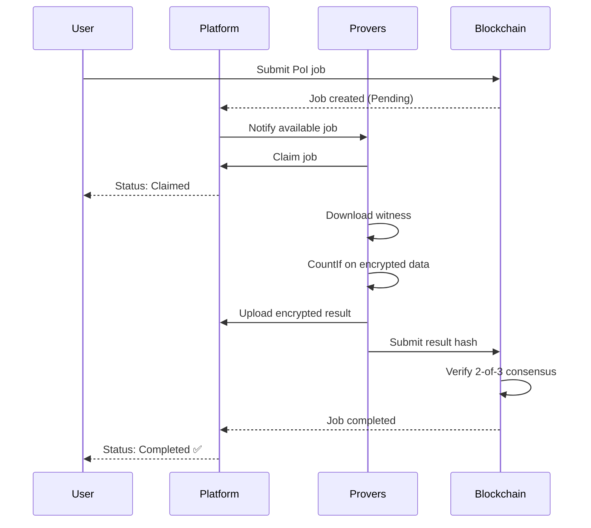

# Proof of Innocence Guide

Verify compliance with sanctions lists or screening criteria without revealing your transaction history using ZyberLink's privacy-preserving verification system.

## Overview

Proof of Innocence (PoI) enables you to prove you have NOT interacted with sanctioned entities without exposing your complete transaction history. This is critical for:

- **Regulatory Compliance** - Pass KYC/AML checks privately
- **Privacy Preservation** - Don't reveal all your transactions
- **Selective Disclosure** - Prove innocence without full transparency

**How it works:** ZyberLink uses FHE CountIf operations to search your encrypted transaction history for sanctioned addresses. If the count is zero, you're proven innocent - without revealing any transaction details.

### The Problem PoI Solves

**Traditional Compliance:**
```
❌ Reveal entire transaction history to auditor
❌ Auditor manually reviews every transaction
❌ Privacy completely lost
❌ Slow and expensive
```

**ZyberLink Proof of Innocence:**
```
✅ Encrypt transaction history locally
✅ Provers count sanctioned interactions (on ciphertext)
✅ Decrypt result: 0 = innocent, >0 = flagged
✅ Transaction details remain private
```

## Prerequisites

Before creating a Proof of Innocence:

- **Solana wallet** with SOL (0.01-0.1 SOL for fees)
- **Transaction data** to verify (wallet addresses, user IDs, etc.)
- **Sanctions list** (OFAC, custom compliance list, etc.)
- **FHE CLI tools** (for encryption)

### Understanding the Data Model

**Input Data:**
- Your transaction history (encrypted as integers)
- Each transaction mapped to a unique index (0-255)

**Sanctions List:**
- List of forbidden indices (e.g., [66, 77, 88, 99])
- These represent sanctioned addresses/entities

**Operation:**
```
CountIf(encrypted_history, predicate=Equals(sanctioned_index))
→ Returns encrypted count of matches
→ 0 = innocent, >0 = violation detected
```

## Step-by-Step Guide

### Step 1: Prepare Your Transaction Data

Convert your transaction history to numeric indices:

```bash
# Example: You have transaction history with these addresses
# - Address A: 0xABC...123 → Index 10
# - Address B: 0xDEF...456 → Index 25
# - Address C: 0xGHI...789 → Index 50
# - Address D: 0xJKL...012 → Index 75

# Sanctioned list (demo): [66, 77, 88, 99]
# Your indices: [10, 25, 50, 75]
# Expected result: 0 matches (you're innocent!)
```

**Index Mapping Strategies:**

**Strategy 1: Hash-based indexing**
```python
# Map addresses to 0-255 range
def address_to_index(address):
    hash_val = hashlib.sha256(address.encode()).hexdigest()
    return int(hash_val[:2], 16)  # First byte as index
```

**Strategy 2: Sequential indexing**
```python
# Assign sequential IDs to entities
entity_registry = {
    "entity_1": 1,
    "entity_2": 2,
    # ... up to 255
}
```

**Strategy 3: Modulo mapping**
```python
# Map large IDs to 0-255 range
def id_to_index(entity_id):
    return entity_id % 256
```

### Step 2: Encrypt Transaction History

Use the FHE CLI to encrypt your transaction indices:

```bash
cd src/fhe-cli

# Encrypt your transaction history
# Format: comma-separated list of indices
cargo run --release --bin fhe-cli encrypt \
  --values 10,25,50,75

# Output:
# ✅ 4 values encrypted
# 📁 witness.bin (52.4 MB) - upload to platform
# 🔑 client_key.bin (secret!) - keep safe
```

**Important:** Each encrypted value represents one transaction's associated index.

### Step 3: Access Proof of Innocence Interface

Navigate to the PoI interface:

**Live Demo:** https://demo.zyberlink.fun/proof-of-innocence
**Local Development:** http://localhost:5173/proof-of-innocence

1. Click **"Proof of Innocence"** in navigation
2. Connect your Solana wallet
3. Review the demo sanctions list (or configure your own)

### Step 4: Review Sanctions List

The platform displays the active sanctions list:

**Demo Sanctions List:**
```
Name: OFAC Demo List
Description: Simulated sanctioned indices for demonstration
Values: [66, 77, 88, 99, 111, 122, 133, 144, 155, 166]
```

**Production Usage:**
- Request official sanctions list from platform operator
- Or import your own compliance list
- Indices should match your transaction mapping strategy

### Step 5: Upload Encrypted Witness

1. Click **"Upload Witness File"**
2. Select `witness.bin` (generated in Step 2)
3. Wait for upload confirmation
4. Platform displays:
   - Witness size (~52 MB)
   - Commitment hash (for verification)
   - Number of encrypted transactions

**Upload Notes:**
- Large files may take 10-30 seconds
- Server key included in witness.bin
- Do not close browser during upload

### Step 6: Select Sanctioned Index to Check

Choose which sanctioned index to verify against:

**UI Options:**
- Dropdown: Select one index from sanctions list
- Or: Check all indices sequentially (multiple jobs)

**Example:**
```
Selected: Index 66
Operation: CountIf(transactions, Equals(66))
Expected: 0 (if you never interacted with index 66)
```

**Batch Checking (Advanced):**
Submit separate jobs for each sanctioned index:
- Job 1: Check index 66
- Job 2: Check index 77
- Job 3: Check index 88
- ... etc.

If ALL return 0, full innocence proven.

### Step 7: Configure Price

Dynamic pricing based on job complexity:

**Price Factors:**
- Operation: CountIf (Tier 4-5 complexity)
- Dataset size: Number of transactions
- Network demand: Current prover availability

**Example Pricing:**
```
Dataset: 10 transactions
Operation: CountIf
Recommended: 0.0054 SOL
Minimum: 0.003 SOL
Maximum: 0.0108 SOL

Breakdown:
- Job cost: 0.0054 SOL
- Platform fee (1%): 0.000054 SOL
- Total: 0.005454 SOL
```

**Pricing Strategy:**
- Use recommended price for normal processing
- Increase 50% for urgent verification
- Decrease 20% for low-priority checks (slower)

### Step 8: Submit Verification Job

1. Review configuration:
   - Sanctioned index to check
   - Number of transactions
   - Price in SOL
   - Required provers: 3
   - Consensus: 2-of-3

2. Click **"Verify Innocence"**

3. Approve transaction in wallet

4. Wait for blockchain confirmation

**Transaction Details:**
```
Type: CreateJob + FheConsensusConfig
Program: ZyberLink Marketplace
Accounts: Job PDA, Escrow PDA, Creator
Data: CountIf(Equals(66)), 3 provers, 2-of-3 consensus
```

### Step 9: Monitor Verification Status

Real-time status updates:



**Status Timeline:**
- **Pending** (0-30s): Waiting for provers
- **Claimed** (instant): Provers accepted job
- **Computing** (30-90s): FHE CountIf computation
- **Completed** (5-10s): Consensus reached

**Total Time:** ~60-180 seconds

### Step 10: View Verification Result

Once completed, the interface shows:

#### Innocent Result (Count = 0)
```
✅ PROOF OF INNOCENCE VERIFIED

Result: 0 matches found
Status: No sanctioned interactions detected
Checked Index: 66
Transactions Analyzed: 10
Provers: 3/3 consensus

🎉 You are proven innocent!
Your transaction history contains no interactions
with sanctioned index 66.

View Transaction: [5k7Xh9...abc123]
Download Proof Certificate: [Download]
```

#### Violation Detected (Count > 0)
```
⚠️ SANCTIONED INTERACTION DETECTED

Result: 2 matches found
Status: Violations detected
Checked Index: 66
Transactions Analyzed: 10
Provers: 3/3 consensus

❌ Your transaction history contains 2 interactions
with sanctioned index 66.

Recommended Actions:
- Review your transaction history
- Contact compliance officer
- Provide additional documentation

View Transaction: [5k7Xh9...abc123]
```

### Step 11: Download Proof Certificate

Generate verifiable proof of innocence:

1. Click **"Download Proof Certificate"**
2. Save JSON certificate file
3. Share with auditors/regulators as needed

**Certificate Contents:**
```json
{
  "version": "1.0",
  "timestamp": "2025-12-04T10:30:00Z",
  "job_id": "5k7Xh9...abc123",
  "verification_type": "proof_of_innocence",
  "result": {
    "count": 0,
    "status": "innocent"
  },
  "parameters": {
    "sanctioned_index": 66,
    "transactions_checked": 10,
    "operation": "CountIf(Equals(66))"
  },
  "consensus": {
    "required_provers": 3,
    "threshold": 2,
    "agreement": "3/3"
  },
  "blockchain_proof": {
    "network": "solana-devnet",
    "transaction": "5k7Xh9...abc123",
    "block": 123456789,
    "timestamp": "2025-12-04T10:30:00Z"
  },
  "privacy_guarantees": {
    "data_encrypted": true,
    "details_revealed": false,
    "fhe_protocol": "TFHE-rs 0.10"
  }
}
```

**Certificate Verification:**
Auditors can verify the certificate by:
1. Checking blockchain transaction
2. Verifying prover consensus
3. Confirming computation parameters

## Complete Example Workflow

### Scenario: Crypto Exchange Compliance Check

**Background:**
- User wants to open exchange account
- Exchange requires OFAC sanctions screening
- User values privacy (doesn't want to expose full history)

**Solution:** Use ZyberLink Proof of Innocence

#### 1. Map Transaction History

```python
# User's real transaction history (simplified)
transactions = [
    "0xABC...123",  # DEX swap
    "0xDEF...456",  # NFT purchase
    "0xGHI...789",  # Token transfer
    "0xJKL...012",  # Staking deposit
]

# Map to indices (hash-based)
indices = [10, 25, 50, 75]

# OFAC sanctions list (demo)
sanctioned = [66, 77, 88, 99]
```

#### 2. Encrypt Transaction Indices

```bash
cd src/fhe-cli
cargo run --release --bin fhe-cli encrypt --values 10,25,50,75

# Output:
# ✅ Encrypted 4 transactions
# 📁 witness.bin (52.4 MB)
# 🔑 client_key.bin (KEEP SECRET!)
```

#### 3. Submit to Platform

```
1. Navigate to https://demo.zyberlink.fun/proof-of-innocence
2. Connect wallet
3. Upload witness.bin
4. Select sanctioned index: 66
5. Use recommended price: 0.0054 SOL
6. Click "Verify Innocence"
7. Approve wallet transaction
```

#### 4. Wait for Verification

```
[00:10] Job submitted - TX: 5k7Xh9...abc123
[00:15] Claimed by 3 provers
[00:30] Computing CountIf(Equals(66))...
[01:45] Consensus reached: 3/3 provers agree
[01:50] ✅ Completed!
```

#### 5. View Result

```
✅ PROOF OF INNOCENCE VERIFIED

Result: 0 matches
Status: No sanctioned interactions
Checked: Index 66

You have proven you did not interact with
sanctioned index 66, without revealing your
full transaction history!
```

#### 6. Submit to Exchange

```
Download proof certificate (poi_proof.json)
Upload to exchange compliance portal
Exchange verifies:
  ✅ Blockchain transaction valid
  ✅ Prover consensus confirmed
  ✅ Zero sanctioned interactions
  ✅ Account approved!
```

**Privacy Preserved:**
- Exchange never saw your transaction history
- Exchange only knows: 0 sanctioned interactions
- Your DeFi activities remain private

## Advanced Usage

### Batch Verification (All Sanctions)

Check all sanctioned indices automatically:

```javascript
// Pseudo-code for batch submission
const sanctioned_list = [66, 77, 88, 99, 111, 122, 133, 144];
const results = [];

for (const index of sanctioned_list) {
  const job = await submitPoIJob({
    witness: witness_file,
    sanctioned_index: index,
    price: recommended_price
  });

  results.push({
    index: index,
    job_id: job.id,
    status: 'pending'
  });
}

// Wait for all jobs to complete
const final_results = await Promise.all(
  results.map(r => waitForJobCompletion(r.job_id))
);

// Check if fully innocent
const is_innocent = final_results.every(r => r.count === 0);
```

**Batch Benefits:**
- Comprehensive verification (all indices)
- Parallel processing (faster completion)
- Complete innocence proof

### Custom Sanctions Lists

Organizations can configure custom compliance lists:

**Use Cases:**
- Internal restricted entities
- Regulatory watch lists
- Jurisdiction-specific sanctions
- Industry blacklists

**Configuration:**
```javascript
// Custom sanctions list (platform admin)
{
  "name": "EU Sanctions List 2025",
  "description": "European Union sanctions (indices)",
  "version": "2025-Q4",
  "indices": [10, 23, 45, 67, 89, 102, 134, 156, 178, 201],
  "authority": "European Commission",
  "updated": "2025-11-01"
}
```

### Incremental Verification

Verify new transactions only:

```
Previous verification: Transactions 1-100 (proven innocent)
New transactions: 101-120 (need verification)

Encrypt only new transactions [101, 102, ..., 120]
Submit PoI job for new batch
Combine results with previous proof
```

**Benefits:**
- Lower costs (fewer transactions to check)
- Faster processing
- Continuous compliance

## Troubleshooting

### False Positive Result

**Symptom:** Result shows >0 matches, but you're certain you're innocent

**Possible Causes:**
1. **Index collision** - Hash function mapped different addresses to same index
2. **Mapping error** - Incorrect transaction-to-index conversion
3. **Sanctions list mismatch** - Wrong list version used

**Solutions:**
```bash
# Verify your index mapping
python verify_mapping.py --transactions txs.json --sanctions list.json

# Use different hash function (reduce collisions)
# Or use 16-bit indices (FheUint16) instead of 8-bit

# Confirm sanctions list version
curl https://api.zyberlink.fun/sanctions/version
```

### Consensus Failed

**Symptom:** Job fails with "Consensus not reached"

**Cause:** Provers got different results (<2-of-3 agreement)

**What to do:**
1. Automatic refund issued
2. Re-encrypt witness (may be corrupted)
3. Resubmit job with new witness
4. If persists, report bug

**Note:** No data leaked (computation on encrypted data)

### Result Decryption Mismatch

**Symptom:** Decrypted result doesn't match expected value

**Causes:**
- Wrong client key used
- Result from different job
- Witness/key mismatch

**Debug steps:**
```bash
# Verify client key timestamp matches witness
ls -l fhe-output/
# client_key.bin and witness.bin should have same timestamp

# Check job ID matches downloaded result
# Job ID: abc123
# Result filename: result_abc123.bin

# Re-download result if corrupted
```

### Price Too Low Error

**Symptom:** Job stays pending, no provers claim

**Solution:**
1. Cancel job (refund issued)
2. Increase price by 50-100%
3. Resubmit job
4. Provers should claim within 30 seconds

**Prevention:** Always use recommended price or higher

## Security Considerations

### What Information is Revealed?

**Revealed to provers:**
- ✅ Number of transactions (count of encrypted values)
- ✅ That you're checking sanctions compliance
- ❌ Transaction details (encrypted)
- ❌ Addresses involved (encrypted)
- ❌ Final result (encrypted)

**Revealed to public (blockchain):**
- ✅ Job creation transaction
- ✅ Job completion status
- ✅ Price paid
- ❌ Input data (not on-chain)
- ❌ Result value (not on-chain)

### Privacy Best Practices

1. **Use burner wallet** - Separate wallet for ZyberLink (avoid linking)
2. **Batch transactions** - Submit multiple PoI jobs at once (hide intent)
3. **Randomize timing** - Don't submit immediately after suspicious event
4. **Use Tor/VPN** - Hide IP address from platform (optional)

### Trust Model

**You don't need to trust:**
- ❌ Provers (they never see plaintext)
- ❌ Platform operator (no access to data)
- ❌ Other users (isolated jobs)

**You must trust:**
- ✅ FHE cryptography (TFHE-rs implementation)
- ✅ Your own key management (client_key.bin security)
- ✅ Sanctions list provider (correct indices)

### Key Management

```bash
# Secure client key storage
mkdir -p ~/.zyberlink/keys
chmod 700 ~/.zyberlink/keys
mv client_key.bin ~/.zyberlink/keys/poi_$(date +%Y%m%d).bin
chmod 400 ~/.zyberlink/keys/poi_$(date +%Y%m%d).bin

# Backup to encrypted storage
gpg --symmetric --cipher-algo AES256 poi_$(date +%Y%m%d).bin
# Store .gpg file on separate device

# Never commit to git
echo "*.bin" >> .gitignore
echo "client_key*" >> .gitignore
```

## Integration with Applications

### API Integration Example

```javascript
// Node.js example: Automated PoI verification
import { ZyberLinkClient } from '@zyberlink/sdk';
import { Connection, Keypair } from '@solana/web3.js';

async function verifyUserInnocence(userId) {
  // 1. Fetch user's transaction history
  const transactions = await getUserTransactions(userId);

  // 2. Map to indices
  const indices = transactions.map(tx => hashToIndex(tx.address));

  // 3. Encrypt locally
  const { witness, clientKey } = await encryptTransactions(indices);

  // 4. Submit PoI job
  const client = new ZyberLinkClient({
    rpcUrl: 'https://api.mainnet-beta.solana.com',
    programId: 'YOUR_PROGRAM_ID'
  });

  const job = await client.createPoIJob({
    witness: witness,
    sanctionedIndex: 66, // Check one index
    priceLamports: 5_000_000,
    requiredProvers: 3,
    consensusThreshold: 2
  });

  // 5. Wait for completion
  const result = await client.waitForJobCompletion(job.id);

  // 6. Decrypt result
  const count = await decryptResult(result.encryptedOutput, clientKey);

  // 7. Return verification status
  return {
    innocent: count === 0,
    violationCount: count,
    jobId: job.id,
    blockchainProof: job.transaction
  };
}
```

### Webhook Integration

Receive notifications when PoI jobs complete:

```javascript
// Express webhook endpoint
app.post('/webhooks/zyberlink', async (req, res) => {
  const { jobId, status, result } = req.body;

  if (status === 'completed') {
    // Decrypt result
    const count = await decryptResult(result, clientKey);

    // Update user status
    await updateUserCompliance(userId, {
      innocent: count === 0,
      verified_at: new Date(),
      job_id: jobId
    });

    // Notify user
    await sendEmail(userId, {
      subject: 'Compliance Verification Complete',
      body: `Your Proof of Innocence has been verified. Result: ${count === 0 ? 'Approved' : 'Flagged'}`
    });
  }

  res.status(200).send('OK');
});
```

## Next Steps

Continue exploring ZyberLink:

- **[Private Analytics Guide](analytics-guide.md)** - Statistical computations on encrypted data
- **[FHE CLI Guide](fhe-cli.md)** - Master encryption workflows
- **[Prover Setup Guide](prover-setup.md)** - Run your own verification node
- **[SDK Integration](sdk-integration.md)** - Build PoI into your platform

## Support

For Proof of Innocence questions:

- **Documentation:** https://docs.zyberlink.fun
- **GitHub Issues:** https://github.com/8ctag0n/13/issues
- **Discord Community:** [Join server]
- **Email:** support@zyberlink.fun

---

**Proof of Innocence:** Verify compliance without exposing your history. Privacy-preserving verification powered by FHE.
