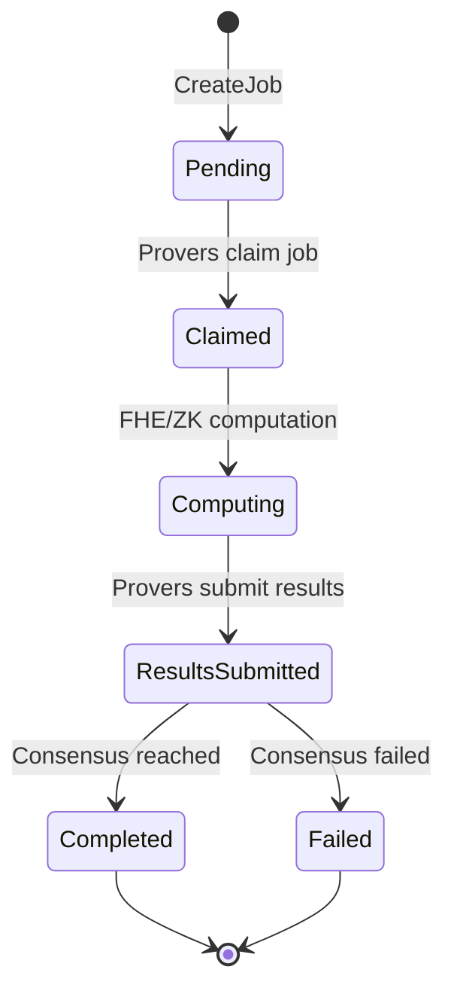

# SDK Integration Guide

Learn how to integrate ZyberLink into your Rust applications to offload FHE and ZK computations to a decentralized prover network.

## Overview

The ZyberLink SDK provides a high-level Rust API for:

- Creating and managing computation jobs
- Integrating FHE operations into your applications
- Monitoring job progress and retrieving results
- Managing prover interactions

## Installation

Add ZyberLink SDK to your `Cargo.toml`:

```toml
[dependencies]
zyberlink-sdk = { git = "https://github.com/yourusername/zyberlink", branch = "main" }
zyberlink-types = { git = "https://github.com/yourusername/zyberlink", branch = "main" }
solana-sdk = "1.18"
solana-client = "1.18"
anyhow = "1.0"
tokio = { version = "1.35", features = ["full"] }
```

## Quick Start

### 1. Initialize the Client

```rust
use zyberlink_sdk::MarketplaceClient;
use solana_sdk::pubkey::Pubkey;

// Connect to local validator (development)
let client = MarketplaceClient::new(
    "http://localhost:8899".to_string(),
    program_id, // Your deployed program ID
);

// Or connect to devnet/mainnet
let client = MarketplaceClient::new(
    "https://api.devnet.solana.com".to_string(),
    program_id,
);
```

### 2. Create Your First Job

```rust
use zyberlink_types::{CircuitType, FheConsensusConfig};
use solana_sdk::signature::{Keypair, Signer};

#[tokio::main]
async fn main() -> Result<()> {
    let client = MarketplaceClient::new(
        "http://localhost:8899".to_string(),
        program_id,
    );

    let creator = Keypair::new();
    let job_id = 1;

    // Prepare encrypted witness data
    let witness_commitment = [0u8; 32]; // Hash of your encrypted data
    let witness_size = 1024; // Size in bytes

    // Configure FHE job with multi-prover consensus
    let fhe_config = Some(FheConsensusConfig {
        required_provers: 3,
        consensus_threshold: 2, // 2-of-3 consensus
    });

    // Build instruction
    let ix = client.create_job_instruction(
        &creator.pubkey(),
        job_id,
        CircuitType::FheAdd, // FHE addition operation
        witness_commitment,
        witness_size,
        1_000_000_000, // 1 SOL payment
        600, // 10 minute timeout
        fhe_config,
    )?;

    // Send transaction
    let signature = client.send_and_confirm_transaction(
        &[ix],
        &[&creator],
    )?;

    println!("Job created: {}", signature);

    Ok(())
}
```

## Core Concepts

### Job Lifecycle



### Job Types

**ZK Proof Jobs**
- Single-prover model
- Proof verification on-chain or client-side
- Faster completion (10-15 seconds)

**FHE Computation Jobs**
- Multi-prover consensus (2-of-3 or 3-of-5)
- On-chain result verification via hash comparison
- Higher security through Byzantine fault tolerance

## SDK Architecture

The SDK is organized into three layers:

### Layer 1: Instruction Builders

Pure instruction builders that don't require keypairs (wallet-compatible):

```rust
use zyberlink_sdk::instructions::InstructionBuilder;

let builder = InstructionBuilder::new(program_id);

// Build instruction without signing
let ix = builder.create_job(
    creator_pubkey,
    job_id,
    CircuitType::FheAdd,
    witness_commitment,
    witness_size,
    price_lamports,
    timeout_seconds,
    fhe_config,
)?;

// Wallet signs the instruction later
```

### Layer 2: Transaction Composers

Compose multi-instruction transactions:

```rust
use zyberlink_sdk::transaction::TransactionBuilder;

let tx_builder = TransactionBuilder::new(program_id);

// Build complex transaction
let transaction = tx_builder
    .add_register_prover(prover_pubkey, stake_amount, encryption_key)
    .add_create_job(creator_pubkey, job_id, /* ... */)
    .build(recent_blockhash, payer_pubkey)?;

// Sign and send
```

### Layer 3: High-Level Client

Full-featured client with RPC integration:

```rust
use zyberlink_sdk::MarketplaceClient;

let client = MarketplaceClient::new(rpc_url, program_id);

// High-level operations
let signature = client.submit_fhe_result(&prover, &job_pda, result_hash)?;
```

## Common Integration Patterns

### Pattern 1: Simple FHE Addition

Encrypt two numbers and add them using FHE:

```rust
use zyberlink_crypto::fhe::{encrypt_value, FheClient};

async fn fhe_addition_example() -> Result<()> {
    // Initialize FHE client
    let fhe_client = FheClient::new();

    // Encrypt values
    let encrypted_a = fhe_client.encrypt(42)?;
    let encrypted_b = fhe_client.encrypt(58)?;

    // Create witness commitment
    let witness = vec![encrypted_a.clone(), encrypted_b.clone()];
    let witness_commitment = hash_witness(&witness);

    // Create job
    let client = MarketplaceClient::new(rpc_url, program_id);
    let job_id = get_next_job_id();

    let ix = client.create_job_instruction(
        &creator.pubkey(),
        job_id,
        CircuitType::FheAdd,
        witness_commitment,
        witness.len() as u32,
        1_000_000_000,
        600,
        Some(FheConsensusConfig {
            required_provers: 3,
            consensus_threshold: 2,
        }),
    )?;

    let signature = client.send_and_confirm_transaction(&[ix], &[&creator])?;

    // Poll for completion
    let (job_pda, _) = client.get_job_pda(&creator.pubkey(), job_id);
    let result = poll_for_completion(&client, &job_pda).await?;

    // Decrypt result
    let decrypted = fhe_client.decrypt(&result.encrypted_output)?;
    println!("Result: {} + {} = {}", 42, 58, decrypted);

    Ok(())
}
```

### Pattern 2: Batch Job Processing

Submit multiple jobs efficiently:

```rust
async fn batch_jobs_example() -> Result<()> {
    let client = MarketplaceClient::new(rpc_url, program_id);

    let mut jobs = Vec::new();

    // Create multiple job instructions
    for i in 0..10 {
        let job_id = i;
        let ix = client.create_job_instruction(
            &creator.pubkey(),
            job_id,
            CircuitType::FheAdd,
            witness_commitment,
            witness_size,
            1_000_000_000,
            600,
            Some(FheConsensusConfig {
                required_provers: 3,
                consensus_threshold: 2,
            }),
        )?;

        jobs.push(ix);
    }

    // Send all jobs in parallel (batch)
    for chunk in jobs.chunks(10) {
        let signature = client.send_and_confirm_transaction(
            chunk,
            &[&creator],
        )?;

        println!("Batch submitted: {}", signature);
    }

    Ok(())
}
```

### Pattern 3: Job Monitoring

Track job progress in real-time:

```rust
use std::time::Duration;
use tokio::time::sleep;

async fn monitor_job(
    client: &MarketplaceClient,
    job_pda: &Pubkey,
) -> Result<JobStatus> {
    loop {
        // Fetch job account
        let account = client.rpc_client.get_account(job_pda)?;

        // Deserialize job data
        let job: Job = borsh::from_slice(&account.data)?;

        match job.status {
            JobStatus::Pending => {
                println!("Job pending, waiting for provers...");
            }
            JobStatus::Claimed => {
                println!("Job claimed by {} provers", job.claimed_provers.len());
            }
            JobStatus::Computing => {
                println!("Provers computing...");
            }
            JobStatus::Completed => {
                println!("Job completed!");
                return Ok(JobStatus::Completed);
            }
            JobStatus::Failed => {
                println!("Job failed");
                return Ok(JobStatus::Failed);
            }
        }

        sleep(Duration::from_secs(2)).await;
    }
}
```

## Working with FHE

### Encrypting Input Data

```rust
use zyberlink_crypto::fhe::FheClient;

let fhe_client = FheClient::new();

// Encrypt a value
let encrypted = fhe_client.encrypt(42)?;

// Serialize for transport
let serialized = encrypted.serialize()?;

// Create witness commitment
let commitment = hash(&serialized);
```

### Decrypting Results

```rust
// Fetch completed job
let job_account = client.rpc_client.get_account(&job_pda)?;
let job: Job = borsh::from_slice(&job_account.data)?;

// Get encrypted result from consensus
let encrypted_result = job.fhe_result
    .expect("Job should have FHE result");

// Decrypt using client's private key
let decrypted = fhe_client.decrypt(&encrypted_result.data)?;

println!("Decrypted result: {}", decrypted);
```

## PDA Derivation

Understanding Program Derived Addresses (PDAs):

```rust
// Config PDA
let (config_pda, _bump) = Pubkey::find_program_address(
    &[b"config"],
    &program_id,
);

// Prover PDA
let (prover_pda, _bump) = Pubkey::find_program_address(
    &[b"prover", prover_authority.as_ref()],
    &program_id,
);

// Job PDA
let job_id_bytes = job_id.to_le_bytes();
let (job_pda, _bump) = Pubkey::find_program_address(
    &[b"job", creator.as_ref(), &job_id_bytes],
    &program_id,
);

// Escrow PDA
let (escrow_pda, _bump) = Pubkey::find_program_address(
    &[b"escrow", job_pda.as_ref()],
    &program_id,
);
```

Or use the client helpers:

```rust
let (config_pda, _) = client.get_config_pda();
let (prover_pda, _) = client.get_prover_pda(&prover_authority);
let (job_pda, _) = client.get_job_pda(&creator, job_id);
let (escrow_pda, _) = client.get_escrow_pda(&job_pda);
```

## Error Handling

The SDK uses `anyhow::Result` for error handling:

```rust
use anyhow::{Result, Context};

async fn create_job_with_error_handling() -> Result<()> {
    let client = MarketplaceClient::new(rpc_url, program_id);

    // Create job with context
    let signature = client
        .send_and_confirm_transaction(&[ix], &[&creator])
        .context("Failed to create job")?;

    println!("Job created: {}", signature);

    Ok(())
}

// Handle errors gracefully
match create_job_with_error_handling().await {
    Ok(_) => println!("Success!"),
    Err(e) => {
        eprintln!("Error: {}", e);
        // Chain shows full context
        for cause in e.chain() {
            eprintln!("  Caused by: {}", cause);
        }
    }
}
```

## Best Practices

### 1. Use Commitment Levels Wisely

```rust
use solana_sdk::commitment_config::CommitmentConfig;

// For production: use confirmed (fast, safe)
let client = MarketplaceClient::new_with_commitment(
    rpc_url,
    program_id,
    CommitmentConfig::confirmed(),
);

// For finality guarantees: use finalized (slower, safest)
let client = MarketplaceClient::new_with_commitment(
    rpc_url,
    program_id,
    CommitmentConfig::finalized(),
);
```

### 2. Implement Retry Logic

```rust
use tokio::time::{sleep, Duration};

async fn send_with_retry(
    client: &MarketplaceClient,
    ix: &Instruction,
    signer: &Keypair,
    max_retries: u32,
) -> Result<Signature> {
    for attempt in 0..max_retries {
        match client.send_and_confirm_transaction(&[ix.clone()], &[signer]) {
            Ok(sig) => return Ok(sig),
            Err(e) if attempt < max_retries - 1 => {
                eprintln!("Attempt {} failed: {}. Retrying...", attempt + 1, e);
                sleep(Duration::from_secs(2_u64.pow(attempt))).await; // Exponential backoff
            }
            Err(e) => return Err(e),
        }
    }
    unreachable!()
}
```

### 3. Cache Program Accounts

```rust
use std::collections::HashMap;
use std::sync::{Arc, Mutex};

struct AccountCache {
    cache: Arc<Mutex<HashMap<Pubkey, Account>>>,
    ttl: Duration,
}

impl AccountCache {
    fn get_or_fetch(
        &self,
        pubkey: &Pubkey,
        client: &RpcClient,
    ) -> Result<Account> {
        let mut cache = self.cache.lock().unwrap();

        if let Some(account) = cache.get(pubkey) {
            return Ok(account.clone());
        }

        let account = client.get_account(pubkey)?;
        cache.insert(*pubkey, account.clone());

        Ok(account)
    }
}
```

### 4. Validate Inputs

```rust
fn validate_job_params(
    price_lamports: u64,
    timeout_seconds: i64,
    fhe_config: &Option<FheConsensusConfig>,
) -> Result<()> {
    // Validate price
    if price_lamports < 1_000_000 { // 0.001 SOL minimum
        anyhow::bail!("Price too low: minimum 0.001 SOL");
    }

    // Validate timeout
    if timeout_seconds < 60 || timeout_seconds > 3600 {
        anyhow::bail!("Timeout must be between 60 and 3600 seconds");
    }

    // Validate FHE config
    if let Some(config) = fhe_config {
        if config.consensus_threshold > config.required_provers {
            anyhow::bail!("Consensus threshold cannot exceed required provers");
        }

        if config.required_provers < 2 {
            anyhow::bail!("FHE jobs require at least 2 provers");
        }
    }

    Ok(())
}
```

## Testing

### Unit Tests

```rust
#[cfg(test)]
mod tests {
    use super::*;
    use solana_sdk::pubkey::Pubkey;

    #[test]
    fn test_pda_derivation() {
        let program_id = Pubkey::new_unique();
        let client = MarketplaceClient::new(
            "http://localhost:8899".to_string(),
            program_id,
        );

        let creator = Pubkey::new_unique();
        let (job_pda, bump) = client.get_job_pda(&creator, 1);

        assert_ne!(job_pda, Pubkey::default());
        assert!(bump < 256);
    }
}
```

### Integration Tests

```rust
#[tokio::test]
async fn test_job_creation() -> Result<()> {
    // Start local validator
    let program_id = deploy_program().await?;

    let client = MarketplaceClient::new(
        "http://localhost:8899".to_string(),
        program_id,
    );

    let creator = Keypair::new();
    airdrop(&creator.pubkey(), 10_000_000_000).await?;

    // Initialize marketplace
    let authority = Keypair::new();
    let init_ix = client.initialize_instruction(
        &authority.pubkey(),
        1000, // 10% fee
        1_000_000_000, // 1 SOL min stake
        500, // min reputation
        600, // default timeout
    )?;

    client.send_and_confirm_transaction(&[init_ix], &[&authority])?;

    // Create job
    let job_id = 1;
    let create_ix = client.create_job_instruction(
        &creator.pubkey(),
        job_id,
        CircuitType::FheAdd,
        [0u8; 32],
        1024,
        1_000_000_000,
        600,
        Some(FheConsensusConfig {
            required_provers: 3,
            consensus_threshold: 2,
        }),
    )?;

    let signature = client.send_and_confirm_transaction(
        &[create_ix],
        &[&creator],
    )?;

    assert_ne!(signature, Signature::default());

    Ok(())
}
```

## Performance Optimization

### 1. Parallel RPC Requests

```rust
use tokio::try_join;

async fn fetch_multiple_jobs(
    client: &MarketplaceClient,
    job_pdas: &[Pubkey],
) -> Result<Vec<Job>> {
    let futures = job_pdas.iter().map(|pda| {
        let client = client.clone();
        let pda = *pda;
        async move {
            let account = client.rpc_client.get_account(&pda)?;
            borsh::from_slice::<Job>(&account.data)
                .map_err(|e| anyhow::anyhow!("Failed to deserialize: {}", e))
        }
    });

    let results = futures::future::try_join_all(futures).await?;
    Ok(results)
}
```

### 2. Transaction Preflight Skip (Advanced)

```rust
use solana_client::rpc_config::RpcSendTransactionConfig;

// Skip preflight for faster submission (use with caution)
let config = RpcSendTransactionConfig {
    skip_preflight: true,
    ..Default::default()
};

// Note: Only use in trusted environments
```

## Migration Guide

### From v0.1 to v0.2

**Breaking changes:**

1. `MarketplaceClient::create_job` now requires `FheConsensusConfig`
2. `JobStatus` enum has new variants
3. PDA derivation includes job_id for uniqueness

**Migration steps:**

```rust
// Old (v0.1)
let ix = client.create_job_instruction(
    &creator.pubkey(),
    CircuitType::FheAdd,
    witness_commitment,
    price_lamports,
);

// New (v0.2)
let ix = client.create_job_instruction(
    &creator.pubkey(),
    job_id, // NEW: unique job ID
    CircuitType::FheAdd,
    witness_commitment,
    witness_size, // NEW: witness size
    price_lamports,
    timeout_seconds, // NEW: explicit timeout
    Some(FheConsensusConfig { // NEW: FHE config
        required_provers: 3,
        consensus_threshold: 2,
    }),
);
```

## Next Steps

- **[API Reference](api-reference.md)** - Complete API documentation
- **[Examples Guide](examples.md)** - Real-world integration examples
- **[Architecture Overview](../architecture/overview.md)** - Understand the system design

## Support

For SDK questions and issues:

- GitHub Issues: [Report a bug](https://github.com/yourusername/zyberlink/issues)
- Discussions: [Ask questions](https://github.com/yourusername/zyberlink/discussions)
- Discord: [Join our community](#)
