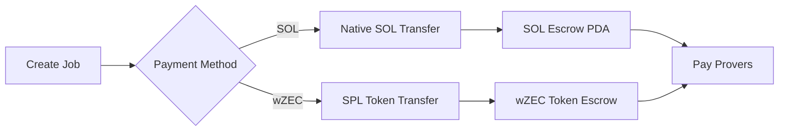

# wZEC Payment Integration

Complete documentation for integrating wZEC (Wrapped Zcash) payments into the ZyberLink marketplace.

## Overview

wZEC is an SPL token on Solana that represents Zcash (ZEC), enabling privacy-focused payments in the ZyberLink decentralized FHE computation marketplace.

**wZEC Mint Address:** `7gGGpHxbEuY8i76PwxjgGB1ZX2Nhmfq65N6YNHtrv7Zf`

## Documentation Structure

This section provides comprehensive documentation for all stakeholders:

### For Users

**[User Guide](wzec-user-guide.md)** - Everything users need to know about paying with wZEC
- What is wZEC and why use it
- How to acquire wZEC tokens
- Step-by-step payment instructions
- Token account management
- Troubleshooting common issues
- FAQ

### For Developers

**[Developer Guide](wzec-developer-guide.md)** - Complete integration guide for developers
- Quick start examples
- Frontend integration (React/Svelte)
- Backend integration (Rust/Node.js)
- Signature generation (CRITICAL: base58 format)
- Token account management
- Error handling patterns
- Best practices

**[API Reference](wzec-api-reference.md)** - Complete API documentation
- Endpoint specifications
- Request/response schemas
- Authentication and security
- Error codes and handling
- Code examples in multiple languages
- SDKs and tools

### For Architects

**[Architecture Documentation](../architecture/wzec-architecture.md)** - Technical deep dive
- System architecture with diagrams
- Component interactions
- Data flow diagrams
- Security model
- Performance considerations
- Future enhancements

### For QA Engineers

**[Testing Guide](wzec-testing-guide.md)** - Comprehensive testing procedures
- Test environment setup
- Unit tests (frontend and backend)
- Integration tests
- E2E automated tests
- Manual testing procedures
- Performance and security testing

## Quick Start

### For Users

1. **Acquire wZEC**: Purchase from a DEX (Raydium, Orca, Jupiter)
2. **Connect Wallet**: Use Phantom, Solflare, or compatible wallet
3. **Select wZEC Payment**: Choose wZEC in payment method selector
4. **Create Job**: System handles token account automatically
5. **Confirm Transaction**: Sign and submit via your wallet

### For Developers

```javascript
import { Connection, PublicKey } from '@solana/web3.js';
import bs58 from 'bs58';

const WZEC_MINT = new PublicKey('7gGGpHxbEuY8i76PwxjgGB1ZX2Nhmfq65N6YNHtrv7Zf');

// 1. Sign message
const message = `create_job:${jobId}:${timestamp}:${nonce}`;
const signature = bs58.encode(await wallet.signMessage(message));

// 2. Create job with wZEC
const response = await fetch('/api/jobs/validate-and-build', {
  method: 'POST',
  headers: { 'Content-Type': 'application/json' },
  body: JSON.stringify({
    creator_pubkey: wallet.publicKey.toString(),
    encrypted_data: encryptedData,
    server_key: serverKey,
    message,
    signature,  // MUST be base58!
    nonce,
    operation: 'add',
    operation_value: 5,
    price_lamports: 500000000,  // 5 wZEC
    required_provers: 3,
    consensus_threshold: 2,
    payment_method: 'wZEC'  // KEY: Specify wZEC
  })
});

const { job_id, transaction } = await response.json();

// 3. Sign and send transaction
// ... (see Developer Guide for complete example)
```

## Key Features

### Dual Payment System



### Automatic Token Account Creation

- System automatically detects missing token accounts
- Creates Associated Token Account (ATA) if needed
- No manual intervention required from users
- Seamless UX

### Backwards Compatible

- Existing SOL payments work unchanged
- No breaking changes to API
- Optional `payment_method` field
- Defaults to SOL if not specified

## Technical Highlights

### Payment Method Comparison

| Feature | SOL Payment | wZEC Payment |
|---------|-------------|--------------|
| Transaction Speed | Instant | Instant |
| Setup Required | None | Token account |
| Accounts in TX | 5 | 9 |
| Instruction | CreateJob | CreateJobWithToken |
| Token Program | System | SPL Token |

### Security Features

- **Ed25519 Signatures**: Cryptographic authentication
- **Anti-Replay Protection**: Nonce + timestamp validation
- **Base58 Format**: Solana-standard signature encoding
- **Input Validation**: Comprehensive backend validation
- **TFHE Support**: Handles 156 MB ServerKeys securely

### Performance

- **API Response**: < 2s for normal requests
- **Large Payloads**: Supports 200 MB requests
- **Throughput**: 50+ requests/second
- **E2E Latency**: ~5-10 seconds (including blockchain confirmation)

## Integration Status

### Backend (Completed)

- [x] Payment method validation
- [x] CreateJobWithToken instruction
- [x] Token escrow PDA derivation
- [x] Automatic ATA creation
- [x] Database schema migration
- [x] E2E test script passing

### Frontend (Completed)

- [x] PaymentMethodSelector component
- [x] Token account manager utility
- [x] Balance validation
- [x] Error handling
- [x] 35+ unit tests
- [x] Mock API for testing

### Documentation (Completed)

- [x] User guide
- [x] Developer guide
- [x] API reference
- [x] Architecture documentation
- [x] Testing guide
- [x] GitBook integration

## Common Use Cases

### Use Case 1: Pay with wZEC

User wants to pay for FHE computation using wZEC instead of SOL.

**Solution:** Select "wZEC" payment method in UI → System handles everything automatically

### Use Case 2: Missing Token Account

User doesn't have wZEC token account yet.

**Solution:** System detects missing account → Includes ATA creation in transaction → Account created automatically

### Use Case 3: API Integration

Developer wants to integrate wZEC payments into their app.

**Solution:** Use `/api/jobs/validate-and-build` endpoint with `payment_method: "wZEC"` → Follow Developer Guide

### Use Case 4: E2E Testing

QA engineer wants to test wZEC payment flow.

**Solution:** Run `./scripts/e2e-test-wzec.sh` → Automated test with real TFHE keys

## Troubleshooting

### Common Issues

**Issue:** "Invalid payment method"
**Solution:** Use `"wZEC"` (uppercase) not `"wzec"` (lowercase)

**Issue:** "Signature verification failed"
**Solution:** Ensure signature is base58 encoded (NOT base64)

**Issue:** "Insufficient wZEC balance"
**Solution:** User needs to acquire more wZEC from DEX

**Issue:** "Token account creation failed"
**Solution:** User needs at least 0.005 SOL for rent + fees

## Resources

### Documentation

- [User Guide](wzec-user-guide.md) - For end users
- [Developer Guide](wzec-developer-guide.md) - For developers
- [API Reference](wzec-api-reference.md) - API specs
- [Architecture](../architecture/wzec-architecture.md) - System design
- [Testing Guide](wzec-testing-guide.md) - QA procedures

### Code Examples

- [Frontend Integration](wzec-developer-guide.md#frontend-integration)
- [Backend Integration](wzec-developer-guide.md#backend-integration)
- [Signature Generation](wzec-developer-guide.md#signature-generation)
- [E2E Test Script](wzec-testing-guide.md#e2e-tests)

### Tools

- **wZEC Mint Explorer**: https://solscan.io/token/7gGGpHxbEuY8i76PwxjgGB1ZX2Nhmfq65N6YNHtrv7Zf
- **Test Key Generator**: `cargo run -p test-utils --bin generate-tfhe-keys`
- **Message Signer**: `scripts/sign-message-raw.py`
- **E2E Test**: `scripts/e2e-test-wzec.sh`

## Support

Need help with wZEC integration?

- **Documentation**: [docs.zyberlink.io](https://docs.zyberlink.io)
- **GitHub Issues**: [Report bugs](https://github.com/zyberlink/zyberlink/issues)
- **Discord**: [#wzec-support](https://discord.gg/zyberlink)
- **Email**: support@zyberlink.io

## Changelog

### Version 1.0.0 (2025-11-20)

**Added:**
- wZEC payment support
- PaymentMethodSelector UI component
- Token account auto-creation
- CreateJobWithToken instruction
- Complete documentation suite
- E2E test script

**Technical Details:**
- Base58 signature format (Solana standard)
- 156 MB TFHE ServerKey support
- Automatic ATA management
- Backwards compatible with SOL payments

## Next Steps

1. **New Users**: Start with the [User Guide](wzec-user-guide.md)
2. **Developers**: Read the [Developer Guide](wzec-developer-guide.md)
3. **Integrators**: Check the [API Reference](wzec-api-reference.md)
4. **Architects**: Review the [Architecture](../architecture/wzec-architecture.md)
5. **QA Teams**: Follow the [Testing Guide](wzec-testing-guide.md)

---

**Last Updated**: 2025-11-21
**Version**: 1.0.0
**wZEC Mint**: `7gGGpHxbEuY8i76PwxjgGB1ZX2Nhmfq65N6YNHtrv7Zf`
**Status**: Production Ready
