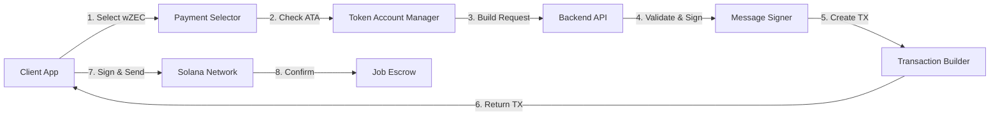

# wZEC Payment Developer Guide

A comprehensive guide for developers integrating wZEC (Wrapped Zcash) payment support into applications using the ZyberLink marketplace.

## Table of Contents

- [Overview](#overview)
- [Quick Start](#quick-start)
- [Frontend Integration](#frontend-integration)
- [Backend Integration](#backend-integration)
- [Signature Generation](#signature-generation)
- [Token Account Management](#token-account-management)
- [Transaction Building](#transaction-building)
- [Error Handling](#error-handling)
- [Testing](#testing)
- [Production Checklist](#production-checklist)
- [Best Practices](#best-practices)

## Overview

### Architecture



### Key Components

1. **PaymentMethodSelector**: UI component for SOL vs wZEC selection
2. **TokenAccountManager**: Automatic ATA creation/verification
3. **MessageSigner**: Ed25519 signature generation (base58 format)
4. **TransactionBuilder**: Creates wZEC payment transactions
5. **API Client**: Handles communication with backend

## Quick Start

### Installation

```bash
# Frontend dependencies
npm install @solana/web3.js @solana/spl-token

# Backend dependencies (Rust)
cargo add solana-sdk spl-token borsh
```

### Minimal Example

```javascript
import { Connection, PublicKey } from '@solana/web3.js';
import { getAssociatedTokenAddress } from '@solana/spl-token';

// Configuration
const WZEC_MINT = new PublicKey('7gGGpHxbEuY8i76PwxjgGB1ZX2Nhmfq65N6YNHtrv7Zf');
const API_URL = 'https://api.zyberlink.io';

// Create job with wZEC payment
async function createJobWithWZEC(wallet, jobData) {
  // 1. Check token account
  const ata = await getAssociatedTokenAddress(WZEC_MINT, wallet.publicKey);

  // 2. Prepare request
  const request = {
    creator_pubkey: wallet.publicKey.toString(),
    encrypted_data: jobData.encryptedData,
    server_key: jobData.serverKey,
    message: `create_job:${jobData.jobId}:${Date.now()}:${randomNonce()}`,
    signature: await signMessage(wallet, message),
    nonce: randomNonce(),
    operation: 'add',
    operation_value: 5,
    price_lamports: 500000000, // 5 wZEC in zatoshis
    required_provers: 3,
    consensus_threshold: 2,
    payment_method: 'wZEC' // KEY: Specify wZEC payment
  };

  // 3. Call API
  const response = await fetch(`${API_URL}/api/jobs/validate-and-build`, {
    method: 'POST',
    headers: { 'Content-Type': 'application/json' },
    body: JSON.stringify(request)
  });

  const { job_id, transaction } = await response.json();

  // 4. Sign and send transaction
  const tx = Transaction.from(Buffer.from(transaction, 'base64'));
  const signed = await wallet.signTransaction(tx);
  const signature = await connection.sendRawTransaction(signed.serialize());

  return { job_id, signature };
}
```

## Frontend Integration

### PaymentMethodSelector Component

**Svelte Implementation:**

```svelte
<script>
  import { createEventDispatcher } from 'svelte';

  const dispatch = createEventDispatcher();

  export let selected = 'sol'; // 'sol' | 'wzec'
  export let disabled = false;

  const methods = [
    {
      id: 'sol',
      name: 'SOL',
      description: 'Native Solana token - Fast & low fees',
      icon: '◉',
      recommended: true
    },
    {
      id: 'wzec',
      name: 'wZEC',
      description: 'Private payments with Zcash - SPL Token',
      icon: '⚡',
      recommended: false
    }
  ];

  function handleSelect(methodId) {
    if (disabled) return;
    selected = methodId;
    dispatch('change', { payment_method: methodId });
  }
</script>

<div class="payment-selector">
  {#each methods as method}
    <button
      class="method-card {selected === method.id ? 'selected' : ''}"
      on:click={() => handleSelect(method.id)}
      disabled={disabled}
    >
      <div class="radio">
        {selected === method.id ? '●' : '○'}
      </div>
      <div class="method-info">
        <div class="method-icon">{method.icon}</div>
        <div class="method-name">{method.name}</div>
        <div class="method-description">{method.description}</div>
      </div>
      {#if method.recommended}
        <span class="badge">RECOMMENDED</span>
      {/if}
    </button>
  {/each}
</div>

<style>
  .method-card {
    display: flex;
    gap: 1rem;
    padding: 1.5rem;
    border: 2px solid var(--border-color);
    border-radius: 8px;
    cursor: pointer;
    transition: all 0.2s;
  }

  .method-card.selected {
    border-color: var(--primary-color);
    background: rgba(139, 92, 246, 0.1);
  }

  .method-card:hover:not(:disabled) {
    border-color: var(--primary-light);
    transform: translateY(-2px);
  }
</style>
```

**React Implementation:**

```jsx
import React, { useState } from 'react';

export function PaymentMethodSelector({ onSelect, initialMethod = 'sol' }) {
  const [selected, setSelected] = useState(initialMethod);

  const methods = [
    {
      id: 'sol',
      name: 'SOL',
      description: 'Native Solana token - Fast & low fees',
      icon: '◉',
      recommended: true
    },
    {
      id: 'wzec',
      name: 'wZEC',
      description: 'Private payments with Zcash - SPL Token',
      icon: '⚡',
      recommended: false
    }
  ];

  const handleSelect = (methodId) => {
    setSelected(methodId);
    onSelect(methodId);
  };

  return (
    <div className="payment-selector">
      {methods.map(method => (
        <button
          key={method.id}
          className={`method-card ${selected === method.id ? 'selected' : ''}`}
          onClick={() => handleSelect(method.id)}
        >
          <div className="radio">
            {selected === method.id ? '●' : '○'}
          </div>
          <div className="method-info">
            <div className="method-icon">{method.icon}</div>
            <div className="method-name">{method.name}</div>
            <div className="method-description">{method.description}</div>
          </div>
          {method.recommended && <span className="badge">RECOMMENDED</span>}
        </button>
      ))}
    </div>
  );
}
```

### Token Account Verification

**Check if user has wZEC token account:**

```javascript
import { getAssociatedTokenAddress, getAccount } from '@solana/spl-token';
import { Connection, PublicKey } from '@solana/web3.js';

const WZEC_MINT = new PublicKey('7gGGpHxbEuY8i76PwxjgGB1ZX2Nhmfq65N6YNHtrv7Zf');

/**
 * Check if user has a wZEC token account
 * @param {Connection} connection - Solana connection
 * @param {PublicKey} walletPubkey - User's wallet public key
 * @returns {Promise<{exists: boolean, address: PublicKey, balance?: bigint}>}
 */
async function checkWZECTokenAccount(connection, walletPubkey) {
  try {
    // Derive ATA address
    const ata = await getAssociatedTokenAddress(
      WZEC_MINT,
      walletPubkey
    );

    // Try to fetch account
    const accountInfo = await getAccount(connection, ata);

    return {
      exists: true,
      address: ata,
      balance: accountInfo.amount
    };
  } catch (error) {
    // Account doesn't exist
    if (error.name === 'TokenAccountNotFoundError') {
      const ata = await getAssociatedTokenAddress(
        WZEC_MINT,
        walletPubkey
      );

      return {
        exists: false,
        address: ata,
        balance: 0n
      };
    }

    throw error;
  }
}

// Usage
const tokenAccount = await checkWZECTokenAccount(connection, wallet.publicKey);

if (!tokenAccount.exists) {
  console.warn('Token account will be created during transaction');
}

if (tokenAccount.balance < priceInZatoshis) {
  throw new Error('Insufficient wZEC balance');
}
```

### Complete Frontend Integration

```javascript
import { Connection, Transaction, PublicKey } from '@solana/web3.js';
import { getAssociatedTokenAddress } from '@solana/spl-token';

const WZEC_MINT = new PublicKey('7gGGpHxbEuY8i76PwxjgGB1ZX2Nhmfq65N6YNHtrv7Zf');
const API_URL = 'https://api.zyberlink.io';

/**
 * Complete job creation flow with wZEC payment
 */
export class ZyberLinkClient {
  constructor(connection, wallet) {
    this.connection = connection;
    this.wallet = wallet;
  }

  /**
   * Create a job with specified payment method
   * @param {Object} jobData - Job parameters
   * @param {string} paymentMethod - 'sol' or 'wzec'
   * @returns {Promise<{jobId: number, signature: string}>}
   */
  async createJob(jobData, paymentMethod = 'sol') {
    // 1. Validate payment method and check balances
    await this.validatePayment(paymentMethod, jobData.priceLamports);

    // 2. Generate message and signature
    const nonce = this.generateNonce();
    const timestamp = Math.floor(Date.now() / 1000);
    const message = `create_job:${jobData.jobId}:${timestamp}:${nonce}`;
    const signature = await this.signMessage(message);

    // 3. Build API request
    const request = {
      creator_pubkey: this.wallet.publicKey.toString(),
      encrypted_data: jobData.encryptedData,
      server_key: jobData.serverKey,
      message,
      signature,
      nonce,
      operation: jobData.operation,
      operation_value: jobData.operationValue,
      price_lamports: jobData.priceLamports,
      required_provers: jobData.requiredProvers || 3,
      consensus_threshold: jobData.consensusThreshold || 2,
      payment_method: paymentMethod === 'wzec' ? 'wZEC' : 'SOL'
    };

    // 4. Call backend API
    const response = await fetch(`${API_URL}/api/jobs/validate-and-build`, {
      method: 'POST',
      headers: { 'Content-Type': 'application/json' },
      body: JSON.stringify(request)
    });

    if (!response.ok) {
      const error = await response.json();
      throw new Error(error.error || 'Failed to create job');
    }

    const { job_id, transaction } = await response.json();

    // 5. Deserialize, sign, and send transaction
    const tx = Transaction.from(Buffer.from(transaction, 'base64'));
    const signedTx = await this.wallet.signTransaction(tx);
    const txSignature = await this.connection.sendRawTransaction(
      signedTx.serialize()
    );

    // 6. Confirm transaction
    await this.connection.confirmTransaction(txSignature, 'confirmed');

    // 7. Notify backend
    await this.confirmJob(job_id, txSignature);

    return {
      jobId: job_id,
      signature: txSignature
    };
  }

  /**
   * Validate payment method and check balances
   */
  async validatePayment(paymentMethod, priceLamports) {
    if (paymentMethod === 'wzec') {
      const tokenAccount = await checkWZECTokenAccount(
        this.connection,
        this.wallet.publicKey
      );

      if (tokenAccount.balance < BigInt(priceLamports)) {
        throw new Error(
          `Insufficient wZEC balance. Required: ${priceLamports}, Available: ${tokenAccount.balance}`
        );
      }
    } else if (paymentMethod === 'sol') {
      const balance = await this.connection.getBalance(this.wallet.publicKey);

      if (balance < priceLamports) {
        throw new Error(
          `Insufficient SOL balance. Required: ${priceLamports}, Available: ${balance}`
        );
      }
    } else {
      throw new Error(`Invalid payment method: ${paymentMethod}`);
    }
  }

  /**
   * Sign message using wallet
   */
  async signMessage(message) {
    const messageBytes = new TextEncoder().encode(message);
    const signatureBytes = await this.wallet.signMessage(messageBytes);

    // IMPORTANT: Return base58 encoded signature
    return bs58.encode(signatureBytes);
  }

  /**
   * Generate unique nonce
   */
  generateNonce() {
    return `${Date.now()}_${Math.random().toString(36).substr(2, 9)}`;
  }

  /**
   * Confirm job creation with backend
   */
  async confirmJob(jobId, signature) {
    await fetch(`${API_URL}/api/jobs/${jobId}/confirm`, {
      method: 'POST',
      headers: { 'Content-Type': 'application/json' },
      body: JSON.stringify({ signature })
    });
  }
}

// Usage Example
const connection = new Connection('https://api.mainnet-beta.solana.com');
const client = new ZyberLinkClient(connection, wallet);

// Create job with wZEC payment
const result = await client.createJob({
  jobId: 12345,
  encryptedData: 'base64_encrypted_data...',
  serverKey: 'base64_server_key...',
  operation: 'add',
  operationValue: 5,
  priceLamports: 500000000, // 5 wZEC
  requiredProvers: 3,
  consensusThreshold: 2
}, 'wzec');

console.log(`Job created: ${result.jobId}, TX: ${result.signature}`);
```

## Backend Integration

### Rust Backend

```rust
use solana_sdk::{
    pubkey::Pubkey,
    signature::{Keypair, Signature, Signer},
    transaction::Transaction,
};
use spl_token::instruction as token_instruction;
use std::str::FromStr;

const WZEC_MINT: &str = "7gGGpHxbEuY8i76PwxjgGB1ZX2Nhmfq65N6YNHtrv7Zf";

/// Job creation request with payment method
#[derive(Debug, serde::Deserialize)]
pub struct CreateJobRequest {
    pub creator_pubkey: String,
    pub encrypted_data: String,
    pub server_key: String,
    pub message: String,
    pub signature: String,  // base58 encoded
    pub nonce: String,
    pub operation: String,
    pub operation_value: u8,
    pub price_lamports: u64,
    pub required_provers: u8,
    pub consensus_threshold: u8,
    pub payment_method: Option<String>, // "SOL" or "wZEC"
}

/// Build transaction for job creation
pub async fn build_job_transaction(
    request: &CreateJobRequest,
) -> Result<String, Box<dyn std::error::Error>> {
    let payment_method = request.payment_method.as_deref().unwrap_or("SOL");

    match payment_method {
        "SOL" => build_sol_transaction(request).await,
        "wZEC" => build_wzec_transaction(request).await,
        _ => Err("Invalid payment method".into()),
    }
}

/// Build SOL payment transaction
async fn build_sol_transaction(
    request: &CreateJobRequest,
) -> Result<String, Box<dyn std::error::Error>> {
    // Standard CreateJob instruction (5 accounts)
    // Implementation from existing codebase
    todo!("Use existing SOL transaction builder")
}

/// Build wZEC payment transaction
async fn build_wzec_transaction(
    request: &CreateJobRequest,
) -> Result<String, Box<dyn std::error::Error>> {
    let creator = Pubkey::from_str(&request.creator_pubkey)?;
    let wzec_mint = Pubkey::from_str(WZEC_MINT)?;

    // Derive PDAs
    let (job_pda, _) = derive_job_pda(&creator, job_id);
    let (config_pda, _) = derive_config_pda();
    let (escrow_pda, _) = derive_escrow_pda(&job_pda);

    // Get creator's token account
    let creator_token_account = get_associated_token_address(&creator, &wzec_mint);

    // Build CreateJobWithToken instruction (9 accounts)
    let accounts = vec![
        AccountMeta::new(creator, true),              // signer
        AccountMeta::new(job_pda, false),             // writable
        AccountMeta::new(config_pda, false),          // writable
        AccountMeta::new(escrow_pda, false),          // writable
        AccountMeta::new(creator_token_account, false), // writable
        AccountMeta::new_readonly(wzec_mint, false),  // readonly
        AccountMeta::new_readonly(system_program::ID, false),
        AccountMeta::new_readonly(spl_token::ID, false),
        AccountMeta::new_readonly(sysvar::rent::ID, false),
    ];

    let instruction_data = CreateJobWithTokenData {
        circuit_type: parse_circuit_type(&request.operation),
        witness_commitment: hash_encrypted_data(&request.encrypted_data),
        witness_size: request.encrypted_data.len() as u32,
        price_lamports: request.price_lamports,
        timeout_seconds: 600,
        fhe_config: Some(FheConsensusConfig {
            required_provers: request.required_provers,
            consensus_threshold: request.consensus_threshold,
        }),
    };

    let instruction = Instruction {
        program_id: PROGRAM_ID,
        accounts,
        data: instruction_data.try_to_vec()?,
    };

    // Create transaction
    let recent_blockhash = get_recent_blockhash().await?;
    let tx = Transaction::new_with_payer(
        &[instruction],
        Some(&creator),
    );

    // Serialize to base64
    let serialized = base64::encode(tx.message.serialize());

    Ok(serialized)
}

/// Get associated token address
fn get_associated_token_address(
    wallet: &Pubkey,
    mint: &Pubkey,
) -> Pubkey {
    spl_associated_token_account::get_associated_token_address(wallet, mint)
}
```

### Node.js Backend

```javascript
const { Connection, PublicKey, Transaction } = require('@solana/web3.js');
const { getAssociatedTokenAddress } = require('@solana/spl-token');
const bs58 = require('bs58');

const WZEC_MINT = new PublicKey('7gGGpHxbEuY8i76PwxjgGB1ZX2Nhmfq65N6YNHtrv7Zf');

/**
 * Build transaction for job creation
 */
async function buildJobTransaction(request) {
  const paymentMethod = request.payment_method || 'SOL';

  if (paymentMethod === 'SOL') {
    return buildSOLTransaction(request);
  } else if (paymentMethod === 'wZEC') {
    return buildWZECTransaction(request);
  } else {
    throw new Error(`Invalid payment method: ${paymentMethod}`);
  }
}

/**
 * Build wZEC payment transaction
 */
async function buildWZECTransaction(request) {
  const creator = new PublicKey(request.creator_pubkey);

  // Derive accounts
  const jobPDA = deriveJobPDA(creator, request.job_id);
  const configPDA = deriveConfigPDA();
  const escrowPDA = deriveEscrowPDA(jobPDA);
  const creatorTokenAccount = await getAssociatedTokenAddress(WZEC_MINT, creator);

  // Build instruction
  const instruction = {
    programId: PROGRAM_ID,
    keys: [
      { pubkey: creator, isSigner: true, isWritable: true },
      { pubkey: jobPDA, isSigner: false, isWritable: true },
      { pubkey: configPDA, isSigner: false, isWritable: true },
      { pubkey: escrowPDA, isSigner: false, isWritable: true },
      { pubkey: creatorTokenAccount, isSigner: false, isWritable: true },
      { pubkey: WZEC_MINT, isSigner: false, isWritable: false },
      { pubkey: SystemProgram.programId, isSigner: false, isWritable: false },
      { pubkey: TOKEN_PROGRAM_ID, isSigner: false, isWritable: false },
      { pubkey: SYSVAR_RENT_PUBKEY, isSigner: false, isWritable: false },
    ],
    data: encodeInstructionData({
      instruction: 'CreateJobWithToken',
      circuitType: request.operation,
      witnessCommitment: hashData(request.encrypted_data),
      witnessSize: request.encrypted_data.length,
      priceLamports: request.price_lamports,
      timeoutSeconds: 600,
      fheConfig: {
        requiredProvers: request.required_provers,
        consensusThreshold: request.consensus_threshold,
      },
    }),
  };

  // Create transaction
  const connection = new Connection('https://api.mainnet-beta.solana.com');
  const { blockhash } = await connection.getLatestBlockhash();

  const transaction = new Transaction({
    feePayer: creator,
    recentBlockhash: blockhash,
  }).add(instruction);

  // Serialize to base64
  return transaction.serialize({ requireAllSignatures: false }).toString('base64');
}

module.exports = { buildJobTransaction };
```

## Signature Generation

### CRITICAL: Base58 Format

The backend expects signatures in **base58 format**, NOT base64. This matches Solana's standard wallet signature format.

```javascript
import bs58 from 'bs58';
import nacl from 'tweetnacl';

/**
 * Sign message with Solana keypair (returns base58)
 * @param {Keypair} keypair - Solana keypair
 * @param {string} message - Message to sign
 * @returns {string} base58 encoded signature
 */
function signMessage(keypair, message) {
  const messageBytes = new TextEncoder().encode(message);
  const signatureBytes = nacl.sign.detached(messageBytes, keypair.secretKey);

  // IMPORTANT: Return base58, not base64
  return bs58.encode(signatureBytes);
}

// Example
const keypair = Keypair.generate();
const message = 'create_job:123:1732104000:nonce123';
const signature = signMessage(keypair, message);

console.log('Signature (base58):', signature);
// Output: "5J7X... (88 characters)"
```

### Python Signing Helper

```python
#!/usr/bin/env python3
"""
Sign message with Solana keypair (raw Ed25519, base58 output)
"""
import sys
import json
import base58
from nacl.signing import SigningKey

def sign_message(keypair_path: str, message: str) -> str:
    """Sign message and return base58 signature"""

    # Load keypair
    with open(keypair_path, 'r') as f:
        keypair_bytes = bytes(json.load(f))

    # Extract secret key (first 32 bytes)
    secret_key = keypair_bytes[:32]
    signing_key = SigningKey(secret_key)

    # Sign message (raw, no prefix)
    message_bytes = message.encode('utf-8')
    signature = signing_key.sign(message_bytes).signature

    # Return base58 encoded
    return base58.b58encode(signature).decode('ascii')

if __name__ == '__main__':
    if len(sys.argv) != 3:
        print('Usage: sign-message.py <keypair_path> <message>')
        sys.exit(1)

    keypair_path = sys.argv[1]
    message = sys.argv[2]

    signature = sign_message(keypair_path, message)
    print(signature)
```

Usage:
```bash
python3 sign-message.py ~/.config/solana/id.json "create_job:123:1732104000:nonce"
# Output: 5J7X... (base58 signature)
```

## Token Account Management

### Automatic Creation

The backend automatically includes token account creation if needed:

```rust
// Check if token account exists
let token_account = get_associated_token_address(&creator, &wzec_mint);

let account_info = rpc_client.get_account(&token_account).ok();

if account_info.is_none() {
    // Add token account creation instruction
    let create_ata_ix = create_associated_token_account(
        &creator,      // payer
        &creator,      // owner
        &wzec_mint,    // mint
    );

    instructions.push(create_ata_ix);
}

// Add payment instruction
instructions.push(create_job_with_token_ix);
```

### Manual Creation (Frontend)

```javascript
import {
  createAssociatedTokenAccountInstruction,
  getAssociatedTokenAddress,
} from '@solana/spl-token';

/**
 * Manually create wZEC token account
 */
async function createWZECTokenAccount(connection, wallet) {
  const ata = await getAssociatedTokenAddress(
    WZEC_MINT,
    wallet.publicKey
  );

  // Check if already exists
  const accountInfo = await connection.getAccountInfo(ata);
  if (accountInfo) {
    console.log('Token account already exists:', ata.toString());
    return ata;
  }

  // Create instruction
  const instruction = createAssociatedTokenAccountInstruction(
    wallet.publicKey, // payer
    ata,              // associated token account
    wallet.publicKey, // owner
    WZEC_MINT         // mint
  );

  // Build and send transaction
  const transaction = new Transaction().add(instruction);
  const signature = await sendAndConfirmTransaction(
    connection,
    transaction,
    [wallet]
  );

  console.log('Token account created:', ata.toString());
  console.log('Transaction:', signature);

  return ata;
}
```

## Transaction Building

### CreateJobWithToken Instruction

```rust
/// Instruction accounts for CreateJobWithToken
pub struct CreateJobWithTokenAccounts {
    /// Creator (signer, pays fees)
    pub creator: Pubkey,
    /// Job PDA (writable)
    pub job: Pubkey,
    /// Config PDA (writable)
    pub config: Pubkey,
    /// Token escrow PDA (writable)
    pub token_escrow: Pubkey,
    /// Creator's token account (writable)
    pub creator_token_account: Pubkey,
    /// Token mint (readonly)
    pub token_mint: Pubkey,
    /// System program
    pub system_program: Pubkey,
    /// Token program
    pub token_program: Pubkey,
    /// Rent sysvar
    pub rent: Pubkey,
}

/// Instruction data for CreateJobWithToken
#[derive(BorshSerialize, BorshDeserialize)]
pub struct CreateJobWithTokenData {
    pub circuit_type: CircuitType,
    pub witness_commitment: [u8; 32],
    pub witness_size: u32,
    pub price_lamports: u64,  // Actually zatoshis for wZEC
    pub timeout_seconds: i64,
    pub fhe_config: Option<FheConsensusConfig>,
}
```

### Complete Transaction Flow

```javascript
/**
 * Complete flow: Create job with wZEC payment
 */
async function createJobWithWZEC(wallet, connection, jobData) {
  // 1. Validate inputs
  if (!jobData.encryptedData || !jobData.serverKey) {
    throw new Error('Missing encrypted data or server key');
  }

  // 2. Check wZEC balance
  const tokenAccount = await checkWZECTokenAccount(connection, wallet.publicKey);

  if (!tokenAccount.exists) {
    console.warn('Token account will be created automatically');
  }

  if (tokenAccount.balance < BigInt(jobData.priceLamports)) {
    throw new Error(`Insufficient wZEC. Need: ${jobData.priceLamports}, Have: ${tokenAccount.balance}`);
  }

  // 3. Generate signature
  const nonce = generateNonce();
  const timestamp = Math.floor(Date.now() / 1000);
  const message = `create_job:${jobData.jobId}:${timestamp}:${nonce}`;
  const signature = await wallet.signMessage(new TextEncoder().encode(message));
  const signatureBase58 = bs58.encode(signature);

  // 4. Build request
  const request = {
    creator_pubkey: wallet.publicKey.toString(),
    encrypted_data: jobData.encryptedData,  // base64
    server_key: jobData.serverKey,          // base64
    message,
    signature: signatureBase58,             // base58!
    nonce,
    operation: jobData.operation,
    operation_value: jobData.operationValue,
    price_lamports: jobData.priceLamports,
    required_provers: jobData.requiredProvers || 3,
    consensus_threshold: jobData.consensusThreshold || 2,
    payment_method: 'wZEC'                  // Key field
  };

  // 5. Call API
  const response = await fetch(`${API_URL}/api/jobs/validate-and-build`, {
    method: 'POST',
    headers: { 'Content-Type': 'application/json' },
    body: JSON.stringify(request)
  });

  if (!response.ok) {
    const error = await response.json();
    throw new Error(error.error || 'API request failed');
  }

  const { job_id, transaction } = await response.json();

  // 6. Deserialize transaction
  const tx = Transaction.from(Buffer.from(transaction, 'base64'));

  // 7. Sign with wallet
  const signedTx = await wallet.signTransaction(tx);

  // 8. Send to network
  const txSignature = await connection.sendRawTransaction(
    signedTx.serialize(),
    { skipPreflight: false }
  );

  // 9. Confirm
  await connection.confirmTransaction(txSignature, 'confirmed');

  // 10. Notify backend
  await fetch(`${API_URL}/api/jobs/${job_id}/confirm`, {
    method: 'POST',
    headers: { 'Content-Type': 'application/json' },
    body: JSON.stringify({ signature: txSignature })
  });

  return { job_id, signature: txSignature };
}
```

## Error Handling

### Common Errors

```javascript
/**
 * Error handling for wZEC payments
 */
class WZECPaymentError extends Error {
  constructor(message, code, details) {
    super(message);
    this.name = 'WZECPaymentError';
    this.code = code;
    this.details = details;
  }
}

/**
 * Handle API errors
 */
async function handleAPIError(response) {
  const error = await response.json();

  switch (response.status) {
    case 400:
      if (error.error.includes('payment_method')) {
        throw new WZECPaymentError(
          'Invalid payment method specified',
          'INVALID_PAYMENT_METHOD',
          error
        );
      }
      if (error.error.includes('signature')) {
        throw new WZECPaymentError(
          'Signature verification failed. Check signature format (must be base58)',
          'SIGNATURE_VERIFICATION_FAILED',
          error
        );
      }
      break;

    case 500:
      if (error.error.includes('transaction build')) {
        throw new WZECPaymentError(
          'Transaction building failed. Check token account and balance',
          'TRANSACTION_BUILD_FAILED',
          error
        );
      }
      break;
  }

  throw new WZECPaymentError(
    error.error || 'Unknown error',
    'UNKNOWN_ERROR',
    error
  );
}

/**
 * Handle transaction errors
 */
function handleTransactionError(error) {
  if (error.message.includes('InsufficientFundsForFee')) {
    throw new WZECPaymentError(
      'Insufficient SOL for transaction fees',
      'INSUFFICIENT_SOL_FOR_FEES',
      error
    );
  }

  if (error.message.includes('TokenAccountNotFound')) {
    throw new WZECPaymentError(
      'wZEC token account not found',
      'TOKEN_ACCOUNT_NOT_FOUND',
      error
    );
  }

  if (error.message.includes('InsufficientFunds')) {
    throw new WZECPaymentError(
      'Insufficient wZEC balance',
      'INSUFFICIENT_WZEC_BALANCE',
      error
    );
  }

  throw error;
}

// Usage
try {
  const result = await createJobWithWZEC(wallet, connection, jobData);
} catch (error) {
  if (error instanceof WZECPaymentError) {
    console.error(`wZEC Payment Error [${error.code}]:`, error.message);
    console.error('Details:', error.details);

    // Show user-friendly message
    switch (error.code) {
      case 'INSUFFICIENT_WZEC_BALANCE':
        showNotification('Insufficient wZEC balance. Please top up your account.');
        break;
      case 'TOKEN_ACCOUNT_NOT_FOUND':
        showNotification('wZEC token account required. It will be created automatically.');
        break;
      case 'SIGNATURE_VERIFICATION_FAILED':
        showNotification('Signature verification failed. Please try again.');
        break;
      default:
        showNotification('Payment failed. Please try again or contact support.');
    }
  } else {
    console.error('Unexpected error:', error);
    showNotification('An unexpected error occurred.');
  }
}
```

## Testing

### Unit Tests

```javascript
import { describe, it, expect, vi } from 'vitest';
import { createJobWithWZEC } from './wzec-client';

describe('wZEC Payment Integration', () => {
  it('should create job with wZEC payment', async () => {
    const mockWallet = createMockWallet();
    const mockConnection = createMockConnection();

    const result = await createJobWithWZEC(mockWallet, mockConnection, {
      jobId: 123,
      encryptedData: 'base64_data',
      serverKey: 'base64_key',
      operation: 'add',
      operationValue: 5,
      priceLamports: 500000000,
      requiredProvers: 3,
      consensusThreshold: 2
    });

    expect(result.job_id).toBe(123);
    expect(result.signature).toBeTruthy();
  });

  it('should handle insufficient wZEC balance', async () => {
    const mockWallet = createMockWalletWithLowBalance();
    const mockConnection = createMockConnection();

    await expect(
      createJobWithWZEC(mockWallet, mockConnection, {
        priceLamports: 1000000000 // 10 wZEC (more than balance)
      })
    ).rejects.toThrow('Insufficient wZEC');
  });

  it('should handle missing token account', async () => {
    const mockWallet = createMockWallet();
    const mockConnection = createMockConnectionWithoutTokenAccount();

    // Should not throw, account created automatically
    const result = await createJobWithWZEC(mockWallet, mockConnection, {
      priceLamports: 500000000
    });

    expect(result.job_id).toBeTruthy();
  });
});
```

### E2E Test

```bash
#!/bin/bash
# E2E test for wZEC payment integration

# 1. Generate TFHE keys
cargo run --release -p test-utils --bin generate-tfhe-keys -- --output-dir ./test-keys

# 2. Start local backend
cargo run --release -p blink-server &
SERVER_PID=$!

# 3. Run test
./scripts/e2e-test-wzec.sh

# 4. Cleanup
kill $SERVER_PID
```

See [wZEC Testing Guide](wzec-testing-guide.md) for complete testing documentation.

## Production Checklist

### Pre-Deployment

- [ ] wZEC mint address verified: `7gGGpHxbEuY8i76PwxjgGB1ZX2Nhmfq65N6YNHtrv7Zf`
- [ ] Signature format confirmed: base58 (NOT base64)
- [ ] Token account creation tested
- [ ] Error handling implemented
- [ ] Rate limiting configured
- [ ] Monitoring set up
- [ ] Documentation updated

### Security

- [ ] Signature verification enabled
- [ ] Nonce anti-replay protection active
- [ ] Timestamp expiry set (5 minutes)
- [ ] Input validation comprehensive
- [ ] SQL injection protection verified
- [ ] XSS protection enabled

### Performance

- [ ] API response time < 2s for normal requests
- [ ] Large payload handling tested (156 MB server key)
- [ ] Connection pooling configured
- [ ] Caching strategy implemented
- [ ] Rate limiting per IP/wallet

### Monitoring

- [ ] Metrics collection (Prometheus/Grafana)
- [ ] Error tracking (Sentry)
- [ ] Transaction monitoring
- [ ] Balance alerts
- [ ] Uptime monitoring

## Best Practices

### 1. Always Validate Payment Method

```javascript
function validatePaymentMethod(method) {
  const valid = ['sol', 'wzec'];
  if (!valid.includes(method.toLowerCase())) {
    throw new Error(`Invalid payment method: ${method}`);
  }
  return method.toUpperCase(); // API expects uppercase
}
```

### 2. Check Balances Before Transaction

```javascript
async function validateBalance(connection, wallet, paymentMethod, amount) {
  if (paymentMethod === 'wZEC') {
    const tokenAccount = await checkWZECTokenAccount(connection, wallet.publicKey);
    if (tokenAccount.balance < BigInt(amount)) {
      throw new Error('Insufficient wZEC balance');
    }
  } else {
    const balance = await connection.getBalance(wallet.publicKey);
    if (balance < amount) {
      throw new Error('Insufficient SOL balance');
    }
  }
}
```

### 3. Use Proper Signature Format

```javascript
// WRONG: base64
const signatureBase64 = Buffer.from(signature).toString('base64');

// RIGHT: base58
const signatureBase58 = bs58.encode(signature);
```

### 4. Handle Token Account Creation Gracefully

```javascript
// Don't fail if token account doesn't exist
const tokenAccount = await checkWZECTokenAccount(connection, wallet.publicKey);

if (!tokenAccount.exists) {
  console.warn('Token account will be created during transaction');
  // Continue anyway, backend handles creation
}
```

### 5. Implement Retry Logic

```javascript
async function createJobWithRetry(wallet, connection, jobData, maxRetries = 3) {
  for (let attempt = 1; attempt <= maxRetries; attempt++) {
    try {
      return await createJobWithWZEC(wallet, connection, jobData);
    } catch (error) {
      if (attempt === maxRetries) throw error;

      console.warn(`Attempt ${attempt} failed, retrying...`);
      await sleep(1000 * attempt); // Exponential backoff
    }
  }
}
```

### 6. Log Important Events

```javascript
console.log('[wZEC Payment] Starting job creation');
console.log('[wZEC Payment] Payment method:', paymentMethod);
console.log('[wZEC Payment] Amount:', priceLamports, 'zatoshis');
console.log('[wZEC Payment] Token account:', tokenAccount.address.toString());
console.log('[wZEC Payment] Transaction sent:', signature);
console.log('[wZEC Payment] Job created:', job_id);
```

### 7. Provide User Feedback

```javascript
// Show loading states
setLoading(true, 'Checking wZEC balance...');
setLoading(true, 'Building transaction...');
setLoading(true, 'Waiting for signature...');
setLoading(true, 'Confirming transaction...');

// Show success
showNotification('Job created successfully!', 'success');

// Show errors with actionable messages
showNotification('Insufficient wZEC. Please top up your account.', 'error');
```

## Next Steps

- **[wZEC API Reference](wzec-api-reference.md)** - Complete API documentation
- **[wZEC Architecture](../architecture/wzec-architecture.md)** - System design deep dive
- **[wZEC Testing Guide](wzec-testing-guide.md)** - Comprehensive testing guide
- **[User Guide](wzec-user-guide.md)** - End-user documentation

## Support

Developer support:

- **GitHub**: [Issues](https://github.com/zyberlink/zyberlink/issues)
- **Discord**: [#dev-support channel](https://discord.gg/zyberlink)
- **Email**: dev@zyberlink.io
- **Docs**: [docs.zyberlink.io](https://docs.zyberlink.io)

---

**Last Updated**: 2025-11-21
**API Version**: 1.0.0
**wZEC Mint**: `7gGGpHxbEuY8i76PwxjgGB1ZX2Nhmfq65N6YNHtrv7Zf`
