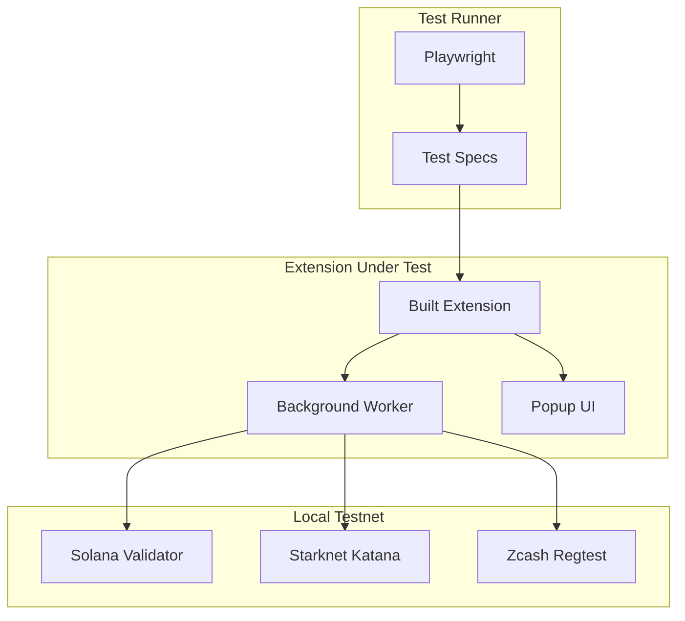

# Testing

This guide covers the E2E (end-to-end) test suite for the ZyberLink Wallet Extension, built with Playwright to ensure code quality and reliability.

## Overview

The wallet includes a comprehensive automated test suite that verifies:

- Onboarding flows (wallet creation and import)
- Multi-chain functionality (Solana, Starknet, Zcash)
- Send and receive operations
- Wallet lock/unlock
- RPC endpoint configuration
- Local testnet integration

## Testing Architecture



## Prerequisites

### Required Software

```bash
# Node.js 18+
node --version

# Docker (for local testnet)
docker --version

# npm dependencies
cd src/wallet-extension
npm install
```

### Extension Build

Tests require the extension to be built:

```bash
npm run build
```

This generates the extension in the `dist/` directory which Playwright automatically loads.

## Test Structure

```
wallet-extension/
├── e2e/
│   ├── fixtures.ts                    # Helpers and configuration
│   ├── wallet.spec.ts                 # Wallet UI tests
│   ├── testnet-integration.spec.ts    # Testnet tests
│   ├── zcash-shielded.spec.ts         # Zcash shielded tests
│   └── api-integration.spec.ts        # Provider API tests
├── playwright.config.ts               # Main configuration
├── playwright.api.config.ts           # API tests config
└── docker/
    ├── docker-compose.test.yml        # Testnet + tests
    ├── run-e2e-tests.sh               # Test runner script
    └── start-testnet.sh               # Start local testnet
```

## Running Tests

### Local Tests (Without Testnet)

UI tests that don't require blockchain:

```bash
# All wallet UI tests
npm test

# Specific tests only
npm test -- wallet.spec.ts

# With visual interface
npm run test:ui

# See browser during tests
npm run test:headed
```

### Tests with Local Testnet

For tests requiring blockchain interaction:

#### Option 1: Full Docker Compose

```bash
cd src/wallet-extension/docker

# Start testnet and run tests
./run-e2e-tests.sh

# Run specific tests
./run-e2e-tests.sh wallet      # Wallet UI only
./run-e2e-tests.sh testnet     # Testnet integration only
./run-e2e-tests.sh zcash       # Zcash shielded only
```

#### Option 2: Manual Testnet + Local Tests

```bash
# Terminal 1: Start testnet
cd src/wallet-extension/docker
./start-testnet.sh

# Terminal 2: Run tests
cd src/wallet-extension
npm test -- testnet-integration.spec.ts
```

#### Option 3: Podman (Docker Alternative)

```bash
cd src/wallet-extension/docker
podman-compose -f docker-compose.test.yml up --build
```

## Playwright Configuration

### Main Configuration (`playwright.config.ts`)

```typescript
{
  testDir: './e2e',
  timeout: 60000,
  workers: 1,              // Extensions require serial execution
  use: {
    headless: false,       // Extensions DON'T work headless
    viewport: { width: 400, height: 600 },
    trace: 'on-first-retry',
    screenshot: 'only-on-failure'
  }
}
```

**Important**: Chrome extensions **don't support headless mode**, so tests always open a visible browser.

### Environment Variables

For Docker tests, RPC URLs are injected:

```bash
SOLANA_RPC_URL=http://solana:8899
STARKNET_RPC_URL=http://starknet:5050
ZCASH_RPC_URL=http://zcash:18232
```

For local development, they use `localhost`:

```typescript
const RPC_URLS = {
  solana: process.env.SOLANA_RPC_URL || 'http://localhost:8899',
  starknet: process.env.STARKNET_RPC_URL || 'http://localhost:5050',
  zcash: process.env.ZCASH_RPC_URL || 'http://localhost:18232'
};
```

## Test Suites

### 1. Wallet UI Tests (`wallet.spec.ts`)

User flow tests without requiring blockchain:

#### Onboarding
- Show welcome screen
- Create new wallet with password
- Import wallet with private key
- Validate password strength

#### Home Screen
- Display all 3 chains (SOL, STRK, ZEC)
- Switch between chains
- Show assets and balances
- Refresh balances

#### Send Flow
- Open send form
- Validate recipient address
- Validate amount format
- Disable button if data invalid

#### Receive Flow
- Show QR code per chain
- Copy address to clipboard
- Switch chains in receive view

#### Lock/Unlock
- Lock wallet manually
- Require password to unlock
- Reject incorrect password
- Auto-lock after timeout

#### Settings
- Open RPC configuration
- Add custom RPC endpoint
- Switch active endpoint
- Remove custom RPC

**Test example:**

```typescript
test('should create new wallet with password', async ({ context, extensionId }) => {
  const page = await openPopup(context, extensionId);

  await page.click('button:has-text("CREATE")');
  await page.fill('input[type="password"]', TEST_WALLET.password);
  await page.locator('input[type="password"]').nth(1).fill(TEST_WALLET.password);
  await page.click('button:has-text("CREATE")');

  await expect(page.locator('text=PRIVATE KEY')).toBeVisible({ timeout: 10000 });
});
```

### 2. Testnet Integration (`testnet-integration.spec.ts`)

Tests verifying real blockchain interaction with local testnets:

#### Solana Testnet
- Connect to local validator
- Get real balance
- Request SOL airdrop
- Send on-chain transaction

#### Starknet Testnet
- Connect to Katana devnet
- Verify pre-funded accounts
- Query account balance

#### Zcash Testnet
- Connect to regtest node
- Verify RPC authentication
- Query blockchain info

**Test example:**

```typescript
test('should fetch balance from Solana testnet', async ({ context, extensionId }) => {
  // Skip if testnet not available
  if (!testnetStatus.solana) test.skip();

  const page = await openPopup(context, extensionId);

  // Setup wallet...
  await page.click('button[title="Refresh Balance"]');

  // Should show balance from actual testnet
  await expect(page.locator('.balance')).toContainText(/\d+\.?\d*/);
});
```

### 3. Zcash Shielded Tests (`zcash-shielded.spec.ts`)

Tests specific to Zcash shielded functionality:

- Generate z-addr (shielded addresses)
- Build shielded transactions
- Add memos to transactions
- Validate z-address format

### 4. API Integration Tests (`api-integration.spec.ts`)

Tests for the provider API injected into web pages:

#### window.solana
- `connect()`: dApp connection
- `signMessage()`: Message signing
- `signTransaction()`: Transaction signing
- `signAndSendTransaction()`: Sign and send
- Events: `connect`, `disconnect`, `accountChanged`

#### window.starknet
- `connect()`: Connection
- `signMessage()`: Message signing
- `getAddress()`: Get address

#### window.zyberlink
- Unified access to all providers
- Version info

## Fixtures and Helpers

The `fixtures.ts` file provides shared utilities:

### Test Fixtures

```typescript
// Test wallet with known key
const TEST_WALLET = {
  password: 'TestPass123!',
  privateKey: 'ed25519:...',
};

// Configurable timeouts
const TIMEOUTS = {
  short: 5000,
  medium: 10000,
  long: 30000,
};
```

### Helper Functions

```typescript
// Open extension popup
async function openPopup(context, extensionId): Promise<Page>

// Wait for specific text
async function waitForText(page, text, timeout?)

// Import test wallet
async function importTestWallet(page, password)
```

## Debugging Tests

### View Tests Running

```bash
# Headed mode (shows browser)
npm run test:headed

# Interactive UI mode
npm run test:ui
```

### Inspect Traces

Playwright automatically captures traces on failures:

```bash
# View trace from last failed test
npx playwright show-trace test-results/*/trace.zip
```

### Failure Screenshots

Screenshots are automatically saved in `test-results/`:

```
test-results/
├── wallet-spec-should-create-wallet/
│   ├── test-failed-1.png
│   └── trace.zip
```

### Extension Logs

To view extension logs during tests:

1. **Background logs**: `chrome://extensions` → "Inspect views: background.html"
2. **Popup logs**: Right-click on popup → "Inspect"
3. **Content script logs**: F12 on web page → Console

### Pause Tests

Add breakpoints in tests:

```typescript
test('debug test', async ({ page }) => {
  await page.click('button');

  // Pause execution for manual inspection
  await page.pause();

  await page.fill('input', 'value');
});
```

## CI/CD Integration

### GitHub Actions

Example CI workflow:

```yaml
name: E2E Tests

on: [push, pull_request]

jobs:
  test:
    runs-on: ubuntu-latest
    steps:
      - uses: actions/checkout@v3

      - name: Setup Node
        uses: actions/setup-node@v3
        with:
          node-version: 18

      - name: Install dependencies
        run: |
          cd src/wallet-extension
          npm ci

      - name: Build extension
        run: |
          cd src/wallet-extension
          npm run build

      - name: Run E2E tests with testnet
        run: |
          cd src/wallet-extension/docker
          ./run-e2e-tests.sh

      - name: Upload test results
        if: always()
        uses: actions/upload-artifact@v3
        with:
          name: playwright-report
          path: src/wallet-extension/playwright-report/
```

**Note**: Extension tests require `headed: false` so they need a virtual display (Xvfb) in CI.

### Docker Runner (used in `run-e2e-tests.sh`)

The script already includes Xvfb:

```bash
docker-compose run e2e-tests sh -c "
  Xvfb :99 -screen 0 1280x720x24 &
  sleep 2
  npm test -- --reporter=list
"
```

## Best Practices

### 1. Use Shared Fixtures

```typescript
import { test, expect, openPopup, TEST_WALLET } from './fixtures';
```

### 2. Wait for Stable Elements

```typescript
// ❌ Bad: can fail if element takes time
await page.click('button');

// ✅ Good: waits until visible
await expect(page.locator('button')).toBeVisible({ timeout: 10000 });
await page.click('button');
```

### 3. Cleanup Between Tests

```typescript
test.beforeEach(async ({ context }) => {
  // Clean storage before each test
  await context.clearCookies();
  await context.clearPermissions();
});
```

### 4. Isolate Testnet Tests

```typescript
test.beforeEach(async () => {
  // Skip if testnet not available
  if (!testnetStatus.solana) {
    test.skip();
  }
});
```

### 5. Appropriate Timeouts

```typescript
// Fast operations (UI)
await expect(page.locator('text')).toBeVisible({ timeout: 5000 });

// Blockchain operations (slow)
await expect(page.locator('.tx-hash')).toBeVisible({ timeout: 30000 });
```

## Troubleshooting

### "Extension failed to load"

**Cause**: Extension not built or incorrect path.

**Solution**:
```bash
npm run build
# Verify dist/ exists
ls -la dist/
```

### "Timeout waiting for popup"

**Cause**: Extension takes time to initialize.

**Solution**: Increase timeout in `openPopup()` or check background worker logs.

### "Testnet service not available"

**Cause**: Docker containers not started or not healthy.

**Solution**:
```bash
# Check container status
docker-compose -f docker/docker-compose.test.yml ps

# Check logs
docker-compose -f docker/docker-compose.test.yml logs solana
```

### "Browser launched but popup won't open"

**Cause**: Incorrect extension ID or popup permissions.

**Solution**: Verify extension is loaded at `chrome://extensions`.

### Tests fail in CI but pass locally

**Cause**: Virtual display (Xvfb) not configured in CI.

**Solution**: Add Xvfb to CI workflow or use the Docker runner which already includes it.

## Coverage Metrics

Current suite covers:

- **Onboarding**: 100% (create, import, password validation)
- **Multi-chain UI**: 100% (switch chains, show balances)
- **Send/Receive**: 80% (UI flows, pending: on-chain tx confirmations)
- **Lock/Unlock**: 100% (manual lock, password verify, auto-lock pending)
- **Settings**: 60% (RPC config, pending: export keys)
- **Testnet Integration**: 40% (connect, balance, pending: send tx)
- **Zcash Shielded**: 30% (address gen, pending: shielded tx)

## Next Steps

### Pending Tests

- [ ] Auto-lock after inactivity timeout
- [ ] Complete on-chain transactions (send + confirm)
- [ ] Zcash shielded transactions E2E
- [ ] Multi-account support
- [ ] Hardware wallet integration
- [ ] Transaction history
- [ ] Token support (SPL, ERC20)

### Infrastructure Improvements

- [ ] Coverage reports with Playwright code coverage
- [ ] Visual regression testing
- [ ] Performance benchmarks
- [ ] RPC endpoint load testing

## Additional Resources

- [Playwright Documentation](https://playwright.dev)
- [Chrome Extension Testing Guide](https://playwright.dev/docs/chrome-extensions)
- [Testnets Guide](testnets.md) - Detailed local testnet configuration
- [Local Development](desarrollo.md) - Development environment setup
