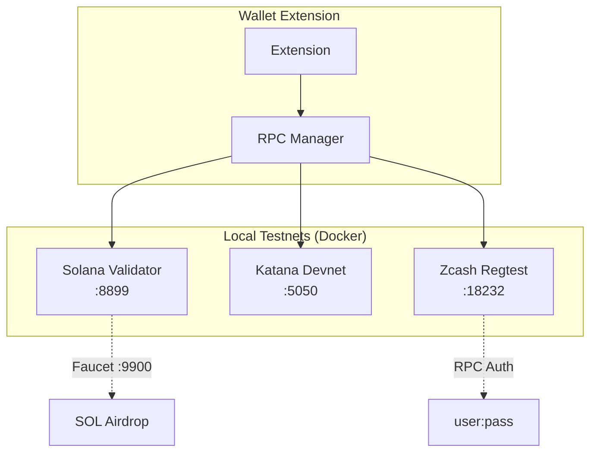

# Testnets

This guide covers the configuration and usage of local testnets for developing and testing the ZyberLink Wallet Extension.

## Overview

The wallet supports three blockchains, each with its own testnet configuration:

- **Solana**: Test Validator (local)
- **Starknet**: Katana (local devnet)
- **Zcash**: Regtest (local test network)

These testnets enable development without spending real funds and with full control over the environment.

## Testnet Architecture



## Quick Setup

### Using Docker Compose

The simplest method is using the provided scripts:

```bash
cd src/wallet-extension/docker

# Start all testnets
./start-testnet.sh

# Verify they're running
docker ps

# Stop testnets
./stop-testnet.sh
```

This starts:
- Solana validator at `localhost:8899` (faucet at `:9900`)
- Starknet Katana at `localhost:5050`
- Zcash regtest at `localhost:18232`

### Verify Services

```bash
# Solana
curl http://localhost:8899/health

# Starknet
curl http://localhost:5050

# Zcash (requires auth)
curl --user zyberlink:testpass123 \
  --data-binary '{"jsonrpc":"1.0","method":"getblockchaininfo","params":[]}' \
  http://localhost:18232
```

## Configuration per Blockchain

### Solana Test Validator

#### Docker Compose

Configuration in `docker/docker-compose.yml`:

```yaml
solana:
  image: solanalabs/solana:v1.18.22
  ports:
    - "8899:8899"  # RPC
    - "9900:9900"  # Faucet
  command: >
    solana-test-validator
    --reset
    --rpc-port 8899
    --faucet-port 9900
    --bind-address 0.0.0.0
```

#### Local Installation (Alternative)

To run without Docker:

```bash
# Install Solana CLI
sh -c "$(curl -sSfL https://release.solana.com/stable/install)"

# Start validator
solana-test-validator \
  --reset \
  --rpc-port 8899 \
  --faucet-port 9900
```

#### Usage from Wallet

In the extension, configure the RPC endpoint:

1. Open Settings → RPC
2. Select "Solana"
3. Add custom RPC:
   - **Name**: Local Testnet
   - **URL**: `http://localhost:8899`
4. Click "USE"

#### Get Test SOL

```bash
# Using Solana CLI
solana airdrop 10 <YOUR_ADDRESS> --url http://localhost:8899

# Or using curl to faucet
curl -X POST http://localhost:9900/airdrop \
  -H "Content-Type: application/json" \
  -d '{"pubkey":"<YOUR_PUBKEY>","lamports":10000000000}'
```

#### Useful Commands

```bash
# View validator logs
solana logs --url http://localhost:8899

# Check balance
solana balance <ADDRESS> --url http://localhost:8899

# Get cluster info
solana cluster-version --url http://localhost:8899

# View recent transactions
solana block --url http://localhost:8899
```

### Starknet Katana

#### Docker Compose

Configuration in `docker/docker-compose.yml`:

```yaml
starknet:
  image: ghcr.io/dojoengine/katana:latest
  ports:
    - "5050:5050"
  command:
    - katana
    - --dev
    - --http.addr=0.0.0.0
    - --http.port=5050
    - --dev.accounts=3
    - --dev.seed=0
```

#### Local Installation (Alternative)

To run without Docker:

```bash
# Install dojo/katana
curl -L https://install.dojoengine.org | bash
dojoup

# Start katana
katana --dev --dev.accounts 3
```

#### Usage from Wallet

In the extension:

1. Settings → RPC
2. Select "Starknet"
3. Add custom RPC:
   - **Name**: Local Katana
   - **URL**: `http://localhost:5050`
4. Click "USE"

#### Pre-funded Accounts

Katana automatically generates 3 funded accounts:

```json
{
  "accounts": [
    {
      "address": "0x6162896d1d7ab204c7ccac6dd5f8e9e7c25ecd5ae4fcb4ad32e57786bb46e03",
      "private_key": "0x1800000000300000180000000000030000000000003006001800006600",
      "balance": "0x3635c9adc5dea00000"
    }
    // ... 2 more accounts
  ]
}
```

To view generated accounts, check container logs:

```bash
docker logs test-starknet | grep -A 20 "PREFUNDED ACCOUNTS"
```

#### Useful Commands

```bash
# Check status
curl http://localhost:5050 -X POST \
  -H "Content-Type: application/json" \
  -d '{"jsonrpc":"2.0","method":"starknet_blockNumber","params":[],"id":1}'

# Get balance
curl http://localhost:5050 -X POST \
  -H "Content-Type: application/json" \
  -d '{
    "jsonrpc":"2.0",
    "method":"starknet_getBalance",
    "params":["<ADDRESS>"],
    "id":1
  }'
```

### Zcash Regtest

#### Docker Compose

Configuration in `docker/docker-compose.yml`:

```yaml
zcash:
  image: electriccoinco/zcashd:latest
  ports:
    - "18232:18232"
  volumes:
    - ./zcash.conf:/srv/zcashd/.zcash/zcash.conf
  command: >
    -regtest
    -server=1
    -rpcuser=zyberlink
    -rpcpassword=testpass123
    -rpcallowip=0.0.0.0/0
    -rpcbind=0.0.0.0
```

#### Configuration File (`zcash.conf`)

```ini
# Regtest mode
regtest=1
server=1

# RPC settings
rpcuser=zyberlink
rpcpassword=testpass123
rpcport=18232
rpcallowip=0.0.0.0/0
rpcbind=0.0.0.0

# Mining
gen=0

# Logging
debug=1
printtoconsole=1
```

#### Local Installation (Alternative)

To run without Docker:

```bash
# Install zcashd (Ubuntu/Debian)
wget -qO - https://apt.z.cash/zcash.asc | sudo apt-key add -
echo "deb [arch=amd64] https://apt.z.cash/ buster main" | \
  sudo tee /etc/apt/sources.list.d/zcash.list
sudo apt update && sudo apt install zcash

# Start in regtest mode
zcashd -regtest -rpcuser=zyberlink -rpcpassword=testpass123
```

#### Usage from Wallet

In the extension:

1. Settings → RPC
2. Select "Zcash"
3. Add custom RPC:
   - **Name**: Local Regtest
   - **URL**: `http://localhost:18232`
   - **Auth**: `zyberlink:testpass123` (if UI supports it)
4. Click "USE"

**Note**: If wallet doesn't support RPC auth in UI, configure an auth-less proxy:

```bash
# Use nginx as auth-less proxy
nginx -c nginx.conf
```

#### Generate Blocks and Funds

Regtest requires manual block mining:

```bash
# Generate 10 blocks
zcash-cli -regtest -rpcuser=zyberlink -rpcpassword=testpass123 generate 10

# Or using curl
curl --user zyberlink:testpass123 \
  --data-binary '{"jsonrpc":"1.0","method":"generate","params":[10]}' \
  http://localhost:18232

# Create shielded address
zcash-cli -regtest -rpcuser=zyberlink -rpcpassword=testpass123 z_getnewaddress

# Send funds to shielded address
zcash-cli -regtest -rpcuser=zyberlink -rpcpassword=testpass123 \
  z_sendmany "FROM_ADDR" '[{"address":"ZADDR","amount":10}]'
```

#### Useful Commands

```bash
# Blockchain info
zcash-cli -regtest -rpcuser=zyberlink -rpcpassword=testpass123 getblockchaininfo

# Address balance
zcash-cli -regtest -rpcuser=zyberlink -rpcpassword=testpass123 z_getbalance "ZADDR"

# List shielded addresses
zcash-cli -regtest -rpcuser=zyberlink -rpcpassword=testpass123 z_listaddresses

# View mempool
zcash-cli -regtest -rpcuser=zyberlink -rpcpassword=testpass123 getrawmempool
```

## Advanced Configuration

### Custom RPC Endpoints in Wallet

The wallet allows adding custom RPC endpoints per chain:

#### From UI

1. Popup → Settings (⚙️)
2. Select chain (SOL / STRK / ZEC)
3. Click "+ ADD CUSTOM RPC"
4. Fill in:
   - **Name**: Descriptive name
   - **URL**: RPC endpoint (must be HTTPS in production)
5. Click "ADD"
6. Click "USE" to activate it

#### From Storage (Debugging)

For development, you can directly edit chrome storage:

```javascript
// In extension DevTools console
chrome.storage.local.get('rpcEndpoints', (data) => {
  console.log(data.rpcEndpoints);
});

// Add custom endpoint
chrome.storage.local.set({
  rpcEndpoints: {
    solana: [
      { name: 'Local', url: 'http://localhost:8899', active: true },
      { name: 'Devnet', url: 'https://api.devnet.solana.com', active: false }
    ]
  }
});
```

### Health Monitoring

The `start-testnet.sh` script includes health checks:

```bash
# Check Solana
for i in {1..30}; do
  if curl -s http://localhost:8899/health > /dev/null 2>&1; then
    echo "Solana: Ready"
    break
  fi
  sleep 2
done

# Similar for Starknet and Zcash
```

For continuous monitoring:

```bash
# Watch loop
watch -n 5 'curl -s http://localhost:8899/health'
```

### Data Persistence

By default, testnets **DON'T persist data** between restarts (using `--reset` and anonymous volumes).

To persist data:

```yaml
# In docker-compose.yml
solana:
  volumes:
    - solana-data:/root/.config/solana

volumes:
  solana-data:
```

**Warning**: Persisting data can cause issues if state becomes corrupted. For testing, it's better to reset each time.

## Troubleshooting

### Port in Use

**Error**: `Error starting userland proxy: listen tcp :8899: bind: address already in use`

**Solution**:
```bash
# Find process using port
lsof -i :8899

# Kill process
kill -9 <PID>

# Or change port in docker-compose.yml
ports:
  - "8900:8899"  # Host:Container
```

### Container Not Healthy

**Error**: `service "solana" is unhealthy`

**Solution**:
```bash
# View container logs
docker logs test-solana

# Check healthcheck manually
docker exec test-solana curl -f http://localhost:8899/health

# Restart container
docker restart test-solana
```

### Zcash RPC Authentication Failed

**Error**: `401 Unauthorized`

**Solution**: Verify credentials in:
1. `zcash.conf`: `rpcuser` and `rpcpassword`
2. Command args: `-rpcuser` and `-rpcpassword`
3. Curl request: `--user zyberlink:testpass123`

### Wallet Won't Connect to Testnet

**Solution**:
1. Verify RPC URL in Settings (no trailing slash)
2. Verify container is running: `docker ps`
3. Verify port is accessible: `curl http://localhost:8899`
4. Check CORS if applicable (Solana validator already allows it)
5. Check extension background worker logs

### Solana Faucet Not Working

**Error**: `Airdrop request failed`

**Solution**:
```bash
# Verify faucet is listening
curl http://localhost:9900/health

# Check faucet balance
solana balance --url http://localhost:8899

# Restart validator if needed
docker restart test-solana
```

## Testing with Testnets

### Playwright E2E

E2E tests can use the testnets:

```bash
# Start testnets first
cd docker && ./start-testnet.sh

# Run tests requiring blockchain
cd ..
npm test -- testnet-integration.spec.ts
```

### Environment Variables

For Docker tests, URLs are injected:

```bash
# In docker-compose.test.yml
environment:
  - SOLANA_RPC_URL=http://solana:8899
  - STARKNET_RPC_URL=http://starknet:5050
  - ZCASH_RPC_URL=http://zcash:18232
```

### Skip Tests if Testnet Not Available

Tests automatically check availability:

```typescript
test.beforeAll(async () => {
  testnetStatus = await isTestnetAvailable();
  if (!testnetStatus.solana) {
    console.log('Solana testnet not available, skipping');
    test.skip();
  }
});
```

## Public Endpoints (Production)

For development with public testnets (not local):

### Solana

```javascript
// Devnet (more stable than testnet)
'https://api.devnet.solana.com'

// Testnet
'https://api.testnet.solana.com'

// Mainnet-beta (production)
'https://api.mainnet-beta.solana.com'
```

### Starknet

```javascript
// Testnet (Goerli)
'https://starknet-testnet.public.blastapi.io'

// Mainnet
'https://starknet-mainnet.public.blastapi.io'
```

### Zcash

```javascript
// No official public testnet
// Requires local node or third-party service
```

**Note**: Public testnets have rate limits and can be slow. For active development, use local testnets.

## Automation Scripts

### Faucet Automation

Script for automatic SOL airdrops:

```bash
#!/bin/bash
# faucet.sh - Airdrop SOL to addresses

ADDRESSES=(
  "7Np41oeYqPefeNQEHSv1UDhYrehxin3NStELsSKCT4K2"
  "6sb4VCZjQEenS9H2d9AAa2mZw7BLhRLw7KQdTbGqQmJ8"
)

for addr in "${ADDRESSES[@]}"; do
  echo "Airdropping to $addr..."
  solana airdrop 10 $addr --url http://localhost:8899
  sleep 1
done
```

### Reset Testnet

Script to completely reset testnet:

```bash
#!/bin/bash
# reset-testnet.sh

cd docker
docker-compose down --volumes
docker-compose up -d
sleep 10
./start-testnet.sh
```

## Additional Resources

- [Solana Test Validator Docs](https://docs.solana.com/developing/test-validator)
- [Katana Documentation](https://book.dojoengine.org/toolchain/katana)
- [Zcash Regtest Guide](https://zcash.readthedocs.io/en/latest/rtd_pages/regtest_guide.html)
- [Testing Guide](testing.md) - Complete E2E test suite
- [Local Development](desarrollo.md) - Development environment setup
