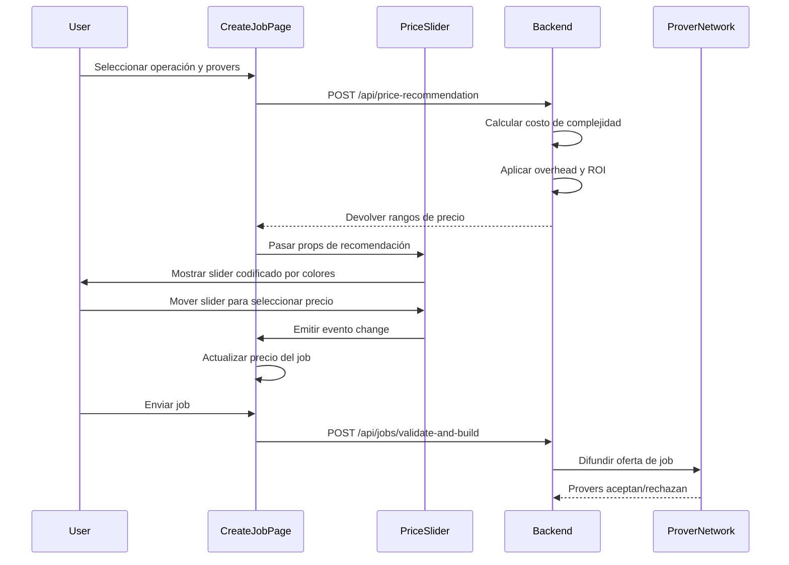
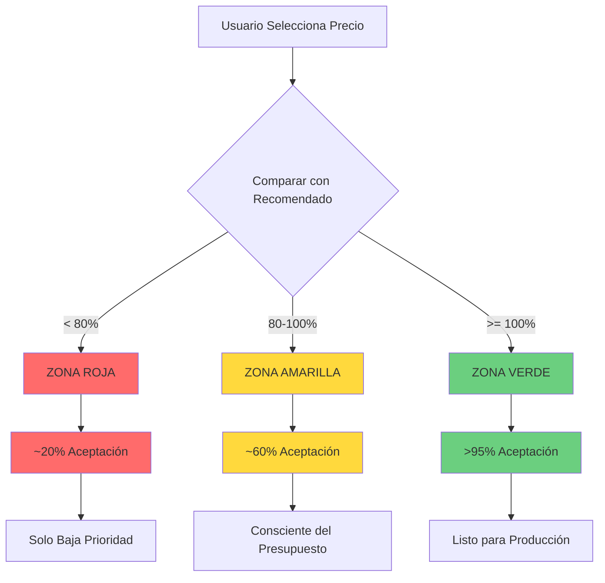
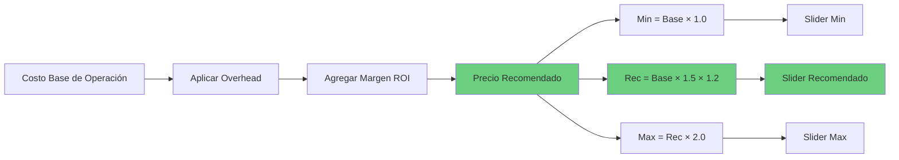

# Guía de Integración de PriceSlider

## Descripción General

El componente **PriceSlider** es una herramienta de precios interactiva que ayuda a los creadores de jobs a seleccionar precios óptimos para sus trabajos de computación FHE. Proporciona retroalimentación visual sobre cómo diferentes puntos de precio afectan la probabilidad de aceptación del prover, asegurando que los jobs sean tomados rápidamente mientras se mantiene la eficiencia de costos.

### ¿Por Qué es Importante PriceSlider?

Al crear un job FHE, el precio que ofreces impacta directamente en:

- **Tasa de Aceptación del Prover**: Precios más altos atraen más provers
- **Velocidad de Toma del Job**: Precios competitivos resultan en procesamiento más rápido
- **Eficiencia de Costos**: El slider ayuda a equilibrar precio vs. tasa de aceptación

El PriceSlider usa un sistema de recomendación de precios dinámico que considera:
- Complejidad de la operación (ej. multiply, add, subtract)
- Número de provers requeridos (requisitos de consenso)
- Condiciones actuales de la red y disponibilidad de provers
- ROI esperado para provers

---

## Interfaz Visual

El PriceSlider presenta una interfaz codificada por colores que facilita la comprensión de las zonas de precios:

```
┌─────────────────────────────────────────────────────────┐
│  SELECCIÓN_DE_PRECIO:                                   │
│                                                         │
│  ├────────────────────────────────────────────────────┤ │
│  MIN              REC                              MAX  │
│  0.003           0.0054                           0.01  │
│       [░░░░░░░░░████████████░░░░░░░░░]                 │
│                    ▲                                    │
│               TU PRECIO: 0.0054 SOL                     │
│                                                         │
│  ACEPTACIÓN_PROVER: [ALTA (>95%)]                      │
│                                                         │
└─────────────────────────────────────────────────────────┘
```

### Elementos de la Interfaz

1. **Etiquetas de Rango de Precio**: Muestra valores de precio mínimo, recomendado y máximo en SOL
2. **Pista Codificada por Colores**: Zonas visuales indicando probabilidad de aceptación
3. **Marcador Recomendado**: Línea vertical marcando el punto de precio óptimo
4. **Slider Interactivo**: Control deslizante para seleccionar tu precio deseado
5. **Visualización de Precio Actual**: Muestra el precio seleccionado en SOL y lamports
6. **Indicador de Aceptación**: Insignia codificada por colores mostrando aceptación estimada del prover

---

## Zonas de Aceptación Explicadas

El slider divide los precios en tres zonas, cada una con características distintas:

### Zona Roja (< 80% del Recomendado)

```
Tasa de Aceptación: ~20%
Nivel de Riesgo: ALTO
Recomendación: EVITAR
```

**Características:**
- Aceptación de prover muy baja
- Los jobs pueden permanecer en cola por períodos extendidos
- Alto riesgo de expiración del job antes de completarse
- No recomendado excepto para propósitos experimentales

**Cuándo usar:**
- Nunca recomendado para jobs de producción
- Puede ser aceptable para tareas de baja prioridad no urgentes

### Zona Amarilla (80% - 100% del Recomendado)

```
Tasa de Aceptación: ~60%
Nivel de Riesgo: MEDIO
Recomendación: USAR CON PRECAUCIÓN
```

**Características:**
- Aceptación de prover moderada
- Algunos provers aceptarán el job
- Tiempo de toma más lento comparado con el precio recomendado
- Posibles retrasos durante alta actividad de red

**Cuándo usar:**
- Creadores de jobs conscientes del presupuesto
- Computaciones no urgentes
- Cuando se está dispuesto a aceptar retrasos moderados

### Zona Verde (>= 100% del Recomendado)

```
Tasa de Aceptación: >95%
Nivel de Riesgo: BAJO
Recomendación: ÓPTIMO
```

**Características:**
- Alta tasa de aceptación de prover
- Toma y procesamiento rápido del job
- Riesgo mínimo de retrasos o expiración
- Precio competitivo que atrae a provers

**Cuándo usar:**
- Jobs de producción que requieren confiabilidad
- Computaciones sensibles al tiempo
- Cuando se necesita disponibilidad máxima

---

## Props del Componente

El componente PriceSlider acepta las siguientes propiedades:

```typescript
export let minPrice = 1000000;        // Precio mínimo en lamports
export let recommendedPrice = 1800000; // Precio recomendado en lamports
export let maxPrice = 3600000;         // Precio máximo sugerido en lamports
export let currentPrice = 1800000;     // Precio actualmente seleccionado en lamports
export let step = 100000;              // Tamaño del paso del slider en lamports
export let isLoading = false;          // Indicador de estado de carga
```

### Detalles de Props

| Prop | Tipo | Valor por Defecto | Descripción |
|------|------|---------|-------------|
| `minPrice` | number | 1000000 | Precio mínimo aceptable (1M lamports = 0.001 SOL) |
| `recommendedPrice` | number | 1800000 | Precio óptimo calculado por IA para alta aceptación |
| `maxPrice` | number | 3600000 | Precio máximo sugerido (límite superior) |
| `currentPrice` | number | 1800000 | Precio actualmente seleccionado por el usuario |
| `step` | number | 100000 | Tamaño del incremento para movimiento del slider |
| `isLoading` | boolean | false | Muestra estado de carga mientras obtiene recomendaciones |

Todos los valores de precio se expresan en **lamports** (1 SOL = 1,000,000,000 lamports).

---

## Eventos

El componente PriceSlider emite un único evento cuando el usuario cambia el precio:

### `on:change`

Se dispara cuando el usuario mueve el slider a un nuevo punto de precio.

**Detalle del Evento:**
```javascript
{
  price: number  // Precio seleccionado en lamports
}
```

**Ejemplo de Manejador:**
```svelte
<script>
  let selectedPrice = 1800000;

  function handlePriceChange(event) {
    selectedPrice = event.detail.price;
    console.log(`Nuevo precio seleccionado: ${selectedPrice} lamports`);
  }
</script>

<PriceSlider
  on:change={handlePriceChange}
  currentPrice={selectedPrice}
/>
```

---

## Integración Backend

El PriceSlider depende de datos de precios dinámicos del endpoint backend `/api/price-recommendation`.

### Petición API

```javascript
const response = await fetch('http://localhost:8080/api/price-recommendation', {
  method: 'POST',
  headers: { 'Content-Type': 'application/json' },
  body: JSON.stringify({
    operation: 'multiply',      // Tipo de operación: 'add', 'multiply', 'subtract', etc.
    operation_value: 5,          // Valor específico de la operación
    expected_count: 10,          // Cantidad esperada de datos (para operaciones como sum/average)
    bins: 5,                     // Número de bins (para operaciones histogram)
    required_provers: 3          // Número de provers necesarios para consenso
  })
});

const priceRecommendation = await response.json();
```

### Respuesta API

```json
{
  "min_price_lamports": 3000000,
  "recommended_price_lamports": 5400000,
  "max_suggested_lamports": 10800000,
  "slider_step": 100000,
  "prover_overhead_percent": 50.0,
  "target_prover_roi_percent": 20.0
}
```

### Campos de Respuesta

| Campo | Tipo | Descripción |
|-------|------|-------------|
| `min_price_lamports` | number | Precio mínimo absoluto para la operación |
| `recommended_price_lamports` | number | Precio óptimo para alta aceptación (>95%) |
| `max_suggested_lamports` | number | Precio máximo razonable (2x recomendado) |
| `slider_step` | number | Incremento sugerido para deslizamiento suave |
| `prover_overhead_percent` | number | Factor de gastos generales del prover (por defecto: 50%) |
| `target_prover_roi_percent` | number | ROI objetivo para provers (por defecto: 20%) |

---

## Lógica de Cálculo de Aceptación

El backend calcula recomendaciones de precios usando la siguiente fórmula:

### Cálculo de Precio Base

```
precio_base = costo_complejidad_operacion
```

El `costo_complejidad_operacion` se determina por el tipo de operación y requisitos computacionales.

### Fórmula de Precio Recomendado

```
precio_recomendado = precio_base × multiplicador_overhead × (1 + roi_objetivo / 100)

donde:
  multiplicador_overhead = 1 + (porcentaje_overhead_prover / 100)  // por defecto: 1.5
  roi_objetivo = porcentaje_roi_objetivo_prover                    // por defecto: 20%
```

### Ejemplo de Cálculo

Para una operación multiply con costo base de 2M lamports:

```
precio_base = 2,000,000 lamports

multiplicador_overhead = 1 + (50 / 100) = 1.5

factor_roi = 1 + (20 / 100) = 1.2

precio_recomendado = 2,000,000 × 1.5 × 1.2 = 3,600,000 lamports (0.0036 SOL)
```

Esto asegura que los provers reciban:
- 50% de overhead para costos operacionales
- 20% de margen de ganancia (ROI)
- Precio competitivo para aceptación rápida

---

## Ejemplo de Uso en Svelte

Aquí hay un ejemplo completo mostrando cómo integrar el PriceSlider en un formulario de creación de jobs:

### Paso 1: Obtener Recomendación de Precio

```svelte
<script>
  import PriceSlider from '$lib/components/PriceSlider.svelte';

  let jobData = {
    operation: 'multiply',
    operationValue: 5,
    requiredProvers: 3,
    priceLamports: 0
  };

  let priceRecommendation = null;
  let isFetchingPrice = false;

  async function fetchPriceRecommendation() {
    isFetchingPrice = true;
    try {
      const response = await fetch('http://localhost:8080/api/price-recommendation', {
        method: 'POST',
        headers: { 'Content-Type': 'application/json' },
        body: JSON.stringify({
          operation: jobData.operation.toLowerCase(),
          operation_value: jobData.operationValue,
          expected_count: 10,
          bins: 5,
          required_provers: jobData.requiredProvers
        })
      });

      if (!response.ok) {
        throw new Error('Failed to get price recommendation');
      }

      priceRecommendation = await response.json();

      // Inicializar con precio recomendado
      jobData.priceLamports = priceRecommendation.recommended_price_lamports;

    } catch (error) {
      console.error('Failed to fetch price recommendation:', error);
      // Fallback a valores por defecto
      priceRecommendation = {
        min_price_lamports: 3000000,
        recommended_price_lamports: 5400000,
        max_suggested_lamports: 10800000,
        slider_step: 100000
      };
    } finally {
      isFetchingPrice = false;
    }
  }

  // Obtener reactivamente cuando cambian operación o provers
  $: {
    if (jobData.operation && jobData.requiredProvers) {
      fetchPriceRecommendation();
    }
  }

  function handlePriceChange(event) {
    jobData.priceLamports = event.detail.price;
  }
</script>
```

### Paso 2: Renderizar el PriceSlider

```svelte
{#if priceRecommendation}
  <div class="price-section">
    <PriceSlider
      minPrice={priceRecommendation.min_price_lamports}
      recommendedPrice={priceRecommendation.recommended_price_lamports}
      maxPrice={priceRecommendation.max_suggested_lamports}
      currentPrice={jobData.priceLamports}
      step={priceRecommendation.slider_step}
      isLoading={isFetchingPrice}
      on:change={handlePriceChange}
    />
  </div>
{/if}
```

### Paso 3: Mostrar Resumen de Costos

```svelte
<div class="cost-summary">
  <h3>Costo Estimado</h3>
  <p>
    Precio del Job: {(jobData.priceLamports / 1_000_000_000).toFixed(6)} SOL
  </p>
  <p>
    Tarifa de Plataforma (1%): {(jobData.priceLamports * 0.01 / 1_000_000_000).toFixed(6)} SOL
  </p>
  <p>
    Total: {(jobData.priceLamports * 1.01 / 1_000_000_000).toFixed(6)} SOL
  </p>
</div>
```

---

## Características Avanzadas

### Botón de Auto-Recomendación

El PriceSlider incluye un botón incorporado "ESTABLECER_COMO_RECOMENDADO" que aparece cuando el usuario selecciona un precio por debajo del valor recomendado:

```svelte
{#if currentPrice < recommendedPrice}
  <button
    class="btn-set-recommended"
    on:click={setToRecommended}
  >
    [ESTABLECER_COMO_RECOMENDADO]
  </button>
{/if}
```

Esta característica ayuda a guiar a los usuarios hacia precios óptimos sin forzarlos a una elección específica.

### Retroalimentación de Aceptación Responsiva

El componente proporciona retroalimentación visual en tiempo real mientras el usuario mueve el slider:

- **Color de Insignia**: Cambia según la zona de aceptación (rojo/amarillo/verde)
- **Estimación de Porcentaje**: Muestra tasa aproximada de aceptación
- **Resaltado de Zona**: El color de fondo de la pista coincide con la zona actual

---

## Mejores Prácticas

### Para Creadores de Jobs

1. **Comenzar con Precio Recomendado**: El precio recomendado se calcula para maximizar la aceptación mientras se mantiene la eficiencia de costos
2. **Monitorear Nivel de Aceptación**: Mantén el slider en la zona verde para jobs de producción
3. **Considerar Urgencia del Job**: Los jobs sensibles al tiempo deben usar precios de zona verde
4. **Presupuestar Cuidadosamente**: Los precios de zona amarilla pueden ahorrar costos para jobs no urgentes

### Para Desarrolladores

1. **Siempre Obtener Recomendaciones Actualizadas**: Los precios deben calcularse dinámicamente basándose en parámetros actuales
2. **Manejar Estados de Carga**: Mostrar indicadores de carga mientras se obtienen recomendaciones
3. **Proporcionar Fallbacks**: Incluir precios por defecto en caso de que la API no esté disponible
4. **Actualizar Reactivamente**: Re-obtener recomendaciones cuando cambian la operación o cantidad de provers
5. **Validar Rangos de Precio**: Asegurar que los precios seleccionados permanezcan dentro de los límites min/max

### Para Operadores de Plataforma

1. **Monitorear Tasas de Aceptación**: Rastrear tasas de aceptación reales vs. predichas
2. **Ajustar Parámetros de ROI**: Afinar `target_prover_roi_percent` según condiciones del mercado
3. **Revisar Costos de Complejidad**: Asegurar que los costos de operación reflejen requisitos computacionales reales
4. **Considerar Condiciones de Red**: Ajustar dinámicamente las recomendaciones según disponibilidad de provers

---

## Solución de Problemas

### Problema: El Slider No se Actualiza

**Síntomas**: El slider de precio muestra valores antiguos después de cambiar la operación

**Solución**:
```svelte
// Asegurar actualizaciones reactivas
$: {
  if (jobData.operation && jobData.requiredProvers) {
    fetchPriceRecommendation();
  }
}
```

### Problema: El Precio Salta al Mínimo

**Síntomas**: El precio seleccionado se reinicia al mínimo cuando se carga la recomendación

**Solución**:
```javascript
// Solo actualizar si el precio actual está por debajo del recomendado
if (!jobData.priceLamports || jobData.priceLamports < priceRecommendation.recommended_price_lamports) {
  jobData.priceLamports = priceRecommendation.recommended_price_lamports;
}
```

### Problema: El Nivel de Aceptación Siempre Muestra Bajo

**Síntomas**: La insignia muestra "BAJO" incluso en zona verde

**Solución**: Verificar que el prop `currentPrice` esté correctamente vinculado y actualizado mediante el evento change.

---

## Documentación Relacionada

- [Referencia API de Creación de Jobs](/guias/api-reference.md)
- [Costos de Operaciones FHE](/guias/examples.md#operation-costs)
- [Guía de Consenso de Prover](/guias/examples.md#consensus-mechanisms)
- [Integración SDK](/guias/sdk-integration.md)

---

## Diagramas Mermaid

### Flujo del Componente PriceSlider



### Cálculo de Zona de Aceptación



### Flujo de Cálculo de Precios



---

## Resumen

El componente PriceSlider es una herramienta crítica para crear jobs FHE exitosos en la red Zyberlink. Al proporcionar retroalimentación visual clara y recomendaciones de precios dinámicas, ayuda a los usuarios a tomar decisiones informadas sobre los precios de jobs, equilibrando la eficiencia de costos con las tasas de aceptación de provers.

Puntos clave:

- Usa la **zona verde** para jobs de producción que requieren alta confiabilidad
- El **precio recomendado** se calcula basándose en ROI del prover y condiciones de red
- Las actualizaciones dinámicas aseguran que los precios se mantengan actuales con la complejidad de la operación y requisitos de provers
- La retroalimentación de aceptación en tiempo real ayuda a los usuarios a entender el impacto de sus decisiones de precio
