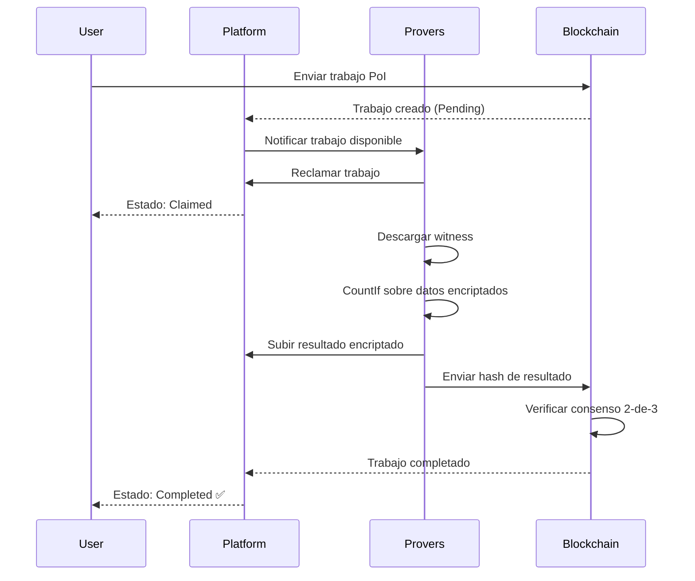

# Guía de Proof of Innocence

Verifica cumplimiento con listas de sanciones o criterios de screening sin revelar tu historial de transacciones usando el sistema de verificación que preserva privacidad de ZyberLink.

## Descripción General

Proof of Innocence (PoI) te permite probar que NO has interactuado con entidades sancionadas sin exponer tu historial completo de transacciones. Esto es crítico para:

- **Cumplimiento Regulatorio** - Pasa verificaciones KYC/AML de manera privada
- **Preservación de Privacidad** - No reveles todas tus transacciones
- **Divulgación Selectiva** - Prueba inocencia sin transparencia completa

**Cómo funciona:** ZyberLink usa operaciones FHE CountIf para buscar en tu historial de transacciones encriptado direcciones sancionadas. Si el conteo es cero, estás probado inocente - sin revelar ningún detalle de transacción.

### El Problema que PoI Resuelve

**Cumplimiento Tradicional:**
```
❌ Revelar historial completo de transacciones al auditor
❌ Auditor revisa manualmente cada transacción
❌ Privacidad completamente perdida
❌ Lento y costoso
```

**Proof of Innocence de ZyberLink:**
```
✅ Encripta historial de transacciones localmente
✅ Provers cuentan interacciones sancionadas (sobre texto cifrado)
✅ Desencripta resultado: 0 = inocente, >0 = marcado
✅ Detalles de transacciones permanecen privados
```

## Requisitos Previos

Antes de crear un Proof of Innocence:

- **Wallet de Solana** con SOL (0.01-0.1 SOL para fees)
- **Datos de transacciones** para verificar (direcciones de wallet, IDs de usuario, etc.)
- **Lista de sanciones** (OFAC, lista de cumplimiento personalizada, etc.)
- **Herramientas FHE CLI** (para encriptación)

### Entendiendo el Modelo de Datos

**Datos de Entrada:**
- Tu historial de transacciones (encriptado como enteros)
- Cada transacción mapeada a un índice único (0-255)

**Lista de Sanciones:**
- Lista de índices prohibidos (ej., [66, 77, 88, 99])
- Estos representan direcciones/entidades sancionadas

**Operación:**
```
CountIf(encrypted_history, predicate=Equals(sanctioned_index))
→ Retorna conteo encriptado de coincidencias
→ 0 = inocente, >0 = violación detectada
```

## Guía Paso a Paso

### Paso 1: Prepara Tus Datos de Transacciones

Convierte tu historial de transacciones a índices numéricos:

```bash
# Ejemplo: Tienes historial de transacciones con estas direcciones
# - Dirección A: 0xABC...123 → Índice 10
# - Dirección B: 0xDEF...456 → Índice 25
# - Dirección C: 0xGHI...789 → Índice 50
# - Dirección D: 0xJKL...012 → Índice 75

# Lista de sanciones (demo): [66, 77, 88, 99]
# Tus índices: [10, 25, 50, 75]
# Resultado esperado: 0 coincidencias (¡eres inocente!)
```

**Estrategias de Mapeo de Índices:**

**Estrategia 1: Indexación basada en hash**
```python
# Mapea direcciones al rango 0-255
def address_to_index(address):
    hash_val = hashlib.sha256(address.encode()).hexdigest()
    return int(hash_val[:2], 16)  # Primer byte como índice
```

**Estrategia 2: Indexación secuencial**
```python
# Asigna IDs secuenciales a entidades
entity_registry = {
    "entity_1": 1,
    "entity_2": 2,
    # ... hasta 255
}
```

**Estrategia 3: Mapeo módulo**
```python
# Mapea IDs grandes al rango 0-255
def id_to_index(entity_id):
    return entity_id % 256
```

### Paso 2: Encripta el Historial de Transacciones

Usa el FHE CLI para encriptar tus índices de transacciones:

```bash
cd src/fhe-cli

# Encripta tu historial de transacciones
# Formato: lista separada por comas de índices
cargo run --release --bin fhe-cli encrypt \
  --values 10,25,50,75

# Salida:
# ✅ 4 valores encriptados
# 📁 witness.bin (52.4 MB) - subir a ZyberLink
# 🔑 client_key.bin (¡secreto!) - mantener seguro
```

**Importante:** Cada valor encriptado representa el índice asociado de una transacción.

### Paso 3: Accede a la Interfaz de Proof of Innocence

Navega a la interfaz PoI:

**Demo en Vivo:** https://demo.zyberlink.fun/proof-of-innocence
**Desarrollo Local:** http://localhost:5173/proof-of-innocence

1. Haz clic en **"Proof of Innocence"** en la navegación
2. Conecta tu wallet de Solana
3. Revisa la lista de sanciones demo (o configura la tuya propia)

### Paso 4: Revisa la Lista de Sanciones

La plataforma muestra la lista de sanciones activa:

**Lista de Sanciones Demo:**
```
Nombre: OFAC Demo List
Descripción: Índices sancionados simulados para demostración
Valores: [66, 77, 88, 99, 111, 122, 133, 144, 155, 166]
```

**Uso en Producción:**
- Solicita lista oficial de sanciones del operador de la plataforma
- O importa tu propia lista de cumplimiento
- Los índices deben coincidir con tu estrategia de mapeo de transacciones

### Paso 5: Sube el Witness Encriptado

1. Haz clic en **"Upload Witness File"**
2. Selecciona `witness.bin` (generado en el Paso 2)
3. Espera confirmación de subida
4. La plataforma muestra:
   - Tamaño del witness (~52 MB)
   - Hash de compromiso (para verificación)
   - Número de transacciones encriptadas

**Notas de Subida:**
- Archivos grandes pueden tomar 10-30 segundos
- Server key incluida en witness.bin
- No cierres el navegador durante la subida

### Paso 6: Selecciona el Índice Sancionado a Verificar

Elige qué índice sancionado verificar:

**Opciones de UI:**
- Dropdown: Selecciona un índice de la lista de sanciones
- O: Verifica todos los índices secuencialmente (múltiples trabajos)

**Ejemplo:**
```
Seleccionado: Índice 66
Operación: CountIf(transactions, Equals(66))
Esperado: 0 (si nunca interactuaste con el índice 66)
```

**Verificación por Lotes (Avanzado):**
Envía trabajos separados para cada índice sancionado:
- Trabajo 1: Verificar índice 66
- Trabajo 2: Verificar índice 77
- Trabajo 3: Verificar índice 88
- ... etc.

Si TODOS retornan 0, inocencia completa probada.

### Paso 7: Configura el Precio

Precios dinámicos basados en complejidad del trabajo:

**Factores de Precio:**
- Operación: CountIf (complejidad Tier 4-5)
- Tamaño del dataset: Número de transacciones
- Demanda de red: Disponibilidad actual de provers

**Ejemplo de Precios:**
```
Dataset: 10 transacciones
Operación: CountIf
Recomendado: 0.0054 SOL
Mínimo: 0.003 SOL
Máximo: 0.0108 SOL

Desglose:
- Costo del trabajo: 0.0054 SOL
- Fee de plataforma (1%): 0.000054 SOL
- Total: 0.005454 SOL
```

**Estrategia de Precios:**
- Usa precio recomendado para procesamiento normal
- Incrementa 50% para verificación urgente
- Disminuye 20% para verificaciones de baja prioridad (más lento)

### Paso 8: Envía el Trabajo de Verificación

1. Revisa la configuración:
   - Índice sancionado a verificar
   - Número de transacciones
   - Precio en SOL
   - Provers requeridos: 3
   - Consenso: 2-de-3

2. Haz clic en **"Verify Innocence"**

3. Aprueba la transacción en la wallet

4. Espera confirmación de blockchain

**Detalles de la Transacción:**
```
Tipo: CreateJob + FheConsensusConfig
Programa: ZyberLink Marketplace
Cuentas: Job PDA, Escrow PDA, Creator
Datos: CountIf(Equals(66)), 3 provers, consenso 2-de-3
```

### Paso 9: Monitorea el Estado de Verificación

Actualizaciones de estado en tiempo real:



**Línea de Tiempo de Estado:**
- **Pending** (0-30s): Esperando provers
- **Claimed** (instantáneo): Provers aceptaron el trabajo
- **Computing** (30-90s): Computación FHE CountIf
- **Completed** (5-10s): Consenso alcanzado

**Tiempo Total:** ~60-180 segundos

### Paso 10: Ve el Resultado de Verificación

Una vez completado, la interfaz muestra:

#### Resultado Inocente (Conteo = 0)
```
✅ PROOF OF INNOCENCE VERIFICADO

Resultado: 0 coincidencias encontradas
Estado: No se detectaron interacciones sancionadas
Índice Verificado: 66
Transacciones Analizadas: 10
Provers: 3/3 consenso

🎉 ¡Estás probado inocente!
Tu historial de transacciones no contiene interacciones
con el índice sancionado 66.

Ver Transacción: [5k7Xh9...abc123]
Descargar Certificado de Prueba: [Descargar]
```

#### Violación Detectada (Conteo > 0)
```
⚠️ INTERACCIÓN SANCIONADA DETECTADA

Resultado: 2 coincidencias encontradas
Estado: Violaciones detectadas
Índice Verificado: 66
Transacciones Analizadas: 10
Provers: 3/3 consenso

❌ Tu historial de transacciones contiene 2 interacciones
con el índice sancionado 66.

Acciones Recomendadas:
- Revisa tu historial de transacciones
- Contacta al oficial de cumplimiento
- Provee documentación adicional

Ver Transacción: [5k7Xh9...abc123]
```

### Paso 11: Descarga el Certificado de Prueba

Genera prueba verificable de inocencia:

1. Haz clic en **"Download Proof Certificate"**
2. Guarda el archivo de certificado JSON
3. Comparte con auditores/reguladores según sea necesario

**Contenidos del Certificado:**
```json
{
  "version": "1.0",
  "timestamp": "2025-12-04T10:30:00Z",
  "job_id": "5k7Xh9...abc123",
  "verification_type": "proof_of_innocence",
  "result": {
    "count": 0,
    "status": "innocent"
  },
  "parameters": {
    "sanctioned_index": 66,
    "transactions_checked": 10,
    "operation": "CountIf(Equals(66))"
  },
  "consensus": {
    "required_provers": 3,
    "threshold": 2,
    "agreement": "3/3"
  },
  "blockchain_proof": {
    "network": "solana-devnet",
    "transaction": "5k7Xh9...abc123",
    "block": 123456789,
    "timestamp": "2025-12-04T10:30:00Z"
  },
  "privacy_guarantees": {
    "data_encrypted": true,
    "details_revealed": false,
    "fhe_protocol": "TFHE-rs 0.10"
  }
}
```

**Verificación de Certificado:**
Los auditores pueden verificar el certificado mediante:
1. Verificar transacción de blockchain
2. Verificar consenso de provers
3. Confirmar parámetros de computación

## Ejemplo de Flujo de Trabajo Completo

### Escenario: Verificación de Cumplimiento de Exchange Cripto

**Contexto:**
- Usuario quiere abrir cuenta de exchange
- Exchange requiere screening de sanciones OFAC
- Usuario valora privacidad (no quiere exponer historial completo)

**Solución:** Usar Proof of Innocence de ZyberLink

#### 1. Mapear Historial de Transacciones

```python
# Historial de transacciones real del usuario (simplificado)
transactions = [
    "0xABC...123",  # Swap de DEX
    "0xDEF...456",  # Compra de NFT
    "0xGHI...789",  # Transferencia de token
    "0xJKL...012",  # Depósito de staking
]

# Mapear a índices (basado en hash)
indices = [10, 25, 50, 75]

# Lista de sanciones OFAC (demo)
sanctioned = [66, 77, 88, 99]
```

#### 2. Encriptar Índices de Transacciones

```bash
cd src/fhe-cli
cargo run --release --bin fhe-cli encrypt --values 10,25,50,75

# Salida:
# ✅ 4 transacciones encriptadas
# 📁 witness.bin (52.4 MB)
# 🔑 client_key.bin (¡MANTENER SECRETO!)
```

#### 3. Enviar a la Plataforma

```
1. Navegar a https://demo.zyberlink.fun/proof-of-innocence
2. Conectar wallet
3. Subir witness.bin
4. Seleccionar índice sancionado: 66
5. Usar precio recomendado: 0.0054 SOL
6. Hacer clic en "Verify Innocence"
7. Aprobar transacción de wallet
```

#### 4. Esperar Verificación

```
[00:10] Trabajo enviado - TX: 5k7Xh9...abc123
[00:15] Reclamado por 3 provers
[00:30] Computando CountIf(Equals(66))...
[01:45] Consenso alcanzado: 3/3 provers de acuerdo
[01:50] ✅ ¡Completado!
```

#### 5. Ver Resultado

```
✅ PROOF OF INNOCENCE VERIFICADO

Resultado: 0 coincidencias
Estado: No hay interacciones sancionadas
Verificado: Índice 66

¡Has probado que no interactuaste con
el índice sancionado 66, sin revelar tu
historial completo de transacciones!
```

#### 6. Enviar al Exchange

```
Descargar certificado de prueba (poi_proof.json)
Subir al portal de cumplimiento del exchange
El exchange verifica:
  ✅ Transacción de blockchain válida
  ✅ Consenso de provers confirmado
  ✅ Cero interacciones sancionadas
  ✅ ¡Cuenta aprobada!
```

**Privacidad Preservada:**
- Exchange nunca vio tu historial de transacciones
- Exchange solo sabe: 0 interacciones sancionadas
- Tus actividades DeFi permanecen privadas

## Uso Avanzado

### Verificación por Lotes (Todas las Sanciones)

Verifica todos los índices sancionados automáticamente:

```javascript
// Pseudo-código para sumisión por lotes
const sanctioned_list = [66, 77, 88, 99, 111, 122, 133, 144];
const results = [];

for (const index of sanctioned_list) {
  const job = await submitPoIJob({
    witness: witness_file,
    sanctioned_index: index,
    price: recommended_price
  });

  results.push({
    index: index,
    job_id: job.id,
    status: 'pending'
  });
}

// Esperar a que todos los trabajos se completen
const final_results = await Promise.all(
  results.map(r => waitForJobCompletion(r.job_id))
);

// Verificar si es completamente inocente
const is_innocent = final_results.every(r => r.count === 0);
```

**Beneficios por Lotes:**
- Verificación completa (todos los índices)
- Procesamiento paralelo (finalización más rápida)
- Prueba completa de inocencia

### Listas de Sanciones Personalizadas

Las organizaciones pueden configurar listas de cumplimiento personalizadas:

**Casos de Uso:**
- Entidades restringidas internas
- Listas de vigilancia regulatoria
- Sanciones específicas de jurisdicción
- Listas negras de la industria

**Configuración:**
```javascript
// Lista de sanciones personalizada (admin de plataforma)
{
  "name": "Lista de Sanciones UE 2025",
  "description": "Sanciones de la Unión Europea (índices)",
  "version": "2025-Q4",
  "indices": [10, 23, 45, 67, 89, 102, 134, 156, 178, 201],
  "authority": "Comisión Europea",
  "updated": "2025-11-01"
}
```

### Verificación Incremental

Verifica solo nuevas transacciones:

```
Verificación previa: Transacciones 1-100 (probado inocente)
Nuevas transacciones: 101-120 (necesitan verificación)

Encripta solo nuevas transacciones [101, 102, ..., 120]
Envía trabajo PoI para nuevo lote
Combina resultados con prueba previa
```

**Beneficios:**
- Costos más bajos (menos transacciones a verificar)
- Procesamiento más rápido
- Cumplimiento continuo

## Solución de Problemas

### Resultado Falso Positivo

**Síntoma:** El resultado muestra >0 coincidencias, pero estás seguro de ser inocente

**Posibles Causas:**
1. **Colisión de índices** - La función hash mapeó diferentes direcciones al mismo índice
2. **Error de mapeo** - Conversión incorrecta de transacción a índice
3. **Discrepancia de lista de sanciones** - Se usó versión incorrecta de la lista

**Soluciones:**
```bash
# Verifica tu mapeo de índices
python verify_mapping.py --transactions txs.json --sanctions list.json

# Usa función hash diferente (reduce colisiones)
# O usa índices de 16 bits (FheUint16) en lugar de 8 bits

# Confirma versión de lista de sanciones
curl https://api.zyberlink.fun/sanctions/version
```

### Consenso Falló

**Síntoma:** El trabajo falla con "Consensus not reached"

**Causa:** Los provers obtuvieron resultados diferentes (< acuerdo 2-de-3)

**Qué hacer:**
1. Reembolso automático emitido
2. Re-encripta witness (puede estar corrupto)
3. Reenvía trabajo con nuevo witness
4. Si persiste, reporta bug

**Nota:** No hay datos filtrados (computación sobre datos encriptados)

### Discrepancia en Desencriptación de Resultado

**Síntoma:** El resultado desencriptado no coincide con el valor esperado

**Causas:**
- Se usó clave de cliente incorrecta
- Resultado de diferente trabajo
- Discrepancia witness/clave

**Pasos de depuración:**
```bash
# Verifica que el timestamp de la clave de cliente coincida con el witness
ls -l fhe-output/
# client_key.bin y witness.bin deberían tener el mismo timestamp

# Verifica que el ID del trabajo coincida con el resultado descargado
# ID del trabajo: abc123
# Nombre del archivo de resultado: result_abc123.bin

# Re-descarga resultado si está corrupto
```

### Error de Precio Demasiado Bajo

**Síntoma:** El trabajo permanece pendiente, ningún prover lo reclama

**Solución:**
1. Cancela el trabajo (reembolso emitido)
2. Incrementa precio en 50-100%
3. Reenvía el trabajo
4. Los provers deberían reclamar en 30 segundos

**Prevención:** Siempre usa precio recomendado o superior

## Consideraciones de Seguridad

### ¿Qué Información se Revela?

**Revelado a provers:**
- ✅ Número de transacciones (conteo de valores encriptados)
- ✅ Que estás verificando cumplimiento de sanciones
- ❌ Detalles de transacciones (encriptados)
- ❌ Direcciones involucradas (encriptadas)
- ❌ Resultado final (encriptado)

**Revelado públicamente (blockchain):**
- ✅ Transacción de creación de trabajo
- ✅ Estado de finalización del trabajo
- ✅ Precio pagado
- ❌ Datos de entrada (no on-chain)
- ❌ Valor del resultado (no on-chain)

### Mejores Prácticas de Privacidad

1. **Usa wallet desechable** - Wallet separada para ZyberLink (evita vinculación)
2. **Agrupa transacciones** - Envía múltiples trabajos PoI a la vez (oculta intención)
3. **Aleatoriza timing** - No envíes inmediatamente después de evento sospechoso
4. **Usa Tor/VPN** - Oculta dirección IP de la plataforma (opcional)

### Modelo de Confianza

**No necesitas confiar en:**
- ❌ Provers (nunca ven texto plano)
- ❌ Operador de plataforma (sin acceso a datos)
- ❌ Otros usuarios (trabajos aislados)

**Debes confiar en:**
- ✅ Criptografía FHE (implementación TFHE-rs)
- ✅ Tu propia gestión de claves (seguridad de client_key.bin)
- ✅ Proveedor de lista de sanciones (índices correctos)

### Gestión de Claves

```bash
# Almacenamiento seguro de clave de cliente
mkdir -p ~/.zyberlink/keys
chmod 700 ~/.zyberlink/keys
mv client_key.bin ~/.zyberlink/keys/poi_$(date +%Y%m%d).bin
chmod 400 ~/.zyberlink/keys/poi_$(date +%Y%m%d).bin

# Backup a almacenamiento encriptado
gpg --symmetric --cipher-algo AES256 poi_$(date +%Y%m%d).bin
# Guarda archivo .gpg en dispositivo separado

# Nunca hagas commit a git
echo "*.bin" >> .gitignore
echo "client_key*" >> .gitignore
```

## Integración con Aplicaciones

### Ejemplo de Integración API

```javascript
// Ejemplo Node.js: Verificación PoI automatizada
import { ZyberLinkClient } from '@zyberlink/sdk';
import { Connection, Keypair } from '@solana/web3.js';

async function verifyUserInnocence(userId) {
  // 1. Obtener historial de transacciones del usuario
  const transactions = await getUserTransactions(userId);

  // 2. Mapear a índices
  const indices = transactions.map(tx => hashToIndex(tx.address));

  // 3. Encriptar localmente
  const { witness, clientKey } = await encryptTransactions(indices);

  // 4. Enviar trabajo PoI
  const client = new ZyberLinkClient({
    rpcUrl: 'https://api.mainnet-beta.solana.com',
    programId: 'YOUR_PROGRAM_ID'
  });

  const job = await client.createPoIJob({
    witness: witness,
    sanctionedIndex: 66, // Verificar un índice
    priceLamports: 5_000_000,
    requiredProvers: 3,
    consensusThreshold: 2
  });

  // 5. Esperar finalización
  const result = await client.waitForJobCompletion(job.id);

  // 6. Desencriptar resultado
  const count = await decryptResult(result.encryptedOutput, clientKey);

  // 7. Retornar estado de verificación
  return {
    innocent: count === 0,
    violationCount: count,
    jobId: job.id,
    blockchainProof: job.transaction
  };
}
```

### Integración de Webhook

Recibe notificaciones cuando los trabajos PoI se completan:

```javascript
// Endpoint de webhook Express
app.post('/webhooks/zyberlink', async (req, res) => {
  const { jobId, status, result } = req.body;

  if (status === 'completed') {
    // Desencriptar resultado
    const count = await decryptResult(result, clientKey);

    // Actualizar estado del usuario
    await updateUserCompliance(userId, {
      innocent: count === 0,
      verified_at: new Date(),
      job_id: jobId
    });

    // Notificar usuario
    await sendEmail(userId, {
      subject: 'Verificación de Cumplimiento Completa',
      body: `Tu Proof of Innocence ha sido verificado. Resultado: ${count === 0 ? 'Aprobado' : 'Marcado'}`
    });
  }

  res.status(200).send('OK');
});
```

## Próximos Pasos

Continúa explorando ZyberLink:

- **[Guía de Analytics Privado](analytics-privado.md)** - Computaciones estadísticas sobre datos encriptados
- **[Guía del FHE CLI](fhe-cli.md)** - Domina flujos de trabajo de encriptación
- **[Guía de Configuración de Prover](configuracion-prover.md)** - Ejecuta tu propio nodo de verificación
- **[Integración del SDK](integracion-sdk.md)** - Construye PoI en tu plataforma

## Soporte

Para preguntas sobre Proof of Innocence:

- **Documentación:** https://docs.zyberlink.fun
- **GitHub Issues:** https://github.com/8ctag0n/13/issues
- **Discord Community:** [Únete al servidor]
- **Email:** support@zyberlink.fun

---

**Proof of Innocence:** Verifica cumplimiento sin exponer tu historial. Verificación que preserva privacidad potenciada por FHE.
