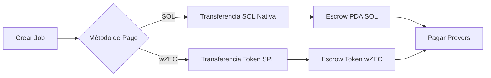

# Integración de Pagos wZEC

Documentación completa para integrar pagos wZEC (Wrapped Zcash) en el marketplace ZyberLink.

## Resumen

wZEC es un token SPL en Solana que representa Zcash (ZEC), habilitando pagos enfocados en privacidad en el marketplace descentralizado de computación FHE de ZyberLink.

**Dirección del Mint wZEC:** `7gGGpHxbEuY8i76PwxjgGB1ZX2Nhmfq65N6YNHtrv7Zf`

## Estructura de la Documentación

Esta sección proporciona documentación completa para todos los stakeholders:

### Para Usuarios

**[Guía de Usuario](wzec-guia-usuario.md)** - Todo lo que los usuarios necesitan saber sobre pagar con wZEC
- Qué es wZEC y por qué usarlo
- Cómo adquirir tokens wZEC
- Instrucciones de pago paso a paso
- Gestión de cuentas de tokens
- Solución de problemas comunes
- Preguntas frecuentes

### Para Desarrolladores

**[Guía de Desarrollador](wzec-guia-desarrollador.md)** - Guía completa de integración para desarrolladores
- Ejemplos de inicio rápido
- Integración frontend (React/Svelte)
- Integración backend (Rust/Node.js)
- Generación de firmas (CRÍTICO: formato base58)
- Gestión de cuentas de tokens
- Patrones de manejo de errores
- Mejores prácticas

**[Referencia API](wzec-referencia-api.md)** - Documentación completa de API
- Especificaciones de endpoints
- Esquemas de request/response
- Autenticación y seguridad
- Códigos de error y manejo
- Ejemplos de código en múltiples lenguajes
- SDKs y herramientas

### Para Arquitectos

**[Documentación de Arquitectura](../arquitectura/wzec-arquitectura.md)** - Inmersión técnica profunda
- Arquitectura del sistema con diagramas
- Interacciones de componentes
- Diagramas de flujo de datos
- Modelo de seguridad
- Consideraciones de rendimiento
- Mejoras futuras

### Para Ingenieros QA

**[Guía de Testing](wzec-guia-testing.md)** - Procedimientos completos de testing
- Configuración de entorno de prueba
- Tests unitarios (frontend y backend)
- Tests de integración
- Tests E2E automatizados
- Procedimientos de testing manual
- Testing de rendimiento y seguridad

## Inicio Rápido

### Para Usuarios

1. **Adquirir wZEC**: Comprar desde un DEX (Raydium, Orca, Jupiter)
2. **Conectar Wallet**: Usar Phantom, Solflare o wallet compatible
3. **Seleccionar Pago wZEC**: Elegir wZEC en selector de método de pago
4. **Crear Job**: El sistema maneja la cuenta de tokens automáticamente
5. **Confirmar Transacción**: Firmar y enviar vía tu wallet

### Para Desarrolladores

```javascript
import { Connection, PublicKey } from '@solana/web3.js';
import bs58 from 'bs58';

const WZEC_MINT = new PublicKey('7gGGpHxbEuY8i76PwxjgGB1ZX2Nhmfq65N6YNHtrv7Zf');

// 1. Firmar mensaje
const message = `create_job:${jobId}:${timestamp}:${nonce}`;
const signature = bs58.encode(await wallet.signMessage(message));

// 2. Crear job con wZEC
const response = await fetch('/api/jobs/validate-and-build', {
  method: 'POST',
  headers: { 'Content-Type': 'application/json' },
  body: JSON.stringify({
    creator_pubkey: wallet.publicKey.toString(),
    encrypted_data: encryptedData,
    server_key: serverKey,
    message,
    signature,  // DEBE ser base58!
    nonce,
    operation: 'add',
    operation_value: 5,
    price_lamports: 500000000,  // 5 wZEC
    required_provers: 3,
    consensus_threshold: 2,
    payment_method: 'wZEC'  // CLAVE: Especificar wZEC
  })
});

const { job_id, transaction } = await response.json();

// 3. Firmar y enviar transacción
// ... (ver Guía de Desarrollador para ejemplo completo)
```

## Características Clave

### Sistema Dual de Pagos



### Creación Automática de Cuenta de Tokens

- El sistema detecta automáticamente cuentas de tokens faltantes
- Crea Associated Token Account (ATA) si es necesario
- No se requiere intervención manual de los usuarios
- UX sin fricciones

### Compatible con Versiones Anteriores

- Los pagos SOL existentes funcionan sin cambios
- Sin cambios breaking en la API
- Campo `payment_method` opcional
- Por defecto es SOL si no se especifica

## Aspectos Técnicos Destacados

### Comparación de Métodos de Pago

| Característica | Pago SOL | Pago wZEC |
|----------------|----------|-----------|
| Velocidad de Transacción | Instantánea | Instantánea |
| Configuración Requerida | Ninguna | Cuenta de tokens |
| Cuentas en TX | 5 | 9 |
| Instrucción | CreateJob | CreateJobWithToken |
| Programa de Tokens | System | SPL Token |

### Características de Seguridad

- **Firmas Ed25519**: Autenticación criptográfica
- **Protección Anti-Replay**: Validación de nonce + timestamp
- **Formato Base58**: Codificación de firma estándar de Solana
- **Validación de Entrada**: Validación backend completa
- **Soporte TFHE**: Maneja ServerKeys de 156 MB de forma segura

### Rendimiento

- **Respuesta API**: < 2s para requests normales
- **Payloads Grandes**: Soporta requests de 200 MB
- **Throughput**: 50+ requests/segundo
- **Latencia E2E**: ~5-10 segundos (incluyendo confirmación blockchain)

## Estado de Integración

### Backend (Completado)

- [x] Validación de método de pago
- [x] Instrucción CreateJobWithToken
- [x] Derivación de PDA escrow de tokens
- [x] Creación automática de ATA
- [x] Migración de esquema de base de datos
- [x] Script E2E test aprobado

### Frontend (Completado)

- [x] Componente PaymentMethodSelector
- [x] Utilidad de gestor de cuenta de tokens
- [x] Validación de balance
- [x] Manejo de errores
- [x] 35+ tests unitarios
- [x] API mock para testing

### Documentación (Completada)

- [x] Guía de usuario
- [x] Guía de desarrollador
- [x] Referencia API
- [x] Documentación de arquitectura
- [x] Guía de testing
- [x] Integración GitBook

## Casos de Uso Comunes

### Caso de Uso 1: Pagar con wZEC

El usuario quiere pagar por computación FHE usando wZEC en lugar de SOL.

**Solución:** Seleccionar método de pago "wZEC" en UI → El sistema maneja todo automáticamente

### Caso de Uso 2: Cuenta de Tokens Faltante

El usuario no tiene cuenta de tokens wZEC aún.

**Solución:** Sistema detecta cuenta faltante → Incluye creación de ATA en transacción → Cuenta creada automáticamente

### Caso de Uso 3: Integración API

El desarrollador quiere integrar pagos wZEC en su app.

**Solución:** Usar endpoint `/api/jobs/validate-and-build` con `payment_method: "wZEC"` → Seguir Guía de Desarrollador

### Caso de Uso 4: Testing E2E

El ingeniero QA quiere probar el flujo de pago wZEC.

**Solución:** Ejecutar `./scripts/e2e-test-wzec.sh` → Test automatizado con claves TFHE reales

## Solución de Problemas

### Problemas Comunes

**Problema:** "Método de pago inválido"
**Solución:** Usar `"wZEC"` (mayúsculas) no `"wzec"` (minúsculas)

**Problema:** "Falló verificación de firma"
**Solución:** Asegurar que la firma esté codificada en base58 (NO base64)

**Problema:** "Balance wZEC insuficiente"
**Solución:** El usuario necesita adquirir más wZEC desde un DEX

**Problema:** "Falló creación de cuenta de tokens"
**Solución:** El usuario necesita al menos 0.005 SOL para rent + fees

## Recursos

### Documentación

- [Guía de Usuario](wzec-guia-usuario.md) - Para usuarios finales
- [Guía de Desarrollador](wzec-guia-desarrollador.md) - Para desarrolladores
- [Referencia API](wzec-referencia-api.md) - Especificaciones API
- [Arquitectura](../arquitectura/wzec-arquitectura.md) - Diseño del sistema
- [Guía de Testing](wzec-guia-testing.md) - Procedimientos QA

### Ejemplos de Código

- [Integración Frontend](wzec-guia-desarrollador.md#integración-frontend)
- [Integración Backend](wzec-guia-desarrollador.md#integración-backend)
- [Generación de Firmas](wzec-guia-desarrollador.md#generación-de-firmas)
- [Script Test E2E](wzec-guia-testing.md#tests-e2e)

### Herramientas

- **Explorer Mint wZEC**: https://solscan.io/token/7gGGpHxbEuY8i76PwxjgGB1ZX2Nhmfq65N6YNHtrv7Zf
- **Generador de Claves Test**: `cargo run -p test-utils --bin generate-tfhe-keys`
- **Firmador de Mensajes**: `scripts/sign-message-raw.py`
- **Test E2E**: `scripts/e2e-test-wzec.sh`

## Soporte

¿Necesitas ayuda con la integración wZEC?

- **Documentación**: [docs.zyberlink.io](https://docs.zyberlink.io)
- **GitHub Issues**: [Reportar bugs](https://github.com/zyberlink/zyberlink/issues)
- **Discord**: [#wzec-support](https://discord.gg/zyberlink)
- **Email**: support@zyberlink.io

## Changelog

### Versión 1.0.0 (2025-11-20)

**Agregado:**
- Soporte de pago wZEC
- Componente UI PaymentMethodSelector
- Auto-creación de cuenta de tokens
- Instrucción CreateJobWithToken
- Suite completa de documentación
- Script test E2E

**Detalles Técnicos:**
- Formato de firma Base58 (estándar Solana)
- Soporte para TFHE ServerKey de 156 MB
- Gestión automática de ATA
- Compatible con versiones anteriores con pagos SOL

## Próximos Pasos

1. **Nuevos Usuarios**: Comenzar con la [Guía de Usuario](wzec-guia-usuario.md)
2. **Desarrolladores**: Leer la [Guía de Desarrollador](wzec-guia-desarrollador.md)
3. **Integradores**: Revisar la [Referencia API](wzec-referencia-api.md)
4. **Arquitectos**: Revisar la [Arquitectura](../arquitectura/wzec-arquitectura.md)
5. **Equipos QA**: Seguir la [Guía de Testing](wzec-guia-testing.md)

---

**Última Actualización**: 2025-11-21
**Versión**: 1.0.0
**Mint wZEC**: `7gGGpHxbEuY8i76PwxjgGB1ZX2Nhmfq65N6YNHtrv7Zf`
**Estado**: Listo para Producción
