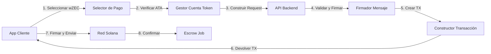

# Guía de Desarrollador de Pagos wZEC

Una guía completa para desarrolladores que integran soporte de pagos wZEC (Wrapped Zcash) en aplicaciones usando el marketplace ZyberLink.

## Tabla de Contenidos

- [Resumen](#resumen)
- [Inicio Rápido](#inicio-rápido)
- [Integración Frontend](#integración-frontend)
- [Integración Backend](#integración-backend)
- [Generación de Firmas](#generación-de-firmas)
- [Gestión de Cuentas de Tokens](#gestión-de-cuentas-de-tokens)
- [Construcción de Transacciones](#construcción-de-transacciones)
- [Manejo de Errores](#manejo-de-errores)
- [Testing](#testing)
- [Checklist de Producción](#checklist-de-producción)
- [Mejores Prácticas](#mejores-prácticas)

## Resumen

### Arquitectura



### Componentes Clave

1. **PaymentMethodSelector**: Componente UI para selección SOL vs wZEC
2. **TokenAccountManager**: Creación/verificación automática de ATA
3. **MessageSigner**: Generación de firma Ed25519 (formato base58)
4. **TransactionBuilder**: Crea transacciones de pago wZEC
5. **API Client**: Maneja comunicación con backend

## Inicio Rápido

### Instalación

```bash
# Dependencias frontend
npm install @solana/web3.js @solana/spl-token bs58

# Dependencias backend (Rust)
cargo add solana-sdk spl-token borsh
```

### Ejemplo Mínimo

```javascript
import { Connection, PublicKey, Transaction } from '@solana/web3.js';
import { getAssociatedTokenAddress } from '@solana/spl-token';
import bs58 from 'bs58';

// Configuración
const WZEC_MINT = new PublicKey('7gGGpHxbEuY8i76PwxjgGB1ZX2Nhmfq65N6YNHtrv7Zf');
const API_URL = 'https://api.zyberlink.io';

// Crear job con pago wZEC
async function createJobWithWZEC(wallet, jobData) {
  // 1. Verificar cuenta de tokens
  const ata = await getAssociatedTokenAddress(WZEC_MINT, wallet.publicKey);

  // 2. Preparar request
  const nonce = `${Date.now()}_${Math.random().toString(36).substr(2, 9)}`;
  const timestamp = Math.floor(Date.now() / 1000);
  const message = `create_job:${jobData.jobId}:${timestamp}:${nonce}`;
  const signature = await signMessage(wallet, message);

  const request = {
    creator_pubkey: wallet.publicKey.toString(),
    encrypted_data: jobData.encryptedData,
    server_key: jobData.serverKey,
    message,
    signature,
    nonce,
    operation: 'add',
    operation_value: 5,
    price_lamports: 500000000, // 5 wZEC en zatoshis
    required_provers: 3,
    consensus_threshold: 2,
    payment_method: 'wZEC' // CLAVE: Especificar pago wZEC
  };

  // 3. Llamar API
  const response = await fetch(`${API_URL}/api/jobs/validate-and-build`, {
    method: 'POST',
    headers: { 'Content-Type': 'application/json' },
    body: JSON.stringify(request)
  });

  const { job_id, transaction } = await response.json();

  // 4. Firmar y enviar transacción
  const connection = new Connection('https://api.mainnet-beta.solana.com');
  const tx = Transaction.from(Buffer.from(transaction, 'base64'));
  const signed = await wallet.signTransaction(tx);
  const txSignature = await connection.sendRawTransaction(signed.serialize());

  return { job_id, signature: txSignature };
}
```

## Integración Frontend

### Componente PaymentMethodSelector

**Implementación Svelte:**

```svelte
<script>
  import { createEventDispatcher } from 'svelte';

  const dispatch = createEventDispatcher();

  export let selected = 'sol'; // 'sol' | 'wzec'
  export let disabled = false;

  const methods = [
    {
      id: 'sol',
      name: 'SOL',
      description: 'Token nativo de Solana - Rápido y bajas comisiones',
      icon: '◉',
      recommended: true
    },
    {
      id: 'wzec',
      name: 'wZEC',
      description: 'Pagos privados con Zcash - Token SPL',
      icon: '⚡',
      recommended: false
    }
  ];

  function handleSelect(methodId) {
    if (disabled) return;
    selected = methodId;
    dispatch('change', { payment_method: methodId });
  }
</script>

<div class="payment-selector">
  {#each methods as method}
    <button
      class="method-card {selected === method.id ? 'selected' : ''}"
      on:click={() => handleSelect(method.id)}
      disabled={disabled}
    >
      <div class="radio">
        {selected === method.id ? '●' : '○'}
      </div>
      <div class="method-info">
        <div class="method-icon">{method.icon}</div>
        <div class="method-name">{method.name}</div>
        <div class="method-description">{method.description}</div>
      </div>
      {#if method.recommended}
        <span class="badge">RECOMENDADO</span>
      {/if}
    </button>
  {/each}
</div>

<style>
  .method-card {
    display: flex;
    gap: 1rem;
    padding: 1.5rem;
    border: 2px solid var(--border-color);
    border-radius: 8px;
    cursor: pointer;
    transition: all 0.2s;
  }

  .method-card.selected {
    border-color: var(--primary-color);
    background: rgba(139, 92, 246, 0.1);
  }

  .method-card:hover:not(:disabled) {
    border-color: var(--primary-light);
    transform: translateY(-2px);
  }
</style>
```

**Implementación React:**

```jsx
import React, { useState } from 'react';

export function PaymentMethodSelector({ onSelect, initialMethod = 'sol' }) {
  const [selected, setSelected] = useState(initialMethod);

  const methods = [
    {
      id: 'sol',
      name: 'SOL',
      description: 'Token nativo de Solana - Rápido y bajas comisiones',
      icon: '◉',
      recommended: true
    },
    {
      id: 'wzec',
      name: 'wZEC',
      description: 'Pagos privados con Zcash - Token SPL',
      icon: '⚡',
      recommended: false
    }
  ];

  const handleSelect = (methodId) => {
    setSelected(methodId);
    onSelect(methodId);
  };

  return (
    <div className="payment-selector">
      {methods.map(method => (
        <button
          key={method.id}
          className={`method-card ${selected === method.id ? 'selected' : ''}`}
          onClick={() => handleSelect(method.id)}
        >
          <div className="radio">
            {selected === method.id ? '●' : '○'}
          </div>
          <div className="method-info">
            <div className="method-icon">{method.icon}</div>
            <div className="method-name">{method.name}</div>
            <div className="method-description">{method.description}</div>
          </div>
          {method.recommended && <span className="badge">RECOMENDADO</span>}
        </button>
      ))}
    </div>
  );
}
```

### Verificación de Cuenta de Tokens

**Verificar si el usuario tiene cuenta de tokens wZEC:**

```javascript
import { getAssociatedTokenAddress, getAccount } from '@solana/spl-token';
import { Connection, PublicKey } from '@solana/web3.js';

const WZEC_MINT = new PublicKey('7gGGpHxbEuY8i76PwxjgGB1ZX2Nhmfq65N6YNHtrv7Zf');

/**
 * Verificar si el usuario tiene cuenta de tokens wZEC
 * @param {Connection} connection - Conexión Solana
 * @param {PublicKey} walletPubkey - Clave pública del wallet del usuario
 * @returns {Promise<{exists: boolean, address: PublicKey, balance?: bigint}>}
 */
async function checkWZECTokenAccount(connection, walletPubkey) {
  try {
    // Derivar dirección ATA
    const ata = await getAssociatedTokenAddress(
      WZEC_MINT,
      walletPubkey
    );

    // Intentar obtener cuenta
    const accountInfo = await getAccount(connection, ata);

    return {
      exists: true,
      address: ata,
      balance: accountInfo.amount
    };
  } catch (error) {
    // Cuenta no existe
    if (error.name === 'TokenAccountNotFoundError') {
      const ata = await getAssociatedTokenAddress(
        WZEC_MINT,
        walletPubkey
      );

      return {
        exists: false,
        address: ata,
        balance: 0n
      };
    }

    throw error;
  }
}

// Uso
const tokenAccount = await checkWZECTokenAccount(connection, wallet.publicKey);

if (!tokenAccount.exists) {
  console.warn('La cuenta de tokens se creará durante la transacción');
}

if (tokenAccount.balance < priceInZatoshis) {
  throw new Error('Balance wZEC insuficiente');
}
```

### Integración Frontend Completa

```javascript
import { Connection, Transaction, PublicKey } from '@solana/web3.js';
import { getAssociatedTokenAddress } from '@solana/spl-token';
import bs58 from 'bs58';

const WZEC_MINT = new PublicKey('7gGGpHxbEuY8i76PwxjgGB1ZX2Nhmfq65N6YNHtrv7Zf');
const API_URL = 'https://api.zyberlink.io';

/**
 * Flujo completo de creación de job con pago wZEC
 */
export class ZyberLinkClient {
  constructor(connection, wallet) {
    this.connection = connection;
    this.wallet = wallet;
  }

  /**
   * Crear job con método de pago especificado
   * @param {Object} jobData - Parámetros del job
   * @param {string} paymentMethod - 'sol' o 'wzec'
   * @returns {Promise<{jobId: number, signature: string}>}
   */
  async createJob(jobData, paymentMethod = 'sol') {
    // 1. Validar método de pago y verificar balances
    await this.validatePayment(paymentMethod, jobData.priceLamports);

    // 2. Generar mensaje y firma
    const nonce = this.generateNonce();
    const timestamp = Math.floor(Date.now() / 1000);
    const message = `create_job:${jobData.jobId}:${timestamp}:${nonce}`;
    const signature = await this.signMessage(message);

    // 3. Construir request API
    const request = {
      creator_pubkey: this.wallet.publicKey.toString(),
      encrypted_data: jobData.encryptedData,
      server_key: jobData.serverKey,
      message,
      signature,
      nonce,
      operation: jobData.operation,
      operation_value: jobData.operationValue,
      price_lamports: jobData.priceLamports,
      required_provers: jobData.requiredProvers || 3,
      consensus_threshold: jobData.consensusThreshold || 2,
      payment_method: paymentMethod === 'wzec' ? 'wZEC' : 'SOL'
    };

    // 4. Llamar API backend
    const response = await fetch(`${API_URL}/api/jobs/validate-and-build`, {
      method: 'POST',
      headers: { 'Content-Type': 'application/json' },
      body: JSON.stringify(request)
    });

    if (!response.ok) {
      const error = await response.json();
      throw new Error(error.error || 'Falló creación de job');
    }

    const { job_id, transaction } = await response.json();

    // 5. Deserializar, firmar y enviar transacción
    const tx = Transaction.from(Buffer.from(transaction, 'base64'));
    const signedTx = await this.wallet.signTransaction(tx);
    const txSignature = await this.connection.sendRawTransaction(
      signedTx.serialize()
    );

    // 6. Confirmar transacción
    await this.connection.confirmTransaction(txSignature, 'confirmed');

    // 7. Notificar backend
    await this.confirmJob(job_id, txSignature);

    return {
      jobId: job_id,
      signature: txSignature
    };
  }

  /**
   * Validar método de pago y verificar balances
   */
  async validatePayment(paymentMethod, priceLamports) {
    if (paymentMethod === 'wzec') {
      const tokenAccount = await checkWZECTokenAccount(
        this.connection,
        this.wallet.publicKey
      );

      if (tokenAccount.balance < BigInt(priceLamports)) {
        throw new Error(
          `Balance wZEC insuficiente. Requerido: ${priceLamports}, Disponible: ${tokenAccount.balance}`
        );
      }
    } else if (paymentMethod === 'sol') {
      const balance = await this.connection.getBalance(this.wallet.publicKey);

      if (balance < priceLamports) {
        throw new Error(
          `Balance SOL insuficiente. Requerido: ${priceLamports}, Disponible: ${balance}`
        );
      }
    } else {
      throw new Error(`Método de pago inválido: ${paymentMethod}`);
    }
  }

  /**
   * Firmar mensaje usando wallet
   */
  async signMessage(message) {
    const messageBytes = new TextEncoder().encode(message);
    const signatureBytes = await this.wallet.signMessage(messageBytes);

    // IMPORTANTE: Devolver firma codificada en base58
    return bs58.encode(signatureBytes);
  }

  /**
   * Generar nonce único
   */
  generateNonce() {
    return `${Date.now()}_${Math.random().toString(36).substr(2, 9)}`;
  }

  /**
   * Confirmar creación de job con backend
   */
  async confirmJob(jobId, signature) {
    await fetch(`${API_URL}/api/jobs/${jobId}/confirm`, {
      method: 'POST',
      headers: { 'Content-Type': 'application/json' },
      body: JSON.stringify({ signature })
    });
  }
}

// Ejemplo de Uso
const connection = new Connection('https://api.mainnet-beta.solana.com');
const client = new ZyberLinkClient(connection, wallet);

// Crear job con pago wZEC
const result = await client.createJob({
  jobId: 12345,
  encryptedData: 'base64_encrypted_data...',
  serverKey: 'base64_server_key...',
  operation: 'add',
  operationValue: 5,
  priceLamports: 500000000, // 5 wZEC
  requiredProvers: 3,
  consensusThreshold: 2
}, 'wzec');

console.log(`Job creado: ${result.jobId}, TX: ${result.signature}`);
```

## Integración Backend

### Backend Rust

```rust
use solana_sdk::{
    pubkey::Pubkey,
    signature::{Keypair, Signature, Signer},
    transaction::Transaction,
};
use spl_token::instruction as token_instruction;
use std::str::FromStr;

const WZEC_MINT: &str = "7gGGpHxbEuY8i76PwxjgGB1ZX2Nhmfq65N6YNHtrv7Zf";

/// Request de creación de job con método de pago
#[derive(Debug, serde::Deserialize)]
pub struct CreateJobRequest {
    pub creator_pubkey: String,
    pub encrypted_data: String,
    pub server_key: String,
    pub message: String,
    pub signature: String,  // codificado en base58
    pub nonce: String,
    pub operation: String,
    pub operation_value: u8,
    pub price_lamports: u64,
    pub required_provers: u8,
    pub consensus_threshold: u8,
    pub payment_method: Option<String>, // "SOL" o "wZEC"
}

/// Construir transacción para creación de job
pub async fn build_job_transaction(
    request: &CreateJobRequest,
) -> Result<String, Box<dyn std::error::Error>> {
    let payment_method = request.payment_method.as_deref().unwrap_or("SOL");

    match payment_method {
        "SOL" => build_sol_transaction(request).await,
        "wZEC" => build_wzec_transaction(request).await,
        _ => Err("Método de pago inválido".into()),
    }
}

/// Construir transacción de pago wZEC
async fn build_wzec_transaction(
    request: &CreateJobRequest,
) -> Result<String, Box<dyn std::error::Error>> {
    let creator = Pubkey::from_str(&request.creator_pubkey)?;
    let wzec_mint = Pubkey::from_str(WZEC_MINT)?;

    // Derivar PDAs
    let (job_pda, _) = derive_job_pda(&creator, job_id);
    let (config_pda, _) = derive_config_pda();
    let (escrow_pda, _) = derive_escrow_pda(&job_pda);

    // Obtener cuenta de tokens del creator
    let creator_token_account = get_associated_token_address(&creator, &wzec_mint);

    // Construir instrucción CreateJobWithToken (9 cuentas)
    let accounts = vec![
        AccountMeta::new(creator, true),              // firmante
        AccountMeta::new(job_pda, false),             // escribible
        AccountMeta::new(config_pda, false),          // escribible
        AccountMeta::new(escrow_pda, false),          // escribible
        AccountMeta::new(creator_token_account, false), // escribible
        AccountMeta::new_readonly(wzec_mint, false),  // solo lectura
        AccountMeta::new_readonly(system_program::ID, false),
        AccountMeta::new_readonly(spl_token::ID, false),
        AccountMeta::new_readonly(sysvar::rent::ID, false),
    ];

    let instruction_data = CreateJobWithTokenData {
        circuit_type: parse_circuit_type(&request.operation),
        witness_commitment: hash_encrypted_data(&request.encrypted_data),
        witness_size: request.encrypted_data.len() as u32,
        price_lamports: request.price_lamports,
        timeout_seconds: 600,
        fhe_config: Some(FheConsensusConfig {
            required_provers: request.required_provers,
            consensus_threshold: request.consensus_threshold,
        }),
    };

    let instruction = Instruction {
        program_id: PROGRAM_ID,
        accounts,
        data: instruction_data.try_to_vec()?,
    };

    // Crear transacción
    let recent_blockhash = get_recent_blockhash().await?;
    let tx = Transaction::new_with_payer(
        &[instruction],
        Some(&creator),
    );

    // Serializar a base64
    let serialized = base64::encode(tx.message.serialize());

    Ok(serialized)
}
```

### Backend Node.js

```javascript
const { Connection, PublicKey, Transaction } = require('@solana/web3.js');
const { getAssociatedTokenAddress } = require('@solana/spl-token');
const bs58 = require('bs58');

const WZEC_MINT = new PublicKey('7gGGpHxbEuY8i76PwxjgGB1ZX2Nhmfq65N6YNHtrv7Zf');

/**
 * Construir transacción para creación de job
 */
async function buildJobTransaction(request) {
  const paymentMethod = request.payment_method || 'SOL';

  if (paymentMethod === 'SOL') {
    return buildSOLTransaction(request);
  } else if (paymentMethod === 'wZEC') {
    return buildWZECTransaction(request);
  } else {
    throw new Error(`Método de pago inválido: ${paymentMethod}`);
  }
}

/**
 * Construir transacción de pago wZEC
 */
async function buildWZECTransaction(request) {
  const creator = new PublicKey(request.creator_pubkey);

  // Derivar cuentas
  const jobPDA = deriveJobPDA(creator, request.job_id);
  const configPDA = deriveConfigPDA();
  const escrowPDA = deriveEscrowPDA(jobPDA);
  const creatorTokenAccount = await getAssociatedTokenAddress(WZEC_MINT, creator);

  // Construir instrucción
  const instruction = {
    programId: PROGRAM_ID,
    keys: [
      { pubkey: creator, isSigner: true, isWritable: true },
      { pubkey: jobPDA, isSigner: false, isWritable: true },
      { pubkey: configPDA, isSigner: false, isWritable: true },
      { pubkey: escrowPDA, isSigner: false, isWritable: true },
      { pubkey: creatorTokenAccount, isSigner: false, isWritable: true },
      { pubkey: WZEC_MINT, isSigner: false, isWritable: false },
      { pubkey: SystemProgram.programId, isSigner: false, isWritable: false },
      { pubkey: TOKEN_PROGRAM_ID, isSigner: false, isWritable: false },
      { pubkey: SYSVAR_RENT_PUBKEY, isSigner: false, isWritable: false },
    ],
    data: encodeInstructionData({
      instruction: 'CreateJobWithToken',
      circuitType: request.operation,
      witnessCommitment: hashData(request.encrypted_data),
      witnessSize: request.encrypted_data.length,
      priceLamports: request.price_lamports,
      timeoutSeconds: 600,
      fheConfig: {
        requiredProvers: request.required_provers,
        consensusThreshold: request.consensus_threshold,
      },
    }),
  };

  // Crear transacción
  const connection = new Connection('https://api.mainnet-beta.solana.com');
  const { blockhash } = await connection.getLatestBlockhash();

  const transaction = new Transaction({
    feePayer: creator,
    recentBlockhash: blockhash,
  }).add(instruction);

  // Serializar a base64
  return transaction.serialize({ requireAllSignatures: false }).toString('base64');
}

module.exports = { buildJobTransaction };
```

## Generación de Firmas

### CRÍTICO: Formato Base58

El backend espera firmas en **formato base58**, NO base64. Esto coincide con el formato estándar de firma de wallet de Solana.

```javascript
import bs58 from 'bs58';
import nacl from 'tweetnacl';

/**
 * Firmar mensaje con keypair Solana (devuelve base58)
 * @param {Keypair} keypair - Keypair Solana
 * @param {string} message - Mensaje a firmar
 * @returns {string} firma codificada en base58
 */
function signMessage(keypair, message) {
  const messageBytes = new TextEncoder().encode(message);
  const signatureBytes = nacl.sign.detached(messageBytes, keypair.secretKey);

  // IMPORTANTE: Devolver base58, no base64
  return bs58.encode(signatureBytes);
}

// Ejemplo
const keypair = Keypair.generate();
const message = 'create_job:123:1732104000:nonce123';
const signature = signMessage(keypair, message);

console.log('Firma (base58):', signature);
// Salida: "5J7X... (88 caracteres)"
```

### Helper de Firma en Python

```python
#!/usr/bin/env python3
"""
Firmar mensaje con keypair Solana (Ed25519 raw, salida base58)
"""
import sys
import json
import base58
from nacl.signing import SigningKey

def sign_message(keypair_path: str, message: str) -> str:
    """Firmar mensaje y devolver firma base58"""

    # Cargar keypair
    with open(keypair_path, 'r') as f:
        keypair_bytes = bytes(json.load(f))

    # Extraer clave secreta (primeros 32 bytes)
    secret_key = keypair_bytes[:32]
    signing_key = SigningKey(secret_key)

    # Firmar mensaje (raw, sin prefijo)
    message_bytes = message.encode('utf-8')
    signature = signing_key.sign(message_bytes).signature

    # Devolver codificado en base58
    return base58.b58encode(signature).decode('ascii')

if __name__ == '__main__':
    if len(sys.argv) != 3:
        print('Uso: sign-message.py <keypair_path> <message>')
        sys.exit(1)

    keypair_path = sys.argv[1]
    message = sys.argv[2]

    signature = sign_message(keypair_path, message)
    print(signature)
```

Uso:
```bash
python3 sign-message.py ~/.config/solana/id.json "create_job:123:1732104000:nonce"
# Salida: 5J7X... (firma base58)
```

## Gestión de Cuentas de Tokens

### Creación Automática

El backend incluye automáticamente creación de cuenta de tokens si es necesario:

```rust
// Verificar si existe cuenta de tokens
let token_account = get_associated_token_address(&creator, &wzec_mint);

let account_info = rpc_client.get_account(&token_account).ok();

if account_info.is_none() {
    // Agregar instrucción de creación de cuenta de tokens
    let create_ata_ix = create_associated_token_account(
        &creator,      // pagador
        &creator,      // propietario
        &wzec_mint,    // mint
    );

    instructions.push(create_ata_ix);
}

// Agregar instrucción de pago
instructions.push(create_job_with_token_ix);
```

### Creación Manual (Frontend)

```javascript
import {
  createAssociatedTokenAccountInstruction,
  getAssociatedTokenAddress,
} from '@solana/spl-token';

/**
 * Crear cuenta de tokens wZEC manualmente
 */
async function createWZECTokenAccount(connection, wallet) {
  const ata = await getAssociatedTokenAddress(
    WZEC_MINT,
    wallet.publicKey
  );

  // Verificar si ya existe
  const accountInfo = await connection.getAccountInfo(ata);
  if (accountInfo) {
    console.log('Cuenta de tokens ya existe:', ata.toString());
    return ata;
  }

  // Crear instrucción
  const instruction = createAssociatedTokenAccountInstruction(
    wallet.publicKey, // pagador
    ata,              // cuenta de tokens asociada
    wallet.publicKey, // propietario
    WZEC_MINT         // mint
  );

  // Construir y enviar transacción
  const transaction = new Transaction().add(instruction);
  const signature = await sendAndConfirmTransaction(
    connection,
    transaction,
    [wallet]
  );

  console.log('Cuenta de tokens creada:', ata.toString());
  console.log('Transacción:', signature);

  return ata;
}
```

## Manejo de Errores

### Errores Comunes

```javascript
/**
 * Manejo de errores para pagos wZEC
 */
class WZECPaymentError extends Error {
  constructor(message, code, details) {
    super(message);
    this.name = 'WZECPaymentError';
    this.code = code;
    this.details = details;
  }
}

/**
 * Manejar errores de API
 */
async function handleAPIError(response) {
  const error = await response.json();

  switch (response.status) {
    case 400:
      if (error.error.includes('payment_method')) {
        throw new WZECPaymentError(
          'Método de pago inválido especificado',
          'INVALID_PAYMENT_METHOD',
          error
        );
      }
      if (error.error.includes('signature')) {
        throw new WZECPaymentError(
          'Falló verificación de firma. Verificar formato de firma (debe ser base58)',
          'SIGNATURE_VERIFICATION_FAILED',
          error
        );
      }
      break;

    case 500:
      if (error.error.includes('transaction build')) {
        throw new WZECPaymentError(
          'Falló construcción de transacción. Verificar cuenta de tokens y balance',
          'TRANSACTION_BUILD_FAILED',
          error
        );
      }
      break;
  }

  throw new WZECPaymentError(
    error.error || 'Error desconocido',
    'UNKNOWN_ERROR',
    error
  );
}

// Uso
try {
  const result = await createJobWithWZEC(wallet, connection, jobData);
} catch (error) {
  if (error instanceof WZECPaymentError) {
    console.error(`Error Pago wZEC [${error.code}]:`, error.message);
    console.error('Detalles:', error.details);

    // Mostrar mensaje amigable al usuario
    switch (error.code) {
      case 'INSUFFICIENT_WZEC_BALANCE':
        showNotification('Balance wZEC insuficiente. Por favor recarga tu cuenta.');
        break;
      case 'TOKEN_ACCOUNT_NOT_FOUND':
        showNotification('Cuenta de tokens wZEC requerida. Se creará automáticamente.');
        break;
      case 'SIGNATURE_VERIFICATION_FAILED':
        showNotification('Falló verificación de firma. Por favor intenta de nuevo.');
        break;
      default:
        showNotification('Pago falló. Por favor intenta de nuevo o contacta soporte.');
    }
  } else {
    console.error('Error inesperado:', error);
    showNotification('Ocurrió un error inesperado.');
  }
}
```

## Testing

Ver [Guía de Testing wZEC](wzec-guia-testing.md) para documentación completa de testing.

## Checklist de Producción

### Pre-Despliegue

- [ ] Dirección mint wZEC verificada: `7gGGpHxbEuY8i76PwxjgGB1ZX2Nhmfq65N6YNHtrv7Zf`
- [ ] Formato de firma confirmado: base58 (NO base64)
- [ ] Creación de cuenta de tokens testeada
- [ ] Manejo de errores implementado
- [ ] Rate limiting configurado
- [ ] Monitoreo configurado
- [ ] Documentación actualizada

### Seguridad

- [ ] Verificación de firma habilitada
- [ ] Protección anti-replay activa con nonce
- [ ] Expiración de timestamp establecida (5 minutos)
- [ ] Validación de entrada completa
- [ ] Protección contra inyección SQL verificada
- [ ] Protección XSS habilitada

### Rendimiento

- [ ] Tiempo de respuesta API < 2s para requests normales
- [ ] Manejo de payloads grandes testeado (server key 156 MB)
- [ ] Connection pooling configurado
- [ ] Estrategia de caching implementada
- [ ] Rate limiting por IP/wallet

### Monitoreo

- [ ] Recolección de métricas (Prometheus/Grafana)
- [ ] Rastreo de errores (Sentry)
- [ ] Monitoreo de transacciones
- [ ] Alertas de balance
- [ ] Monitoreo de uptime

## Mejores Prácticas

### 1. Siempre Validar Método de Pago

```javascript
function validatePaymentMethod(method) {
  const valid = ['sol', 'wzec'];
  if (!valid.includes(method.toLowerCase())) {
    throw new Error(`Método de pago inválido: ${method}`);
  }
  return method.toUpperCase(); // API espera mayúsculas
}
```

### 2. Verificar Balances Antes de Transacción

```javascript
async function validateBalance(connection, wallet, paymentMethod, amount) {
  if (paymentMethod === 'wZEC') {
    const tokenAccount = await checkWZECTokenAccount(connection, wallet.publicKey);
    if (tokenAccount.balance < BigInt(amount)) {
      throw new Error('Balance wZEC insuficiente');
    }
  } else {
    const balance = await connection.getBalance(wallet.publicKey);
    if (balance < amount) {
      throw new Error('Balance SOL insuficiente');
    }
  }
}
```

### 3. Usar Formato de Firma Correcto

```javascript
// INCORRECTO: base64
const signatureBase64 = Buffer.from(signature).toString('base64');

// CORRECTO: base58
const signatureBase58 = bs58.encode(signature);
```

### 4. Manejar Creación de Cuenta de Tokens Gracefully

```javascript
// No fallar si la cuenta de tokens no existe
const tokenAccount = await checkWZECTokenAccount(connection, wallet.publicKey);

if (!tokenAccount.exists) {
  console.warn('Cuenta de tokens se creará durante transacción');
  // Continuar de todos modos, backend maneja creación
}
```

### 5. Implementar Lógica de Reintentos

```javascript
async function createJobWithRetry(wallet, connection, jobData, maxRetries = 3) {
  for (let attempt = 1; attempt <= maxRetries; attempt++) {
    try {
      return await createJobWithWZEC(wallet, connection, jobData);
    } catch (error) {
      if (attempt === maxRetries) throw error;

      console.warn(`Intento ${attempt} falló, reintentando...`);
      await sleep(1000 * attempt); // Backoff exponencial
    }
  }
}
```

## Próximos Pasos

- **[Referencia API wZEC](wzec-referencia-api.md)** - Documentación completa de API
- **[Arquitectura wZEC](../arquitectura/wzec-arquitectura.md)** - Inmersión profunda en diseño del sistema
- **[Guía de Testing wZEC](wzec-guia-testing.md)** - Guía completa de testing
- **[Guía de Usuario](wzec-guia-usuario.md)** - Documentación para usuario final

## Soporte

Soporte para desarrolladores:

- **GitHub**: [Issues](https://github.com/zyberlink/zyberlink/issues)
- **Discord**: [Canal #dev-support](https://discord.gg/zyberlink)
- **Email**: dev@zyberlink.io
- **Docs**: [docs.zyberlink.io](https://docs.zyberlink.io)

---

**Última Actualización**: 2025-11-21
**Versión API**: 1.0.0
**Mint wZEC**: `7gGGpHxbEuY8i76PwxjgGB1ZX2Nhmfq65N6YNHtrv7Zf`
