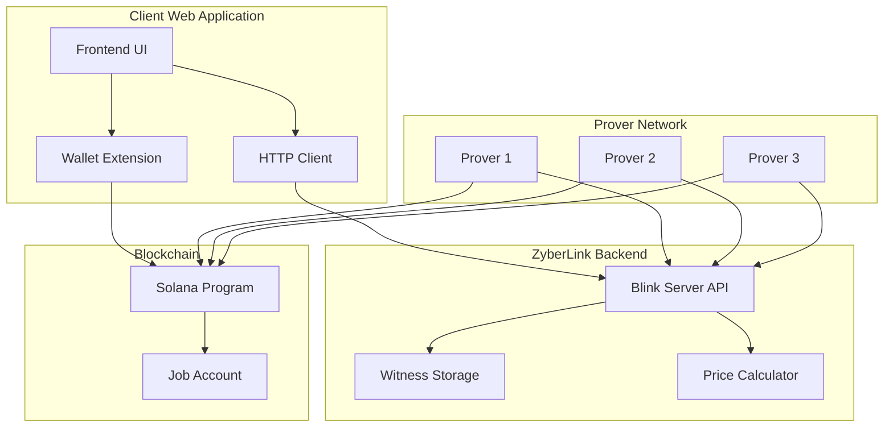

# Web Application Integration

## Overview

This document describes how web applications can interact with ZyberLink to execute private and decentralized FHE (Fully Homomorphic Encryption) computations. The integration currently relies on direct interaction with the Blink Server (backend) and the Solana blockchain.

## Integration Architecture



## Integration Components

### 1. Blink Server API

The Blink Server provides the following REST endpoints:

#### Witness Upload
```http
POST /witness
Content-Type: application/json

{
  "data": "base64_encoded_encrypted_data",
  "server_key": "base64_encoded_server_key"
}

Response:
{
  "commitment": "blake2s256_hash",
  "size": 1024
}
```

#### Price Recommendation
```http
POST /api/price-recommendation
Content-Type: application/json

{
  "circuit_type": "FheAdd",
  "witness_size": 1024,
  "expected_provers": 3
}

Response:
{
  "min_price": 0.001,
  "recommended_price": 0.005,
  "max_price": 0.01,
  "slider": {
    "min": 0.001,
    "max": 0.02,
    "step": 0.001
  }
}
```

### 2. Wallet Extension

The wallet extension handles:
- Solana connection
- Transaction signing
- Private key management

Injected provider interface:
```javascript
// Connect wallet
const { publicKey } = await window.solana.connect();

// Sign and send transaction
const signature = await window.solana.signAndSendTransaction(transaction);
```

### 3. Solana Program

The on-chain program manages:
- Job creation
- Prover registration
- Consensus verification
- Payment distribution

---

## Full Integration Flow

### Step 1: Prepare Encrypted Data

The client must encrypt their data using TFHE before sending it:

```rust
// Example in Rust (using tfhe-rs)
use tfhe::prelude::*;
use tfhe::{ConfigBuilder, generate_keys, FheUint8};

// Generate keys
let config = ConfigBuilder::default().build();
let (client_key, server_key) = generate_keys(config);

// Encrypt data
let encrypted = FheUint8::encrypt(10u8, &client_key);

// Serialize for transport
let encrypted_bytes = bincode::serialize(&encrypted)?;
let server_key_bytes = bincode::serialize(&server_key)?;
```

### Step 2: Upload Witness to Blink Server

```javascript
async function uploadWitness(encryptedData, serverKey) {
  const response = await fetch('http://localhost:3000/witness', {
    method: 'POST',
    headers: { 'Content-Type': 'application/json' },
    body: JSON.stringify({
      data: btoa(encryptedData),
      server_key: btoa(serverKey)
    })
  });

  return await response.json();
}
```

### Step 3: Create Job On-Chain

```javascript
async function createJob(commitment, price) {
  const transaction = await buildCreateJobTransaction({
    creator: publicKey,
    witnessCommitment: commitment,
    pricePerProver: price,
    expectedProvers: 3
  });

  return await window.solana.signAndSendTransaction(transaction);
}
```

### Step 4: Monitor Progress and Download Result

```javascript
async function getResult(jobId) {
  // Poll until status is 'completed'
  const status = await fetch(`${this.apiUrl}/api/jobs/${jobId}`).then(r => r.json());
  
  if (status.status === 'completed') {
    const result = await fetch(`${this.apiUrl}/api/jobs/${jobId}/result`).then(r => r.json());
    return result;
  }
}
```

## Security Considerations

1.  **Client-Side Encryption**: Sensitive data MUST be encrypted on the client before being sent to the backend.
2.  **Result Verification**: Clients should verify that result hashes match the on-chain commitments.
3.  **Key Management**: Client keys should never leave the user's device. Only server keys are sent to the backend.

## Current Limitations

- No Official JavaScript SDK yet (direct HTTP calls required).
- Results are downloaded encrypted (must decrypt locally with `client_key`).
- Real-time updates require polling (no WebSockets for status yet).
