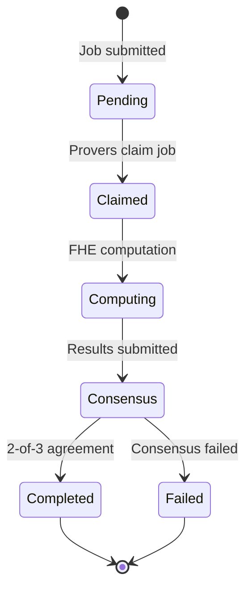

# Private Analytics Guide

Perform privacy-preserving statistical computations on encrypted data using ZyberLink's FHE analytics capabilities.

## Overview

Private Analytics allows you to compute statistics on encrypted datasets without revealing individual data points. ZyberLink supports multiple aggregation operations that run on encrypted data through Fully Homomorphic Encryption (FHE).

**Privacy Guarantee:** Your raw data never leaves your machine unencrypted. Provers compute on ciphertext and return encrypted results that only you can decrypt.

### Supported Operations

| Operation | Description | Use Case |
|-----------|-------------|----------|
| **Sum** | Total of encrypted values | Revenue aggregation, census totals |
| **Average** | Mean of encrypted values | Demographics, salary statistics |
| **CountIf** | Count values matching predicate | Survey analysis, compliance checks |
| **Histogram** | Distribution across bins | Age groups, income brackets |

## Prerequisites

Before starting, ensure you have:

- **Solana wallet** with SOL for transaction fees (0.01-0.1 SOL)
- **Encrypted data** prepared using the [Zyb CLI (FHE)](fhe-cli.md)
- **Internet connection** to access ZyberLink platform
- **Modern browser** (Chrome, Firefox, Safari, Edge)

### Data Preparation

Your data must be encrypted before submission. See the [Zyb CLI (FHE) Guide](fhe-cli.md) for encryption steps.

**Input format:** Array of encrypted values (FheUint8 or FheUint16)
**Output format:** Encrypted result + metadata (decryptable with your client key)

## Step-by-Step Guide

### Step 1: Encrypt Your Data

Use the FHE CLI to encrypt your dataset:

```bash
cd src/zyb-cli
cargo run --release --bin zyb fhe encrypt --values 10,20,30,40,50
```

This generates:
- **witness.bin** - Encrypted data + server key (upload to platform)
- **client_key.bin** - Secret decryption key (keep private!)

**Security Note:** Never share your client key. Store it securely offline.

### Step 2: Access the Analytics Interface

Navigate to the ZyberLink platform:

**Live Demo:** https://demo.zyberlink.fun
**Local Development:** http://localhost:5173/analytics

1. Click **"Private Analytics"** in the navigation menu
2. Connect your Solana wallet
3. Ensure sufficient SOL balance (check top-right corner)

### Step 3: Upload Encrypted Witness

1. Click **"Upload Witness File"** button
2. Select the `witness.bin` file from Step 1
3. Wait for file upload confirmation
4. The platform will display witness size and commitment hash

**Upload Notes:**
- Large witness files (50-100MB) may take 10-30 seconds
- Do not close the browser during upload
- The server key is included in witness.bin

### Step 4: Choose Operation

Select the statistical operation to perform:

#### Sum - Total of Values

**Best for:** Revenue totals, census aggregation, vote counts

**Example:**
```
Input: [10, 20, 30, 40, 50] (encrypted)
Output: 150 (encrypted)
```

**Use Case:** Calculate total donations without revealing individual amounts.

#### Average - Mean Value

**Best for:** Salary statistics, age demographics, survey averages

**Example:**
```
Input: [25, 30, 35, 40, 45] (encrypted)
Output: (175, 5) → 35 (encrypted sum + count)
```

**Use Case:** Compute average employee salary without exposing individual salaries.

#### CountIf - Conditional Count

**Best for:** Survey analysis, compliance verification, threshold checks

**Predicates:**
- `Equals(value)` - Count exact matches
- `GreaterThan(value)` - Count above threshold
- `LessThan(value)` - Count below threshold
- `Between(min, max)` - Count within range

**Example:**
```
Input: [15, 25, 35, 45] (encrypted)
Predicate: GreaterThan(18)
Output: 3 (encrypted)
```

**Use Case:** Count users over age 18 without revealing exact ages.

#### Histogram - Distribution Analysis

**Best for:** Age groups, income brackets, time-based distributions

**Example:**
```
Input: [5, 15, 25, 35, 45] (encrypted)
Bins: [0-18, 19-35, 36-65, 66+]
Output: [1, 2, 2, 0] (encrypted counts per bin)
```

**Use Case:** Generate age distribution report without exposing individual ages.

### Step 5: Configure Price

The platform uses dynamic pricing based on computational complexity:

1. **View Recommended Price** - Auto-calculated based on operation
2. **Adjust Price** (optional) - Use slider to set custom price
3. **Review Breakdown:**
   - Base job cost
   - Platform fee (1%)
   - Total cost in SOL

**Pricing Factors:**
- Operation complexity (Sum < Average < CountIf < Histogram)
- Dataset size (more values = higher cost)
- Current network demand

**Recommendation:** Use the recommended price for best results. Lower prices may delay job completion.

### Step 6: Submit Job

1. Review job configuration:
   - Operation type
   - Witness size
   - Price (in SOL)
   - Required provers (default: 3)
   - Consensus threshold (default: 2-of-3)

2. Click **"Submit Analytics Job"**

3. Approve transaction in wallet popup

4. Wait for blockchain confirmation (5-10 seconds)

**Transaction Details:**
- Creates on-chain job account
- Locks payment in escrow
- Notifies prover network

### Step 7: Monitor Progress

The interface displays real-time job status:

#### Status Stages



**Typical Timeline:**
- **Pending:** 5-30 seconds (waiting for provers)
- **Claimed:** Instant (provers download witness)
- **Computing:** 10-60 seconds (FHE computation)
- **Consensus:** 5-10 seconds (on-chain verification)
- **Total:** ~30-120 seconds

#### Status Indicators

- **Pending** (🟡) - Waiting for provers to claim
- **Claimed** (🔵) - Provers have accepted job
- **Computing** (🔵) - FHE computation in progress
- **Completed** (🟢) - Job successful, result available
- **Failed** (🔴) - Consensus failed, full refund issued

### Step 8: Download Result

Once status shows **Completed**:

1. Click **"Download Result"** button
2. Save the encrypted result file (e.g., `result.bin`)
3. View transaction on Solana Explorer (click TX signature)

**Result Contents:**
- Encrypted FHE computation output
- Consensus metadata
- Job completion timestamp

### Step 9: Decrypt Result

Use the FHE CLI to decrypt the result:

```bash
cd src/zyb-cli
cargo run --release --bin zyb fhe decrypt \
  --result-path ./result.bin \
  --client-key-path ./fhe-output/client_key.bin
```

**Output:**
```
🔓 Decrypting result...
✅ Result: 150

Operation: Sum
Input Count: 5 values
Computation Time: 45s
Provers: 3/3 consensus
```

## Complete Example Workflow

### Scenario: Private Donation Analysis

**Goal:** Calculate total donations without revealing individual amounts.

**Dataset:** 5 anonymous donations (simulated)

#### 1. Encrypt Donation Amounts

```bash
# Navigate to FHE CLI
cd src/zyb-cli

# Encrypt donation values (in dollars)
cargo run --release --bin zyb fhe encrypt \
  --values 100,250,75,500,125

# Output:
# ✅ 5 values encrypted
# 📁 witness.bin (52.4 MB)
# 🔑 client_key.bin (saved to fhe-output/)
```

#### 2. Submit to Platform

```
1. Open https://demo.zyberlink.fun/analytics
2. Connect wallet (e.g., Phantom)
3. Upload witness.bin
4. Select operation: "SUM"
5. Use recommended price: 0.0054 SOL
6. Click "Submit Analytics Job"
7. Approve transaction in wallet
```

#### 3. Wait for Completion

```
Status updates:
[00:05] Pending - Waiting for provers...
[00:15] Claimed - 3 provers claimed job
[00:20] Computing - Provers working on encrypted data...
[01:05] Completed - Consensus reached! ✅

Transaction: 5k7Xh9...abc123
```

#### 4. Decrypt Result

```bash
# Download result.bin from platform
# Decrypt with client key
cargo run --release --bin zyb fhe decrypt \
  --result-path ~/Downloads/result.bin \
  --client-key-path ./fhe-output/client_key.bin

# Output:
# 🎯 Decrypted Result: 1050
#
# ✅ Total donations: $1,050
# (Individual amounts remain private!)
```

## Advanced Usage

### Batch Analytics Jobs

Submit multiple jobs in sequence:

```bash
# Encrypt multiple datasets
zyb fhe encrypt --values 10,20,30 --output dataset1.bin
zyb fhe encrypt --values 40,50,60 --output dataset2.bin
zyb fhe encrypt --values 70,80,90 --output dataset3.bin

# Submit each dataset for different operations:
# 1. Dataset1 → Sum
# 2. Dataset2 → Average
# 3. Dataset3 → Histogram
```

### Custom Pricing Strategy

Adjust price based on urgency:

- **Low Priority** (slow, cheap): -30% from recommended
- **Normal** (balanced): Use recommended price
- **High Priority** (fast, expensive): +50% from recommended

Higher prices attract provers faster but cost more SOL.

### Histograms with Custom Bins

Configure age group distribution:

```javascript
// Platform: Select "Histogram"
// Define bins:
Bins: [
  { min: 0, max: 18, label: "Minors" },
  { min: 19, max: 35, label: "Young Adults" },
  { min: 36, max: 65, label: "Adults" },
  { min: 66, max: 255, label: "Seniors" }
]

// Input: encrypted ages [15, 25, 45, 70, 30]
// Output: [1, 2, 1, 1] (encrypted counts)
```

## Troubleshooting

### Witness Upload Fails

**Symptom:** Upload stalls at 50-100% or shows error

**Solutions:**
1. Check file size (should be ~50-100MB for standard witness)
2. Verify network connectivity
3. Try uploading from different browser/network
4. Ensure file is not corrupted (re-encrypt if needed)

```bash
# Verify witness file
ls -lh witness.bin
# Should show ~50-100MB file size

# Re-encrypt if corrupted
cargo run --release --bin zyb fhe encrypt --values 10,20,30
```

### Job Stays in "Pending" Status

**Symptom:** Job not claimed by provers after 60+ seconds

**Causes:**
- Price too low (provers rejecting unprofitable job)
- No active provers on network
- Witness backend unavailable

**Solutions:**
1. Cancel job and resubmit with higher price (+50%)
2. Check network status: https://status.zyberlink.fun
3. Contact support if network issue suspected

### Consensus Failed

**Symptom:** Job completes but shows "Failed" status

**Cause:** Provers disagreed on result (< 2-of-3 consensus)

**What Happens:**
- Full refund issued automatically
- No data leaked (computation on encrypted data)

**Solutions:**
1. Resubmit job with same witness (rare transient failures)
2. If persists, regenerate witness (may be corrupted)
3. Report bug if reproducible

### Decryption Fails

**Symptom:** `zyb fhe decrypt` shows error or wrong result

**Causes:**
- Wrong client key (mismatched with witness)
- Corrupted result file
- Result file from different job

**Solutions:**
```bash
# Verify you're using the correct client key
ls fhe-output/
# Should show client_key.bin with matching timestamp

# Check result file size
ls -lh result.bin
# Should be 256-1024 bytes

# Re-download result from platform if corrupted
```

### Transaction Fails

**Symptom:** Wallet rejects transaction or shows error

**Common Errors:**

**"Insufficient SOL balance"**
```
Solution: Add more SOL to wallet
Minimum: 0.01 SOL for fees + job price
```

**"Simulation failed"**
```
Solution:
1. Refresh page
2. Reconnect wallet
3. Ensure wallet is on correct network (devnet/mainnet)
```

**"Blockhash not found"**
```
Solution: Transaction expired, retry immediately
```

## Security Best Practices

### Protecting Your Data

1. **Never share client_key.bin** - Anyone with this can decrypt your results
2. **Verify HTTPS** - Ensure browser shows lock icon when using platform
3. **Backup client keys** - Store securely offline (USB drive, encrypted backup)
4. **Use burner wallets** - Create separate wallet for ZyberLink (limit exposure)

### Operational Security

```bash
# Secure client key storage
chmod 600 fhe-output/client_key.bin
mv fhe-output/client_key.bin ~/secure-backup/

# Encrypt backups
gpg --symmetric --cipher-algo AES256 client_key.bin

# Verify witness integrity
sha256sum witness.bin > witness.sha256
```

### What Provers Can See

Provers have access to:
- ✅ Encrypted data (ciphertext - looks like random bytes)
- ✅ Server key (enables computation on ciphertext)
- ❌ Raw values (never exposed)
- ❌ Decryption key (you keep this)
- ❌ Final result plaintext (only encrypted result)

**Guarantee:** FHE ensures provers compute on encrypted data without learning anything about the values.

## Performance Characteristics

### Operation Complexity

| Operation | Dataset Size | Computation Time | Cost (SOL) |
|-----------|--------------|------------------|------------|
| Sum | 10 values | 15-30s | 0.003-0.01 |
| Sum | 100 values | 30-60s | 0.01-0.03 |
| Average | 10 values | 20-40s | 0.01-0.05 |
| Average | 100 values | 60-120s | 0.05-0.1 |
| CountIf | 10 values | 30-60s | 0.05-0.1 |
| CountIf | 100 values | 90-180s | 0.1-0.2 |
| Histogram | 10 values, 4 bins | 60-120s | 0.2+ |

*Times and costs are approximate and vary with network conditions.*

### Optimization Tips

**Reduce costs:**
- Batch similar operations together
- Use simpler operations when possible (Sum vs Histogram)
- Submit during low-demand periods

**Speed up computation:**
- Increase price (attracts provers faster)
- Reduce dataset size if possible
- Use Sum instead of Average when count is known

## Next Steps

Now that you understand Private Analytics:

- **[Proof of Innocence Guide](proof-of-innocence-guide.md)** - Verify compliance without exposing data
- **[Zyb CLI (FHE) Guide](fhe-cli.md)** - Master encryption and decryption workflows
- **[Prover Setup Guide](prover-setup.md)** - Run your own prover node
- **[SDK Integration](sdk-integration.md)** - Build analytics into your application

## Support

For analytics questions:

- **Documentation:** https://docs.zyberlink.fun
- **GitHub Issues:** https://github.com/8ctag0n/13/issues
- **Discord Community:** [Join server]
- **Email:** support@zyberlink.fun

---

**Privacy-Preserving Analytics:** Compute on encrypted data. Results only you can decrypt.
