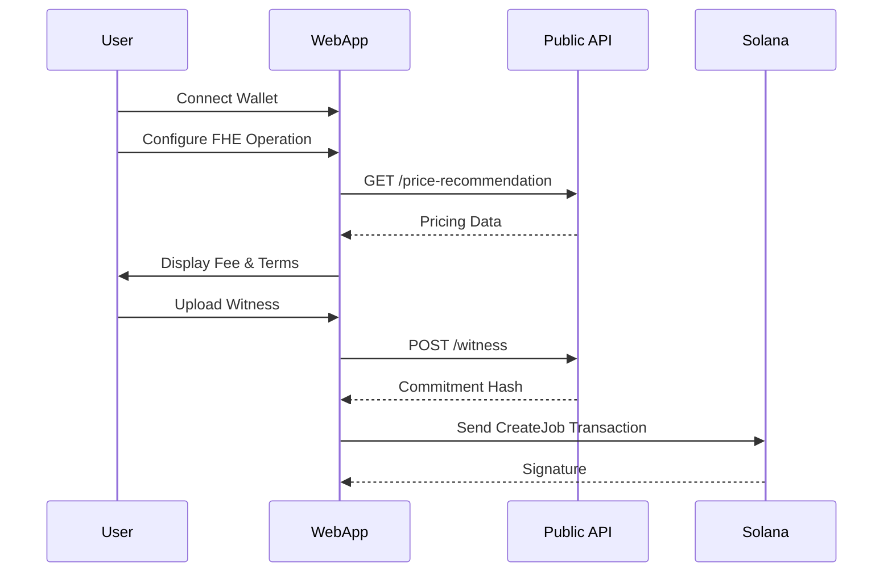

# Web Application Guide

## Overview

The ZyberLink Web Application (`zyb-apps/webapp`) provides a powerful interface for users to interact with the ZYB protocol. It simplifies the process of creating FHE/ZK jobs, managing witnesses, and visualizing computation results.

## Key Features

- **DeFi Dashboard**: View balances and execute private swaps.
- **Privacy Analytics**: Upload datasets and run FHE aggregations.
- **Compliance Tool**: Proof of Innocence (POI) verification wizard.
- **Job Monitor**: Real-time tracking of on-chain computation consensus.

## Technical Stack

- **Framework**: Svelte 4 / Vite
- **State Management**: Svelte Stores
- **Blockchain**: `@solana/web3.js`
- **Styling**: Tailwind CSS + Cyberpunk Design System

## Getting Started

### Development Mode

```bash
cd zyb-apps/webapp
npm install
npm run dev
```

The app will be available at `http://localhost:5173`.

### Configuration

Environment variables used:
- `VITE_API_URL`: URL of the Public API Gateway.
- `VITE_RPC_URL`: Solana RPC endpoint.
- `VITE_PROGRAM_ID`: Marketplace program ID.

## Interaction Flow



---

## Deployment

The webapp is designed to be deployed as a static site (SPA) to platforms like Vercel, Netlify, or Cloudflare Pages.

```bash
npm run build
# Output in zyb-apps/webapp/dist
```
