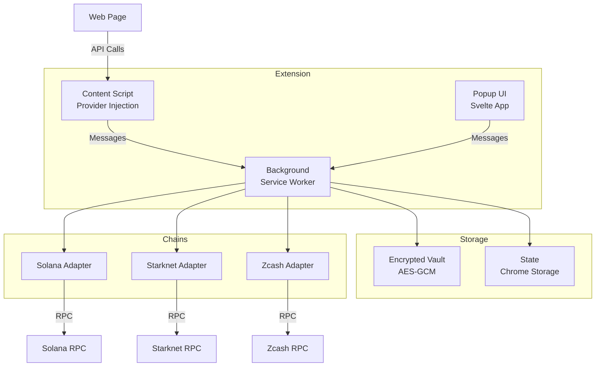
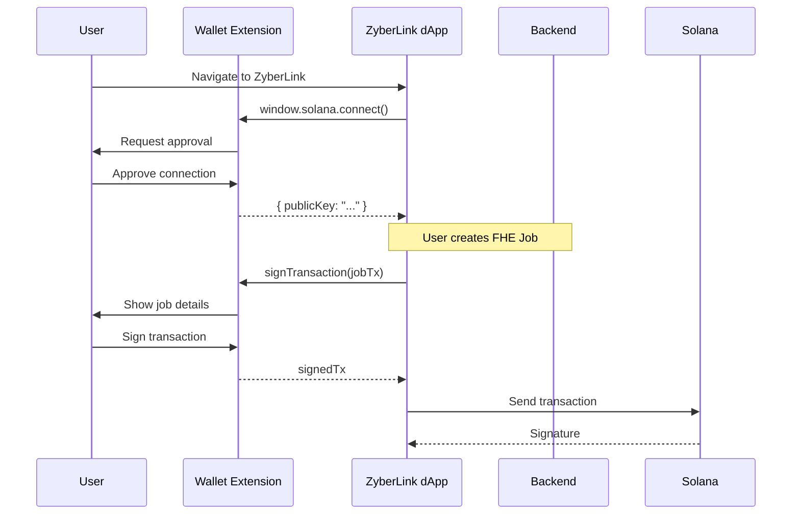

# ZyberLink Wallet Extension

Multi-chain browser extension supporting Solana, Starknet, and Zcash with customizable RPC configuration.

## Features

- **Multi-chain**: Support for Solana, Starknet, and Zcash
- **BIP39/44**: Standard mnemonic-based key derivation
- **Security**: Encrypted vault with AES-GCM
- **Custom RPC**: Configurable endpoints for each network
- **Provider API**: Injection of `window.solana` and `window.starknet`
- **Auto-lock**: Automatic security locking
- **TUI Design**: Minimalist cyberpunk interface

## Technology Stack

- **TypeScript**: Static typing and security
- **Svelte 5**: Modern reactive framework
- **Manifest V3**: Chrome extensions standard
- **Vite + CRXJS**: Optimized build system
- **Web Crypto API**: Native browser cryptography

## Architecture



## Project Structure

```
wallet-extension/
├── manifest.json              # Manifest V3
├── background/
│   └── service-worker.ts     # State and message manager
├── content/
│   └── inject.ts             # Provider injection
├── popup/
│   ├── App.svelte            # Main router
│   └── routes/               # UI views
│       ├── CreateWallet.svelte
│       ├── Unlock.svelte
│       ├── Home.svelte
│       ├── Send.svelte
│       └── Settings.svelte
├── lib/
│   ├── crypto/               # Keyring + encryption
│   │   ├── keyring.ts        # BIP39/44
│   │   └── encryption.ts     # AES-GCM
│   ├── chains/               # Chain adapters
│   │   ├── solana.ts
│   │   ├── starknet.ts
│   │   └── zcash.ts
│   ├── storage/              # Chrome storage wrapper
│   ├── rpc/                  # RPC management
│   └── messaging/            # Message handlers
└── assets/
    └── icons/                # Extension icons
```

## Use Cases

### For End Users

1. **Multi-Chain Asset Management**: Manage SOL, STRK, and ZEC from a single wallet
2. **dApp Interaction**: Connect with web3 applications (including ZyberLink marketplace)
3. **Private Transactions**: Support for Zcash shielded transactions
4. **Custom RPC**: Configure your own endpoints for greater control

### For Developers

1. **Provider API**: Standard integration with `window.solana` and `window.starknet`
2. **Multi-Chain Testing**: Automated E2E tests with Playwright
3. **Extensible**: Modular architecture for adding new chains

## Integration with ZyberLink

The wallet integrates directly with the ZyberLink marketplace:



## Security

### Security Model

- **Encrypted Vault**: All private keys are stored encrypted with AES-GCM
- **PBKDF2**: Key derivation with 100,000 iterations
- **Auto-lock**: Automatic locking after 15 minutes of inactivity
- **Mnemonic**: 12-word BIP39 for backup and recovery
- **Isolation**: Keys never leave the extension

### Best Practices

1. **Seed Phrase**: Store your recovery phrase offline (paper, metal)
2. **Strong Password**: Minimum 8 characters, ideally 16+
3. **Reliable RPC**: Only add endpoints from verified sources
4. **Review Transactions**: Always verify destination and amount before signing
5. **Manual Lock**: Lock the wallet when not in use

## Provider API

### Solana Provider

```javascript
// Connect
const { publicKey } = await window.solana.connect();

// Sign message
const message = new TextEncoder().encode("Hello ZyberLink");
const { signature } = await window.solana.signMessage(message);

// Sign transaction
const signedTx = await window.solana.signTransaction(transaction);

// Sign and send
const { signature } = await window.solana.signAndSendTransaction(transaction);

// Events
window.solana.on('connect', (publicKey) => console.log('Connected:', publicKey));
window.solana.on('disconnect', () => console.log('Disconnected'));
```

### Starknet Provider

```javascript
// Connect
const { publicKey } = await window.starknet.connect();

// Sign message
const signature = await window.starknet.signMessage(messageHash);

// Get address
const address = await window.starknet.getAddress();
```

### ZyberLink Unified API

```javascript
// Unified access to all providers
window.zyberlink.solana   // Solana provider
window.zyberlink.starknet // Starknet provider
window.zyberlink.version  // "0.1.0"
```

## Default RPC Endpoints

### Solana

- **Mainnet**: `https://api.mainnet-beta.solana.com`
- **Devnet**: `https://api.devnet.solana.com`
- **Testnet**: `https://api.testnet.solana.com`

### Starknet

- **Mainnet**: `https://starknet-mainnet.public.blastapi.io`
- **Testnet**: `https://starknet-testnet.public.blastapi.io`

### Zcash

- **Mainnet**: Configurable (requires local node or service)

## Roadmap

### Implemented

- [x] Multi-chain (Solana, Starknet, Zcash)
- [x] BIP39/44 key derivation
- [x] AES-GCM encrypted vault
- [x] Custom RPC endpoints
- [x] Send/Receive transactions
- [x] Provider injection
- [x] E2E testing suite

### Coming Soon

- [ ] Transaction history
- [ ] Token support (SPL, ERC20)
- [ ] NFT support
- [ ] Multi-account support
- [ ] Hardware wallet integration
- [ ] Address book
- [ ] Zcash shielded transactions UI
- [ ] Network health monitoring
- [ ] Export private keys (with warning)

## Additional Documentation

- [Quick Start](quick-start.md) - Installation and first steps
- [Architecture](architecture.md) - Technical system details
- [Local Development](development.md) - Developer guide
- [Testing](testing.md) - E2E test suite
- [Testnets](testnets.md) - Test network configuration
- [Project Structure](project-structure.md) - Detailed explanation of each file

## Support

To report issues or contribute, visit the main ZyberLink repository.

### Debug Logs

1. **Popup logs**: Right-click on the icon → "Inspect popup"
2. **Background logs**: `chrome://extensions` → ZyberLink → "background.html"
3. **Content script logs**: F12 on the web page → Console

## License

Apache-2.0
