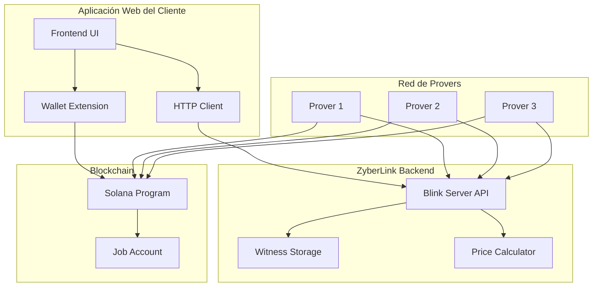

# Integración con Aplicaciones Web

## Descripción General

Este documento describe cómo las aplicaciones web pueden interactuar con ZyberLink para ejecutar computaciones FHE privadas y descentralizadas. La integración actual se basa en la interacción directa con el Blink Server (backend) y la blockchain de Solana.

## Arquitectura de Integración



## Componentes de Integración

### 1. Blink Server API

El Blink Server proporciona los siguientes endpoints REST:

#### Upload de Witness
```http
POST /witness
Content-Type: application/json

{
  "data": "base64_encoded_encrypted_data",
  "server_key": "base64_encoded_server_key"
}

Response:
{
  "commitment": "blake2s256_hash",
  "size": 1024
}
```

#### Recomendación de Precio
```http
POST /api/price-recommendation
Content-Type: application/json

{
  "circuit_type": "FheAdd",
  "witness_size": 1024,
  "expected_provers": 3
}

Response:
{
  "min_price": 0.001,
  "recommended_price": 0.005,
  "max_price": 0.01,
  "slider": {
    "min": 0.001,
    "max": 0.02,
    "step": 0.001
  }
}
```

#### Consulta de Estado de Job
```http
GET /api/jobs/{job_id}

Response:
{
  "job_id": 1,
  "creator": "pubkey",
  "status": "processing",
  "provers": [
    {"pubkey": "...", "result_hash": "..."}
  ],
  "consensus_reached": false
}
```

#### Descarga de Resultado
```http
GET /api/jobs/{job_id}/result

Response:
{
  "result": "base64_encoded_result",
  "proof": "consensus_proof",
  "timestamp": 1234567890
}
```

### 2. Wallet Extension

La wallet extension maneja:
- Conexión con Solana
- Firma de transacciones
- Gestión de claves privadas

Interfaz del proveedor inyectado:
```javascript
// Conectar wallet
const { publicKey } = await window.solana.connect();

// Firmar transacción
const signedTx = await window.solana.signTransaction(transaction);

// Enviar transacción firmada
const signature = await window.solana.signAndSendTransaction(transaction);
```

### 3. Solana Program

El programa on-chain gestiona:
- Creación de jobs
- Registro de provers
- Verificación de consenso
- Distribución de pagos

## Flujo de Integración Completo

### Paso 1: Preparar Datos Encriptados

El cliente debe encriptar sus datos usando TFHE antes de enviarlos:

```rust
// Ejemplo en Rust (usando tfhe-rs)
use tfhe::prelude::*;
use tfhe::{ConfigBuilder, generate_keys, set_server_key, FheUint8};

// Generar llaves
let config = ConfigBuilder::default().build();
let (client_key, server_key) = generate_keys(config);

// Encriptar datos
let clear_data: Vec<u8> = vec![1, 2, 3, 4, 5];
let encrypted_data: Vec<FheUint8> = clear_data
    .iter()
    .map(|&x| FheUint8::encrypt(x, &client_key))
    .collect();

// Serializar para envío
let encrypted_bytes = bincode::serialize(&encrypted_data)?;
let server_key_bytes = bincode::serialize(&server_key)?;
```

### Paso 2: Upload de Witness al Blink Server

```javascript
// Desde la aplicación web
async function uploadWitness(encryptedData, serverKey) {
  const response = await fetch('http://localhost:3000/witness', {
    method: 'POST',
    headers: { 'Content-Type': 'application/json' },
    body: JSON.stringify({
      data: btoa(encryptedData),
      server_key: btoa(serverKey)
    })
  });

  const { commitment, size } = await response.json();
  return { commitment, size };
}
```

### Paso 3: Obtener Recomendación de Precio

```javascript
async function getPriceRecommendation(circuitType, witnessSize, expectedProvers) {
  const response = await fetch('http://localhost:3000/api/price-recommendation', {
    method: 'POST',
    headers: { 'Content-Type': 'application/json' },
    body: JSON.stringify({
      circuit_type: circuitType,
      witness_size: witnessSize,
      expected_provers: expectedProvers
    })
  });

  const pricing = await response.json();
  return pricing;
}
```

### Paso 4: Crear Job On-Chain

```javascript
async function createJob(commitment, pricePerProver, expectedProvers) {
  // Construir transacción (requiere acceso a Solana web3.js)
  const transaction = await buildCreateJobTransaction({
    creator: publicKey,
    jobId: Date.now(),
    circuitType: 'FheAdd',
    witnessCommitment: commitment,
    pricePerProver: pricePerProver * LAMPORTS_PER_SOL,
    expectedProvers: expectedProvers,
    consensusThreshold: Math.ceil(expectedProvers * 0.67) // 2-de-3
  });

  // Firmar y enviar con wallet
  const signature = await window.solana.signAndSendTransaction(transaction);

  return signature;
}
```

### Paso 5: Monitorear Progreso

```javascript
async function monitorJob(jobId) {
  const pollInterval = 5000; // 5 segundos

  return new Promise((resolve, reject) => {
    const interval = setInterval(async () => {
      try {
        const response = await fetch(`http://localhost:3000/api/jobs/${jobId}`);
        const job = await response.json();

        console.log(`Estado: ${job.status}`);
        console.log(`Provers: ${job.provers.length}/${job.expected_provers}`);

        if (job.status === 'completed') {
          clearInterval(interval);
          resolve(job);
        } else if (job.status === 'failed') {
          clearInterval(interval);
          reject(new Error('Job failed'));
        }
      } catch (error) {
        clearInterval(interval);
        reject(error);
      }
    }, pollInterval);
  });
}
```

### Paso 6: Descargar Resultado

```javascript
async function downloadResult(jobId) {
  const response = await fetch(`http://localhost:3000/api/jobs/${jobId}/result`);
  const { result, proof } = await response.json();

  // Decodificar resultado
  const resultBytes = atob(result);

  // Descifrar con client_key (debe hacerse del lado del cliente)
  // const decryptedResult = decryptWithClientKey(resultBytes);

  return resultBytes;
}
```

## Ejemplo Completo de Integración

```javascript
// app.js - Ejemplo completo de flujo de integración

class ZyberLinkClient {
  constructor(apiUrl, walletProvider) {
    this.apiUrl = apiUrl;
    this.wallet = walletProvider;
  }

  async connect() {
    const { publicKey } = await this.wallet.connect();
    this.publicKey = publicKey;
    return publicKey;
  }

  async createFheJob(encryptedData, serverKey, circuitType = 'FheAdd') {
    // 1. Upload witness
    console.log('Uploading witness...');
    const { commitment, size } = await fetch(`${this.apiUrl}/witness`, {
      method: 'POST',
      headers: { 'Content-Type': 'application/json' },
      body: JSON.stringify({
        data: btoa(encryptedData),
        server_key: btoa(serverKey)
      })
    }).then(r => r.json());

    console.log('Witness uploaded:', commitment);

    // 2. Get price recommendation
    console.log('Getting price recommendation...');
    const pricing = await fetch(`${this.apiUrl}/api/price-recommendation`, {
      method: 'POST',
      headers: { 'Content-Type': 'application/json' },
      body: JSON.stringify({
        circuit_type: circuitType,
        witness_size: size,
        expected_provers: 3
      })
    }).then(r => r.json());

    console.log('Recommended price:', pricing.recommended_price);

    // 3. Create job on-chain
    console.log('Creating job on-chain...');
    const jobId = Date.now();
    const transaction = await this.buildCreateJobTx({
      jobId,
      circuitType,
      commitment,
      pricePerProver: pricing.recommended_price,
      expectedProvers: 3,
      consensusThreshold: 2
    });

    const signature = await this.wallet.signAndSendTransaction(transaction);
    console.log('Job created:', signature);

    // 4. Monitor progress
    console.log('Monitoring job...');
    const result = await this.monitorJob(jobId);

    // 5. Download result
    console.log('Downloading result...');
    const finalResult = await fetch(`${this.apiUrl}/api/jobs/${jobId}/result`)
      .then(r => r.json());

    return {
      jobId,
      signature,
      result: finalResult
    };
  }

  async monitorJob(jobId, timeout = 120000) {
    const startTime = Date.now();
    const pollInterval = 5000;

    while (Date.now() - startTime < timeout) {
      const job = await fetch(`${this.apiUrl}/api/jobs/${jobId}`)
        .then(r => r.json());

      if (job.status === 'completed') {
        return job;
      } else if (job.status === 'failed') {
        throw new Error('Job failed');
      }

      await new Promise(resolve => setTimeout(resolve, pollInterval));
    }

    throw new Error('Job timeout');
  }

  buildCreateJobTx(params) {
    // Construir transacción usando @solana/web3.js
    // Ver documentación de SDK para detalles
    throw new Error('Not implemented - use Solana SDK');
  }
}

// Uso
async function main() {
  const client = new ZyberLinkClient(
    'http://localhost:3000',
    window.solana
  );

  await client.connect();

  const result = await client.createFheJob(
    myEncryptedData,
    myServerKey,
    'FheAdd'
  );

  console.log('Job completed:', result);
}
```

## Integración con UI

### Componente React de Ejemplo

```jsx
import { useState } from 'react';

function FheJobCreator() {
  const [status, setStatus] = useState('idle');
  const [jobId, setJobId] = useState(null);

  const handleCreateJob = async () => {
    try {
      setStatus('uploading');

      // Upload witness
      const { commitment } = await uploadWitness(data, serverKey);

      setStatus('creating');

      // Create job
      const signature = await createJob(commitment);
      const jobId = extractJobIdFromSignature(signature);
      setJobId(jobId);

      setStatus('monitoring');

      // Monitor
      const result = await monitorJob(jobId);

      setStatus('completed');
    } catch (error) {
      setStatus('failed');
      console.error(error);
    }
  };

  return (
    <div>
      <button onClick={handleCreateJob} disabled={status !== 'idle'}>
        Create FHE Job
      </button>
      <div>Status: {status}</div>
      {jobId && <div>Job ID: {jobId}</div>}
    </div>
  );
}
```

## Consideraciones de Seguridad

### 1. Encriptación del Lado del Cliente
Los datos sensibles DEBEN ser encriptados en el cliente antes de enviarlos al backend.

### 2. Verificación de Resultados
Los clientes deben verificar que los hashes de resultados coincidan con los commitments on-chain.

### 3. Consenso Multi-Prover
Siempre configure un consenso threshold >= 2 para evitar resultados maliciosos de un solo prover.

### 4. Gestión de Claves
Las client keys nunca deben salir del dispositivo del usuario. Solo las server keys se envían al backend.

## Limitaciones Actuales

- No hay SDK de JavaScript: la integración requiere llamadas HTTP directas y construcción manual de transacciones Solana
- El resultado descargado está encriptado: el cliente debe descifrarlo localmente con su client_key
- No hay sistema de eventos en tiempo real: se requiere polling para monitorear el progreso
- Las transacciones Solana deben construirse manualmente usando @solana/web3.js

## Recursos Adicionales

- [Flujo FHE E2E](flujo-fhe-e2e.md) - Flujo completo del sistema
- [Referencia de API](../guias/referencia-api.md) - Endpoints del backend
- [Wallet Extension](../wallet-extension/README.md) - Documentación de la wallet
- [Integración SDK](../guias/integracion-sdk.md) - SDK en Rust (para aplicaciones backend)
