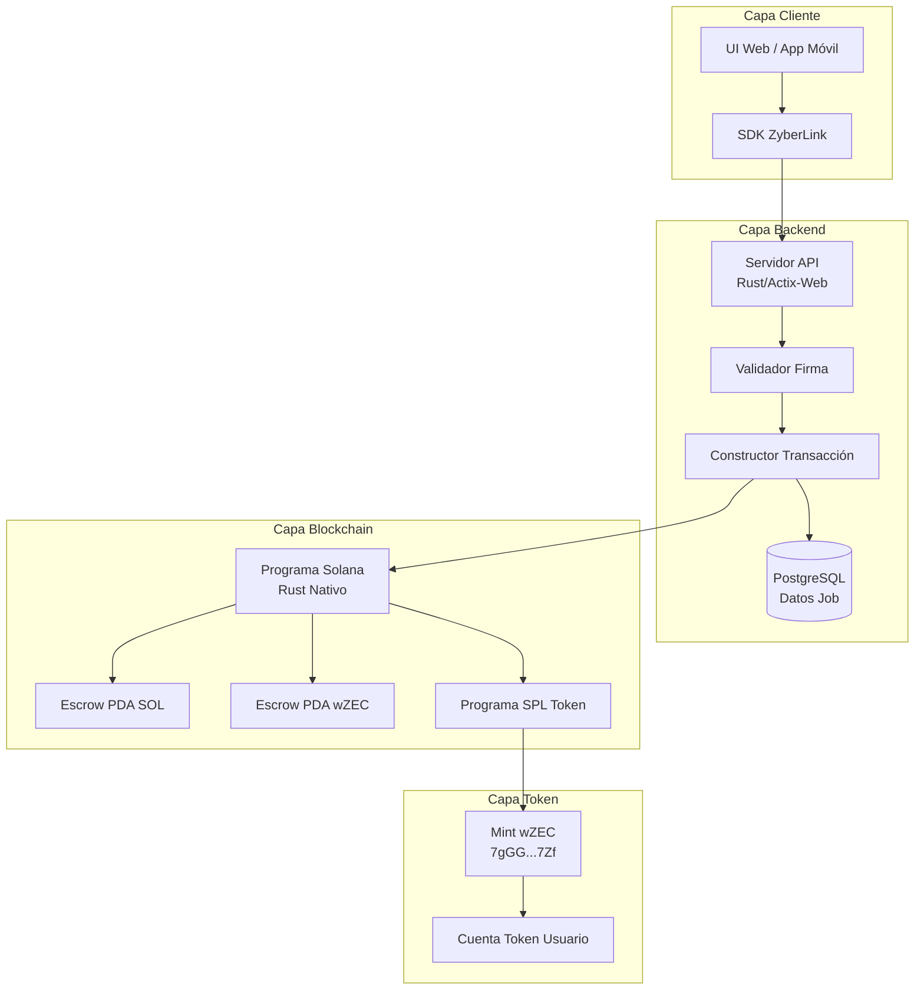
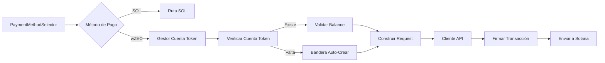
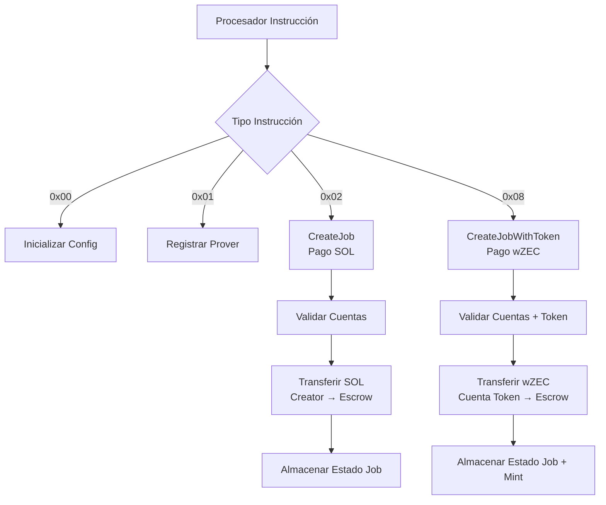
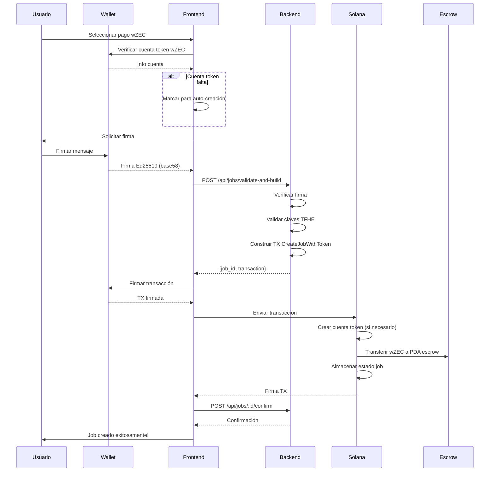
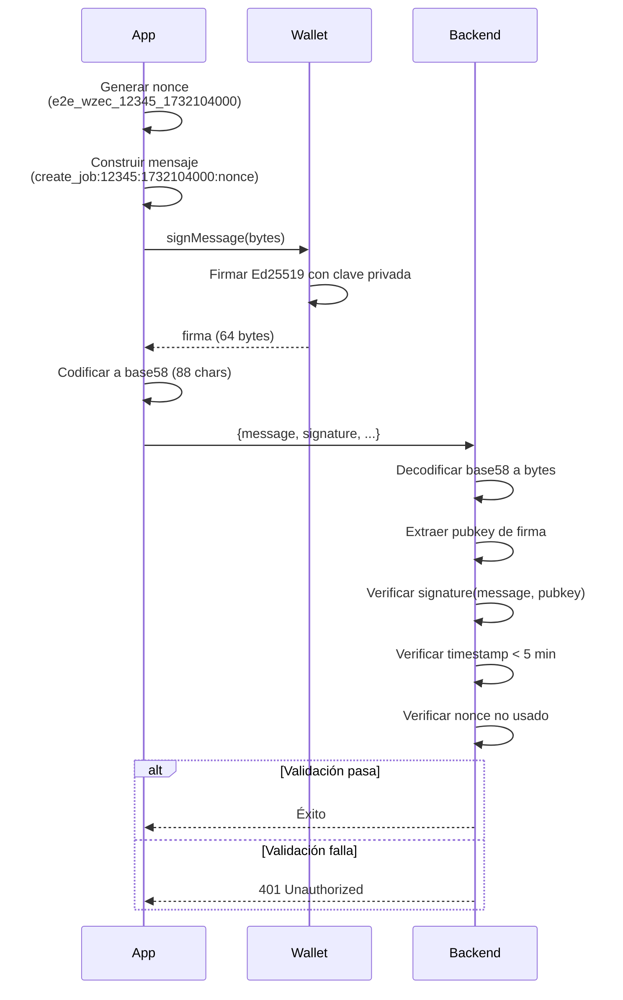
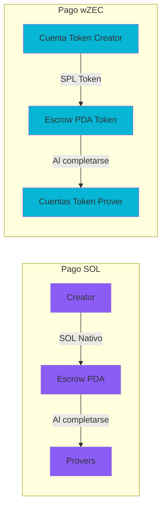
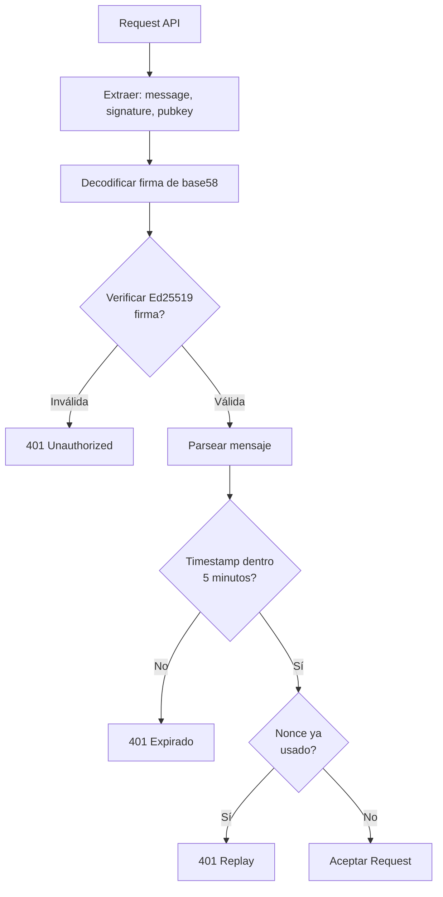
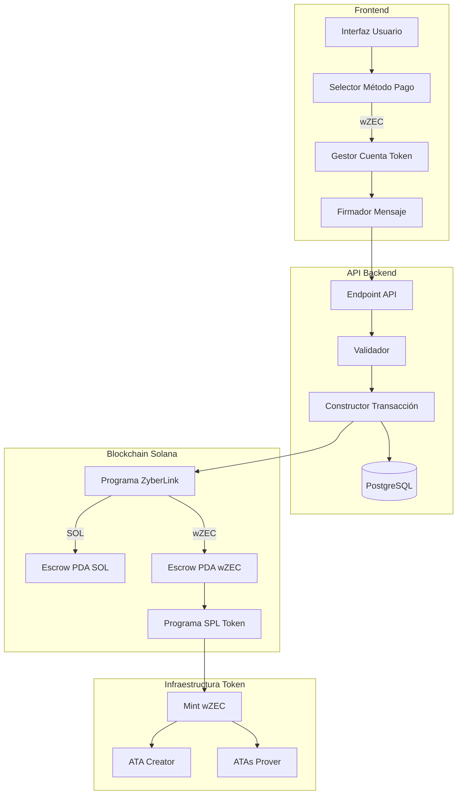

# Arquitectura de Pagos wZEC

Documentación de arquitectura técnica para la integración de pagos wZEC (Wrapped Zcash) en el marketplace ZyberLink.

## Tabla de Contenidos

- [Resumen del Sistema](#resumen-del-sistema)
- [Arquitectura de Componentes](#arquitectura-de-componentes)
- [Flujo de Datos](#flujo-de-datos)
- [Comparación Métodos de Pago](#comparación-métodos-de-pago)
- [Estructura de Transacción](#estructura-de-transacción)
- [Modelo de Seguridad](#modelo-de-seguridad)
- [Consideraciones de Rendimiento](#consideraciones-de-rendimiento)
- [Mejoras Futuras](#mejoras-futuras)

## Resumen del Sistema

### Arquitectura de Alto Nivel



### Principios de Diseño Clave

1. **Compatibilidad hacia Atrás**: Los pagos SOL continúan funcionando sin cambios
2. **Manejo Automático**: Cuentas de tokens creadas automáticamente si faltan
3. **Seguridad de Tipos**: El sistema de tipos de Rust previene confusión de métodos de pago
4. **Seguridad de Firmas**: Firmas Ed25519 con protección contra replay
5. **Soporte TFHE**: Maneja ServerKeys de 156 MB eficientemente

## Arquitectura de Componentes

### Componentes Frontend



**PaymentMethodSelector.svelte:**
- UI de botones de radio para SOL vs wZEC
- Indicadores visuales y tooltips
- Cumple con accesibilidad (WCAG AA)
- Diseño responsivo

**TokenAccountManager:**
- Verifica Associated Token Account de wZEC
- Valida balance antes de transacción
- Marca cuentas faltantes para auto-creación
- Manejo de errores para casos edge

### Arquitectura Backend

```mermaid
graph TB
    API[POST /api/jobs/validate-and-build]
    API --> Parse[Parsear y Validar Request]
    Parse --> SigVerify[Verificar Firma Ed25519]
    SigVerify --> NonceCheck[Verificar Unicidad Nonce]
    NonceCheck --> PaymentRoute{Método de Pago?}

    PaymentRoute -->|SOL| SOL_Build[Construir Transacción SOL<br/>5 cuentas]
    PaymentRoute -->|wZEC| WZEC_Build[Construir Transacción wZEC<br/>9 cuentas]

    SOL_Build --> SOL_Ix[Instrucción CreateJob]
    WZEC_Build --> WZEC_Ix[Instrucción CreateJobWithToken]

    SOL_Ix --> Serialize[Serializar Transacción]
    WZEC_Ix --> Serialize

    Serialize --> Store[Almacenar en PostgreSQL]
    Store --> Response[Devolver {job_id, transaction}]
```

**Archivos Backend Clave:**

```
blink-server/
├── src/
│   ├── api_handlers.rs          # Manejadores endpoint HTTP
│   ├── validators.rs            # Validación firma e input
│   ├── tx_builder.rs            # Construcción transacción
│   ├── db/
│   │   ├── models.rs            # Modelos base de datos
│   │   └── queries.rs           # Consultas SQL
│   └── main.rs                  # Punto entrada servidor
└── migrations/
    └── 20250120000007_add_wzec_payment_support.sql
```

### Estructura Programa On-Chain



**Archivos Programa:**

```
programs/cypherlink/
├── src/
│   ├── processor/
│   │   ├── mod.rs                        # Procesador principal
│   │   ├── create_job.rs                 # Pago SOL (existente)
│   │   └── create_job_with_token.rs      # Pago wZEC (NUEVO)
│   ├── instruction.rs                    # Enum instrucción
│   └── lib.rs                            # Entrypoint programa
```

## Flujo de Datos

### Flujo Pago wZEC



### Flujo Firma de Mensaje



## Comparación Métodos de Pago

### SOL vs wZEC



### Diferencias Técnicas

| Aspecto | Pago SOL | Pago wZEC |
|---------|----------|-----------|
| **Instrucción** | CreateJob (0x02) | CreateJobWithToken (0x08) |
| **Cuentas** | 5 | 9 |
| **Cuenta Token** | No requerida | Requerida (auto-creada) |
| **Tipo Escrow** | SOL PDA | SPL Token PDA |
| **Programa Transferencia** | System Program | SPL Token Program |
| **Unidad Precio** | Lamports | Zatoshis |
| **Dirección Mint** | N/A | 7gGG...7Zf |

### Estructuras de Cuentas

**Pago SOL (5 cuentas):**
```rust
pub struct CreateJobAccounts<'a> {
    pub creator: &'a AccountInfo<'a>,        // Firmante
    pub job: &'a AccountInfo<'a>,            // PDA (escribible)
    pub config: &'a AccountInfo<'a>,         // PDA (solo lectura)
    pub escrow: &'a AccountInfo<'a>,         // PDA (escribible)
    pub system_program: &'a AccountInfo<'a>, // Programa
}
```

**Pago wZEC (9 cuentas):**
```rust
pub struct CreateJobWithTokenAccounts<'a> {
    pub creator: &'a AccountInfo<'a>,              // Firmante
    pub job: &'a AccountInfo<'a>,                  // PDA (escribible)
    pub config: &'a AccountInfo<'a>,               // PDA (escribible)
    pub token_escrow: &'a AccountInfo<'a>,         // PDA (escribible)
    pub creator_token_account: &'a AccountInfo<'a>, // ATA (escribible)
    pub token_mint: &'a AccountInfo<'a>,           // Mint (solo lectura)
    pub system_program: &'a AccountInfo<'a>,       // Programa
    pub token_program: &'a AccountInfo<'a>,        // Programa
    pub rent: &'a AccountInfo<'a>,                 // Sysvar
}
```

## Estructura de Transacción

### Anatomía Transacción wZEC

```
Transaction {
  signatures: [null],  // Sin firmar, llenado por wallet
  message: {
    header: {
      num_required_signatures: 1,
      num_readonly_signed_accounts: 0,
      num_readonly_unsigned_accounts: 4
    },
    account_keys: [
      creator_pubkey,           // Firmante
      job_pda,                  // Escribible
      config_pda,               // Escribible
      token_escrow_pda,         // Escribible
      creator_token_account,    // Escribible
      wzec_mint,                // Solo lectura
      system_program,           // Solo lectura
      token_program,            // Solo lectura
      rent_sysvar              // Solo lectura
    ],
    recent_blockhash: "...",
    instructions: [
      {
        program_id_index: 7,  // Token Program
        accounts: [...],      // Índices cuentas
        data: [0x08, ...]     // Datos CreateJobWithToken
      }
    ]
  }
}
```

### Derivación PDA

```rust
// Job PDA
let (job_pda, job_bump) = Pubkey::find_program_address(
    &[
        b"job",
        creator.as_ref(),
        &job_id.to_le_bytes()
    ],
    &program_id
);

// Escrow PDA SOL
let (sol_escrow_pda, escrow_bump) = Pubkey::find_program_address(
    &[
        b"escrow",
        job_pda.as_ref()
    ],
    &program_id
);

// Escrow PDA Token
let (token_escrow_pda, token_bump) = Pubkey::find_program_address(
    &[
        b"token_escrow",
        job_pda.as_ref(),
        token_mint.as_ref()
    ],
    &program_id
);

// Associated Token Account (ATA)
let ata = spl_associated_token_account::get_associated_token_address(
    &creator,
    &wzec_mint
);
```

## Modelo de Seguridad

### Autenticación



### Formato de Firma (CRÍTICO)

**Formato Correcto (base58):**
```javascript
const signature = bs58.encode(signatureBytes);
// Salida: "5J7XqG3K8H9L..." (88 chars)
```

**Formato Incorrecto (base64):**
```javascript
const signature = Buffer.from(signatureBytes).toString('base64');
// Salida: "BQYHCAkKCw..." (¡incorrecto!)
```

### Protección Anti-Replay

```rust
// Verificar timestamp
let current_time = SystemTime::now().duration_since(UNIX_EPOCH)?.as_secs();
let request_time = parse_timestamp_from_message(&message)?;

if current_time - request_time > 300 {  // 5 minutos
    return Err("Timestamp expirado");
}

// Verificar unicidad nonce
if db.nonce_exists(&nonce).await? {
    return Err("Nonce ya usado");
}

// Almacenar nonce
db.store_nonce(&nonce).await?;
```

### Seguridad Cuenta Token

**Seguridad Creación Automática:**
```rust
// Verificar que creator tiene suficiente SOL para rent
let creator_balance = rpc_client.get_balance(&creator)?;
let rent_exempt_balance = rent.minimum_balance(TOKEN_ACCOUNT_SIZE);

if creator_balance < rent_exempt_balance {
    return Err("SOL insuficiente para rent cuenta token");
}

// Crear instrucción ATA (idempotente)
let create_ata_ix = create_associated_token_account_idempotent(
    &creator,  // pagador
    &creator,  // propietario
    &token_mint
);
```

## Consideraciones de Rendimiento

### Tamaños de Payload

```
Componentes Request:
├── Overhead JSON:       ~500 bytes
├── encrypted_data:      ~1 MB (1,048,576 bytes max)
├── server_key:          ~156 MB (ServerKey TFHE típica)
├── Otros campos:        ~300 bytes
└── Total:               ~157 MB

Response:
├── Overhead JSON:       ~100 bytes
├── transaction:         ~1-2 KB (TX serializada)
└── Total:               ~2 KB
```

### Optimización de Red

```rust
// Backend: Stream payloads grandes
#[post("/api/jobs/validate-and-build")]
async fn create_job(
    payload: web::Payload,
    max_size: web::Data<MaxSize>
) -> Result<HttpResponse> {
    // Stream payload en lugar de cargar en memoria
    let body = payload
        .limit(max_size.0)  // Límite 200 MB
        .fold(BytesMut::new(), |mut acc, chunk| {
            acc.extend_from_slice(&chunk?);
            Ok::<_, PayloadError>(acc)
        })
        .await?;

    // Procesar...
}
```

### Indexación Base de Datos

```sql
-- Optimizar búsquedas
CREATE INDEX idx_temp_job_data_payment_method
ON temp_job_data(payment_method);

CREATE INDEX idx_temp_job_data_nonce
ON temp_job_data(nonce);

CREATE INDEX idx_temp_job_data_creator_timestamp
ON temp_job_data(creator_pubkey, created_at DESC);
```

### Análisis Costo Transacción

```
Pago SOL:
├── Comisión transacción:    ~0.0005 SOL
├── Rent escrow:             ~0.002 SOL (reembolsable)
└── Total inicial:           ~0.0025 SOL

Pago wZEC:
├── Comisión transacción:    ~0.001 SOL (más cuentas)
├── Rent escrow token:       ~0.002 SOL (reembolsable)
├── Rent ATA (si nuevo):     ~0.002 SOL (una vez)
└── Total inicial:           ~0.005 SOL (peor caso)
```

## Mejoras Futuras

### Fase 1: Estado Actual

- [x] Soporte pago dual (SOL/wZEC)
- [x] Creación automática cuenta token
- [x] Formato firma base58
- [x] Soporte ServerKey TFHE 156 MB
- [x] Cobertura test E2E

### Fase 2: Optimización (Q1 2025)

- [ ] Soporte transacción batch
- [ ] UI pre-creación cuenta token
- [ ] Caching firma
- [ ] Actualizaciones tiempo real WebSocket
- [ ] API GraphQL

### Fase 3: Características Avanzadas (Q2 2025)

- [ ] Soporte pago multi-token
- [ ] Pagos parciales / cuotas
- [ ] Staking wZEC para provers
- [ ] Bridges cross-chain (ZEC ↔ wZEC)
- [ ] Integración pago protegido

### Fase 4: Mejoras Privacidad (Q3 2025)

- [ ] Integración pool protegido Zcash
- [ ] Montos transacción privados
- [ ] Pruebas pago zero-knowledge
- [ ] Pricing job confidencial
- [ ] Selección prover anónima

## Diagrama: Flujo Sistema Completo



## Documentación Relacionada

- **[Guía de Usuario](../guias/wzec-guia-usuario.md)** - Documentación usuario final
- **[Guía de Desarrollador](../guias/wzec-guia-desarrollador.md)** - Guía integración
- **[Referencia API](../guias/wzec-referencia-api.md)** - Docs API completa
- **[Guía de Testing](../guias/wzec-guia-testing.md)** - Procedimientos testing

---

**Última Actualización**: 2025-11-21
**Versión Arquitectura**: 1.0.0
**Mint wZEC**: `7gGGpHxbEuY8i76PwxjgGB1ZX2Nhmfq65N6YNHtrv7Zf`
