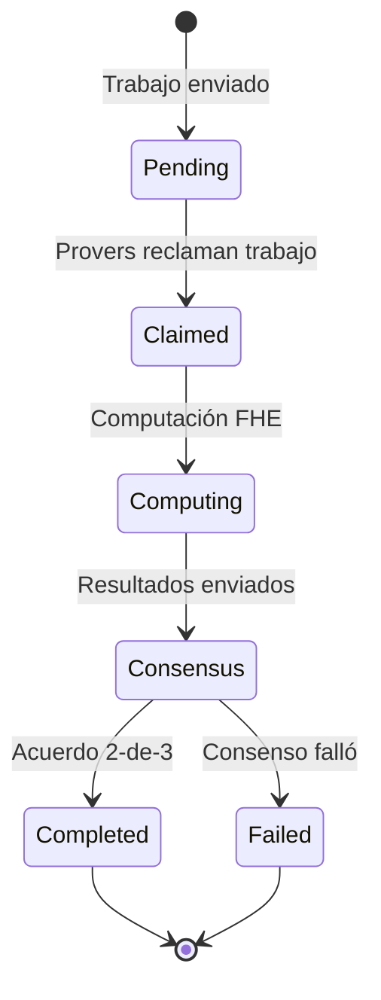

# Guía de Analytics Privado

Realiza computaciones estadísticas que preservan privacidad sobre datos encriptados usando las capacidades de analytics FHE de ZyberLink.

## Descripción General

Analytics Privado te permite computar estadísticas sobre datasets encriptados sin revelar puntos de datos individuales. ZyberLink soporta múltiples operaciones de agregación que se ejecutan sobre datos encriptados a través de Encriptación Totalmente Homomórfica (FHE).

**Garantía de Privacidad:** Tus datos raw nunca salen de tu máquina sin encriptar. Los provers computan sobre texto cifrado y retornan resultados encriptados que solo tú puedes desencriptar.

### Operaciones Soportadas

| Operación | Descripción | Caso de Uso |
|-----------|-------------|-------------|
| **Sum** | Total de valores encriptados | Agregación de ingresos, totales de censo |
| **Average** | Promedio de valores encriptados | Demografía, estadísticas salariales |
| **CountIf** | Cuenta valores que coinciden con predicado | Análisis de encuestas, verificaciones de cumplimiento |
| **Histogram** | Distribución a través de bins | Grupos de edad, rangos de ingresos |

## Requisitos Previos

Antes de comenzar, asegúrate de tener:

- **Wallet de Solana** con SOL para fees de transacción (0.01-0.1 SOL)
- **Datos encriptados** preparados usando el [Zyb CLI (FHE)](fhe-cli.md)
- **Conexión a Internet** para acceder a la plataforma ZyberLink
- **Navegador moderno** (Chrome, Firefox, Safari, Edge)

### Preparación de Datos

Tus datos deben estar encriptados antes de la sumisión. Ve la [Guía del Zyb CLI (FHE)](fhe-cli.md) para los pasos de encriptación.

**Formato de entrada:** Array de valores encriptados (FheUint8 o FheUint16)
**Formato de salida:** Resultado encriptado + metadata (desencriptable con tu clave de cliente)

## Guía Paso a Paso

### Paso 1: Encripta Tus Datos

Usa el FHE CLI para encriptar tu dataset:

```bash
cd src/zyb-cli
cargo run --release --bin zyb fhe encrypt --values 10,20,30,40,50
```

Esto genera:
- **witness.bin** - Datos encriptados + server key (subir a la plataforma)
- **client_key.bin** - Clave secreta de desencriptación (¡mantener privada!)

**Nota de Seguridad:** Nunca compartas tu clave de cliente. Guárdala de manera segura offline.

### Paso 2: Accede a la Interfaz de Analytics

Navega a la plataforma ZyberLink:

**Demo en Vivo:** https://demo.zyberlink.fun
**Desarrollo Local:** http://localhost:5173/analytics

1. Haz clic en **"Private Analytics"** en el menú de navegación
2. Conecta tu wallet de Solana
3. Asegura un balance SOL suficiente (revisa la esquina superior derecha)

### Paso 3: Sube el Witness Encriptado

1. Haz clic en el botón **"Upload Witness File"**
2. Selecciona el archivo `witness.bin` del Paso 1
3. Espera la confirmación de subida del archivo
4. La plataforma mostrará el tamaño del witness y el hash de compromiso

**Notas de Subida:**
- Archivos witness grandes (50-100MB) pueden tomar 10-30 segundos
- No cierres el navegador durante la subida
- La server key está incluida en witness.bin

### Paso 4: Elige la Operación

Selecciona la operación estadística a realizar:

#### Sum - Total de Valores

**Mejor para:** Totales de ingresos, agregación de censo, conteo de votos

**Ejemplo:**
```
Entrada: [10, 20, 30, 40, 50] (encriptado)
Salida: 150 (encriptado)
```

**Caso de Uso:** Calcula donaciones totales sin revelar montos individuales.

#### Average - Valor Promedio

**Mejor para:** Estadísticas salariales, demografía de edad, promedios de encuestas

**Ejemplo:**
```
Entrada: [25, 30, 35, 40, 45] (encriptado)
Salida: (175, 5) → 35 (suma encriptada + conteo)
```

**Caso de Uso:** Computa salario promedio de empleados sin exponer salarios individuales.

#### CountIf - Conteo Condicional

**Mejor para:** Análisis de encuestas, verificación de cumplimiento, verificaciones de umbral

**Predicados:**
- `Equals(value)` - Cuenta coincidencias exactas
- `GreaterThan(value)` - Cuenta por encima del umbral
- `LessThan(value)` - Cuenta por debajo del umbral
- `Between(min, max)` - Cuenta dentro del rango

**Ejemplo:**
```
Entrada: [15, 25, 35, 45] (encriptado)
Predicado: GreaterThan(18)
Salida: 3 (encriptado)
```

**Caso de Uso:** Cuenta usuarios mayores de 18 años sin revelar edades exactas.

#### Histogram - Análisis de Distribución

**Mejor para:** Grupos de edad, rangos de ingresos, distribuciones basadas en tiempo

**Ejemplo:**
```
Entrada: [5, 15, 25, 35, 45] (encriptado)
Bins: [0-18, 19-35, 36-65, 66+]
Salida: [1, 2, 2, 0] (conteos encriptados por bin)
```

**Caso de Uso:** Genera reporte de distribución de edad sin exponer edades individuales.

### Paso 5: Configura el Precio

La plataforma usa precios dinámicos basados en complejidad computacional:

1. **Ver Precio Recomendado** - Auto-calculado basado en la operación
2. **Ajustar Precio** (opcional) - Usa el slider para establecer precio personalizado
3. **Revisar Desglose:**
   - Costo base del trabajo
   - Fee de plataforma (1%)
   - Costo total en SOL

**Factores de Precios:**
- Complejidad de operación (Sum < Average < CountIf < Histogram)
- Tamaño del dataset (más valores = mayor costo)
- Demanda actual de la red

**Recomendación:** Usa el precio recomendado para mejores resultados. Precios más bajos pueden retrasar la finalización del trabajo.

### Paso 6: Envía el Trabajo

1. Revisa la configuración del trabajo:
   - Tipo de operación
   - Tamaño del witness
   - Precio (en SOL)
   - Provers requeridos (por defecto: 3)
   - Umbral de consenso (por defecto: 2-de-3)

2. Haz clic en **"Submit Analytics Job"**

3. Aprueba la transacción en el popup de la wallet

4. Espera la confirmación de blockchain (5-10 segundos)

**Detalles de la Transacción:**
- Crea cuenta de trabajo on-chain
- Bloquea pago en escrow
- Notifica a la red de provers

### Paso 7: Monitorea el Progreso

La interfaz muestra el estado del trabajo en tiempo real:

#### Etapas de Estado



**Línea de Tiempo Típica:**
- **Pending:** 5-30 segundos (esperando provers)
- **Claimed:** Instantáneo (provers descargan witness)
- **Computing:** 10-60 segundos (computación FHE)
- **Consensus:** 5-10 segundos (verificación on-chain)
- **Total:** ~30-120 segundos

#### Indicadores de Estado

- **Pending** (🟡) - Esperando que los provers reclamen
- **Claimed** (🔵) - Provers han aceptado el trabajo
- **Computing** (🔵) - Computación FHE en progreso
- **Completed** (🟢) - Trabajo exitoso, resultado disponible
- **Failed** (🔴) - Consenso falló, reembolso completo emitido

### Paso 8: Descarga el Resultado

Una vez que el estado muestre **Completed**:

1. Haz clic en el botón **"Download Result"**
2. Guarda el archivo de resultado encriptado (ej., `result.bin`)
3. Ve la transacción en Solana Explorer (haz clic en la firma TX)

**Contenidos del Resultado:**
- Salida de computación FHE encriptada
- Metadata de consenso
- Timestamp de finalización del trabajo

### Paso 9: Desencripta el Resultado

Usa el FHE CLI para desencriptar el resultado:

```bash
cd src/zyb-cli
cargo run --release --bin zyb fhe decrypt \
  --result-path ./result.bin \
  --client-key-path ./fhe-output/client_key.bin
```

**Salida:**
```
🔓 Desencriptando resultado...
✅ Resultado: 150

Operación: Sum
Conteo de Entrada: 5 valores
Tiempo de Computación: 45s
Provers: 3/3 consenso
```

## Ejemplo de Flujo de Trabajo Completo

### Escenario: Análisis de Donaciones Privadas

**Objetivo:** Calcular donaciones totales sin revelar montos individuales.

**Dataset:** 5 donaciones anónimas (simuladas)

#### 1. Encriptar Montos de Donaciones

```bash
# Navega al FHE CLI
cd src/zyb-cli

# Encripta valores de donaciones (en dólares)
cargo run --release --bin zyb fhe encrypt \
  --values 100,250,75,500,125

# Salida:
# ✅ 5 valores encriptados
# 📁 witness.bin (52.4 MB)
# 🔑 client_key.bin (guardado en fhe-output/)
```

#### 2. Envía a la Plataforma

```
1. Abre https://demo.zyberlink.fun/analytics
2. Conecta wallet (ej., Phantom)
3. Sube witness.bin
4. Selecciona operación: "SUM"
5. Usa precio recomendado: 0.0054 SOL
6. Haz clic en "Submit Analytics Job"
7. Aprueba la transacción en la wallet
```

#### 3. Espera la Finalización

```
Actualizaciones de estado:
[00:05] Pending - Esperando provers...
[00:15] Claimed - 3 provers reclamaron el trabajo
[00:20] Computing - Provers trabajando en datos encriptados...
[01:05] Completed - ¡Consenso alcanzado! ✅

Transacción: 5k7Xh9...abc123
```

#### 4. Desencripta el Resultado

```bash
# Descarga result.bin de la plataforma
# Desencripta con la clave de cliente
cargo run --release --bin zyb fhe decrypt \
  --result-path ~/Downloads/result.bin \
  --client-key-path ./fhe-output/client_key.bin

# Salida:
# 🎯 Resultado Desencriptado: 1050
#
# ✅ Donaciones totales: $1,050
# (¡Los montos individuales permanecen privados!)
```

## Uso Avanzado

### Trabajos de Analytics por Lotes

Envía múltiples trabajos en secuencia:

```bash
# Encripta múltiples datasets
zyb fhe encrypt --values 10,20,30 --output dataset1.bin
zyb fhe encrypt --values 40,50,60 --output dataset2.bin
zyb fhe encrypt --values 70,80,90 --output dataset3.bin

# Envía cada dataset para diferentes operaciones:
# 1. Dataset1 → Sum
# 2. Dataset2 → Average
# 3. Dataset3 → Histogram
```

### Estrategia de Precios Personalizada

Ajusta el precio basado en urgencia:

- **Baja Prioridad** (lento, barato): -30% del recomendado
- **Normal** (balanceado): Usa precio recomendado
- **Alta Prioridad** (rápido, costoso): +50% del recomendado

Precios más altos atraen provers más rápido pero cuestan más SOL.

### Histogramas con Bins Personalizados

Configura distribución de grupos de edad:

```javascript
// Plataforma: Selecciona "Histogram"
// Define bins:
Bins: [
  { min: 0, max: 18, label: "Menores" },
  { min: 19, max: 35, label: "Adultos Jóvenes" },
  { min: 36, max: 65, label: "Adultos" },
  { min: 66, max: 255, label: "Adultos Mayores" }
]

// Entrada: edades encriptadas [15, 25, 45, 70, 30]
// Salida: [1, 2, 1, 1] (conteos encriptados)
```

## Solución de Problemas

### La Subida del Witness Falla

**Síntoma:** La subida se detiene al 50-100% o muestra error

**Soluciones:**
1. Verifica el tamaño del archivo (debería ser ~50-100MB para witness estándar)
2. Verifica la conectividad de red
3. Intenta subir desde diferente navegador/red
4. Asegura que el archivo no esté corrupto (re-encripta si es necesario)

```bash
# Verifica archivo witness
ls -lh witness.bin
# Debería mostrar tamaño de archivo ~50-100MB

# Re-encripta si está corrupto
cargo run --release --bin zyb fhe encrypt --values 10,20,30
```

### El Trabajo Permanece en Estado "Pending"

**Síntoma:** Trabajo no reclamado por provers después de 60+ segundos

**Causas:**
- Precio demasiado bajo (provers rechazando trabajo no rentable)
- No hay provers activos en la red
- Backend de witness no disponible

**Soluciones:**
1. Cancela el trabajo y reenvía con precio más alto (+50%)
2. Verifica estado de la red: https://status.zyberlink.fun
3. Contacta soporte si se sospecha problema de red

### Consenso Falló

**Síntoma:** El trabajo se completa pero muestra estado "Failed"

**Causa:** Los provers no estuvieron de acuerdo en el resultado (< 2-de-3 consenso)

**Qué Sucede:**
- Reembolso completo emitido automáticamente
- No hay datos filtrados (computación sobre datos encriptados)

**Soluciones:**
1. Reenvía el trabajo con el mismo witness (fallos transitorios raros)
2. Si persiste, regenera el witness (puede estar corrupto)
3. Reporta bug si es reproducible

### La Desencriptación Falla

**Síntoma:** `zyb fhe decrypt` muestra error o resultado incorrecto

**Causas:**
- Clave de cliente incorrecta (no coincide con el witness)
- Archivo de resultado corrupto
- Archivo de resultado de diferente trabajo

**Soluciones:**
```bash
# Verifica que estás usando la clave de cliente correcta
ls fhe-output/
# Debería mostrar client_key.bin con timestamp coincidente

# Verifica tamaño del archivo de resultado
ls -lh result.bin
# Debería ser 256-1024 bytes

# Re-descarga resultado de la plataforma si está corrupto
```

### La Transacción Falla

**Síntoma:** La wallet rechaza la transacción o muestra error

**Errores Comunes:**

**"Insufficient SOL balance"**
```
Solución: Agrega más SOL a la wallet
Mínimo: 0.01 SOL para fees + precio del trabajo
```

**"Simulation failed"**
```
Solución:
1. Refresca la página
2. Reconecta la wallet
3. Asegura que la wallet esté en la red correcta (devnet/mainnet)
```

**"Blockhash not found"**
```
Solución: Transacción expiró, reintentar inmediatamente
```

## Mejores Prácticas de Seguridad

### Protegiendo Tus Datos

1. **Nunca compartas client_key.bin** - Cualquiera con esto puede desencriptar tus resultados
2. **Verifica HTTPS** - Asegura que el navegador muestre icono de candado al usar la plataforma
3. **Respalda las claves de cliente** - Guarda de manera segura offline (USB drive, backup encriptado)
4. **Usa wallets desechables** - Crea wallet separada para ZyberLink (limita exposición)

### Seguridad Operacional

```bash
# Almacenamiento seguro de clave de cliente
chmod 600 fhe-output/client_key.bin
mv fhe-output/client_key.bin ~/secure-backup/

# Encripta backups
gpg --symmetric --cipher-algo AES256 client_key.bin

# Verifica integridad del witness
sha256sum witness.bin > witness.sha256
```

### Qué Pueden Ver los Provers

Los provers tienen acceso a:
- ✅ Datos encriptados (texto cifrado - parece bytes aleatorios)
- ✅ Server key (habilita computación sobre texto cifrado)
- ❌ Valores raw (nunca expuestos)
- ❌ Clave de desencriptación (tú la guardas)
- ❌ Texto plano del resultado final (solo resultado encriptado)

**Garantía:** FHE asegura que los provers computen sobre datos encriptados sin aprender nada sobre los valores.

## Características de Rendimiento

### Complejidad de Operación

| Operación | Tamaño del Dataset | Tiempo de Computación | Costo (SOL) |
|-----------|-------------------|----------------------|-------------|
| Sum | 10 valores | 15-30s | 0.003-0.01 |
| Sum | 100 valores | 30-60s | 0.01-0.03 |
| Average | 10 valores | 20-40s | 0.01-0.05 |
| Average | 100 valores | 60-120s | 0.05-0.1 |
| CountIf | 10 valores | 30-60s | 0.05-0.1 |
| CountIf | 100 valores | 90-180s | 0.1-0.2 |
| Histogram | 10 valores, 4 bins | 60-120s | 0.2+ |

*Tiempos y costos son aproximados y varían con las condiciones de la red.*

### Consejos de Optimización

**Reducir costos:**
- Agrupa operaciones similares juntas
- Usa operaciones más simples cuando sea posible (Sum vs Histogram)
- Envía durante períodos de baja demanda

**Acelerar la computación:**
- Incrementa el precio (atrae provers más rápido)
- Reduce el tamaño del dataset si es posible
- Usa Sum en lugar de Average cuando el conteo es conocido

## Próximos Pasos

Ahora que entiendes Analytics Privado:

- **[Guía de Proof of Innocence](proof-of-innocence.md)** - Verifica cumplimiento sin exponer datos
- **[Guía del Zyb CLI (FHE)](fhe-cli.md)** - Domina flujos de trabajo de encriptación y desencriptación
- **[Guía de Configuración de Prover](configuracion-prover.md)** - Ejecuta tu propio nodo prover
- **[Integración del SDK](integracion-sdk.md)** - Construye analytics en tu aplicación

## Soporte

Para preguntas sobre analytics:

- **Documentación:** https://docs.zyberlink.fun
- **GitHub Issues:** ver el [Mapa de Repositorios](../primeros-pasos/repositorios.md)
- **Discord Community:** [Únete al servidor]
- **Email:** support@zyberlink.fun

---

**Analytics que Preservan Privacidad:** Computa sobre datos encriptados. Resultados que solo tú puedes desencriptar.
