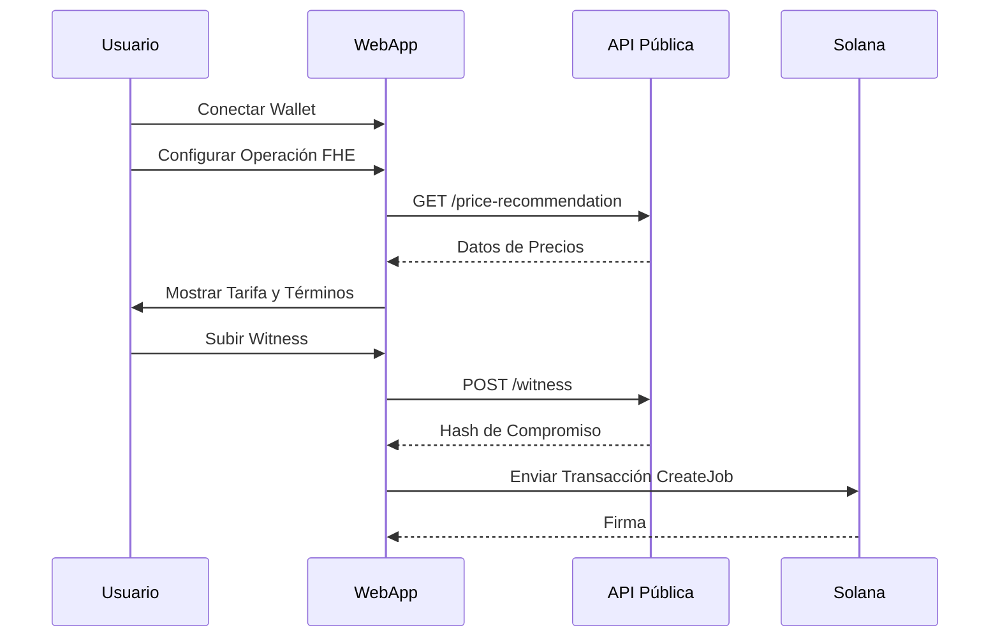

# Guía de Aplicación Web

## Descripción General

La Aplicación Web de ZyberLink (`zyb-apps/webapp`) proporciona una interfaz potente para que los usuarios interactúen con el protocolo ZYB. Simplifica el proceso de creación de trabajos FHE/ZK, la gestión de witnesses y la visualización de resultados de computación.

## Características Clave

- **Dashboard DeFi**: Visualiza balances y ejecuta intercambios privados (swaps).
- **Analytics Privado**: Sube datasets y ejecuta agregaciones FHE.
- **Herramienta de Compliance**: Asistente de verificación de Proof of Innocence (POI).
- **Monitor de Jobs**: Seguimiento en tiempo real del consenso de computación on-chain.

## Stack Tecnológico

- **Framework**: Svelte 4 / Vite
- **Gestión de Estado**: Svelte Stores
- **Blockchain**: `@solana/web3.js`
- **Estilo**: Tailwind CSS + Sistema de Diseño Cyberpunk

## Primeros Pasos

### Modo Desarrollo

```bash
cd zyb-apps/webapp
npm install
npm run dev
```

La aplicación estará disponible en `http://localhost:5173`.

### Configuración

Variables de entorno utilizadas:
- `VITE_API_URL`: URL del Gateway de API Pública.
- `VITE_RPC_URL`: Endpoint RPC de Solana.
- `VITE_PROGRAM_ID`: ID del programa marketplace.

## Flujo de Interacción



---

## Despliegue

La webapp está diseñada para ser desplegada como un sitio estático (SPA) en plataformas como Vercel, Netlify o Cloudflare Pages.

```bash
npm run build
# Salida en zyb-apps/webapp/dist
```
