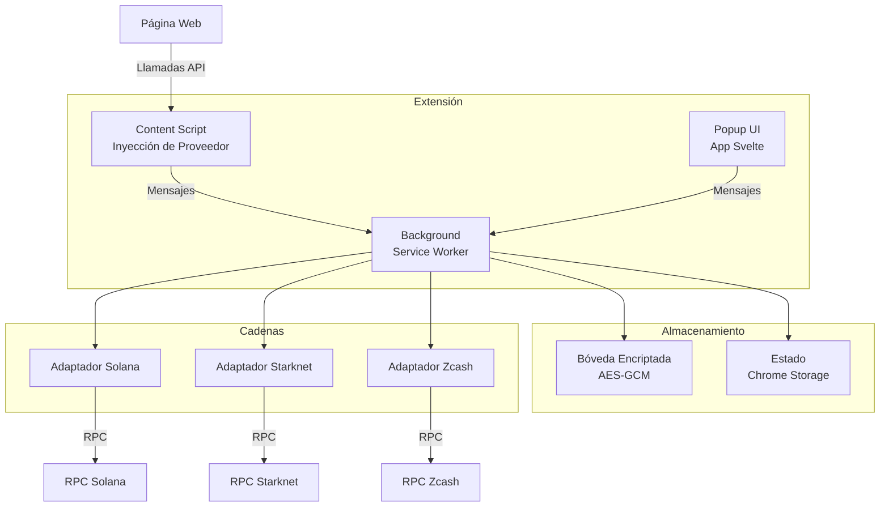
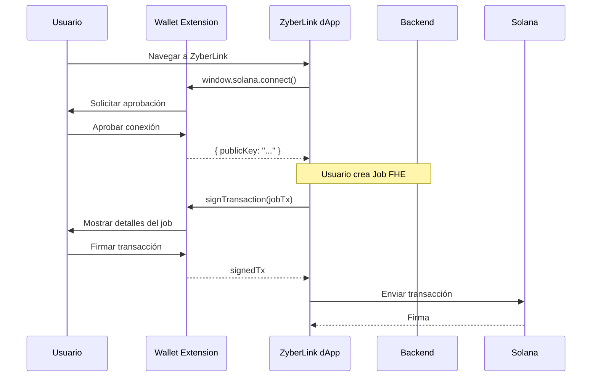

# ZyberLink Reference Wallet (Experimental)

> ⚠️ **Implementación de Referencia Experimental**
>
> Esta wallet es una prueba de concepto diseñada para demostrar la gestión nativa de claves FHE y la generación de pruebas ZK directamente en el navegador. Está destinada a desarrolladores e investigadores que exploran características avanzadas de privacidad, no para la gestión de activos en producción. Para interacciones estándar con Solana, recomendamos usar Phantom, Solflare o Backpack.

Extensión de navegador multi-cadena con soporte para Solana, Starknet y Zcash con configuración RPC personalizable.

## Características

- **Multi-cadena**: Soporte para Solana, Starknet y Zcash
- **BIP39/44**: Derivación de claves estándar basada en mnemotécnicos
- **Seguridad**: Bóveda encriptada con AES-GCM
- **RPC Personalizado**: Endpoints configurables para cada red
- **API de Proveedor**: Inyección de `window.solana` y `window.starknet`
- **Auto-bloqueo**: Bloqueo de seguridad automático
- **Diseño TUI**: Interfaz minimalista cyberpunk

## Stack Tecnológico

- **TypeScript**: Tipado estático y seguridad
- **Svelte 5**: Framework reactivo moderno
- **Manifest V3**: Estándar de extensiones de Chrome
- **Vite + CRXJS**: Sistema de compilación optimizado
- **Web Crypto API**: Criptografía nativa del navegador

## Arquitectura



## Casos de Uso

### Para Usuarios Finales (Experimental)

1. **Gestión de Activos Multi-Cadena**: Gestionar SOL, STRK y ZEC desde una sola wallet
2. **Interacción dApp**: Conectar con aplicaciones web3 (incluyendo marketplace ZyberLink)
3. **Transacciones Privadas**: Soporte para transacciones protegidas de Zcash
4. **RPC Personalizado**: Configurar tus propios endpoints para mayor control

### Para Desarrolladores

1. **API de Proveedor**: Integración estándar con `window.solana` y `window.starknet`
2. **Testing Multi-Cadena**: Tests E2E automatizados con Playwright
3. **Extensible**: Arquitectura modular para añadir nuevas cadenas

## Integración con ZyberLink

La wallet se integra directamente con el marketplace de ZyberLink:



## Seguridad

### Modelo de Seguridad

- **Bóveda Encriptada**: Todas las claves privadas se almacenan encriptadas con AES-GCM
- **PBKDF2**: Derivación de claves con 100,000 iteraciones
- **Auto-bloqueo**: Bloqueo automático tras 15 minutos de inactividad
- **Mnemotécnico**: BIP39 de 12 palabras para respaldo y recuperación
- **Aislamiento**: Las claves nunca salen de la extensión

### Mejores Prácticas

1. **Frase Semilla**: Almacenar frase de recuperación offline (papel, metal)
2. **Contraseña Fuerte**: Mínimo 8 caracteres, idealmente 16+
3. **RPC Confiable**: Solo añadir endpoints de fuentes verificadas
4. **Revisar Transacciones**: Siempre verificar destino y monto antes de firmar
5. **Bloqueo Manual**: Bloquear la wallet cuando no esté en uso

## API de Proveedor

### Proveedor Solana

```javascript
// Conectar
const { publicKey } = await window.solana.connect();

// Firmar mensaje
const message = new TextEncoder().encode("Hola ZyberLink");
const { signature } = await window.solana.signMessage(message);

// Firmar transacción
const signedTx = await window.solana.signTransaction(transaction);

// Firmar y enviar
const { signature } = await window.solana.signAndSendTransaction(transaction);

// Eventos
window.solana.on('connect', (publicKey) => console.log('Conectado:', publicKey));
window.solana.on('disconnect', () => console.log('Desconectado'));
```

### Proveedor Starknet

```javascript
// Conectar
const { publicKey } = await window.starknet.connect();

// Firmar mensaje
const signature = await window.starknet.signMessage(messageHash);

// Obtener dirección
const address = await window.starknet.getAddress();
```

### API Unificada ZyberLink

```javascript
// Acceso unificado a todos los proveedores
window.zyberlink.solana   // Proveedor Solana
window.zyberlink.starknet // Proveedor Starknet
window.zyberlink.version  // "0.1.0"
```

## Roadmap

### Implementado

- [x] Multi-cadena (Solana, Starknet, Zcash)
- [x] Derivación de claves BIP39/44
- [x] Bóveda encriptada AES-GCM
- [x] Endpoints RPC personalizados
- [x] Enviar/Recibir transacciones
- [x] Inyección de proveedor
- [x] Suite de testing E2E

### Próximamente

- [ ] Historial de transacciones
- [ ] Soporte de tokens (SPL, ERC20)
- [ ] Soporte NFT
- [ ] Soporte multi-cuenta
- [ ] Integración hardware wallet
- [ ] Libreta de direcciones
- [ ] UI transacciones protegidas Zcash
- [ ] Monitoreo salud de red
- [ ] Exportar claves privadas (con advertencia)

## Documentación Adicional

- [Inicio Rápido](quickstart.md) - Instalación y primeros pasos
- [Desarrollo Local](development.md) - Guía de desarrollador
- [Testing](testing.md) - Suite de test E2E
- [Testnets](testnets.md) - Configuración de redes de prueba

## Soporte

Para reportar problemas o contribuir, usa el repositorio `zyb-apps` o ver el [Mapa de Repositorios](../primeros-pasos/repositorios.md).

## Licencia

Apache-2.0
