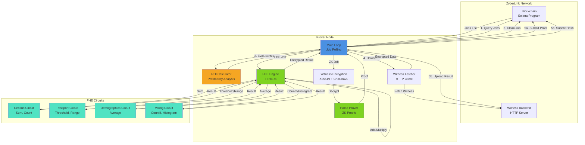
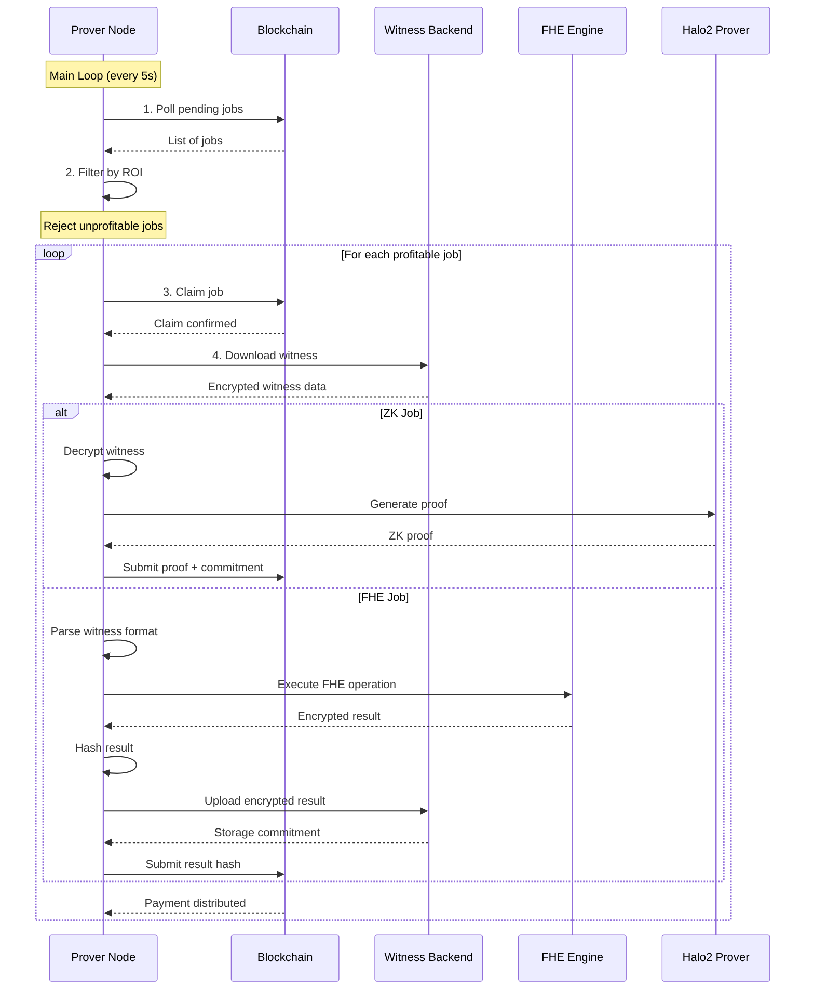

# ZyberLink Prover Node

The ZyberLink Prover Node is an autonomous computation daemon that executes privacy-preserving computations for the ZyberLink network. It processes jobs from the on-chain marketplace, performing either Zero-Knowledge (ZK) proofs or Fully Homomorphic Encryption (FHE) computations, and submits results back to the blockchain.

## Overview

### What is the Prover Node?

The Prover Node is a background service that:

- **Polls** the on-chain marketplace for pending computation jobs
- **Evaluates** job profitability using ROI (Return on Investment) analysis
- **Claims** profitable jobs by submitting on-chain transactions
- **Downloads** encrypted witness data from the witness backend
- **Executes** privacy-preserving computations (ZK or FHE)
- **Submits** results back to the blockchain for verification and payment

### Computation Types

The prover node supports two types of privacy-preserving computations:

#### 1. Zero-Knowledge (ZK) Proofs

ZK proofs allow proving statements about private data without revealing the data itself. The prover node supports:

- **Zcash Orchard** - Shielded transaction proofs using Halo2
- **Anonymous Voting** - Private vote verification
- **Credential Verification** - Privacy-preserving credential checks

**ZK Flow**: Single prover per job, exclusive claim, full proof generation.

#### 2. Fully Homomorphic Encryption (FHE)

FHE allows performing computations on encrypted data without decryption. The prover node supports multiple FHE operations organized in tracks:

**Track A - Foundation Layer** (Simple Operations):
- `Add` - Add constant to encrypted value
- `Multiply` - Multiply encrypted value by constant
- `Sum` - Sum multiple encrypted values
- `Threshold` - Check if value exceeds threshold
- `RangeCheck` - Verify value is within range

**Track B - Extension Layer** (Advanced Operations):
- `Average` - Compute average of encrypted values
- `CountIf` - Count values matching a predicate
- `Histogram` - Generate histogram from encrypted data

**FHE Flow**: Multi-prover consensus (3+ provers), parallel execution, encrypted result verification.

### Multi-Prover Consensus System

For FHE jobs, ZyberLink uses a decentralized consensus mechanism:

1. **Multiple provers** (configurable, default 3) can claim the same FHE job
2. **Each prover** independently computes the result on encrypted data
3. **Result hashes** are submitted on-chain for consensus verification
4. **Consensus** is reached when sufficient provers agree (2-of-3 default)
5. **Payment** is distributed among provers who reached consensus

This ensures computational integrity without requiring trust in any single prover.

## Architecture



## Quick Start

### Prerequisites

- Rust 1.75+ with cargo
- Solana CLI tools
- Access to Solana RPC endpoint (local or devnet)
- Witness backend URL
- Solana keypair for prover identity

### Build

```bash
# Build release version
cargo build --release -p zyberlink-prover

# The binary will be at:
# ./target/release/zyberlink-prover
```

### Run

```bash
# Basic run with required parameters
RUST_LOG=info \
SOLANA_RPC_URL=http://localhost:8899 \
./target/release/zyberlink-prover \
  --program-id <PROGRAM_PUBKEY> \
  --witness-backend-url http://localhost:8080

# Run with custom configuration
./target/release/zyberlink-prover \
  --rpc-url http://localhost:8899 \
  --program-id <PROGRAM_PUBKEY> \
  --keypair ~/.config/solana/prover.json \
  --witness-backend-url http://localhost:8080 \
  --min-roi 20.0 \
  --cost-multiplier 1.5 \
  --poll-interval 5 \
  --max-concurrent-jobs 3

# Run with TUI (Terminal User Interface)
./target/release/zyberlink-prover --tui-mode \
  --program-id <PROGRAM_PUBKEY> \
  --witness-backend-url http://localhost:8080
```

### Initial Setup

Before running the prover node, you should register as a prover on-chain:

```bash
# Register prover with stake
./target/release/zyberlink-prover register \
  --program-id <PROGRAM_PUBKEY> \
  --rpc-url http://localhost:8899 \
  --keypair ~/.config/solana/prover.json \
  --stake-amount 100000000

# Or use interactive setup wizard
./target/release/zyberlink-prover setup \
  --program-id <PROGRAM_PUBKEY> \
  --stake-amount 100000000
```

## Configuration

### Command-Line Arguments

| Argument | Type | Default | Description |
|----------|------|---------|-------------|
| `--rpc-url` | String | `http://localhost:8899` | Solana RPC endpoint URL |
| `--program-id` | String | Required | ZyberLink program public key |
| `--keypair` | String | `~/.config/solana/id.json` | Path to prover keypair file |
| `--witness-backend-url` | String | `http://localhost:8080` | Witness storage backend URL |
| `--poll-interval` | u64 | `5` | Job polling interval in seconds |
| `--min-roi` | f64 | `20.0` | Minimum ROI percentage to accept jobs |
| `--cost-multiplier` | f64 | `1.5` | Operational cost multiplier for overhead |
| `--max-concurrent-jobs` | usize | `3` | Maximum concurrent jobs to process |
| `--fhe-server-key-path` | String | None | Path to FHE server key file (optional) |
| `--tui-mode` | Flag | `false` | Enable Terminal User Interface |

### Environment Variables

The prover node can also be configured via environment variables:

```bash
# Core configuration
export SOLANA_RPC_URL=http://localhost:8899
export ZYBERLINK_PROGRAM_ID=<PROGRAM_PUBKEY>
export BACKEND_URL=http://localhost:8080
export WITNESS_BACKEND_URL=http://localhost:8080

# Keypair path
export PROVER_KEYPAIR_PATH=~/.config/solana/prover.json

# ROI configuration
export MIN_ROI_PERCENT=20.0
export OPERATIONAL_COST_MULTIPLIER=1.5

# Performance tuning
export POLL_INTERVAL_SECS=5
export MAX_CONCURRENT_JOBS=3
export MOCK_PROVING_TIME=10

# FHE configuration (optional)
export FHE_SERVER_KEY_PATH=/path/to/server_key.bin

# Logging
export RUST_LOG=info  # Options: error, warn, info, debug, trace
```

### Configuration Files

The setup wizard can generate a configuration file at `~/.config/zyberlink/prover-config.json`:

```json
{
  "rpc_url": "http://localhost:8899",
  "program_id": "...",
  "keypair_path": "~/.config/solana/prover.json",
  "witness_backend_url": "http://localhost:8080",
  "min_roi_percentage": 20.0,
  "operational_cost_multiplier": 1.5,
  "poll_interval_seconds": 5,
  "max_concurrent_jobs": 3
}
```

## ROI Calculator

The ROI (Return on Investment) Calculator evaluates whether a job is profitable before claiming it. This prevents provers from accepting unprofitable work.

### Formula

The ROI calculation uses the following formula:

```
revenue_per_prover = job_price / required_provers
total_cost = base_cost × operational_cost_multiplier
profit = revenue_per_prover - total_cost
roi_percentage = (profit / total_cost) × 100
is_profitable = roi_percentage >= min_roi_percentage
```

Where:
- **job_price**: Total payment offered by client (in lamports)
- **required_provers**: Number of provers needed for consensus (FHE jobs only)
- **base_cost**: Estimated computational cost based on operation complexity
- **operational_cost_multiplier**: Overhead factor for infrastructure, electricity, etc.

### Complexity Tiers

FHE operations are categorized into 5 complexity tiers, each with different base costs:

| Tier | Operations | Base Cost | Timeout |
|------|-----------|-----------|---------|
| 1 | Add, Multiply | 0.001 SOL | 30s |
| 2 | Sum (small), Threshold, RangeCheck | 0.003 SOL | 60s |
| 3 | Sum (large), Average (small) | 0.01 SOL | 120s |
| 4 | Average (large), CountIf (small) | 0.05 SOL | 300s |
| 5 | CountIf (large), Histogram | 0.2+ SOL | 600s |

### Profitability Evaluation

The ROI calculator automatically:

1. **Extracts** operation type and parameters from the job
2. **Determines** complexity tier based on operation
3. **Calculates** expected revenue per prover
4. **Estimates** computational cost including overhead
5. **Computes** ROI percentage
6. **Decides** if job meets minimum ROI threshold

### Configuration of Thresholds

You can tune the ROI calculator to your operational costs:

```bash
# Conservative: Only accept high-profit jobs
--min-roi 50.0 --cost-multiplier 2.0

# Aggressive: Accept most jobs
--min-roi 10.0 --cost-multiplier 1.2

# Default: Balanced approach
--min-roi 20.0 --cost-multiplier 1.5
```

### Example Evaluation

```rust
// Job: Sum operation with 10 values
// Price: 0.01 SOL (10,000,000 lamports)
// Required provers: 3

revenue_per_prover = 10,000,000 / 3 = 3,333,333 lamports (0.0033 SOL)
base_cost = 3,000,000 lamports (0.003 SOL) // Tier 2
total_cost = 3,000,000 × 1.5 = 4,500,000 lamports (0.0045 SOL)
profit = 3,333,333 - 4,500,000 = -1,166,667 lamports

roi_percentage = (-1,166,667 / 4,500,000) × 100 = -25.9%
is_profitable = false // ROI < 20%

// Result: Job is REJECTED
```

The prover will not claim this job because it would result in a loss.

## Job Processing Flow

The prover node follows this workflow for each job:



### Step-by-Step Process

#### Step 1: Poll Pending Jobs

The prover queries the blockchain for jobs with `JobStatus::Pending`:

```rust
let pending_jobs = find_pending_jobs(&client.rpc_client, &program_id)?;
```

#### Step 2: Evaluate ROI

Each job is evaluated for profitability:

```rust
let roi = roi_calculator.evaluate_job(
    &circuit_type,
    job.price_lamports,
    required_provers,
);

if roi.is_profitable {
    // Accept job
} else {
    // Reject job
}
```

#### Step 3: Claim Job

Submit claim transaction to the blockchain:

```rust
// For ZK jobs (exclusive claim)
client.claim_job_instruction(&prover_pubkey, &job_pda)?

// For FHE jobs (multi-prover claim)
client.claim_fhe_job_instruction(&prover_pubkey, &job_pda, job_id)?
```

#### Step 4: Download Witness

Fetch encrypted witness data from the witness backend:

```rust
let witness_bytes = witness_fetcher
    .download_witness(&witness_hash)
    .await?;
```

#### Step 5a: Execute ZK Computation

For Zero-Knowledge jobs:

```rust
// Decrypt witness
let witness = witness_encryption.decrypt_witness(&witness_bytes)?;

// Generate Halo2 proof
let proof = halo2_prover.generate_orchard_proof(witness).await?;

// Submit proof
client.submit_proof_instruction(
    &prover_pubkey,
    &job_pda,
    proof_commitment,
    proof_size,
)?;
```

#### Step 5b: Execute FHE Computation

For FHE jobs:

```rust
// Parse witness format: [len (4 bytes)] [encrypted_data] [server_key]
let encrypted_data_len = u32::from_le_bytes(...);
let encrypted_data = &witness_bytes[4..4+len];
let server_key_bytes = &witness_bytes[4+len..];

// Initialize FHE engine
let server_key = deserialize_server_key(server_key_bytes)?;
let engine = FheEngine::new(server_key);

// Execute operation
let result_bytes = engine.compute_operation(encrypted_data, operation)?;

// Hash result for consensus
let result_hash = FheEngine::hash_result(&result_bytes);

// Upload encrypted result
witness_fetcher.upload_fhe_result(&result_bytes).await?;

// Submit result hash
client.submit_fhe_result_instruction(
    &prover_pubkey,
    &job_pda,
    job_id,
    result_hash,
)?;
```

### Witness Data Format

#### ZK Witness Format

For Zero-Knowledge jobs, the witness is encrypted using X25519 key exchange + ChaCha20-Poly1305:

```
[Encrypted Witness Data]
  ├─ Ephemeral public key (32 bytes)
  ├─ Nonce (12 bytes)
  └─ Ciphertext + Tag (variable)
```

#### FHE Witness Format

For FHE jobs, the witness contains encrypted data and server key:

```
[FHE Witness Data]
  ├─ Length prefix (4 bytes, little-endian u32)
  ├─ Encrypted data (variable)
  │   └─ Serialized FheUint8 ciphertext(s)
  └─ Server key (variable, ~50MB)
      └─ Serialized TFHE ServerKey
```

For multi-value operations (Sum, Average, CountIf, Histogram):

```
[Encrypted Data Section]
  └─ Bincode-serialized Vec<Vec<u8>>
      ├─ Encrypted value 1
      ├─ Encrypted value 2
      └─ ...
```

## Supported FHE Operations

The prover node supports a comprehensive set of FHE operations implemented across specialized circuits.

### Track A - Foundation Layer

#### Add
```rust
Operation: Add(constant: u8)
Complexity: Tier 1
Cost: 0.001 SOL
Timeout: 30s
Description: Adds a constant to an encrypted value
Example: encrypted(42) + 10 = encrypted(52)
```

#### Multiply
```rust
Operation: Multiply(constant: u8)
Complexity: Tier 1
Cost: 0.001 SOL
Timeout: 30s
Description: Multiplies an encrypted value by a constant
Example: encrypted(7) × 6 = encrypted(42)
```

#### Sum
```rust
Operation: Sum { expected_count: u32 }
Complexity: Tier 2-3 (based on count)
Cost: 0.003-0.01 SOL
Timeout: 60-120s
Description: Sums multiple encrypted values
Example: sum([enc(10), enc(20), enc(30)]) = enc(60)
Implementation: CensusCircuit::compute_sum_u16()
```

#### Threshold
```rust
Operation: Threshold { threshold: u8, greater_or_equal: bool }
Complexity: Tier 2
Cost: 0.003 SOL
Timeout: 60s
Description: Checks if encrypted value meets threshold
Example: threshold(enc(25), 18, true) = enc(true)
Implementation: PassportCircuit::compute_threshold()
```

#### RangeCheck
```rust
Operation: RangeCheck { min: u32, max: u32 }
Complexity: Tier 2
Cost: 0.003 SOL
Timeout: 60s
Description: Verifies encrypted value is within range
Example: range_check(enc(25), 18, 65) = enc(true)
Implementation: PassportCircuit::compute_range_check()
```

### Track B - Extension Layer

#### Average
```rust
Operation: Average { expected_count: u32 }
Complexity: Tier 3-4 (based on count)
Cost: 0.01-0.05 SOL
Timeout: 120-300s
Description: Computes average of encrypted values
Example: avg([enc(10), enc(20), enc(30)]) = (enc(60), 3)
Returns: (encrypted_sum, count) tuple
Implementation: DemographicsCircuit::compute_average_u16()
```

#### CountIf
```rust
Operation: CountIf { predicate: FhePredicate, expected_count: u32 }
Complexity: Tier 4-5 (based on count)
Cost: 0.05-0.2 SOL
Timeout: 300-600s
Description: Counts encrypted values matching predicate
Predicates: Equals, GreaterThan, LessThan, Between
Example: count_if([enc(1), enc(0), enc(1)], Equals(1)) = enc(2)
Implementation: VotingCircuit::compute_count_if()
```

#### Histogram
```rust
Operation: Histogram { bins: Vec<HistogramBin> }
Complexity: Tier 5
Cost: 0.2+ SOL (scales with bin count)
Timeout: 600s
Description: Generates histogram from encrypted data
Example: histogram([enc(5), enc(15), enc(25)], bins=[0-10, 11-20, 21-30])
         = [enc(1), enc(1), enc(1)]
Implementation: VotingCircuit::compute_histogram()
```

### Circuit Implementations

The FHE operations are implemented across four specialized circuits:

- **CensusCircuit** (`src/prover-node/src/circuits/census.rs`) - Population counting and summation
- **PassportCircuit** (`src/prover-node/src/circuits/passport.rs`) - Age verification and threshold checks
- **DemographicsCircuit** (`src/prover-node/src/circuits/demographics.rs`) - Statistical analysis and averages
- **VotingCircuit** (`src/prover-node/src/circuits/voting.rs`) - Private voting, counting, and histograms

Each circuit uses TFHE-rs (Concrete) for homomorphic operations, supporting both `FheUint8` (8-bit) and `FheUint16` (16-bit) operations depending on the required numeric range.

## Logging and Debugging

### Log Levels

Configure logging verbosity with the `RUST_LOG` environment variable:

```bash
# Error only - minimal output
RUST_LOG=error ./target/release/zyberlink-prover

# Warnings and errors
RUST_LOG=warn ./target/release/zyberlink-prover

# Info level - recommended for production
RUST_LOG=info ./target/release/zyberlink-prover

# Debug level - detailed execution flow
RUST_LOG=debug ./target/release/zyberlink-prover

# Trace level - extremely verbose (includes all dependencies)
RUST_LOG=trace ./target/release/zyberlink-prover

# Module-specific logging
RUST_LOG=zyberlink_prover=debug,prover_node=debug ./target/release/zyberlink-prover
```

### Log Output Examples

#### Job Processing (Info Level)

```
[INFO] Starting ZyberLink Prover Node
[INFO] Prover Authority: 7vX8h9...
[INFO] ROI calculator initialized - Min ROI: 20.0%, Cost multiplier: 1.5x
[INFO] Found 3 pending jobs
[INFO] Job is PROFITABLE - Op: Sum, Tier: 2, Revenue: 3500000 lamports, Cost: 4500000 lamports, Profit: -1000000 lamports, ROI: -22.2%
[INFO] Found 2 profitable jobs (ROI >= 20.0%)
[INFO] Processing job 42 - Price: 10000000 lamports, Circuit: FheComputation(Add(5)), ROI: 33.3%, Profit: 1500000 lamports
[INFO] [Job 42] Starting processing
[INFO] [Job 42] Claiming job...
[INFO] [Job 42] Claimed successfully (sig: 5k7Xh...)
[INFO] [Job 42] Downloading encrypted witness from backend...
[INFO] [Job 42] Downloaded encrypted witness (52428800 bytes)
[INFO] [Job 42] Generating proof (circuit: FheComputation(Add(5)))...
[INFO] [Job 42] Executing FHE operation: Add(5)
[INFO] [Job 42] Parsed witness: 256 bytes encrypted data, 52428544 bytes server key
[INFO] [Job 42] Initializing FHE engine from witness...
[INFO] [Job 42] FHE engine initialized
[INFO] [Job 42] FHE computation complete (256 bytes, hash: a3f5b2c8)
[INFO] [Job 42] Uploading encrypted result to witness backend...
[INFO] [Job 42] FHE result stored with commitment: 9d4e7a...
[INFO] [Job 42] FHE result submitted successfully (sig: 8h3Nm...)
[INFO] [Job 42] Completed!
```

#### Debug Level Output

```
[DEBUG] Polling for available jobs...
[DEBUG] Found job PDA: 3Qz8j... with ID: 42, Status: Pending
[DEBUG] Fetching FHE consensus data for job 42
[DEBUG] FHE operation: Add(5), Required provers: 3
[DEBUG] Evaluating job profitability...
[DEBUG] Base cost: 1000000 lamports, Total cost: 1500000 lamports
[DEBUG] Revenue per prover: 3333333 lamports
[DEBUG] Profit: 1833333 lamports, ROI: 122.2%
[DEBUG] Job accepted - ROI exceeds minimum threshold
```

### Common Errors and Solutions

#### Error: "Failed to claim (already claimed?)"

```
[WARN] [Job 42] Failed to claim (already claimed?): Transaction failed
```

**Cause**: Another prover claimed the job first (common in competitive environments)

**Solution**: This is normal behavior. The prover will skip this job and try the next one.

#### Error: "Failed to download witness from backend"

```
[ERROR] [Job 42] Failed to download witness: Witness not found for commitment: a3f5b2c8...
```

**Cause**: Witness backend doesn't have the witness file

**Solutions**:
- Verify witness backend URL is correct
- Check witness backend logs for upload issues
- Ensure client uploaded witness before creating job

#### Error: "Failed to deserialize server key from witness"

```
[ERROR] [Job 42] Failed to deserialize server key from witness
```

**Cause**: Corrupted witness data or incompatible TFHE version

**Solutions**:
- Verify witness format matches expected structure
- Check TFHE version compatibility (prover should use tfhe 0.10)
- Validate witness upload was successful

#### Error: "We are not in the claimed_provers list"

```
[WARN] [Job 42] We are not in the claimed_provers list, aborting
```

**Cause**: FHE job claimed by other provers, no slots available

**Solution**: Normal behavior when all prover slots are filled. Try next job.

#### Error: "Job is NOT PROFITABLE"

```
[WARN] Job is NOT PROFITABLE - Op: Histogram, Tier: 5, Revenue: 100000000 lamports, Cost: 200000000 lamports, Loss: -100000000 lamports, ROI: -50.0% (min: 20.0%)
```

**Cause**: Job price is too low for computational cost

**Solutions**:
- Lower `--min-roi` threshold (accept lower profit margins)
- Decrease `--cost-multiplier` (reduce overhead estimate)
- Wait for higher-priced jobs
- Contact clients to adjust pricing

### Performance Monitoring

#### Log Files

The prover node writes logs to stdout. To persist logs to a file:

```bash
# Redirect to file
./target/release/zyberlink-prover 2>&1 | tee prover.log

# Rotate logs with logrotate
./target/release/zyberlink-prover >> /var/log/zyberlink/prover.log 2>&1

# Use systemd journal
journalctl -u zyberlink-prover -f
```

#### TUI Mode

For real-time monitoring, enable TUI mode:

```bash
./target/release/zyberlink-prover --tui-mode
```

The TUI displays:
- Jobs claimed, completed, failed, pending
- Total earnings (SOL)
- Average proof time
- Recent job history
- System uptime

### Debugging Tips

1. **Enable debug logging** for detailed execution flow
2. **Check blockchain explorer** to verify transaction status
3. **Monitor witness backend** health endpoint: `curl http://localhost:8080/health`
4. **Verify keypair** has sufficient SOL balance for transactions
5. **Test ROI calculator** with different thresholds to understand filtering
6. **Use mock proving time** for faster local testing: `--mock-proving-time 1`

## Related Documentation

- [ZyberLink SDK](/sdks/rust/README.md) - Client library for job creation
- [Witness Backend](/src/witness-backend/README.md) - Witness storage service
- [On-Chain Program](/src/program/README.md) - Solana smart contract
- [FHE Operations](/src/shared/types/src/fhe.rs) - FHE operation definitions
- [ROI Calculator](/src/prover-node/src/roi_calculator.rs) - ROI implementation details
- [FHE Engine](/src/prover-node/src/fhe_engine.rs) - FHE computation engine
- [Circuit Implementations](/src/prover-node/src/circuits/) - FHE circuit modules

## Advanced Topics

### Running Multiple Prover Nodes

You can run multiple prover instances for increased throughput:

```bash
# Prover 1 - FHE only
./target/release/zyberlink-prover \
  --keypair ~/.config/solana/prover1.json \
  --max-concurrent-jobs 5

# Prover 2 - ZK only
./target/release/zyberlink-prover \
  --keypair ~/.config/solana/prover2.json \
  --max-concurrent-jobs 5
```

### Custom FHE Server Keys

Generate and use custom FHE server keys:

```bash
# Generate keys
./target/release/generate-fhe-keys \
  --client-key-path ./client_key.bin \
  --server-key-path ./server_key.bin

# Run prover with custom server key
./target/release/zyberlink-prover \
  --fhe-server-key-path ./server_key.bin
```

### Systemd Service

Run prover as a systemd service:

```ini
[Unit]
Description=ZyberLink Prover Node
After=network.target

[Service]
Type=simple
User=zyberlink
WorkingDirectory=/opt/zyberlink
Environment="RUST_LOG=info"
Environment="SOLANA_RPC_URL=http://localhost:8899"
ExecStart=/opt/zyberlink/zyberlink-prover \
  --program-id <PROGRAM_PUBKEY> \
  --witness-backend-url http://localhost:8080 \
  --keypair /opt/zyberlink/prover.json
Restart=always
RestartSec=10

[Install]
WantedBy=multi-user.target
```

### Docker Deployment

```dockerfile
FROM rust:1.75 as builder
WORKDIR /app
COPY . .
RUN cargo build --release -p zyberlink-prover

FROM debian:bookworm-slim
RUN apt-get update && apt-get install -y libssl-dev ca-certificates
COPY --from=builder /app/target/release/zyberlink-prover /usr/local/bin/
ENTRYPOINT ["zyberlink-prover"]
```

### Monitoring and Metrics

Integration points for monitoring:

- Parse logs for job completion metrics
- Track on-chain prover account balance
- Monitor transaction success/failure rates
- Alert on consecutive job failures
- Track ROI trends over time

## License

See [LICENSE](/LICENSE) for details.
