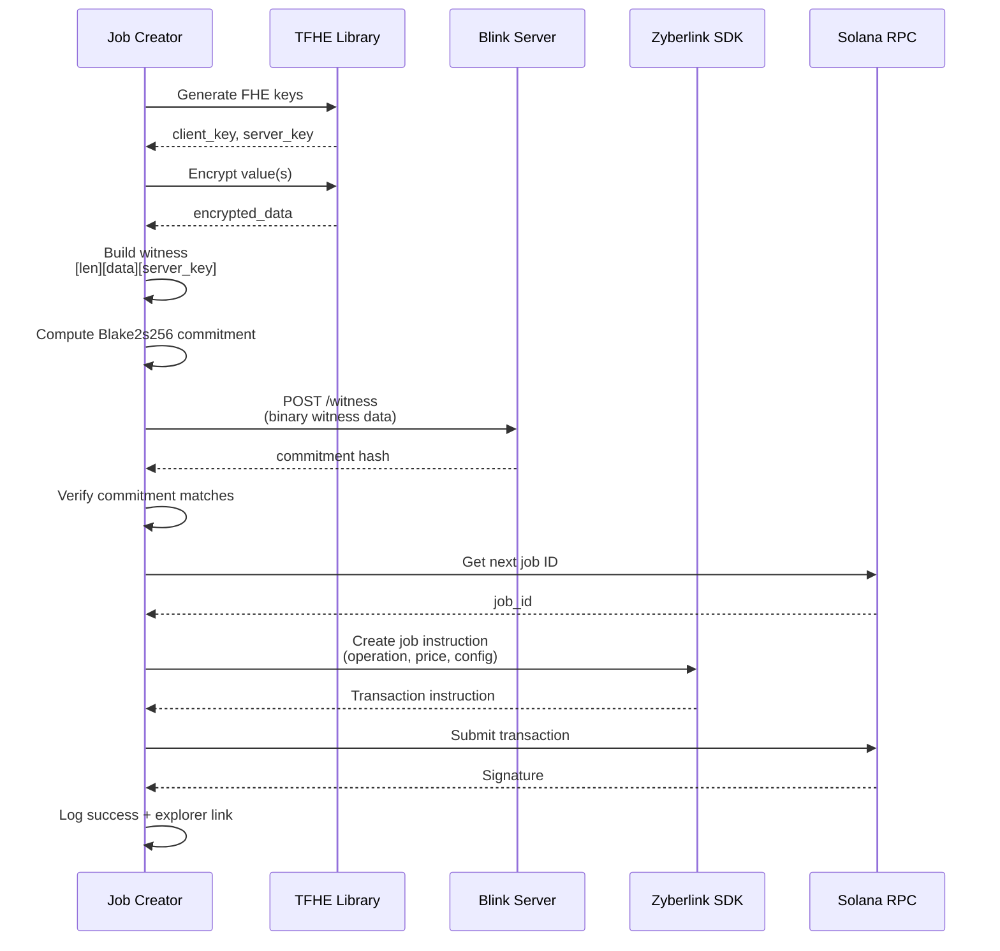

# Job Creator

A command-line tool for creating and submitting FHE (Fully Homomorphic Encryption) jobs to the Zyberlink marketplace on Solana.

## Overview

The Job Creator is a testing and demonstration tool designed to:

- Generate FHE-encrypted data with various operations
- Submit jobs to the Zyberlink Solana program
- Test the end-to-end flow of the FHE marketplace
- Benchmark different operation types and complexity tiers
- Demonstrate the integration between on-chain jobs and off-chain witness storage

This tool is primarily used for:
- **Testing**: Validate the full system including prover assignment, computation, and result submission
- **Demos**: Showcase FHE capabilities with different operation types
- **Benchmarks**: Measure performance across complexity tiers
- **Development**: Create test data for developing prover and backend components

## Quick Start

### Build

```bash
# Build in release mode
cargo build --release -p job-creator

# Or build from the project root
cd /home/deploy/experimental/zyberlink-demo
cargo build --release -p job-creator
```

### Run

```bash
# Set required environment variables
export PROGRAM_ID="your_program_id"
export SOLANA_RPC_URL="http://localhost:8899"  # Optional, defaults to localhost
export BACKEND_URL="http://localhost:8080"      # Optional, defaults to localhost
export USER_KEYPAIR="/path/to/keypair.json"     # Optional, creates new keypair if not set

# Run the job creator
./target/release/job-creator
```

## Configuration

The Job Creator uses environment variables for configuration:

### Required Configuration

- **`PROGRAM_ID`**: The Solana program ID for the Zyberlink marketplace
  - Must be a valid Solana public key
  - Example: `HnRTpCx7Xs3f1BKkVhkeZwcqRfPmSDpVQ6QxgN7Vm8Rt`

### Optional Configuration

- **`SOLANA_RPC_URL`**: RPC endpoint for Solana
  - Default: `http://localhost:8899`
  - Examples:
    - Localnet: `http://localhost:8899`
    - Devnet: `https://api.devnet.solana.com`
    - Mainnet: `https://api.mainnet-beta.solana.com`

- **`BACKEND_URL`**: Backend server for witness storage
  - Default: `http://localhost:8080`
  - Must support `/witness` endpoint for witness uploads

- **`USER_KEYPAIR`**: Path to Solana keypair JSON file
  - Default: `/tmp/job-creator-keypair.json`
  - If file doesn't exist, a new keypair will be generated
  - Format: Standard Solana keypair JSON (array of 64 bytes)

### Logging

The tool uses `env_logger` for logging. Control verbosity with:

```bash
# Set log level
export RUST_LOG=info    # Default level
export RUST_LOG=debug   # Verbose output
export RUST_LOG=warn    # Minimal output

# Run with logging
./target/release/job-creator
```

## Supported Operations

The Job Creator supports all FHE operations across five complexity tiers:

### Tier 1: Basic Arithmetic
Simple operations on a single encrypted value.

- **`Add(value: u8)`**
  - Adds a constant to an encrypted value
  - Example: `encrypt(42) + 10 = encrypt(52)`
  - Compute time: ~150ms

- **`Multiply(value: u8)`**
  - Multiplies an encrypted value by a constant
  - Example: `encrypt(5) * 3 = encrypt(15)`
  - Compute time: ~200ms

### Tier 2: Aggregation
Operations on multiple encrypted values.

- **`Sum { expected_count: u16 }`**
  - Sums multiple encrypted values
  - Use case: Census counting, population statistics
  - Example: `encrypt(1) + encrypt(1) + ... = encrypt(N)`
  - Compute time: ~150ms + 50ms per value

### Tier 3: Comparison
Conditional operations and threshold checks.

- **`Threshold { threshold: u8, greater_or_equal: bool }`**
  - Checks if encrypted value meets threshold condition
  - Use case: Age verification in zk-passport
  - Example: `encrypt(age) >= 18` returns `encrypt(1)` if true, `encrypt(0)` if false
  - Compute time: ~300ms

### Tier 4: Statistical Operations
Complex operations requiring multiple computations.

- **`Average { expected_count: u16 }`**
  - Computes average of multiple encrypted values
  - Returns `(encrypted_sum, count)` for client-side division
  - Use case: Demographic analysis
  - Example: `avg([encrypt(25), encrypt(30), encrypt(35)]) = (encrypt(90), 3)` → 30
  - Compute time: ~150ms + 50ms per value

### Tier 5: Advanced Operations
Most complex operations with significant computational requirements.

- **`Histogram { bins: Vec<HistogramBin> }`**
  - Computes distribution histogram across bins
  - Use case: Private voting, demographic distribution
  - Example: `histogram([votes...], [bin1, bin2, bin3]) = [encrypt(30), encrypt(20), encrypt(10)]`
  - Compute time: ~500ms + 3000ms per bin

## Witness Format

The witness data combines encrypted input and FHE server key in a specific binary format:

### Single-Value Operations

For operations that work on a single encrypted value (`Add`, `Multiply`, `Threshold`):

```
[encrypted_data_len: 4 bytes LE][encrypted_data][server_key]
```

**Structure:**
1. **Length prefix** (4 bytes, little-endian): Size of the encrypted data
2. **Encrypted data**: Serialized `FheUint8` ciphertext (bincode format)
3. **Server key**: Serialized TFHE server key (bincode format)

**Example:**
```rust
// Encrypt value
let value = 10u8;
let encrypted = FheUint8::encrypt(value, &client_key);
let encrypted_bytes = bincode::serialize(&encrypted)?;

// Build witness
let mut witness = Vec::new();
witness.extend_from_slice(&(encrypted_bytes.len() as u32).to_le_bytes());
witness.extend_from_slice(&encrypted_bytes);
witness.extend_from_slice(&server_key_bytes);
```

### Multi-Value Operations

For operations that work on multiple encrypted values (`Sum`, `Average`):

```
[vec_len: 4 bytes LE][Vec<Vec<u8>> serialized][server_key]
```

**Structure:**
1. **Length prefix** (4 bytes, little-endian): Size of the serialized vector
2. **Encrypted values**: Serialized `Vec<Vec<u8>>` where each inner `Vec<u8>` is a bincode-serialized `FheUint8`
3. **Server key**: Serialized TFHE server key (bincode format)

**Example:**
```rust
// Create multiple encrypted values
let mut encrypted_values: Vec<Vec<u8>> = Vec::new();
for i in 0..expected_count {
    let value = ((i % 10) + 1) as u8;
    let encrypted = FheUint8::encrypt(value, &client_key);
    let enc_bytes = bincode::serialize(&encrypted)?;
    encrypted_values.push(enc_bytes);
}

// Serialize the vector
let serialized_vec = bincode::serialize(&encrypted_values)?;

// Build witness
let mut witness = Vec::new();
witness.extend_from_slice(&(serialized_vec.len() as u32).to_le_bytes());
witness.extend_from_slice(&serialized_vec);
witness.extend_from_slice(&server_key_bytes);
```

### Commitment Calculation

The witness commitment is computed using Blake2s256:

```rust
use blake2::{Blake2s256, Digest};

let mut hasher = Blake2s256::new();
hasher.update(&witness_bytes);
let commitment = hex::encode(hasher.finalize());
```

This commitment is used to:
- Verify witness integrity when provers download it
- Link on-chain jobs to off-chain witness data
- Detect tampering or corruption

## Job Creation Flow

The Job Creator follows this sequence to create and submit jobs:



### Detailed Steps

1. **Generate FHE Keys**
   ```rust
   let config = ConfigBuilder::default().build();
   let (client_key, server_key) = generate_keys(config);
   ```

2. **Encrypt Values**
   - Single value: Encrypt one `u8` value
   - Multiple values: Encrypt array of `u8` values

3. **Build Witness**
   - Format encrypted data according to operation type
   - Append server key
   - Add length prefixes

4. **Upload Witness**
   - POST binary data to `{BACKEND_URL}/witness`
   - Receive commitment hash from backend
   - Verify commitment matches local calculation

5. **Get Pricing**
   - Each operation has a cost configuration based on complexity tier
   - Minimum payment covers prover costs + ROI
   - Job Creator uses 2x minimum to ensure profitability

6. **Create Job On-Chain**
   - Get next job ID from program config account
   - Build transaction with `create_fhe_job` instruction
   - Submit and confirm transaction

7. **Monitor Status**
   - Job is now available for provers to claim
   - Provers download witness, compute result, submit on-chain
   - Consensus is reached when threshold provers submit matching results

## Operation Modes

### Continuous Mode (Default)

The Job Creator runs in continuous mode, creating jobs at regular intervals:

```bash
./target/release/job-creator
```

**Behavior:**
- Creates jobs every 10 seconds
- Rotates through all 5 operation types (Add, Multiply, Sum, Threshold, Average)
- Runs indefinitely until stopped with Ctrl+C
- Automatically requests airdrops if balance is low (localnet only)

**Operation Rotation:**
```
Job #1: Add(42)
Job #2: Multiply(7)
Job #3: Sum (5 items)
Job #4: Threshold(50)
Job #5: Average (5 items)
Job #6: Add(42)  [cycle repeats]
...
```

### Single Job Mode

To create a single job and exit, modify the code to remove the loop:

```rust
// Comment out the loop in main.rs
// loop {
    // ... job creation code ...
// }
```

Or use a simple bash wrapper:

```bash
# Run once and kill after 15 seconds
timeout 15 ./target/release/job-creator
```

## Pricing and Cost Model

The Job Creator uses a dynamic pricing model based on operation complexity:

### Cost Configuration

Each operation has a `CostConfig` that defines:

```rust
pub struct CostConfig {
    pub complexity_tier: u8,           // 1-5
    pub min_payment_lamports: u64,     // Minimum per prover
    pub timeout_seconds: u64,          // Time limit for completion
}
```

### Pricing Formula

```
total_price = min_payment_lamports × multiplier × required_provers
```

Where:
- `min_payment_lamports`: Base cost for the operation
- `multiplier`: Currently 2x (covers 1.5x prover cost + 20% ROI)
- `required_provers`: Number of provers needed (default: 3)

### Example Pricing

```
Tier 1 (Add):      0.001 SOL × 2 × 3 = 0.006 SOL total
Tier 2 (Sum):      0.002 SOL × 2 × 3 = 0.012 SOL total
Tier 3 (Threshold): 0.003 SOL × 2 × 3 = 0.018 SOL total
Tier 4 (Average):  0.004 SOL × 2 × 3 = 0.024 SOL total
Tier 5 (Histogram): 0.005 SOL × 2 × 3 = 0.030 SOL total
```

### Recommended Pricing

The backend server provides a `/recommended-price` endpoint that suggests optimal pricing based on:
- Current network conditions
- Prover availability
- Operation complexity
- Historical completion rates

The Job Creator currently uses static pricing (2x minimum) but can be extended to query recommended prices.

## Usage Examples

### Example 1: Test on Localnet

```bash
# Start localnet
solana-test-validator

# Deploy program (in another terminal)
cd /home/deploy/experimental/zyberlink-demo
anchor build
anchor deploy

# Set environment
export PROGRAM_ID="<deployed_program_id>"
export SOLANA_RPC_URL="http://localhost:8899"
export BACKEND_URL="http://localhost:8080"

# Run job creator
./target/release/job-creator
```

### Example 2: Create Jobs on Devnet

```bash
# Set devnet configuration
export PROGRAM_ID="<devnet_program_id>"
export SOLANA_RPC_URL="https://api.devnet.solana.com"
export BACKEND_URL="https://devnet-backend.zyberlink.com"
export USER_KEYPAIR="~/.config/solana/id.json"

# Ensure account has balance
solana balance
solana airdrop 1  # If needed

# Run job creator
./target/release/job-creator
```

### Example 3: Custom Operation Sequence

Modify `main.rs` to create specific operation patterns:

```rust
// Create only Sum operations for stress testing
let operation = FheOperation::Sum { expected_count: 10 };

// Create alternating Add/Multiply
let operation = if job_counter % 2 == 0 {
    FheOperation::Add(42)
} else {
    FheOperation::Multiply(7)
};

// Create increasing complexity
let operation = match job_counter % 5 {
    0 => FheOperation::Add(10),
    1 => FheOperation::Sum { expected_count: 5 },
    2 => FheOperation::Threshold { threshold: 50, greater_or_equal: true },
    3 => FheOperation::Average { expected_count: 10 },
    4 => FheOperation::Histogram { bins: vec![...] },
    _ => unreachable!(),
};
```

## Output and Monitoring

### Console Output

The Job Creator provides detailed logging:

```
[INFO] Job Creator starting...
[INFO] RPC URL: http://localhost:8899
[INFO] Program ID: HnRTpCx7Xs3f1BKkVhkeZwcqRfPmSDpVQ6QxgN7Vm8Rt
[INFO] Backend URL: http://localhost:8080
[INFO] User: 9xQeWvG816bUx9EPjHmaT23yvVM2ZWbrrpZb9PusVFin

===========================================
  Job Creator - Continuous Mode
===========================================

Creating FHE jobs every 10 seconds...
Press Ctrl+C to stop

--- Job #1 ---
[INFO] Creating Tier 1 job: Add(42)
[INFO] FHE data created (105 bytes encrypted, 15824 bytes server key)
[INFO] Tier 1: 1000000 lamports/prover (0.001 SOL)
[INFO] Uploading witness to backend (15933 bytes)...
[INFO] Witness uploaded, commitment: a3c5f8e2...
[INFO] Commitment verified: a3c5f8e2...
[INFO] Using job ID: 1
[INFO] ✓ Job created! Signature: 5Kqw8pF2...
[INFO]   View: https://explorer.solana.com/tx/5Kqw8pF2...?cluster=custom&customUrl=http://localhost:8899
```

### Monitoring Job Status

Use the Solana Explorer to monitor job status:

```
https://explorer.solana.com/tx/<signature>?cluster=custom&customUrl=<rpc_url>
```

Or query on-chain accounts using the SDK:

```bash
# View job account
solana account <job_pda>

# Monitor program logs
solana logs <program_id>
```

## Troubleshooting

### Insufficient Balance

```
Error: Failed to create job: Insufficient funds
```

**Solution:**
```bash
# On localnet
solana airdrop 1

# On devnet
solana airdrop 1 --url devnet

# On mainnet
# Transfer SOL from another wallet
```

### Backend Connection Failed

```
Error: Failed to upload witness: connection refused
```

**Solution:**
- Verify backend is running: `curl http://localhost:8080/health`
- Check `BACKEND_URL` environment variable
- Ensure firewall allows connections

### Invalid Program ID

```
Error: Invalid PROGRAM_ID
```

**Solution:**
- Verify program is deployed: `solana program show <program_id>`
- Check `PROGRAM_ID` format (base58 string)
- Ensure using correct network (localnet/devnet/mainnet)

### Commitment Mismatch

```
Error: Commitment mismatch! Local: a3c5..., Backend: b4d6...
```

**Solution:**
- Backend and client must use same hash algorithm (Blake2s256)
- Check for data corruption during upload
- Verify backend `/witness` endpoint implementation

### Transaction Timeout

```
Error: Transaction was not confirmed in 30 seconds
```

**Solution:**
- Check network congestion
- Increase commitment level to `finalized`
- Retry with higher priority fees (mainnet)

## Dependencies

Key dependencies from `Cargo.toml`:

- **`zyberlink-sdk`**: SDK for interacting with Zyberlink program
- **`zyberlink-types`**: Shared types for FHE operations
- **`solana-sdk`** / **`solana-client`**: Solana blockchain interaction
- **`tfhe`**: TFHE library for FHE operations (v0.10)
- **`tokio`**: Async runtime
- **`reqwest`**: HTTP client for backend communication
- **`blake2`**: Blake2s256 hashing for commitments
- **`bincode`**: Serialization for FHE data structures

## Related Documentation

- [Zyberlink SDK](/sdks/rust/README.md) - SDK documentation for program interaction
- [FHE Types](/src/shared/types/src/fhe.rs) - FHE operation definitions
- [Blink Server](/src/blink-server/README.md) - Backend witness storage
- [Program Documentation](/programs/zyberlink-market/README.md) - Solana program details

## Development

### Building from Source

```bash
# Clone repository
git clone <repository_url>
cd zyberlink-demo

# Build job creator
cargo build --release -p job-creator

# Run tests
cargo test -p job-creator

# Check for errors
cargo check -p job-creator
```

### Code Structure

```
src/job-creator/
├── Cargo.toml           # Dependencies and metadata
├── README.md            # This file
└── src/
    └── main.rs          # Main job creator logic
```

### Extending the Job Creator

To add new features:

1. **Add new operations**: Implement new `FheOperation` variants in `zyberlink-types`
2. **Custom pricing**: Query backend's `/recommended-price` endpoint
3. **Metrics collection**: Add tracking for success/failure rates
4. **Job monitoring**: Poll job status and log completion events
5. **Batch creation**: Create multiple jobs in parallel

### Contributing

When contributing to the Job Creator:

- Follow Rust naming conventions
- Add logging for important events
- Handle errors gracefully with context
- Update this documentation for new features
- Test on localnet before devnet/mainnet
