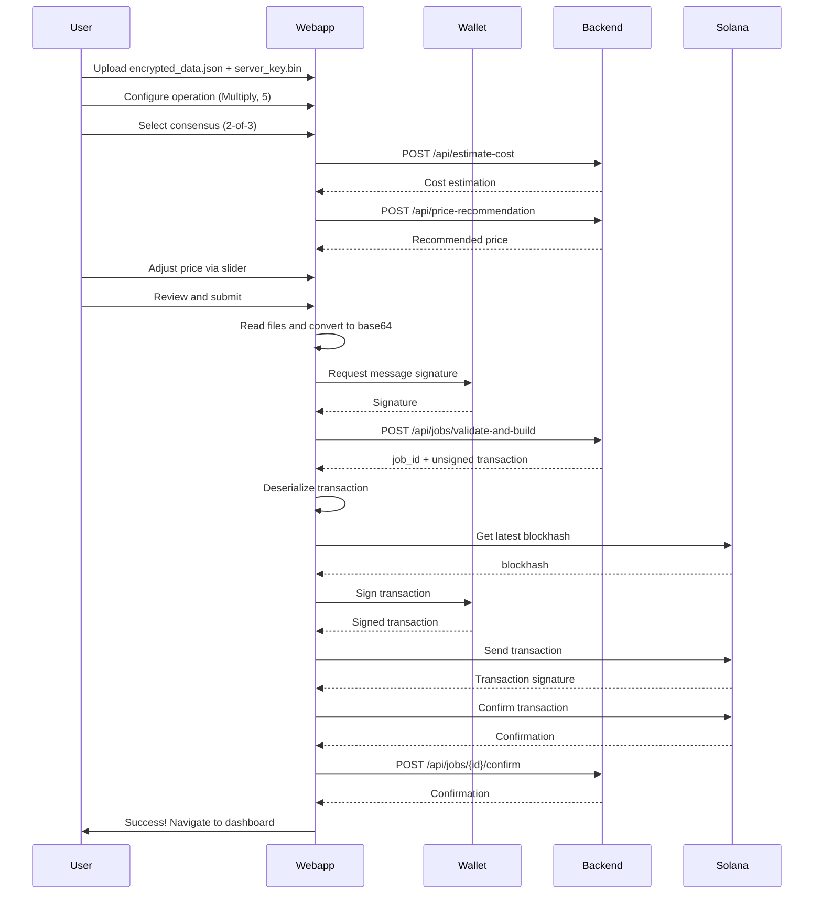

# Zyberlink Webapp - Frontend Architecture

A Svelte-based web application for creating and monitoring Fully Homomorphic Encryption (FHE) computation jobs on Solana.

## Overview

### Tech Stack

- **Framework**: Svelte 5 + Vite 7
- **Blockchain**: Solana Web3.js + SPL Token
- **Wallet Integration**: Solana Wallet Adapter (Phantom, Solflare)
- **Styling**: Custom TUI (Terminal UI) system with CSS variables
- **Testing**: Vitest + Testing Library

### Purpose

This web application provides a user-friendly interface for:
- Creating FHE computation jobs with encrypted data
- Configuring job parameters (operation type, consensus, pricing)
- Managing Solana wallet connections and transactions
- Monitoring job status in real-time
- Supporting multiple payment methods (SOL and SPL tokens like wZEC)

## Quick Start

```bash
cd src/webapp
npm install
npm run dev
```

The app will be available at `http://localhost:5173`

### Available Scripts

```bash
npm run dev      # Start development server with HMR
npm run build    # Production build (output to dist/)
npm run preview  # Preview production build locally
npm run test     # Run Vitest test suite
```

## Architecture

### Application Structure

```
src/webapp/
├── src/
│   ├── lib/
│   │   ├── components/          # Reusable UI components
│   │   │   ├── PriceSlider.svelte        # Price selection with acceptance zones
│   │   │   ├── JobCard.svelte            # Job status card
│   │   │   ├── WalletConnect.svelte      # Wallet connection UI
│   │   │   ├── Toast.svelte              # Notification toast
│   │   │   ├── Loading.svelte            # Loading spinner
│   │   │   ├── PaymentMethodSelector.svelte  # SOL/wZEC selector
│   │   │   ├── Tooltip.svelte            # Info tooltips
│   │   │   ├── Logo.svelte               # App logo
│   │   │   ├── Footer.svelte             # Page footer
│   │   │   ├── GlobalNavigation.svelte   # Top navigation
│   │   │   ├── Timeline.svelte           # Job timeline
│   │   │   ├── TimelineNode.svelte       # Timeline step
│   │   │   ├── TimelineNavigation.svelte # Timeline controls
│   │   │   ├── StatsBar.svelte           # Statistics display
│   │   │   ├── FHEFlow.svelte            # FHE process visualization
│   │   │   └── HeroBootSequence.svelte   # Landing page hero
│   │   ├── pages/                # Route pages
│   │   │   ├── Landing.svelte            # Home/landing page
│   │   │   ├── Dashboard.svelte          # Job list and monitoring
│   │   │   └── CreateJob.svelte          # 4-step job creation wizard
│   │   ├── stores/               # Svelte stores (state management)
│   │   │   ├── wallet.js                 # Wallet connection state
│   │   │   ├── toast.js                  # Toast notification queue
│   │   │   └── router.js                 # Hash-based routing
│   │   ├── utils/                # Utility functions
│   │   │   └── tokenAccountManager.js    # SPL token account management
│   │   └── mocks/                # Mock data for development
│   │       └── api.js                    # Mock API responses
│   ├── styles/
│   │   ├── tui-system.css        # Terminal UI design system
│   │   └── app.css               # Global styles
│   ├── App.svelte                # Root component
│   └── main.js                   # Application entry point
├── public/                       # Static assets
├── package.json
├── vite.config.js
└── .env.local                    # Environment variables (not in git)
```

### Routing

The app uses a simple **hash-based routing** system:

```javascript
// Valid routes
#landing      → Landing.svelte
#dashboard    → Dashboard.svelte
#create-job   → CreateJob.svelte
```

Routes are validated against a whitelist for security. Navigation is handled via the `router.js` store:

```javascript
import { navigateTo } from './lib/stores/router';
navigateTo('dashboard');
```

## Core Components

### 1. CreateJob.svelte - Job Creation Wizard

A **4-step wizard** for creating FHE computation jobs:

#### Step 1: PREPARE
- File uploads for encrypted data and server key
- Drag-and-drop or click-to-upload interface
- Validation: requires both `encrypted_data.json` and `server_key.bin`

#### Step 2: CONFIGURE
- **Operation Selection**: Add, Multiply, Subtract
- **Operation Value**: Integer 1-255
- **Payment Method**: SOL or wZEC (SPL token)
- **Consensus**: 2-of-3 or 3-of-5 provers
- **Price Selection**: Dynamic slider with acceptance zones
- **Cost Estimation**: Real-time cost calculation from backend

#### Step 3: REVIEW
- Summary of uploaded files
- Configuration review
- Final cost breakdown
- Warnings about wallet charges

#### Step 4: SUBMIT
- Transaction signing via wallet
- Progress indicators for each step:
  1. Reading encrypted files
  2. Generating signature
  3. Validating job with backend
  4. Preparing transaction
  5. Wallet signing
  6. Sending to Solana
  7. Confirming transaction
  8. Backend confirmation

**Key Features**:
- Reactive cost estimation based on operation complexity
- Price recommendation with dynamic slider
- SPL token account creation if needed (for wZEC payments)
- Real-time feedback during transaction processing

### 2. PriceSlider.svelte - Dynamic Price Selection

An intelligent price slider with visual acceptance zones:

```
[LOW ZONE] → [MEDIUM ZONE] → [HIGH ZONE]
   Red          Yellow          Green
  <80%         80-100%         100%+
```

**Features**:
- Visual zones showing prover acceptance probability
- Recommended price marker
- Real-time acceptance percentage
- "Set to Recommended" quick action
- Responsive to backend price recommendations

**Props**:
```javascript
minPrice           // Minimum price in lamports
recommendedPrice   // Backend-recommended price
maxPrice           // Maximum suggested price
currentPrice       // Current selected price
step               // Slider step increment
isLoading          // Loading state
```

### 3. Dashboard.svelte - Job Monitoring

Real-time job list with **live polling** (2-second intervals):

**Features**:
- Auto-refresh job status
- Status mapping: `pending_tx`, `active`, `claimed`, `completed`, `failed`
- Job cards with operation details
- Time since creation
- "New" pulse animation for recent jobs (<10 seconds)
- Cost and consensus information

### 4. WalletConnect.svelte - Wallet Integration

Handles Solana wallet connection with support for multiple adapters:

**Supported Wallets**:
- Phantom
- Solflare
- Other Solana Wallet Adapter compatible wallets

**Functionality**:
- Connect/disconnect
- Display public key (truncated)
- Wallet state persistence in store
- Transaction signing capabilities

## State Management (Stores)

### wallet.js - Wallet Store

```javascript
{
  connected: boolean,
  publicKey: PublicKey | null,
  provider: WalletAdapter | null,
  name: string | null
}
```

Methods:
- `disconnectWallet()`: Clear wallet connection

### toast.js - Toast Notification Store

```javascript
toastStore.show(message, type, duration)
toastStore.remove(id)
toastStore.clear()

// Helpers
toastStore.success(message)
toastStore.error(message)
toastStore.warning(message)
toastStore.info(message)
```

Types: `'info'`, `'success'`, `'error'`, `'warning'`

### router.js - Routing Store

```javascript
currentRoute.subscribe(route => { /* ... */ })
navigateTo(route)
initHashRouter()  // Initialize in main.js
```

## Integration with Backend API

### API Endpoints Used

#### 1. Cost Estimation
```http
POST /api/estimate-cost
Content-Type: application/json

{
  "operation": "multiply",
  "operation_value": 5,
  "expected_count": 100,
  "bins": 5,
  "required_provers": 3
}

Response:
{
  "operation": "multiply",
  "complexity_tier": 2,
  "min_payment_sol": 0.001,
  "total_min_payment_lamports": 3000000,
  "timeout_seconds": 30
}
```

#### 2. Price Recommendation
```http
POST /api/price-recommendation
Content-Type: application/json

{
  "operation": "multiply",
  "operation_value": 5,
  "expected_count": 10,
  "bins": 5,
  "required_provers": 3
}

Response:
{
  "min_price_lamports": 3000000,
  "recommended_price_lamports": 5400000,
  "max_suggested_lamports": 10800000,
  "slider_step": 100000
}
```

#### 3. Job Validation and Transaction Building
```http
POST /api/jobs/validate-and-build
Content-Type: application/json

{
  "creator_pubkey": "7xKx...",
  "encrypted_data": "base64...",
  "server_key": "base64...",
  "message": "create_job:123:1234567890:abc123",
  "signature": "base64...",
  "nonce": "abc123",
  "operation": "multiply",
  "operation_value": 5,
  "price_lamports": 5400000,
  "required_provers": 3,
  "consensus_threshold": 2,
  "payment_method": "SOL"
}

Response:
{
  "job_id": 123,
  "transaction": "base64_unsigned_transaction"
}
```

#### 4. Job Confirmation
```http
POST /api/jobs/{job_id}/confirm
Content-Type: application/json

{
  "signature": "solana_transaction_signature"
}

Response:
{
  "status": "confirmed",
  "job_id": 123
}
```

#### 5. Job Listing
```http
GET /api/jobs

Response:
{
  "count": 10,
  "jobs": [
    {
      "job_id": 123,
      "status": "active",
      "operation": "multiply",
      "operation_value": 5,
      "price_lamports": 5400000,
      "required_provers": 3,
      "consensus_threshold": 2,
      "payment_method": "SOL",
      "created_at": "2025-11-27T10:00:00Z"
    }
  ]
}
```

## Job Creation Flow



## Payment Methods

### 1. SOL (Native Solana Token)
- Default payment method
- Direct lamport transfer
- Simplest flow, no token account needed

### 2. wZEC (Wrapped ZEC - SPL Token)
- SPL Token standard (Token-2022 compatible)
- Requires Associated Token Account (ATA)
- Automatic ATA creation if needed
- Uses `tokenAccountManager.js` utility

**Token Account Creation Flow**:
```javascript
import { ensureTokenAccount, WZEC_MINT } from './utils/tokenAccountManager';

const tokenAccount = await ensureTokenAccount(
  connection,
  walletStore,
  WZEC_MINT,
  (progress) => {
    console.log(progress.message);
    // progress.step: 'checking' | 'creating' | 'success'
  }
);
```

## Environment Variables

Create a `.env.local` file in `/src/webapp/`:

```bash
# Solana RPC endpoint
VITE_SOLANA_RPC_URL=http://localhost:8899

# Backend API URL
VITE_BACKEND_URL=http://127.0.0.1:8080

# Solana program ID (optional, for direct program interaction)
VITE_PROGRAM_ID=6bLbYN6makhdmkGSofQJGsQ4uSZ61NjgdDn5BVdFRNiA
```

**Note**: `.env.local` is gitignored. For production, use `.env.production` or configure via deployment platform.

## Design System

### TUI (Terminal UI) System

The app uses a custom **terminal-inspired design system** with:

- Monospace font (`IBM Plex Mono`, `Courier New`)
- Cyberpunk color palette (cyan, violet accents)
- Glowing effects and neon borders
- ASCII-style dividers and decorations

**Key CSS Variables** (from `tui-system.css`):
```css
--zyber-cyber-cyan: #06B6D4
--zyber-quantum-violet: #8B5CF6
--zyber-success: #10B981
--zyber-warning: #F59E0B
--zyber-error: #EF4444
--zyber-glow-cyan: 0 0 20px rgba(6, 182, 212, 0.5)
```

### Component Styling Patterns

1. **TUI Boxes**: `.tui-box` class for bordered containers
2. **Monospace Text**: `.text-mono` for terminal aesthetic
3. **Color Classes**: `.text-cyan`, `.text-success`, `.text-error`, etc.
4. **Spacing**: CSS variable scale `--space-1` through `--space-12`
5. **Animations**: Fade-in, pulse, cursor blink effects

## Build and Deploy

### Production Build

```bash
npm run build
```

**Output**: `dist/` directory with optimized static assets

### Build Configuration

The build process (Vite):
1. Bundles all Svelte components
2. Optimizes and minifies CSS/JS
3. Generates sourcemaps (configurable)
4. Handles environment variable replacement
5. Outputs static HTML + assets

### Deployment Options

#### Static Hosting (Recommended)
Deploy the `dist/` folder to:
- **Vercel**: Zero-config Svelte support
- **Netlify**: Drag-and-drop deployment
- **GitHub Pages**: With hash routing
- **AWS S3 + CloudFront**: For production scale
- **IPFS**: Decentralized hosting

#### Configuration for Static Hosts

Most static hosts require hash routing (which this app uses). If deploying to a path other than root, update `vite.config.js`:

```javascript
export default {
  base: '/your-path/',  // e.g., '/app/' or '/zyberlink/'
}
```

### Example: Vercel Deployment

1. Install Vercel CLI: `npm i -g vercel`
2. Run: `vercel`
3. Follow prompts
4. Set environment variables in Vercel dashboard

## Testing

### Running Tests

```bash
npm run test           # Run once
npm run test -- --watch  # Watch mode
```

### Test Structure

Tests use **Vitest** with **@testing-library/svelte**:

```javascript
import { render, screen, fireEvent } from '@testing-library/svelte';
import { describe, it, expect } from 'vitest';
import CreateJob from './CreateJob.svelte';

describe('CreateJob Wizard', () => {
  it('renders step 1 by default', () => {
    render(CreateJob);
    expect(screen.getByText(/STEP_1/i)).toBeInTheDocument();
  });

  it('validates file uploads before proceeding', async () => {
    render(CreateJob);
    const nextButton = screen.getByTestId('wizard-next');
    expect(nextButton).toBeDisabled();
  });
});
```

## Development Tips

### Hot Module Replacement (HMR)

Vite provides instant HMR for Svelte components. State is **not preserved** by default (Svelte HMR limitation). Use stores for state you want to persist across reloads.

### Debugging

1. **Browser DevTools**: Full support for Svelte components
2. **Svelte DevTools**: Browser extension for component inspection
3. **Console Logging**: Use `console.log` liberally during development
4. **Network Tab**: Monitor API requests and responses

### Mock Mode

The app includes mock API responses in `/lib/mocks/api.js` for offline development. Toggle mock mode by updating API calls to use mock functions.

### Wallet Testing

For local development without a real wallet:
1. Install Phantom wallet extension
2. Switch to **Devnet** in wallet settings
3. Get devnet SOL from faucet: `solana airdrop 2`

## Architecture Decisions

### Why Svelte Over React/Vue?

- **Smaller bundle size**: No virtual DOM overhead
- **Better performance**: Compile-time optimization
- **Simpler syntax**: Less boilerplate than React
- **Native reactivity**: Built-in reactive statements (`$:`)

### Why Hash Routing?

- **No server configuration needed**: Works on any static host
- **Simpler than client-side routing**: No need for SvelteKit
- **Back/forward button support**: Browser history works naturally
- **Shareable URLs**: Links work with `#` hash

### Why No TypeScript?

- **Faster iteration**: Less type ceremony for a demo app
- **JSDoc alternative**: Type hints via comments if needed
- **Svelte's runtime checks**: Catches many errors at dev time
- **Can migrate later**: Svelte supports TS when needed

## Common Issues and Solutions

### Issue: Wallet not connecting
**Solution**: Ensure wallet extension is installed and set to the correct network (Devnet/Mainnet). Check browser console for errors.

### Issue: Transaction fails with "blockhash not found"
**Solution**: The transaction expired. Retry. The app fetches a fresh blockhash before signing.

### Issue: File upload doesn't work
**Solution**: Check file format (`.json` for encrypted data, `.bin` for server key). Ensure files are generated by `fhe-encrypt`.

### Issue: Price slider shows no recommendation
**Solution**: Backend may be unavailable. Check `VITE_BACKEND_URL` in `.env.local` and ensure backend is running.

### Issue: "wZEC token account creation failed"
**Solution**: Ensure wallet has enough SOL for rent (~0.002 SOL). Check Solana RPC connection.

## Performance Considerations

### Optimization Techniques

1. **Lazy Loading**: Components loaded on-demand (not implemented, but recommended for larger apps)
2. **Memoization**: Svelte's reactive statements cache computed values
3. **Debouncing**: Cost estimation is debounced to avoid excessive API calls
4. **Polling Efficiency**: Dashboard polling uses silent refresh (no loading spinner)

### Bundle Size

Production build (estimated):
- **Main bundle**: ~150KB (minified + gzipped)
- **Solana Web3.js**: ~200KB (largest dependency)
- **Total**: ~350KB initial load

**Optimization opportunities**:
- Tree-shake unused Web3.js methods
- Code-split by route
- Lazy-load Solana libraries

## Security Considerations

1. **Route Whitelisting**: All routes validated against `VALID_ROUTES` array
2. **Input Validation**: Operation values limited to 1-255
3. **No Private Keys in Frontend**: All signing happens via wallet extension
4. **HTTPS in Production**: Always use HTTPS for wallet connections
5. **Environment Variables**: Sensitive config in `.env.local`, not committed to git

## Browser Support

**Supported Browsers**:
- Chrome 90+ (recommended for wallet extensions)
- Firefox 88+
- Safari 15+ (limited wallet support)
- Edge 90+

**Required Features**:
- ES6 Modules
- Crypto API (for signature generation)
- Web3 provider injection (for wallet adapters)

## Contributing Guidelines

When working on the webapp:

1. **Component Structure**: Keep components small and focused
2. **Styling**: Use TUI system variables, avoid inline styles
3. **State Management**: Use stores for shared state, local state for component-specific
4. **API Integration**: Abstract API calls into reusable functions
5. **Testing**: Add tests for critical flows (job creation, wallet connection)
6. **Documentation**: Update this README when adding major features

## Roadmap

Potential future enhancements:

- [ ] TypeScript migration for better type safety
- [ ] Progressive Web App (PWA) support
- [ ] Advanced job filtering and search
- [ ] Job result visualization (charts, graphs)
- [ ] Multi-language support (i18n)
- [ ] Dark/light theme toggle
- [ ] Wallet transaction history
- [ ] Batch job creation
- [ ] Job templates and presets

## Resources

### Documentation
- [Svelte Tutorial](https://svelte.dev/tutorial)
- [Solana Web3.js Docs](https://solana-labs.github.io/solana-web3.js/)
- [Vite Guide](https://vitejs.dev/guide/)

### Related Projects
- Backend API: `/src/blink-server/`
- FHE Encryption CLI: `/src/fhe-encrypt/`
- Solana Program: `/solana_programs/`

---

**Need Help?**
- Check `/src/webapp/src/lib/mocks/api.js` for API response examples
- Review component implementations in `/src/webapp/src/lib/components/`
- Examine the 4-step wizard flow in `CreateJob.svelte`
